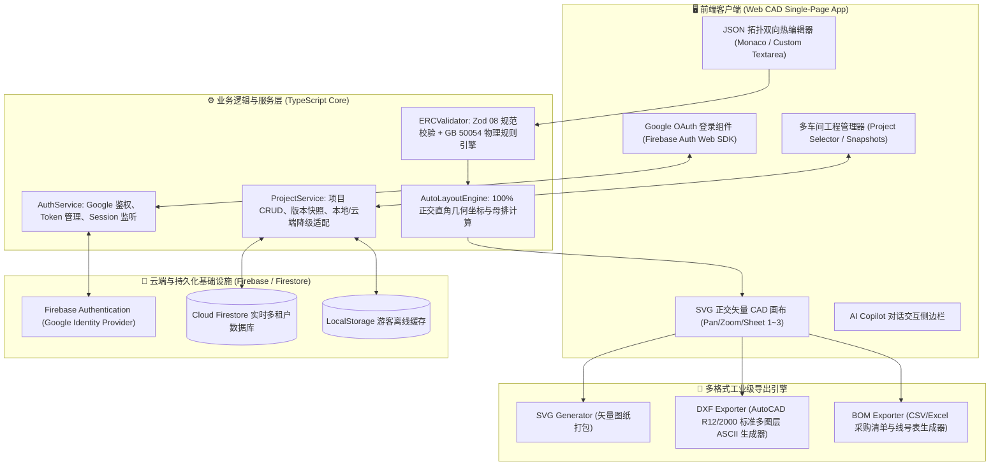

# ElecPal (电气伴侣) · 技术架构与数据流规范 (Technical Architecture)

| 文档版本 | 发布日期 | 状态 | 适用对象 |
| :--- | :--- | :--- | :--- |
| **V1.0.0** | **2026-08-24** | **草案/讨论中** | **全栈工程师、云架构师、前端开发** |

---

## 🏛️ 一、 系统全栈架构分层



---

## 🔐 二、 Firebase 鉴权与多租户数据隔离设计

### 1. 认证流 (Authentication Flow)
1. 前端调用 `signInWithPopup(auth, googleProvider)`，弹出标准 Google OAuth 授权窗口；
2. 用户授权后，Firebase 返回 `UserCredential`（包含 `uid`, `email`, `displayName`, `photoURL`, `accessToken`）；
3. 前端持久化监听 `onAuthStateChanged(auth, user => { ... })` 实时响应登录/登出状态。

### 2. Firestore 数据安全规则 (Security Rules)
保证每个用户只能读写属于自己 `uid` 的工程项目：

```javascript
rules_version = '2';
service cloud.firestore {
  match /databases/{database}/documents {
    // 用户个人工程目录隔离
    match /users/{userId}/projects/{projectId} {
      allow read, write: if request.auth != null && request.auth.uid == userId;
      
      // 项目下属拓扑版本快照
      match /versions/{versionId} {
        allow read, write: if request.auth != null && request.auth.uid == userId;
      }
    }
  }
}
```

---

## 🗄️ 三、 云端数据库集合定义 (Firestore Collections)

### 1. `users/{userId}` (用户档案)
```typescript
interface UserProfile {
  uid: string;
  email: string;
  display_name: string;
  avatar_url: string;
  role: 'engineer' | 'reviewer' | 'admin';
  created_at: string; // ISO 8601 UTC
  last_login_at: string;
}
```

### 2. `users/{userId}/projects/{projectId}` (工程项目)
```typescript
interface ProjectEntity {
  project_id: string;
  project_name: string;          // 如: "数字化鱼菜共生农业工厂"
  facility_code: string;         // 如: "FAC-SUZHOU-01"
  active_version_id: string;     // 当前激活的拓扑版本 ID
  created_at: string;
  updated_at: string;
}
```

### 3. `users/{userId}/projects/{projectId}/versions/{versionId}` (拓扑版本快照)
```typescript
interface TopologyVersionEntity {
  version_id: string;
  version_tag: string;           // 如: "V1.0", "V1.1", "V2.0-施工图"
  commit_summary: string;        // 如: "升级一级主闸为正泰160A，增加2号水泵变频器"
  schema_version: string;        // "2.0.0" (对齐 08 规范)
  topology_data: any;            // 完整的全要素电气拓扑 JSON
  erc_result: {
    passed: boolean;
    error_count: number;
    warning_count: number;
    details: Array<{ rule_id: string; message: string; severity: 'error' | 'warning' }>;
  };
  created_at: string;
}
```

---

## 📐 四、 AutoCAD DXF 工业级导出设计

DXF (Drawing Exchange Format) 导出引擎不依赖庞大的第三方 C++ 库，直接由纯 TypeScript 构造标准的 ASCII DXF 格式，包含以下标准图层：

1. **`0-BORDER`**：标准 A2/A1 图框与 GB/T 10609.1 标题栏表格；
2. **`0-BUSBAR`** (粗线/金色)：380V 主母线与二级分箱小母排；
3. **`0-POWER-LINE`** (中粗线/青色)：动力电缆分支走线；
4. **`0-SYMBOLS`** (白色/细线)：断路器、互感器、避雷器、电机符号块；
5. **`0-TEXT`** (绿色)：回路编号、电缆型号截面公式与设备功率参数。
