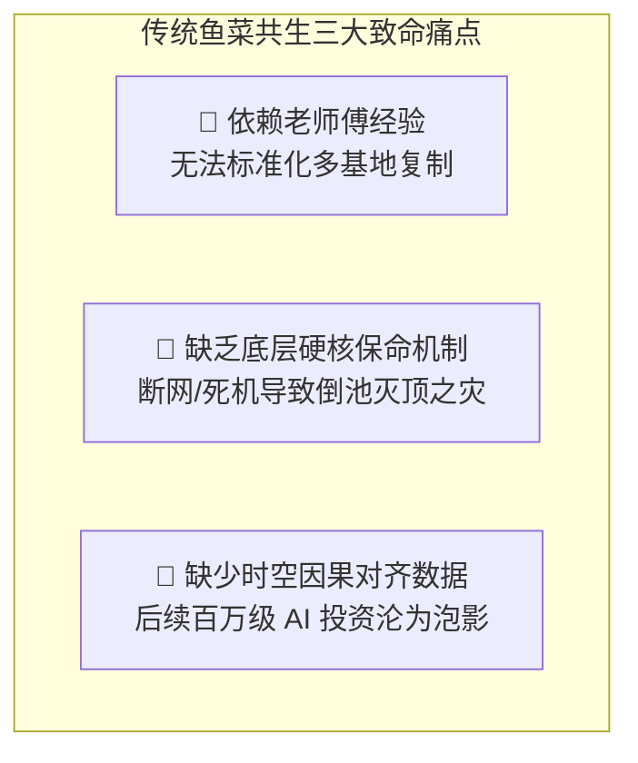
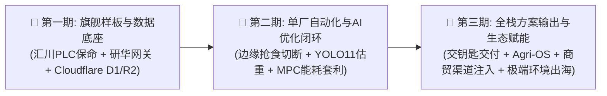

# 连锁数字化农业工厂：02_项目背景与技术团队分工 (Project Background & Team Division)

## 1. 项目发起契机

现代设施农业正迎来从传统经验驱动向数字工业化驱动的深刻转型。

团队创始成员在鱼菜共生领域已进行了数年的前期实验、生物机理验证与小规模工程探索。然而，传统鱼菜共生系统普遍面临**“强生物耦合、环境多变量敏感、依赖老师傅经验、死亡率波动大”**的行业普遍瓶颈。为了将这一兼具“绿色循环、零废水排放、高产出比”的生态农业模型推进至**商业化量产与多基地连锁复制**的工业级阶段，团队正式确立了以 **“工业物联网 (IIoT) + 边缘自治控制 (Edge AI / PLC) + 云端中台 (Cloudflare Serverless)”** 为核心的数字化转型路线。

作为项目的 IT 与 AI 技术团队，我们的核心职责是构筑稳定、高可靠、确定性的软硬件技术底座，将过去不可控的“生物玄学”彻底转化为可量化、可预测、可复制的“数字精密工业”。

---

## 2. 传统模式的核心痛点与工程挑战

在过去依靠人工经验与手工作坊式运营中，主要存在三大致命痛点：

1. **不可复制性（经验黑盒）**：高水平养殖与农艺专家极度稀缺且无法批量复制，单纯依靠人工巡视看水色、凭感觉喂食，导致扩张时“开一个厂成功，开五个厂瘫痪”。
2. **高风险脆弱性（生物死亡）**：鱼池作为高耗氧生物系统，水体溶解氧一旦跌破生理死线，鱼群将在 30~45 分钟内大面积窒息死亡。若将生命线交由不稳定的公网或普通民用电脑控制，网络抖动即可导致单池数十万生物资产瞬间清零。
3. **数据荒漠与时空错位**：流体在管道中有物理流动时滞（鱼池水需数十分钟流经反应器才到达菜池），手工记录与未对齐时间戳的数据会让后续算法产生“逆向因果”，导致 AI 训练陷入“垃圾进，垃圾出”的死循环。

---

## 3. 数字化工厂三大战略阶段愿景

为了规避盲目投资与技术冒进，项目技术演进严格按照 **“目标明确、CAPEX 可控、理性悲观风险防护”** 的分期战略推进：

* **第一期（旗舰样板与基础数据底座闭环）**：投入极度可控的硬件 CAPEX（约 2.33 万元），部署工业级汇川 Easy320 PLC、智能边缘工控机、10路监控及高精度荧光法水质传感器。实现毫秒级硬件硬锁闭保命，打通全厂 ISO 8601 时空对齐宽表，以零服务器运维成本将数据沉淀至 Cloudflare D1/R2 数据湖。
* **第二期（单厂自动化与 AI 优化闭环）**：在真实高质量数据基础上，引入边缘计算机视觉（精准投喂切断/YOLO11 双目估重）、温室 MPC 能耗避峰套利与协作机械臂自动收割，全面验证交钥匙软硬件方案与单店商业经济模型。
* **第三期（全栈方案规模化输出与生态赋能）**：打造“云端中央大脑 + 边缘小脑”模块化 Agri-OS 架构，面向地方国投、农业龙头与产业园区提供“硬件+软件+渠道+农艺配方”的交钥匙数字化农业工厂整体解决方案，并向中东沙漠及高寒极端环境拓展出海。

---

## 4. 研发团队与基地协同分工

| 角色 / 团队 | 核心职责与系统交互边界 |
| :--- | :--- |
| **IT & AI 研发团队** | 负责系统架构设计、数据契约规范、PLC 梯形图与保命互锁、边缘网关开发、Cloudflare 云端 API/D1/R2 建设、前端 Shadcn UI 监控看板及 AI 算法模型研发。 |
| **水产养殖专家 (养殖长)** | 负责鱼类生理阈值界定、水质化学检测标准校验、投喂策略机理输入及生物死淘记录。 |
| **设施园艺专家 (种植长)** | 负责蔬菜 VPD/PPFD 农学适宜区间标定、营养液调理配方制定、病虫害早期表型特征定义。 |
| **研发主管 (农艺与水产科研主管)** | 负责 Crop Ontology 作物本体库构建、12座试验舱 DOE 研发、学术文献与开源数据集对接、生理机理模型验证及《数字种植配方》签发。 |
| **品质主管与驻厂实验室** | 负责全流程理化快检、62项农残/硝酸盐/土腥味检测、e-COA 防伪签发及 4°C 留样质控。 |
| **工程与自动化主管 (现场电工)** | 负责低压配电柜、PLC 控制柜接线、传感器旁路清洗管路维护及现场网络布线。 |
| **集团财务与供应链总监** | 负责商超订单接入、长慢周期资金对冲模型校验及大宗饲料集采决策。 |
