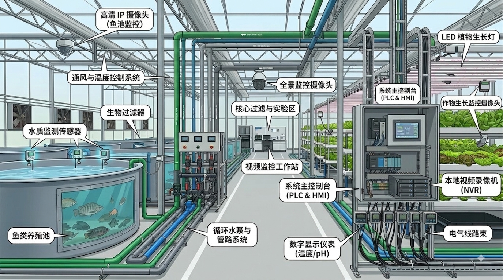

# 连锁数字化农业工厂（鱼菜共生）：分期实施计划书

## 📋 计划书摘要与投资逻辑

鱼菜共生是兼具水产养殖（高蛋白）与设施园艺（高产出）的现代农业形态。然而，传统鱼菜共生项目多因“跨学科复杂度高、环境因子耦合强、高度依赖人工经验”而面临无法规模化复制与单位经济（Unit Economics）不达标的痛点。

本实施计划书面向集团股东与投资方，旨在通过 **“分期推进、目标明确、CAPEX 可控、理性悲观风险防护”** 的原则，将资本投入划分为三大战略阶段：

* **第一期（实验验证与基础数据采集期）：** **【精准降本，双端兼顾】** 选型工业级紧凑型高性能 PLC（汇川 Easy320 系列，自带以太网与 RS485 串口）、边缘工控网关（研华 UNO-2271G-V2 / 研祥 MEC-5008）、三相导轨式智能电力监测仪（**威胜信息 DTSD342-P5 系列 + 3只丁本 DBKCT24 开口式互感器**，0.5S级高精度/RS485 Modbus-RTU/尖峰平谷复费率计量）、强弱电双层热浸锌主干桥架体系（**江苏中道开程 200×100×2.0mm + 304不锈钢螺栓/双层吊架配件，暂估 1.80 万元**）与 10 路高清视频监控网络（海康 DS-7816N-Q2 NVR + 希捷酷鹰 4TB 监控硬盘 + 10台 DS-2CD1221D-I3 PoE 枪机 + TP-Link 16口 PoE 交换机）。云端中台采用零运维成本的 **Cloudflare D1 (结构化 SQL 数据，结合 5s 网关宽表聚合策略)** 与 **Cloudflare R2 (零流量费对象存储，用于 10 路视频切片与延时快照)**。按照**官方授权渠道、全新原装开票正品（含增值税发票与 1 年原厂质保）**的标准，完整覆盖**【控制中枢与动力配电】、【鱼池区】、【调理池区】、【菜池与立体温室区】、【视频网络】与【高空强弱电双层走线桥架】**，并布设**室内 3D 垂直分层温湿度组与室外六要素超声波微气象站**。硬件采购 CAPEX 为 **4.68 万元**，现场施工与高空安装人工费暂估为 **1.00 万元**，软件研发与农艺/技术 AI 调研 Token 预算为 **0.30 万元**（1,500元/月 × 2个月），第一期总投入预算精确控制在 **5.98 万元 (约 6.0 万元)**，开发周期 **8 周**。完成高可靠工业感知网络、旁路探头防护、气动吹扫气源、RTC 断电防刷盘保护、本地保命安全机制、全回路能耗感知、高空标准化走线与基础可视化监控，产出高可信度底层数据。
* **第二期（单基地自动化与 AI 优化期）：** 中等 CAPEX 投入，建成单基地示范工厂，引入边缘 AI（投喂切断/估重）、能耗 MPC 避峰套利与协作臂自动收割，验证降本增效（FCR & OPEX）与单店模型。
* **第三期（多基地连锁与集团中台赋能期）：** 规模化 CAPEX 复制，打造“云端中央大脑 + 边缘小脑”架构，实现跨基地排产、快慢资产现金流动态对冲与盒马/山姆级大宗履约。

---

## 🚩 第一期：实验验证与基础数据采集期 (Phase 1: Foundation & Data Acquisition)

### 1.1 总体设施构想与物理空间布局

*图 1-1 连锁数字化鱼菜共生工厂——温室与设施构想全景图*

在第一期，明确提出：**完全聚焦于基础物理数据的精准采集与本地工业级安全保护。** 

做出这一战略选择，是因为在真实的鱼菜共生工厂中，如果不脚踏实地跑通第一期，将带来以下极其惨痛的商业与资金代价：

#### 🔴 核心痛点诊断：为什么必须从“人工经验”转向“数据逻辑”？
在目前的早期小规模阶段，靠经验丰富的师傅人工巡检（凭经验看水色、摸水温、靠感觉投喂和开风机）基本可以应付日常运营。**但这种依靠“个人经验”而非“数据逻辑”的传统模式，构成了企业未来发展的致命瓶颈：**

1. **规模无法做大（无法标准化复制）**：高水平的熟练农艺师和养殖师傅极其稀缺，且不可复制。如果企业要进行多基地连锁扩展，没有一套标准的数据逻辑，就会陷入“开一个厂成功，开五个厂瘫痪”的扩张陷阱。
2. **人工成本高昂且风险极大**：7×24 小时依靠高薪人工三班倒盯防，不仅导致日常运营开支（OPEX）居高不下，而且无法杜绝夜间疲劳、漏巡漏检的风险。一旦师傅离职，积累的经验随之流失。
3. **第一期的根本使命**：第一期部署工业级传感器与 PLC 数据中台，**核心不是为了炫耀技术，而是要把依赖“老师傅经验”的个人玄学，转化为依靠“数字逻辑”的标准化 SOP**。只有第一期把水温、溶氧、pH、光照的数据逻辑清洗干净，企业才能摆脱对高薪熟练工的依赖，为未来的规模化扩建与连锁复制打下不可替代的商业基石！

#### 🔴 反面代价一：生物资产瞬间崩溃死亡（“倒池”惨剧）
鱼池是高密度高耗氧的生命系统。**如果第一期图省钱或图花哨，把溶解氧（DO）和水温控制交给不稳定的公网、普通家用电脑或尚不成熟的 AI 软件：**
* 只要遇到网络波动、路由器卡死或软件崩溃，一旦水中溶解氧跌破 $4.0\,\text{mg/L}$ 的生理死线，**鱼群将在 30 ~ 45 分钟内发生大面积急性窒息死亡**，单池数十万元的鱼类生物资产将瞬间清零。
* **第一期的解决方案**：引入工业级“PLC 本地硬核保命脑”（即独立的工业级安全控制器）。哪怕全厂断网、服务器死机，PLC 硬件也会在毫秒级内自动强开氧气阀门并熔断投喂，将生物安全死死锁在物理底层。

#### 🔴 反面代价二：传感器迅速漂移报废，导致重复投资（“假数据”陷阱）
鱼池水体富含有机物、藻类和微生物。**如果第一期采购廉价的开源创客探头，或直接将探头扔在鱼池死角：**
* 传感器会在 2 ~ 3 周内因探头表面粘连污泥和膜面生物附着，产生严重的数据“下漂”（明明缺氧却显示正常，或明明正常却频繁误报警）。
* 这不仅会导致上万元的传感器频繁报废、产生持续性故障更换费用，更会让后续所有管理决策建立在“假数据”之上。
* **第一期的解决方案**：坚持工业级选型（采用荧光法光学 DO + 双盐桥抗污染 pH 电极），并配置“旁路流通槽（探头独立洗澡池）”与每 4 小时气动自动吹扫清洗，从源头确保数据真实可靠。

#### 🔴 反面代价三：数据乱成一团，导致后续数百万 AI 投资彻底砸水里（“垃圾进，垃圾出”）
水在系统中流动是有物理时间滞后性的（鱼池排出的废水要流经过滤池、管道，几十分钟后才到达菜池）。**如果不建立统一严格的时间身份证（严格 ISO 8601 时空时间戳）：**
* 人工化验的数据、环境传感器的数据与水质数据在时间维度上将完全错位。
* 以后花几百万元投入训练的 AI 模型，会识别出“因为今天收割了蔬菜，所以昨天鱼池氨氮升高”这种荒谬的逆向因果逻辑，导致后续所有智能化投资彻底沦为泡影。
* **第一期的解决方案**：统一全厂硬件时钟，给每一条上报的数据强制打上毫秒级 UTC 统一时间戳与流体滞后标签，确保数据具备极高的商业与学科学术价值。

---

### 1.2 通俗化术语对照表 (Non-Technical Glossary for Shareholders)

为了方便股东与非技术管理层理解，计划书中所涉及的技术术语与商业功能对照如下：

| 技术术语 | 通俗解释与形象比喻 | 为什么必须有它？对商业和安全的直接价值 |
| :--- | :--- | :--- |
| **PLC (可编程逻辑控制器)** | **现场工业级“保命安全脑”** 运行在现场控制柜里的工业级独立芯片 | 不怕断网、不怕死机。只要水里缺氧，0.1 秒内自动强开氧气阀门，是鱼群生命的“防暴保险丝”。 |
| **三相智能电表 (威胜 DTSD342-P5)** | **动力配电与峰谷电费的“数字精算师”** 导轨式互感电表，0.5S级精度/RS485通信 | 自动计量全厂动力、水泵与环控电耗，支持 6 费率尖峰平谷统计，为 [03_能耗优化子系统.md](../04_subsystems/03_能耗优化子系统.md) 的 MPC 峰谷避峰套利提供数据依据。 |
| **开口式互感器 (丁本 DBKCT24)** | **主回路大电流的“安全免拆取样夹”** 开口卡扣式 CT，200/5A，0.5级精度 | 免拆卸 160A 粗电缆，直接卡在 A/B/C 三相电缆上，0.5 级高精度转换电流信号给电表，绝缘耐压 2.5kV。 |
| **热浸锌双层桥架 (中道开程 200×100×2.0)** | **全厂电缆的“高空耐腐蚀高速公路”** 热浸锌槽式 + 盖板 + 304不锈钢螺栓 | 强电在上（防滴水/电磁屏蔽）、弱电在下（方便检修调线），高湿耐腐蚀 15 年不锈，一次性打通全厂骨干走线。 |
| **边缘网关 (Industrial Gateway)** | **现场数据“翻译官与快递员”** 部署在温室的小型工业工控机 | 负责把 PLC 采集到的温度、pH 等数据打包成标准格式，发送给云端。断网时会自动把数据存在本地，通网后重新补发，保证数据不丢。 |
| **网关宽表聚合策略 (Bucket Strategy)** | **全厂数据“打包集装箱”** | 将全厂 120+ 个点位的数据每 5 秒打包成 1 张完整 JSON 宽表整体上报。数据条数缩减 99%，将 Cloudflare D1 云端数据库费用死锁在 0 元。 |
| **NVR 硬盘录像机 + 10路枪机** | **现场“24小时全量监视眼与黑匣子”** 包含海康威视 NVR 与希捷 4TB 监控硬盘 | 10 路 HD 摄像头全天候监控鱼池与菜池，本地全量循环保存 15 天视频，出现纠纷或异常可查全量历史。 |
| **旁路流通槽 (Flow Cell)** | **探头专属的“独立洗澡池”** | 把水从大池引一小股到专用小槽里测 pH 和水温，防止大鱼碰撞电极，也避免水流杂质干扰测量精度。 |
| **荧光法 DO 探头 (Optical DO)** | **免频繁维护的“光学测氧仪”** | 利用光学原理测水里的溶解氧，不像老式电极那样容易老化，自带高压气枪定时冲洗头部，省去大量人工清洗维护成本。 |
| **Cloudflare D1 数据库** | **云端“高可靠零维护数据仓库”** 基于 Cloudflare 边缘网络的 Serverless SQL | 全球高可用、零服务器运维成本。秒级存储 ISO 8601 时空遥测数据，为手机大屏提供高并发读取。 |
| **Cloudflare R2 对象存储** | **云端“零流量费视频与图片保险箱”** 无出站流量费（Egress Free）对象存储 | 专门存储 10 路摄像头的报警视频切片与 10 分钟自动抓拍快照。观看/调阅视频完全免流量费。 |
| **AI 研发与调研 Token** | **软件开发与文献调研“智力加速引擎”** | 用于辅助编写 PLC 梯形图、Modbus-TCP 协议栈、智能数据契约校验及农业/水质学术文献深度研读。 |
| **ISO 8601 UTC 时间戳** | **全局统一的“数据身份证”** | 格式如 `2026-08-11T15:30:00.000Z`。彻底消灭跨基地、跨系统的时区混乱，确保每一条数据物理采集时刻毫秒不差。 |
| **Shadcn UI + Tailwind CSS v4** | **现代轻量化“工业监控大屏 UI”** | 高对比度、反应迅速的网页管理界面。支持手机、平板和电脑随时查看各池水质与报警状态。 |

---

### 1.3 第一期预算与采购明细 (官方正品开票预算：¥ 5.98 万元)

> 💡 **工程级采购与施工明细跳转**：  
> 本节仅为面向股东与管理层的投资宏观盘点。具体到每一个主料订货 SKU、采购渠道建议、柜内 35mm 导轨/线槽/端子排小五金配件、线缆精确米数、桥架配件、电工工时与现场通电验收 Checklist，请详见专门编制的工程文档：👉 **[04_第一期硬件采购BOM与工程施工清单.md](./04_第一期硬件采购BOM与工程施工清单.md)**。

第一期预算由 **物理硬件采购 CAPEX (4.68 万元，含水质保命底座、三相电表互感器、立体微气象感知与双层桥架)**、**现场施工与高空吊装安装人工费 (1.00 万元，暂估)** 与 **软件研发及 AI 调研 Token 预算 (0.30 万元)** 共同构成。硬件采购预算均按官方授权代理商全新开票正品标准核算。

#### 1. 硬件采购清单（按物理区域分组）

##### 1. 控制中枢与动力配电保护 (Control & Electrical Hub)
| 设备/材料名称 | 规格型号与品牌选型推荐 | 数量 | 单位 | 预估单价 (RMB) | 预估总价 (RMB) | 关键技术参数与物理安装要求 |
| :--- | :--- | :--- | :--- | :--- | :--- | :--- |
| PLC 主控 CPU | 汇川 Easy320 系列 (Easy320-1614TN) | 1 | 台 | ¥ 700 | ¥ 700 | 官方全新正品，自带以太网 (Modbus-TCP) 及 RS485/RS232，16DI/14DO 晶体管输出 |
| 三相导轨式智能电表 | 威胜 (Willfar) DTSD342-P5 系列 | 1 | 台 | ¥ 580 | ¥ 580 | 官方正品，0.5S 级三相四线，RS485 (Modbus-RTU/DL-T645)，自带电压自取电(免外接电源)，计量三相电压/电流/有功/谐波/TOU 尖峰平谷复费率 |
| 开口式电流互感器 | 丁本 DBKCT24 (孔径24mm 200/5A) | 3 | 只 | ¥ 25 | ¥ 75 | 官方正品 0.5 级高精度，开口卡扣式免拆线安装，带 1 米阻燃铜引线，绝缘耐压 2.5kV，卡装于正泰 160A 主开关电缆上 |
| 工业继电器组 | 欧姆龙 MY2N-GS 24VDC + PYFZ-08-E | 4 | 套 | ¥ 65 | ¥ 260 | 含 LED 指示灯继电器 + PYFZ-08-E 底座 + PYC-A1 防震扣 |
| 开关电源 | 明纬 (MeanWell) NDR-120-24 | 1 | 台 | ¥ 180 | ¥ 180 | 官方原装，24V DC / 5A 导轨式工业电源 |
| 配电保护微断 | 正泰 / 施耐德 微型断路器 | 1 | 套 | ¥ 150 | ¥ 150 | 配电防护，含 220V 入户微断与 24V 保险丝端子 |
| 智能边缘网关 | 研华 UNO-2271G-V2 / 研祥 MEC-5008 | 1 | 台 | ¥ 2,700 | ¥ 2,700 | Intel N6210/J6412 CPU/8G内存/128G SSD/双千兆网口/2串口/RTC电池/无风扇 |

##### 2. 鱼池养殖区 (Aquaculture RAS Zone)
| 设备/材料名称 | 规格型号与品牌选型推荐 | 数量 | 单位 | 预估单价 (RMB) | 预估总价 (RMB) | 关键技术参数与物理安装要求 |
| :--- | :--- | :--- | :--- | :--- | :--- | :--- |
| 荧光法 DO 传感器 | 工业荧光法 DO (RS485Modbus) | 1 | 支 | ¥ 4,800 | ¥ 4,800 | 官方正品包质保，光学荧光法（含自动气动吹扫喷嘴与电磁阀） |
| 吹扫微型空压机 | 24V 无油静音微型气泵 | 1 | 台 | ¥ 350 | ¥ 350 | 工业级 24V 气泵，为 DO 探头吹扫提供 0.4MPa 气源 |
| 气动吹扫电磁阀 | 亚德客 / SMC 24V 气动阀 | 1 | 个 | ¥ 180 | ¥ 180 | 官方原装，每 4 小时高压吹扫 DO 探头头部 10 秒 |
| 鱼池高低液位开关 | 316L 不锈钢浮球液位开关 | 2 | 个 | ¥ 120 | ¥ 240 | 鱼池溢流与干烧硬保护开关（高液位 / 低液位） |

##### 3. 调理池与水质中继区 (Mixing & Buffer Zone)
| 设备/材料名称 | 规格型号与品牌选型推荐 | 数量 | 单位 | 预估单价 (RMB) | 预估总价 (RMB) | 关键技术参数与物理安装要求 |
| :--- | :--- | :--- | :--- | :--- | :--- | :--- |
| 工业级 pH 传感器 | 双盐桥 pH 电极 + 485变送器 | 1 | 支 | ¥ 1,200 | ¥ 1,200 | 官方正品，含 PTFE 隔膜，配套旁路流通槽，监控调理池 pH |
| 工业 EC 传感器 | 四电极式电导率 + 485变送器 | 1 | 支 | ¥ 1,500 | ¥ 1,500 | 官方正品，范围 $0 \sim 10\,\text{mS/cm}$，监控出水总营养盐浓度 |
| 调理池水温传感器 | PT1000 316L 护套探头 + 485变送 | 1 | 支 | ¥ 350 | ¥ 350 | 接入旁路流通槽，精确监控中继调理水体温度 |
| 旁路流通槽总成 | 透明有机玻璃/PVC 旁路槽 | 1 | 套 | ¥ 450 | ¥ 450 | 含 1/2" 螺纹接口、进出水快插接头与防震支架 |

##### 4. 菜池/水培槽与温室大空间立体感知区 (Hydroponic Raceway & 3D Ambient Zone)
| 设备/材料名称 | 规格型号与品牌选型推荐 | 数量 | 单位 | 预估单价 (RMB) | 预估总价 (RMB) | 关键技术参数与物理安装要求 |
| :--- | :--- | :--- | :--- | :--- | :--- | :--- |
| 菜池根区水温传感器 | PT1000 316L 不锈钢防水探头 | 1 | 支 | ¥ 350 | ¥ 350 | 深入深水漂浮槽/NFT根系区，防根腐病水温过高 |
| 菜池槽液位开关 | 316L 不锈钢浮球液位开关 | 2 | 个 | ¥ 120 | ¥ 240 | 监控水培槽液位，防浮板搁浅干涸或溢流 |
| 室内 3D 分层温湿度 | 工业 SHT35/40 百叶罩 (RS485) | 6 | 组 | ¥ 410 | ¥ 2,460 | 8m大空间分层测温（6柱×3层共18测点，L1冠层/L2中层/L3顶层），评估烟囱效应与热停滞 |
| PAR 光量子传感器 | 光合有效辐射计 (RS485) | 1 | 支 | ¥ 2,800 | ¥ 2,800 | 垂直悬挂于生菜叶面上方，测光合有效辐射光强 (PPFD) |
| 室外六要素微气象站 | 固态超声波一体式 (RS485) | 1 | 套 | ¥ 3,800 | ¥ 3,800 | 超声波风速风向、室外温湿压、总辐射/PAR，含雨雪常闭硬触点（大风/暴雨 0.1s 硬关天窗） |

##### 5. 视频监控网络与本地 NVR (Video Surveillance & Local NVR Hub)
| 设备/材料名称 | 规格型号与品牌选型推荐 | 数量 | 单位 | 预估单价 (RMB) | 预估总价 (RMB) | 关键技术参数与物理安装要求 |
| :--- | :--- | :--- | :--- | :--- | :--- | :--- |
| 16路 NVR 录像机 | 海康威视 DS-7816N-Q2 (双盘位) | 1 | 台 | ¥ 580 | ¥ 580 | 16路 H.265，双盘位，支持 ONVIF/RTSP 协议 (商用R2版为980元) |
| 4TB 监控专用硬盘 | 希捷酷鹰 ST4000VX015 4TB | 1 | 块 | ¥ 580 | ¥ 580 | 256MB缓存/5400RPM，7×24 小时监控级，支持 10 路连续录制 15 天 |
| 1080P IP 枪型摄像头 | 海康威视 DS-2CD1221D-I3 (PoE) | 10 | 台 | ¥ 180 | ¥ 1,800 | IP67 防尘防水、红外夜视、PoE 供电 (5鱼池/4菜池/1控制柜) |
| 16口 PoE 交换机 | TP-Link TL-SL1218P (带2千兆上联) | 1 | 台 | ¥ 480 | ¥ 480 | 16个百兆PoE供电口 + 2个千兆上联口，保障 10 路高清码流不卡顿 |

##### 6. 试剂耗材、控制柜及配线 (Consumables & Wiring)
| 设备/材料名称 | 规格型号与品牌选型推荐 | 数量 | 单位 | 预估单价 (RMB) | 预估总价 (RMB) | 关键技术参数与物理安装要求 |
| :--- | :--- | :--- | :--- | :--- | :--- | :--- |
| 标定试剂套件 | pH/EC 标准标定试剂盒 | 1 | 套 | ¥ 200 | ¥ 200 | 官方标准缓冲粉剂及 1413uS/cm 标准校准液套件 |
| 配电控制柜及线材 | 600x500x200 柜体 + RVSP线 | 1 | 批 | ¥ 1,800 | ¥ 1,800 | IP65 喷塑柜体、RVSP 2x0.75 屏蔽线、PG 缆线接头 |

##### 7. 强弱电双层热浸锌桥架与吊装辅材 (Cable Tray Infrastructure - 暂估)
| 设备/材料名称 | 规格型号与品牌选型推荐 | 数量 | 单位 | 预估单价 (RMB) | 预估总价 (RMB) | 关键技术参数与物理安装要求 |
| :--- | :--- | :--- | :--- | :--- | :--- | :--- |
| 热浸锌槽式桥架及辅件 | 江苏中道开程 200×100×2.0 (含盖板/304螺栓/双层吊架/梁夹/通丝吊杆) | 1 | 批 | ¥ 18,000 | ¥ 18,000 | **【暂估，后期按实际米数精调】** 覆盖全厂主干与分支双层骨干走线（强电上/弱电下），热浸锌超强防腐，标配 304 不锈钢螺栓与免焊接梁夹 |

##### 💰 硬件采购 CAPEX 小计：¥ 46,805 元 (约 4.68 万元)

---

#### 2. 现场工程施工与高空安装人工费 (Field Installation & Labor - 暂估)

| 费用类别 | 施工内容与人工工时测算 | 周期/工日 | 计价标准 (RMB) | 费用小计 (RMB) |
| :--- | :--- | :---: | :--- | :--- |
| **现场施工与高空安装人工费** | 包含 2 名熟练强弱电工现场作业： 1. 高空钢桁架梁夹与双层桥架吊装敷设； 2. IP65 控制柜装配、PLC/电表/继电器二次接线与冷压端子压接； 3. 鱼池/菜池传感器管路下引、旁路流通槽安装与气动吹扫管连接； 4. 10 路 PoE 摄像头布线、水晶头压接与全厂接地网电阻测试。 | 约 10~12 天 (包工/日工) | **【暂估，按工时实调】** | **¥ 10,000** |

---

#### 3. 软件研发与调研 AI Token 预算小计 (Software R&D & Token OPEX)

| 费用类别 | 描述与使用用途 | 周期 | 月预算 (RMB) | 费用小计 (RMB) |
| :--- | :--- | :--- | :--- | :--- |
| **AI API Token 服务费** | 用于 PLC 梯形图辅助编写、Modbus 契约代码生成、Cloudflare Workers & D1 & R2 接口加速开发，以及水质/农艺/温控学术文献的 AI 智能研读与数据抽取 | 2 个月 (8周) | ¥ 1,500 / 月 | **¥ 3,000** |

##### 💰 第一期资金投入总计 (硬件 CAPEX + 施工人工 + R&D OPEX)：¥ 59,805 元 (约 5.98 万元)

---

#### 各设备核心功能与作用简述 (Device Functional Summary)

1. **PLC 主控 CPU (汇川 Easy320-1614TN)**：现场的“保命总指挥部”。原生自带以太网与 RS485 接口，负责高速收集所有传感器数据，并在出现缺氧、溢水或暴雨强风等紧急风险时，0.1 秒内自动触发继电器开阀或关天窗，完全不受网络死机影响。
2. **三相导轨式智能电力监测仪 (威胜 DTSD342-P5 系列)**：全厂电能与电费的“数字精算师”。标准 35mm 导轨安装，直接从 380V/220V 电压回路自取电（免额外外接电源）。通过 RS-485 (Modbus-RTU / DL/T 645) 实时采集三相电压、三相电流、有功/无功功率、功率因数及 2~63 次谐波，内置 6 费率尖峰平谷（TOU）分时电能计量，为 [03_能耗优化子系统.md](../04_subsystems/03_能耗优化子系统.md) 的 MPC 峰谷避峰套利与单批次生菜/鱼群精准 COGS 电费核算提供高精度数据底座。
3. **开口式电流互感器 (丁本 DBKCT24 系列 3只)**：主回路电缆的“安全免拆电流采样夹”。$\Phi 24\text{mm}$ 开口式卡扣设计，在免拆卸 $160\text{A}$ 粗电缆的前提下，直接卡扣在 A/B/C 三相进线电缆上。变比为 $200/5\text{A}$，测量精度达 $0.5$ 级，阻燃 PC 外壳（UL94-V0），耐压 $2.5\text{kV}$，自带 1 米纯铜二次引线直接接入威胜电表电流端子，提供极度安全便捷的电流取样。
4. **工业继电器组 (欧姆龙 MY2N-GS 24VDC + PYFZ-08-E 底座套件)**：PLC 的“电力大开关”。用 PLC 的 24V 弱电信号安全开关大功率曝气机、液氧电磁阀、水泵和天窗电机（220V/380V）。配有绿色 LED 工作状态指示灯与防震金属固定扣 PYC-A1。
5. **开关电源 (明纬 24V/5A)**：控制柜的“纯净供血泵”。把温室 220V 交流电转换为工业标准的 24V 直流电，为 PLC、传感器和电磁阀稳定供电。
6. **配电保护微断**：控制柜的“电路保险丝”。防止现场突发短路、雷击或过载烧毁昂贵控制器与传感器，发生异常瞬间断电保护。
7. **智能边缘网关 (研华 UNO-2271G-V2 / 研祥 MEC-5008)**：现场数据的“翻译官与暂存仓库”。采用 Intel N6210/J6412 CPU/8G内存/128G SSD/双网口/2串口/RTC硬件电池，负责给采集的数据打上毫秒级统一身份证发往云端；断网时把数据安全暂存本地，通网后补发，确保数据不丢。
8. **16路 NVR 录像机 (海康 DS-7816N-Q2) + 希捷酷鹰 4TB 监控硬盘**：现场视频的“24小时黑匣子”。全天候接收 10 路摄像头的 1080P 高清视频码流，本地循环覆盖存储 15 天，保证现场发生任何事故都有完整全量视频可查。
9. **1080P IP67 PoE 枪型摄像头 (海康 DS-2CD1221D-I3 10台)**：现场环境的“全天候监视眼”。部署于 5 个鱼池区（看摄食/浮头）、4 个菜池区（看叶面长势）与 1 个控制柜区，IP67 防水防尘，提供 RTSP 高清码流。
10. **16口 PoE 交换机 (TP-Link TL-SL1218P)**：摄像头网络的“供电与数据立交桥”。带 2 个千兆上联口，通过网线同时为 10 台 IP 摄像头提供 48V PoE 供电并传输 RTSP 视频码流至 NVR 与工控机。
11. **鱼池荧光法 DO 传感器 (光学测氧仪)**：鱼池生命的“防窒息警报器”。利用光学原理 24 小时高精度监控鱼池水里溶解的氧气量，氧气低时报警并通知 PLC 救命。
12. **吹扫微型空压机 (24V 气泵)**：探头吹扫的“气压动力源”。为 DO 测氧探头的自动气喷吹扫提供 0.4MPa 压缩空气。
13. **气动吹扫电磁阀**：探头清洗的“定时水龙头”。由 PLC 控制每 4 小时打开 10 秒，引导高压空气冲洗测氧探头头部，吹走污泥微生物，免去人工频繁清洗。
14. **鱼池高低液位开关**：鱼池水位的“防溢防干烧哨兵”。监测鱼池水位，太低时报警防水泵干烧烧毁，太高时切断补水防漫池溢流。
15. **调理池工业级 pH 传感器**：调理池酸碱度的“健康化验员”。监测给菜池供水前的 pH 值是否处于 5.8~6.5 最佳营养吸收区间，防止水质过酸或过碱。
16. **调理池工业 EC 传感器 (电导率仪)**：菜池供水营养液的“浓度测量仪”。测量进入菜池前水里溶解的营养盐总浓度，防止营养不足或浓度过高烧伤菜根。
17. **调理池水温传感器**：调理池水温的“精细体温计”。以 $0.1^\circ\text{C}$ 精度监控进入菜池前的水体温度。
18. **旁路流通槽总成 (探头洗澡池)**：探头的“独立安全舱”。把调理池水引一小股到透明小槽里测试，消灭水流气泡干扰，确保 pH/EC 读数绝对准确。
19. **菜池根区水温传感器 (PT1000 Waterproof)**：蔬菜根系的“生命体温计”。深入水培深水漂浮槽/NFT 管道内监控蔬菜根系水温。当菜池水温 $>24^\circ\text{C}$ 时提示根腐病风险，$<12^\circ\text{C}$ 时提示生长停滞。
20. **菜池槽液位开关**：水培槽水位的“搁浅防溢哨兵”。监测菜池水培槽水位，防止深水漂浮板因缺水搁浅触底损坏根系，或水位过高漫出温室。
21. **室内 3D 垂直分层温湿度组 (SHT35/40)**：8米大空间的“热力学体检网”。在不同高度（L1冠层1.2m/L2中层3.8m/L3顶脊7.5m）多点测温，评估热分层与烟囱效应，为天窗自然排热和环流混风提供依据（详见 [04_大空间温室立体微气候感知与温控策略规范.md](file:///c:/DavidCode/aquaponics/docs/05_specifications/04_大空间温室立体微气候感知与温控策略规范.md)）。
22. **PAR 光量子传感器 (光照计)**：生菜阳光吸收量的“光合测量仪”。悬挂于菜池上方，专门测量照射到生菜叶片的光合有效辐射强度（PPFD），评估蔬菜每日吸收的光照累积量（DLI）。
23. **室外综合超声波微气象站**：温室环控的“全天候前瞻眼”。实时采集室外超声波风速风向、总辐射/PAR、温湿压，并在暴风雨时通过常闭硬触点 0.1 秒强制天窗关窗防雨。
24. **标定试剂套件**：传感器的“标准校准刻度尺”。提供标准酸碱度与电导率试剂，用于每两周给探头做一次标准校准，确保数据长期精确。
25. **配电控制柜及线材**：系统的“防护铠甲与神经血管”。IP65 防尘防水控制柜保护核心设备，抗干扰屏蔽电线传输信号，确保在潮湿温室中长期稳定工作。
26. **强弱电双层热浸锌桥架体系 (中道开程 200×100×2.0)**：全厂动力与通信的“高空耐腐蚀高速公路”。采用强电在上（带盖槽式防滴水）、弱电在下（镀锌网格架方便理线）的双层结构（垂直净距 $300\sim 350\text{mm}$），热浸锌超强耐湿耐腐蚀，配 304 不锈钢螺栓与免焊接梁夹，一次性打通全厂骨干走线。

---

### 1.4 系统硬件与软件整体拓扑架构图 (System Architecture Topology)

第一期系统的物理设备、10 路监控视频流与软件数据流通过以下四层工业拓扑图完整打通：

```mermaid
flowchart TD
    %% 定义样式分类
    classDef fieldStyle fill:#e1f5fe,stroke:#0288d1,stroke-width:2px;
    classDef plcStyle fill:#fff3e0,stroke:#f57c00,stroke-width:2px;
    classDef edgeStyle fill:#e8f5e9,stroke:#388e3c,stroke-width:2px;
    classDef cloudStyle fill:#f3e5f5,stroke:#7b1fa2,stroke-width:2px;
    classDef appStyle fill:#fbe9e7,stroke:#d84315,stroke-width:2px;

    %% Layer 1: 物理现场感知、视频与执行层
    subgraph Layer1 ["1. 现场物理感知、视频与执行层 (Field Layer)"]
        direction LR
        subgraph FishZone ["【鱼池 RAS 车间】"]
            DO["荧光法 DO 探头"]
            AirPump["24V 吹扫微型空压机"]
            Solenoid["气动吹扫电磁阀"]
            FishLevel["316L 鱼池高低液位开关"]
        end

        subgraph BufferZone ["【调理池/中继池区】"]
            FlowCell["旁路流通槽总成"]
            pH["双盐桥 pH 传感器"]
            EC["四电极 EC 传感器"]
            TempBuffer["PT1000 调理池水温探头"]
            pH --- FlowCell
            EC --- FlowCell
            TempBuffer --- FlowCell
        end

        subgraph VegZone ["【菜池水培与温室立体感知区】"]
            VegTemp["菜池根区水温传感器 (PT1000)"]
            VegLevel["菜池槽高低液位开关"]
            Indoor3DMasts["🌡️ 室内 3D 垂直分层测柱<br>(L1冠层/L2中层/L3顶层)"]
            PAR["PAR 光量子辐射计"]
        end

        subgraph OutdoorZone ["【室外环境感知区】"]
            OutdoorStation["🌤️ 室外六要素微气象站<br>(超声风速风向/总辐射/温湿压)"]
            RainRelay["🌧️ 雨雪感应常闭触点 (NC)"]
        end

        subgraph CamZone ["【现场 10 路视频监控网络】"]
            Cameras["📷 10 路 IP 摄像头<br>(5鱼池/4菜池/1控制柜 H.265 RTSP)"]
        end

        subgraph Actuators ["【现场执行机构】"]
            Relays["欧姆龙 MY2N-GS 继电器组"]
            O2Valve["液氧急救电磁阀 / 曝气机"]
            FeederCut["自动投喂机熔断断电"]
            WaterPump["中继池/菜池补水泵"]
            VentMotor["电动顶窗/天窗电机"]
            Relays --> O2Valve
            Relays --> FeederCut
            Relays --> WaterPump
            Relays --> VentMotor
        end
    end

    %% Layer 2: 现场 IP65 控制柜与 NVR 存储
    subgraph Layer2 ["2. 现场控制与边缘存储中枢 (Control & Edge Storage Hub)"]
        direction TB
        Power["明纬 NDR-120-24 开关电源 (24V DC)"]
        CTs["🧲 3只开口式互感器 CT (DBKCT24 200/5A)<br>(免拆卡扣在 160A 主开关电缆上)"]
        PowerMeter["⚡ 威胜 DTSD342-P5 智能电表<br>【0.5S级动力与分时电量感知】<br>(三相电压电流/有功功率/TOU峰谷计量)"]
        PLC["🔌 汇川 Easy320-1614TN PLC<br>【现场硬核保命脑】<br>(500ms 轮询 / 0.1s 硬件保命互锁)"]
        EdgeIPC["💻 研华 UNO-2271G-V2 / 研祥 MEC-5008 工控机<br>【边缘数据小脑】<br>(硬件 RTC 电池 / 5s 宽表快照打包 / 128G 断网自愈缓存)"]
        NVR["📹 现场 16 路 NVR 录像机 + 4TB 监控硬盘<br>【全量视频 24h 循环存储】<br>(覆盖本地 15 天历史码流)"]

        CTs -->|二次侧 5A 信号线| PowerMeter
        Power -.->|24V 供电| PLC
        Power -.->|24V 供电| EdgeIPC
        Power -.->|24V 供电| AirPump
    end

    %% 现场物理连接线
    DO -->|RS485 Modbus-RTU| PLC
    pH -->|RS485 Modbus-RTU| PLC
    EC -->|RS485 Modbus-RTU| PLC
    TempBuffer -->|RS485 Modbus-RTU| PLC
    VegTemp -->|RS485 Modbus-RTU| PLC
    PowerMeter -->|RS485 Modbus-RTU| EdgeIPC
    Indoor3DMasts -->|RS485 Modbus-RTU| EdgeIPC
    OutdoorStation -->|RS485 Modbus-RTU| EdgeIPC
    PAR -->|RS485 Modbus-RTU| PLC
    RainRelay ==>|24V 硬互锁触点 DI| PLC

    Cameras -->|网线 RTSP 高清码流| NVR
    NVR <-->|网线 ONVIF/SDK 调阅| EdgeIPC

    FishLevel -->|24V 开关量 DI| PLC
    VegLevel -->|24V 开关量 DI| PLC
    PLC -->|24V 硬互锁触点 DO| Relays
    PLC -->|24V 吹扫触发 DO| Solenoid

    %% 柜内直连
    PLC <==>|网线直连 Modbus-TCP| EdgeIPC

    %% Layer 3: 云端 Serverless 中台
    subgraph Layer3 ["3. 云端 Serverless 中台 (Cloudflare Infrastructure Layer)"]
        Router["📶 工业 4G/5G 路由器"]
        CloudWorkers["⚡ Cloudflare Workers API (apps/cloud-api)<br>【防时钟漂移中间件 + 三级告警引擎】"]
        StorageD1["🗄️ Cloudflare D1 数据库<br>【5s 宽表快照 SQL (SQLite at Edge)】<br>(仅占每日免费写入额度的 17.3%)"]
        StorageR2["📦 Cloudflare R2 对象存储<br>【零出站流量费视频切片与 D1 每日归档】<br>(30天自动过期 / 月开支低至 $1.5~$3.0)"]
        SMSNotify["📱 微信 / 短信 / 钉钉告警引擎<br>(带有 R2 视频播放直达链接)"]

        CloudWorkers --> StorageD1
        CloudWorkers --> StorageR2
        CloudWorkers --> SMSNotify
    end

    EdgeIPC -->|加密 HTTPS 5s 宽表 JSON| Router
    EdgeIPC -->|告警切片 MP4 & 10min 快照 JPG 上传| Router
    Router -->|公网加密隧道| CloudWorkers

    %% Layer 4: 监控大屏呈现
    subgraph Layer4 ["4. 工业监控大屏 (Presentation Layer - Shadcn UI + Tailwind v4)"]
        WebUI["📊 Web 监控看板 (apps/web-ui)<br>【实时数据仪表盘 + R2 告警视频回放 + 延时摄影播放】"]
    end

    CloudWorkers -->|WebSocket / REST API 实时推送| WebUI
    StorageR2 -.->|直连零流量费 CDN 播放| WebUI

    %% 应用样式
    class DO,AirPump,Solenoid,FishLevel,FlowCell,pH,EC,TempBuffer,VegTemp,VegLevel,Indoor3DMasts,OutdoorStation,RainRelay,PAR,Cameras,Relays,O2Valve,FeederCut,WaterPump,VentMotor fieldStyle;
    class PLC,Power,NVR plcStyle;
    class EdgeIPC edgeStyle;
    class CloudWorkers,StorageD1,StorageR2,SMSNotify cloudStyle;
    class WebUI appStyle;
```

---

### 1.5 软件核心功能架构 (Software Features - Non-AI)

第一期软件聚焦于**极高可靠性、零运维云端成本、严格时间契约与实时监控**，分为 6 个核心子模块：

#### 1.5.1 PLC 本地保命控制程序 (Layer 2)
* **实时采集**：PLC 通过工业串口按 500ms 间隔轮询传感器，换算为直观数值（如 `鱼池DO = 6.25 mg/L`、`菜池根温 = 19.5°C`）。
* **保命逻辑**：
  * 当 `鱼池溶解氧 < 4.0 mg/L` 时，PLC 继电器直接强制接通液氧电磁阀/备用曝气机；
  * 当 `鱼池溶解氧 < 3.0 mg/L` 时，继电器强制切断自动投喂机电源（防止鱼吃食消耗氧气加速窒息）；
  * 当 `菜池水培槽液位过低` 时，自动触发中继池补水泵；
  * 当 `室外检测到暴风雨 (雨雪触发 / 风速 > 12m/s)` 时，PLC 硬件常闭触点 0.1s 极速强制全关顶窗防雨。
* **自动清洗**：每隔 4 小时触发一次气动电磁阀与微型空压机，用高压空气吹扫溶氧探头头部 10 秒，防止污垢附着。

#### 1.5.2 边缘网关数据服务 (`apps/edge-gateway`)
* **数据读取**：秒级拉取 PLC 保持寄存器与室内外 RS485 气象环境数据。
* **数据身份证打码**：本地生成**严格 ISO 8601 UTC 毫秒级时间戳**（如 `2026-08-11T15:30:00.000Z`）。
* **断网保护与自愈**：检测到公网中断时，自动写入本地 SQLite 存储；网络恢复后按 50 条/秒平滑补报，**严格保留原始采集时刻**，绝不乱套。

#### 1.5.3 云端 Serverless 数据中台与告警服务 (`apps/cloud-api` on Cloudflare Workers & D1 & R2)
* **结构化数据存储**：采用 **Cloudflare D1 边缘 Serverless SQL 数据库**，存储 ISO 8601 遥测数据，云端服务器维护成本降至 **0 元**。
* **非结构化视频存储**：采用 **Cloudflare R2 对象存储**，存储 10 路摄像头的报警视频切片与定时延时快照，享受 **零出站流量费 (No Egress Fees)** 杀手级优势。
* **防防防防时钟错乱中间件**：校验上报数据与 Cloudflare 边缘节点时刻，若时差超过 $100\,\text{ms}$，拒绝写入并触发运维警报。

#### 1.5.4 10 路视频监控与 Cloudflare R2 分级存储策略 (Video & R2 Tiered Storage Strategy)

为了兼顾“24 小时全量安全留痕”与“云端存储费用绝对受控”，系统采用 **“本地 NVR 存全量 + Cloudflare R2 存精简”** 的分布式工业视频架构：

##### 1. 存储分级与费用实测对比 (10 路 1080P H.265 摄像头)

* **视频数据基准**：单摄像头 1080P/2Mbps H.265 码率 $\approx 900\,\text{MB/小时}$，10 路摄像头 24h 总体积 $\approx 216\,\text{GB/天}$。

| 存储层级 | 存储介质 | 录制与上传策略 | 月新增容量 | 预估月费用 | 商业与工程评估 |
| :--- | :--- | :--- | :--- | :--- | :--- |
| **本地保底存储** | 本地 16路 NVR + 4TB 监控硬盘 | **全天 24 小时连续录像** (本地循环覆盖存储 15 天) | ~ 3.2 TB | **0 元/月** (硬件一次性采购) | **强力推荐**。保障现场全量历史调看极度流畅，不占用公网带宽。 |
| **云端精细存储** | **Cloudflare R2** (零流量费对象存储) | **日常定时快照**：每 10 分钟自动抽抓 1 张高清 JPG 图片，生成生菜生长与鱼群活动的“延时摄影 (Time-lapse)” | ~ 30 GB / 月 | **$0.45 美元/月** (约 3 元) | **推荐**。免出站流量费，极低成本展现作物生长与鱼群摄食全过程。 |
| **云端告警存储** | **Cloudflare R2** (零流量费对象存储) | **事件触发切片**：当 PLC 触发溶氧/水温告警或人员闯入时，网关切取告警前 1 分钟至后 2 分钟视频（3分钟 MP4）上传 R2 | ~ 100~200 GB / 月 | **$1.5 ~$3.0 美元/月** (约 10~20 元) | **首推（最智能）**。报警信息秒级推送手机，并附带 R2 视频链接，随时在线查验事故真相。 |

##### 2. Cloudflare R2 关键配置与工程落地规则
* **杀手级优势（零出站流量费）**：管理层与农艺师在 Web UI 或手机大屏频繁调阅、观看 R2 上的视频切片与快照时，**产生的出站流量费为 0 元**，彻底消灭了传统云厂商（阿里云/AWS）的流量账单炸弹。
* **生命周期自动化管理 (Lifecycle Rules)**：在 Cloudflare R2 后台设置存储桶生命周期规则 `Expiration: 30 days`。超过 30 天的告警切片与图片**由 R2 自动清空删除**，无需人工维护，将云端存储空间固定在指定上限内。

#### 1.5.5 全厂 100+ 监测点位推演、网关宽表打包、数据防灾备份与警示闭环逻辑 (Data Throughput & Disaster Recovery)

推演至 **10个鱼池 + 10个菜池 + 调理池 + 8米立体大空间与室外微气象** 的完整规模，系统数据量与防灾策略设计如下：

##### 1. 全厂传感器与数据点位总数盘点 (120+ 物理信号点)
| 监测区域 | 包含设备/点位 | 数量 | 采样方式与上报策略 |
| :--- | :--- | :--- | :--- |
| **10 个鱼池区** | 溶氧 DO (RS485) 液位高/低开关 (24V DI) | 10 支 20 个 | **高频/事件**：DO 按 **1 秒/次** 采集；液位按 **10 秒心跳 + 突变触发**。 |
| **10 个菜池区** | 根区水温 (PT1000) 菜池槽液位高/低开关 | 10 支 20 个 | **中频/事件**：水温按 **5 秒/次** 采集；液位按 **10 秒心跳 + 突变触发**。 |
| **调理/中继池区** | pH、EC、调理池水温 (RS485) 调理池液位开关 | 各 1 支 (共 3 支) 2 个 | **中频/事件**：水质指标按 **5 秒/次** 采集；液位按 **10 秒心跳 + 突变触发**。 |
| **8米室内立体温控区** | 6 根垂直测柱（L1冠层/L2中层/L3顶层） PAR 光量子辐射计 (RS485) | 18 组温湿度 1 支 | **中频**：分层温湿度按 **5 秒/次** 采快照，评估烟囱效应与热停滞。 |
| **室外综合微气象区** | 超声风速风向、室外温湿压、总辐射 雨雪常闭硬触点 (24V DI) | 6 要素 1 个触点 | **中频/事件**：风速辐射按 **2 秒/次** 采快照；暴风雨 **0.1s 突变硬触发**。 |
| **动力与配电能耗区** | 威胜 DTSD342-P5 三相智能电表 (RS485) 三相电压/电流/有功/无功/功率因数/TOU电能 | 1~3 套 (主回路/水泵/暖通) | **中频**：电气量与分时电量按 **5 秒/次** 采集打包进宽表快照。 |
| **全厂执行机构** | 继电器/泵/阀/开窗电机输出状态 (DO) | 约 35~45 路 | **事件驱动**：状态发生改变时瞬间触发 + 10秒定时心跳。 |

##### 2. 24 小时数据记录总量计算与架构对比

* **传统单点日志模式 (Per-Sensor Insert)**：每个点位独立插入一行数据，日产生约 **173.7 万条/天** 数据（$86.4万 + 22.4万 + 4.3万 + 60.4万$），将严重超出云端数据库免费写入配额并产生海量随机 IO。
* **工业网关宽表打包模式 (Bucket Strategy - 推荐)**：边缘网关每 **5 秒** 汇总全厂 100+ 点位，打包成 1 张带有 ISO 8601 时空时间戳的 JSON 宽表写入数据库。
  * **每日数据条数**：$\frac{86,400\,\text{秒}}{5\,\text{秒}} = \mathbf{17,280\,\text{条/天}}$ (仅 **1.73 万条/天**)。
  * **单条记录大小**：约 $1.5\,\text{KB}$（包含全厂点位 JSON 字符串）。
  * **每日数据存储体积**：$17,280 \times 1.5\,\text{KB} \approx \mathbf{25.9\,\text{MB / 天}}$。
  * **Cloudflare D1 额度核算**：D1 每日免费写入 **10 万次**，1.73 万次仅占 **17.3%**，即使切换为 1 秒/次全厂快照 (8.64 万条/天) 也依然零成本，云端数据库开支死锁在 **0 元/月**！

##### 3. 数据防灾备份机制 (Disaster Recovery & Backup Architecture)
* **边缘工控机 128G 离线双轨缓存**：在全厂 10鱼池+10菜池 规模下，若温室公网彻底中断，工控机以 25.9 MB/天的速度写入本地 SQLite 存储，**本地 128G 硬盘可无损支撑连续 13 年的全量历史离线缓存**。
* **公网自愈补报 (Auto Self-Healing)**：网络恢复后，网关按 50 条/秒平滑补报，带有原始采集时刻的时间戳，云端数据湖自动修补空白。
* **云端 D1 到 R2 每日增量归档**：每日凌晨 3:00，Cloudflare Workers 自动将 D1 中的数据库打包导出为 `.sqlite.gz` 增量压缩包归档至 R2，防止误删或坏块。

##### 4. 三级警示与保命闭环逻辑 (Multi-Tiered Alert & Safety Interlock)
* **Level 1 物理底层 (PLC 0.1s 极速硬闭环)**：DO $<4.0\,\text{mg/L}$ 强开液氧；DO $<3.0\,\text{mg/L}$ 强切自动投喂机；菜池液位过低强开补水泵。
* **Level 2 边缘网关 (工控机 1s 本地警报 + 视频切片)**：检测离线或探头传感器数据漂移，抓取 NVR 告警前后 3 分钟视频切片推送。
* **Level 3 云端中台 (Cloud Workers 5s 规则推演 + 多通道分级通知)**：微信公众号、钉钉机器人、手机短信三维推送警报，推文中附带 R2 视频播放直达链接。

#### 1.5.6 工业监控大屏界面 (`apps/web-ui`)
* **前端栈**：采用 **Shadcn UI + Tailwind CSS v4.xx** 构建。
* **核心功能**：
  1. **实时双区仪表盘**：分区展示**【鱼池水质区】**（DO/水温/液位）与**【菜池水培区】**（根区水温/EC/pH/PAR/冠层温湿度），数据超标触发红黄警告闪烁。
  2. **视频与遥测联动大屏**：支持直接播放 R2 存储的告警视频切片，并展示 10 分钟抓拍生成的“生菜每日生长延时摄影”。
  3. **历史趋势曲线与告警日志**：传感器运行状态与历史报警日志检索。

---

### 1.6 第一期软件开发周期与进度计划 (Development WBS & Timeline)

第一期开发周期紧凑规划为 **8 周（2 个月）**，拆解如下：

#### 详细周计划 (Weekly Breakdown)

| 阶段 | 周次 | 关键任务与里程碑 (Milestones) | 交付成果与商业验证 |
| :--- | :--- | :--- | :--- |
| **Sprint 1** | **W1** | 硬件 BOM 采购下单；设计 `packages/shared-contracts`（统一时间格式与 D1/R2 表结构）。 | 硬件到货、发布数据规范 |
| | **W2** | PLC 梯形图编写（鱼池与菜池传感器读取、继电器逻辑）；控制柜与 NVR 组装接线。 | PLC 固件程序、控制柜测试 |
| **Sprint 2** | **W3** | 旁路流通槽安装、微型空压机接线、pH 标定；开发边缘网关采集程序与 NVR 视频切片模块。 | 边缘网关成功读取数据与视频切片 |
| | **W4** | 边缘网关实现断网本地缓存与恢复平滑补报功能。 | 通过断网 2 小时恢复补报测试 |
| **Sprint 3** | **W5** | 部署 Cloudflare Workers、D1 数据库与 R2 存储桶；开发防时钟错乱中间件。 | 遥测稳定入 D1，视频切片稳定入 R2 |
| | **W6** | 开发基础阈值告警引擎（短信/钉钉/网页推送，附带 R2 视频播放链接）。 | 告警触发与视频推送测试成功 |
| **Sprint 4** | **W7** | 基于 **Shadcn UI + Tailwind CSS v4** 开发网页端双区仪表盘、趋势图与 R2 视频回放。 | 监控大屏上线 |
| | **W8** | **全系统集成联调**：模拟缺氧与菜池液位异常验证 PLC 自动保护与视频联动切片；模拟断网验证自愈。 | 第一期 MVP 交付与试运行报告 |

---

### 1.7 理性悲观风险防护与经验教训备注

> [!IMPORTANT]
> **【经验教训备注 1.1：消灭探头气泡与附着干扰】**
> 水池直接悬挂 pH/DO 探头易附着藻类或积聚气泡导致读数下漂。
> **防护措施**：pH/PT1000 必须接入旁路流通槽（Flow Cell），维持平稳水流；DO 探头配备气动吹扫喷嘴与微型空压机气源，由 PLC 每 4 小时吹扫 10 秒。
> 
> **【经验教训备注 1.2：时间格式绝对死线】**
> 所有后端 API、消息 Payload 和数据库记录的时间戳，必须严格统一为 `YYYY-MM-DDTHH:mm:ss.000Z` 格式。严禁使用本地时间字符串或 Unix 秒级戳。
> 
> **【经验教训备注 1.3：NTP 时钟漂移拒收】**
> 工控机与 PLC 必须配置 NTP 每小时强制同步。云端中间件检测到时间偏差 $> 100\,\text{ms}$ 时，硬性拒绝数据入库并触发告警，防止脏数据污染数据湖。
> 
> **【经验教训备注 1.4：死守网关宽表打包策略】**
> 严禁采用单传感器独立上报模式（日写 173 万次）。必须由边缘网关按 5 秒全厂宽表 JSON 打包上报（日写仅 1.73 万次），将 Cloudflare D1 云端数据库运行成本锁定在 0 元/月。
> 
> **【经验教训备注 1.5：边缘 128G 硬盘双轨防灾备份】**
> 边缘网关工控机（研华/研祥 128G SSD）必须开启断网双轨缓存。公网中断时以 25.9 MB/天的速率存入 SQLite，具备 13 年断网自愈容灾能力，网络恢复后平滑补报。

---

## 🚩 第二期：单基地自动化与 AI 优化期 (Phase 2: Base Automation & AI Optimization)

在第一期建立的高可信度时空数据湖基础上，第二期开始引入中等 CAPEX 投资，在单基地示范工厂内跑通 AI 降本与具身自动化：

1. **边缘视觉精准投喂切断**：部署水面上方鱼眼/广角相机，在边缘工控机运行光流法与鱼群活动度分析，实时评估抢食饱和度，自动提前切断投喂，降低 $15\% \sim 20\%$ 饲料浪费 (OPEX)。
2. **水下双目 YOLO11 活体生物量估测**：利用水下双目相机点云重构鱼体三维骨架，实现无接触式高频估重（误差 $\le 3\%$），彻底消除人工捞鱼称重应激死亡。
3. **温室能耗 MPC 避峰套利算法**：打通高精度未来 72 小时气象预报 API 与本地电网分时电价表 (TOU)，利用大水体热惯性进行“白天阳光蓄热、深夜谷电蓄能、傍晚尖峰避峰”，降低暖通与补光电费 $15\% \sim 25\%$。
4. **协作机械臂柔性采收验证**：引入六轴工业协作机械臂与 3D 点云视觉，配合仿生软体抓手（力控阈值 $0.2\,\text{N}$），实现水培生菜无菌全自动抓取与切根。

---

## 🚩 第三期：多基地连锁与集团中台赋能期 (Phase 3: Multi-Base Expansion & Group Hub)

第三期推进规模化资本复制，构建“集团中央大脑 + 基地自治小脑”的集团化运营闭环：

1. **标准 SOP 与数字资产一键克隆**：新建园区直接通过云端下发成熟的环境联动控制模型，调试周期缩短 $50\%$，实现“出厂即量产，投产即标准”。
2. **多机调度 RCS 与 AMR 搬运车集群**：基于 VDA 5050 标准协议，调度多台 AMR 搬运车与天车轨道，实现水培浮板从栽培区到收割车间的无人化物料循环。
3. **APS 以销定产与商超大宗履约**：中台对接大型连锁商超 (OMS)，根据生长预测模型秒级拆解排产工单，履约率达 $99\%$ 以上。
4. **长慢资产与快短资产现金流动态对冲**：集团财务算法动态调配生菜（30天短周期）与高价值鱼（12~18个月长周期）的排产比重，必要时增种 20 天超短周期特种香草，对冲育肥期高昂饲料采购资金压力。

---

## 📊 股东投资分期对比矩阵

| 评估维度 | 第一期：实验验证与基础数据采集期 | 第二期：单基地自动化与 AI 优化期 | 第三期：多基地连锁与集团中台期 |
| :--- | :--- | :--- | :--- |
| **AI 参与度** | **绝对为 0 (纯物理物联与规则闭环，仅研发生效 Token)** | 边缘 AI (摄食分析/YOLO11估重/MPC能耗) | 集团大模型训练、模型蒸馏与跨基地排产 |
| **资金投入预算** | **约 5.98 万元 (硬件 4.68万 + 施工人工 1.00万 + AI研发 0.3万)** PLC柜、智能电表/开口互感器、中道开程双层桥架、现场施工安装、气源/流通槽、双区传感器、微气象站、NVR/10摄像头、工控机、Token | **中等 (约 35%~40% 预算)** 扩产、分回路电表、AI相机、机械臂 | **规模化 (约 45%~50% 预算)** 多基地复制、AMR集群、云端中台 |
| **核心软件** | Cloudflare Workers, D1, R2、ISO 8601、Shadcn UI | 摄食推理引擎、MPC 求解器、切根算法 | VDA 5050 RCS、APS 排产、资金对冲 |
| **开发周期** | **8 周 (2 个月)** | 16 周 (4 个月) | 24 周 (6 个月) |
| **核心交付物** | 鱼池/菜池稳定数据流、PLC 保命、R2 告警视频、双区大屏 | 降低 OPEX 15-20%、电费降 15-25%、自动化收割 | 调试周期缩短 50%、商超履约率 99% |

---

## 💡 总结与致股东书

在第一期规划中，我们**建立了全厂 120+ 监测点位的宽表聚合数据吞吐测算、防灾备份机制与三级警示闭环**：

1. **5 秒网关宽表聚合 (Bucket Strategy)**：
   * 在 **10 个鱼池 + 10 个菜池 + 调理池 + 8米立体大空间与室外微气象 (120+ 信号点)** 的全厂规模下，采用网关 5 秒宽表快照上报，每天仅产生 **1.73 万次写入**（仅占 Cloudflare D1 每日 10 万次免费写入配额的 17.3%），数据体积仅 **25.9 MB/天**。
   * 云端数据库运营开支死锁在 **0 元/月**。
2. **边缘 128G 硬盘防灾与三级警示**：
   * 工控机 128G SSD 支持断网连续无损存储 **13 年** 的全量遥测历史，通网后自动平滑补报。
   * 构建物理 PLC (0.1s 互锁保命)、边缘工控机 (1s 声光+视频切片)、云端 Workers (5s 微信/钉钉/短信报警) 三级警示闭环。

