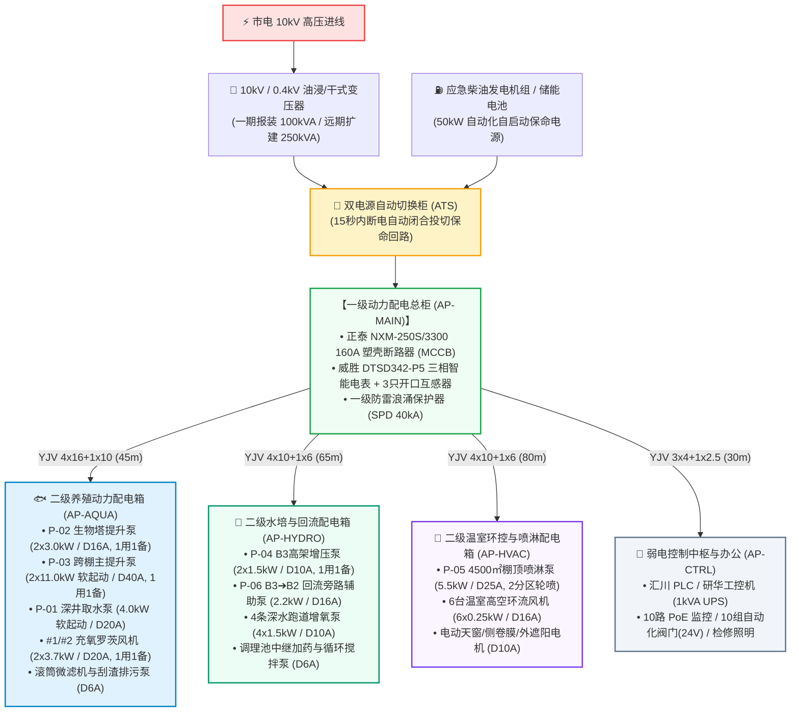
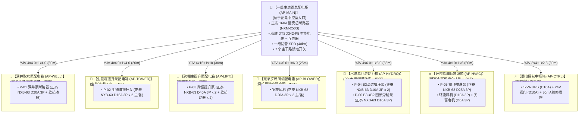
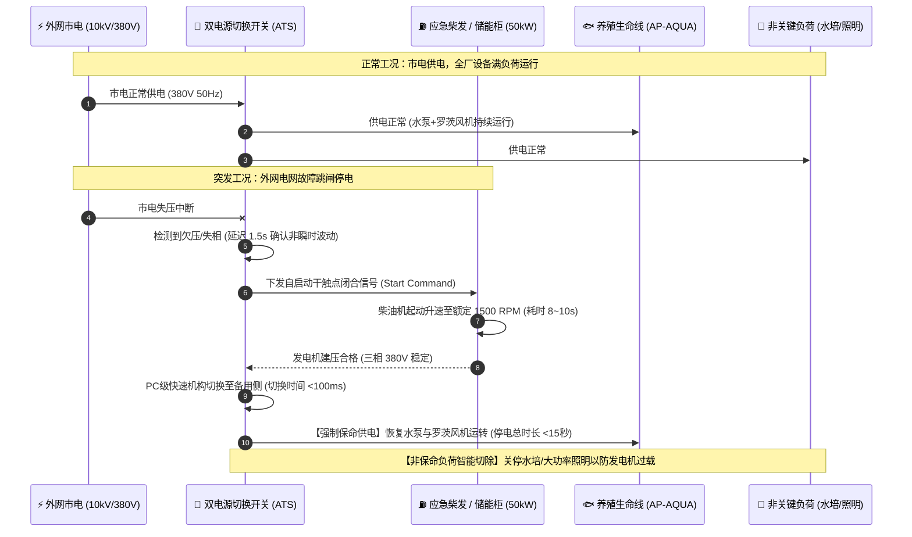
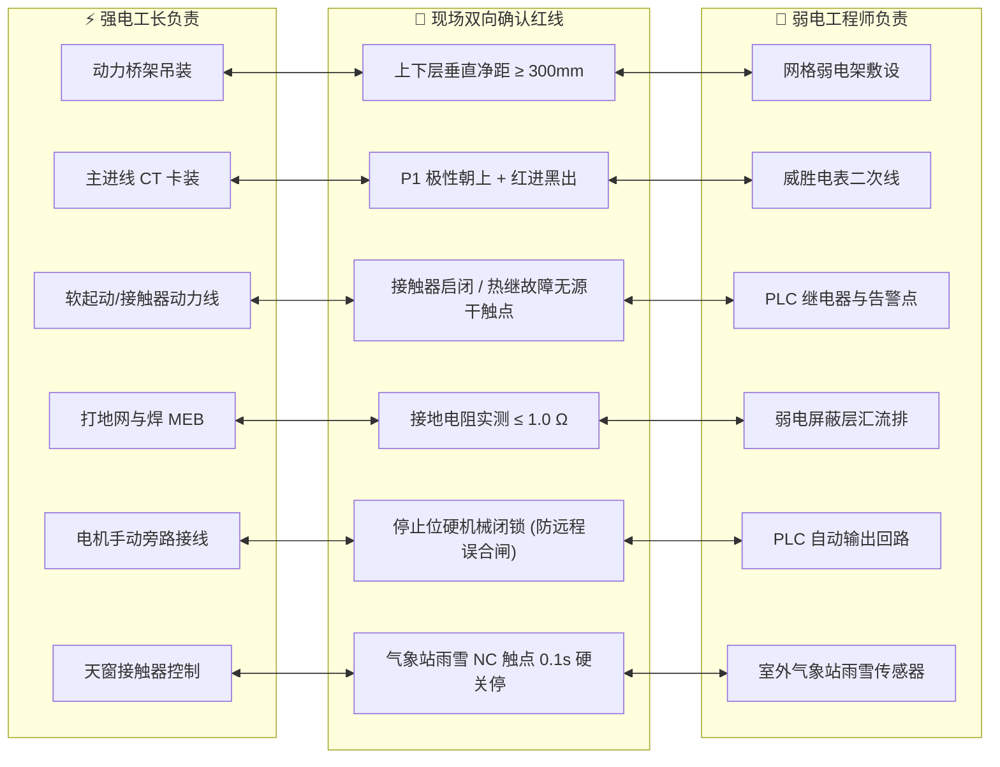

# 连锁数字化农业工厂：06_全厂强电动力配电与电气工程规划规范 (Plant-Wide Electrical Power Distribution & Engineering Specification)

> **核心定位**：本规范是数字化农业工厂（鱼菜共生智能工业体系）在 **380V/220V 强电动力配电、负荷计算、分级配电箱回路矩阵、电力电缆截面载流量与长距离压降校验、双电源自动切换 (ATS) 应急保命以及联合防雷接地等电位系统** 的顶级工程实施与验收规范。
> 
> 本规范明确确立：**强电动力系统是全厂所有活体生物（鱼类与蔬菜）资产的“生命能量源泉”。强电系统必须坚持“容量留有余量、两级分布式就地控制、每台执行器独立配置 D 型断路器防单点倒池、防雷与保护接地严格 $\le 1.0\,\Omega$”的工业底线。**

---

## 1. 强电动力配电系统顶层架构蓝图

全厂强电动力采用 **TN-S 三相五线制 (380V/220V, 50Hz)** 供电系统，中性线 (N) 与保护地线 (PE) 自变压器出线端起严格物理分开：



---

## 2. 现场一级配电总开关实物参数与容量核验

根据现场配电总开关实物铭牌核验，现场已配备工业级高分断塑壳断路器：

```
+-----------------------------------------------------------------------------------+
|                   现场一级总配电断路器实物铭牌参数表 (Single Source of Truth)       |
+-----------------------------------------------------------------------------------+
|  • 制造品牌与规格型号：正泰 (CHNT) NXM-250S/3300 塑壳断路器 (MCCB)                 |
|  • 额定电流 (In)：160A (250A 壳架等级，配置 160A 热磁脱扣器)                       |
|  • 额定绝缘电压 (Ui) / 冲击耐压 (Uimp)：800V / 8kV                                 |
|  • 400V 极限/运行分断能力 (Icu/Ics)：36kA / 20kA                                   |
|  • 瞬时短路脱扣整定倍数 (Ii)：10In (即 1600A 瞬时短路磁脱扣)                       |
|  • 出线端子接线工艺：下方 LOAD 端子每相采用“双拼铜电缆并联”，黄/绿/红标准相色套管   |
|  • 互感器卡装朝向：3 只丁本 DBKCT24 (200/5A) 开口互感器 P1 极性面朝向上方电源侧    |
+-----------------------------------------------------------------------------------+
```

### 2.1 现场 160A 总开关带载能力复核
$$\text{主开关最大持续供电功率} = \sqrt{3} \times 380\,\text{V} \times 160\,\text{A} \times \cos\phi(0.85) \approx \mathbf{89.4\,\text{kW}}$$

* **第一期实际计算负荷**：$P_{js} \approx 36.85\,\text{kW}$，计算电流 $I_{js} = 65.9\,\text{A}$；
* **运行负荷率与安全裕量**：实际负荷仅占总开关额定容量的 **$41.2\%$**，具备 **$2.4\,\text{倍}$ 的安全冗余**，第一期完全无须增容改电。

---

## 3. 全厂负荷计算与变压器容量规划 (需用系数法)

依据《低压配电设计规范》(GB 50054-2011) 及 [07_深圳光明基地双棚跨区大闭环水循环系统工程设计规范.md](./07_深圳光明基地双棚跨区大闭环水循环系统工程设计规范.md)，对 P-01~P-06 定频/软起动水泵及全厂用电设备进行负荷精算：

| 动力用电单元/子系统 | 包含设备明细与装机容量 ($P_e$) | 需用系数 ($K_x$) | 功率因数 ($\cos\phi$) | 计算有功 ($P_{js}$, kW) | 计算无功 ($Q_{js}$, kvar) | 计算电流 ($I_{js}$, A) | 负荷等级与供电保障要求 |
| :--- | :--- | :---: | :---: | :---: | :---: | :---: | :--- |
| **1. 养殖水动力与充氧 (AP-AQUA)** | **$22.45\,\text{kW}$** (P-03 11kW主提升 + P-02 3kW生物塔 + P-01 4kW深井 + 3.7kW风机 + 0.75kW微滤) | 0.85 | 0.85 ($\tan\phi=0.62$) | **$19.08\,\text{kW}$** | **$11.83\,\text{kvar}$** | **$34.1\,\text{A}$** | **一级负荷 (保命不可断，ATS 应急自投)** |
| **2. 水培种植与回流 (AP-HYDRO)** | **$9.95\,\text{kW}$** (P-04 1.5kW高架 + P-06 2.2kW旁路 + 6kW跑道增氧 + 0.25kW加药) | 0.75 | 0.85 ($\tan\phi=0.62$) | **$7.46\,\text{kW}$** | **$4.63\,\text{kvar}$** | **$13.3\,\text{A}$** | **二级负荷 (允许短暂停机避峰)** |
| **3. 温室环控与降温 (AP-HVAC)** | **$17.5\,\text{kW}$** (P-05 5.5kW喷淋泵 + 1.5kW环流风机 + 0.5kW天窗遮阳 + 10kW预留) | 0.70 | 0.80 ($\tan\phi=0.75$) | **$12.25\,\text{kW}$** | **$9.19\,\text{kvar}$** | **$23.3\,\text{A}$** | **二级负荷 (顶温超标时按需投入)** |
| **4. 弱电中台与阀门 (AP-CTRL)**| **$5.0\,\text{kW}$** (PLC/工控机/10组24V电动阀/10路PoE/照明) | 0.80 | 0.90 ($\tan\phi=0.48$) | **$4.00\,\text{kW}$** | **$1.92\,\text{kvar}$** | **$6.8\,\text{A}$** | **一级负荷 (自带 1kVA 在线式 UPS)** |
| **5. 扩建预留 (含中央地源热泵)** | **$45.0\,\text{kW}$** | 0.65 | 0.85 ($\tan\phi=0.62$) | **$29.25\,\text{kW}$** | **$18.14\,\text{kvar}$** | **$52.3\,\text{A}$** | **三期规划预留动力负荷** |
| **📊 第一期实际生产负荷合计** | **$54.9\,\text{kW}$** | **综合 0.78** | **0.84** | **$36.85\,\text{kW}$** | **$23.65\,\text{kvar}$** | **$\mathbf{65.9\,\text{A}}$** | **第一期 160A 主进线断路器安全冗余 2.4 倍** |
| **🏢 远期全厂满产总负荷合计** | **$99.9\,\text{kW}$** | **综合 0.72** | **0.85** | **$71.93\,\text{kW}$** | **$44.60\,\text{kvar}$** | **$\mathbf{128.6\,\text{A}}$** | **满足未来 5 年扩建无须二次改电** |

### 3.1 变压器容量选型与功率因数补偿
1. **第一期变压器负荷率**：
   * 第一期计算视在功率 $S_{js} = \sqrt{36.85^2 + 23.65^2} \approx 43.8\,\text{kVA}$；
   * 采用标准 **$100\,\text{kVA}$ 专变**，运行负荷率在 $44\%$（处于变压器最高运行效率区间 $\eta \approx 98\%$）。
2. **电容无功就地补偿 (Power Factor Correction)**：
   * 一级配电柜配置 **$20\,\text{kvar}$（4 组 $\times 5\,\text{kvar}$ 自动投切电容电抗补偿模组）**；
   * 补偿后全厂综合功率因数达到 **$\cos\phi \ge 0.95$**，杜绝供电局力率电费罚款。

---

## 4. 大空间厂房“两级分布式配电架构”与区域独立分箱规范

在双棚大跨度温室厂房中，推行 **“一级主配电总柜 (AP-MAIN) $\to$ 二级就地独立动力分箱 (AP-WELL / AP-TOWER / AP-LIFT / AP-BLOWER / AP-HYDRO / AP-HVAC / AP-CTRL) $\to$ 机旁就地检修旋钮”** 的分布式架构：



### 4.1 就地独立配电箱的四大工程核心优势
1. **就地隔离、互不影响**：深井泵、生物塔泵、跨棚泵各设独立箱体，单箱维护检修完全不影响其余生命水泵与风机；
2. **人在池边，闸在眼前**：养殖工人在各功能区巡视发现异常时，走两步即可在专用分箱前操作停机与复位；
3. **检修人身安全保障 (Lockout/Tagout 工业上锁挂牌)**：机电工清洗水泵时在专用就地箱拉闸上锁，彻底杜绝误合闸绞伤风险；
4. **强弱电电磁物理隔离 (EMI Protection)**：大功率软起动器（11kW）独立设箱，彻底隔离谐波对弱电传感器信号的干扰。

---

## 5. 执行器独立断路器配置矩阵与 D 型脱扣硬规则

> [!CAUTION]
> ### 🚨 电气安全铁律：为什么每个执行器必须独立配备 D 型断路器？
> 1. **严禁共用总闸（防止单点故障导致全厂倒池）**：单台水泵发生短路时，**必须仅跳本台水泵的专用断路器**，总闸和其余鱼池水泵、罗茨风机绝不跳闸，保障生命系统连续供氧；
> 2. **防止电机堵转烧毁**：单泵额定电流 $6\sim 22\text{A}$，堵转电流会增大 5~8 倍。若无独立断路器，电机将在几分钟内烧毁起火；
> 3. **必须选用 D 型脱扣特性 (D-Curve)**：工频水泵、风机全压启动瞬间存在 **$5 \sim 8\,\text{倍}$ 的启动冲击电流**，必须选用 **D 型断路器（$10\sim 14 I_n$ 瞬时脱扣）**。严禁使用民用 C 型断路器，防止合闸瞬间误跳闸。

### 5.1 全厂各动力执行器独立断路器选型表 (7 大就地动力箱精准对齐)

| 所属配电箱 | 动力执行器设备名称与工况 | 设备额定功率 | 满载额定电流 ($I_e$) | 推荐独立断路器型号规格 | 启动与电气驱动方式 | 保护与隔离职能说明 |
| :--- | :--- | :---: | :---: | :--- | :---: | :--- |
| **AP-WELL** | **P-01 深井取水潜水泵** | **4.0 kW** (380V) | 约 $8.6\,\text{A}$ | **正泰 `NXB-63 D20A 3P`** | **软起动器 (SS-4kW)** | 深井抽水至蓄水池，配动水位电极保护 |
| **AP-TOWER**| **P-02 生物塔提升泵 #1** | **3.0 kW** (380V) | 约 $6.4\,\text{A}$ | **正泰 `NXB-63 D16A 3P`** | **交流接触器工频直启 (DOL)** | 超低扬程大流量提升，配热过载继电器 |
| **AP-TOWER**| **P-02 生物塔提升泵 #2** (备用) | **3.0 kW** (380V) | 约 $6.4\,\text{A}$ | **正泰 `NXB-63 D16A 3P`** | **交流接触器工频直启 (DOL)** | 1用1备独立回路，支持 PLC 自动轮换 |
| **AP-LIFT** | **P-03 跨棚主提升泵 #1** | **11.0 kW** (380V) | 约 $22.5\,\text{A}$ | **正泰 `NXB-63 D40A 3P`** | **软起动器 (SS-11kW)** | 全厂第一大动力中枢，软起动防电网冲击与水锤 |
| **AP-LIFT** | **P-03 跨棚主提升泵 #2** (备用) | **11.0 kW** (380V) | 约 $22.5\,\text{A}$ | **正泰 `NXB-63 D40A 3P`** | **软起动器 (SS-11kW)** | 1用1备独立回路，支持 24h 自动对倒与故障自投 |
| **AP-BLOWER**| **#1 充氧罗茨风机** | **3.7 kW** (380V) | 约 $7.8\,\text{A}$ | **正泰 `NXB-63 D20A 3P`** | **交流接触器工频直启 (DOL)** | 鱼池大流量充氧生命线主供气回路 |
| **AP-BLOWER**| **#2 备用充氧罗茨风机** | **3.7 kW** (380V) | 约 $7.8\,\text{A}$ | **正泰 `NXB-63 D20A 3P`** | **交流接触器工频直启 (DOL)** | 备用风机独立控制与单独保养隔离 |
| **AP-HYDRO**| **P-04 B3高架增压泵 #1** | **1.5 kW** (380V) | 约 $3.4\,\text{A}$ | **正泰 `NXB-63 D10A 3P`** | **交流接触器工频直启 (DOL)** | PLC 立体温控按需加压供液 |
| **AP-HYDRO**| **P-04 B3高架增压泵 #2** (备用) | **1.5 kW** (380V) | 约 $3.4\,\text{A}$ | **正泰 `NXB-63 D10A 3P`** | **交流接触器工频直启 (DOL)** | 备用高架增压回路 |
| **AP-HYDRO**| **P-06 B3➔B2 回流旁路泵** | **2.2 kW** (380V) | 约 $4.9\,\text{A}$ | **正泰 `NXB-63 D16A 3P`** | **交流接触器工频直启 (DOL)** | 边缘工况（冲淤/倒池/高背压）加压回路 |
| **AP-HVAC** | **P-05 4500㎡棚顶喷淋泵** | **5.5 kW** (380V) | 约 $11.6\,\text{A}$ | **正泰 `NXB-63 D25A 3P`** | **交流接触器工频直启 (DOL)** | 2 分区交替轮喷，高压微雾降温回路 |
| **AP-HVAC** | **温室高空环流风机群** | **1.5 kW** (380V) | 约 $3.4\,\text{A}$ | **正泰 `NXB-63 D10A 3P`** | **交流接触器工频直启 (DOL)** | 高空风机群独立供电回路 |
| **AP-HVAC** | **电动天窗/外遮阳电机** | **0.4 kW** (380V) | 约 $1.1\,\text{A}$ | **正泰 `NXB-63 D6A 3P`** | **交流接触器工频直启 (DOL)** | 减速电机行程限位与过载跳闸保护 |
| **AP-CTRL** | **弱电控制中枢与 UPS** | **1.0 kVA** (220V) | 约 $4.5\,\text{A}$ | **正泰 `NXB-63 C16A 2P`** | **在线式 UPS 稳压滤波** | PLC、工控机专用纯净电源 |
| **AP-CTRL** | **全厂 10 组 24V 自动化阀门**| **0.35 kW** (220V) | 约 $1.6\,\text{A}$ | **正泰 `NXB-63 D10A 2P`** | **24V 开关电源集中供电** | V-01~V-10 自动化蝶阀/球阀/电磁阀 |
| **AP-CTRL** | **现场移动检修防水插座箱** | **2.2 kW** (220V) | 约 $10.0\,\text{A}$| **正泰 `NXBLE-63 C16A 2P (30mA)`**| **工频 220V 检修电源** | 高压清洗机/手持电钻 (强制 30mA ≤0.1s 极速漏保) |

---

### 5.2 全厂剩余电流动作保护 (RCD) 分级与生命维持防翻塘规范

依据《剩余电流动作保护装置安装和运行》(GB 13955) 与现代高密度循环水养殖工程实践，全厂漏电保护严格执行**“科学分级、人身防触电、动力防误跳、生命只报不切”**四项红线：

```
+-----------------------------------------------------------------------------------+
|                   全厂剩余电流动作保护 (RCD) 三级协同安全矩阵                     |
+-----------------------------------------------------------------------------------+
| 1. 【二级动力箱总进线】 (AP-AQUA / AP-HYDRO / AP-HVAC):                           |
|    • 型号：正泰 NXBLE-63 3P (带漏电保护模块)                                       |
|    • 额定动作电流：IΔn = 100mA，S 型延时 (动作时间 0.3s)                           |
|    • 职能：防止总干线绝缘老化起火，彻底消除多台水泵/风机启动瞬态微漏电导致的误跳闸！|
|                                                                                   |
| 2. 【鱼池循环水泵与罗茨风机】 (P-01 ~ P-06 生命维持设备):                         |
|    • 保护模式：独立 D 型微断 + 等电位可靠接地 (PE ≤ 1.0Ω) + 漏电电流检测送 PLC    |
|    • 🚨 国标铁律：只报警、不跳闸！发生接地微漏电时触发中控声光警报并自动投备用泵， |
|      严禁断路器自动断电切断生命水体循环与充氧！                                    |
|                                                                                   |
| 3. 【现场移动检修插座箱】 (单相 220V 检修回路):                                   |
|    • 型号：正泰 NXBLE-63 2P C16A                                                  |
|    • 额定动作电流：IΔn = 30mA，瞬动型 (动作时间 ≤ 0.1s)                            |
|    • 职能：高压水枪清洗、手持电钻检修的人身保命底线，0.1 秒阻断心室纤颤致死风险！  |
+-----------------------------------------------------------------------------------+
```

---

## 6. 动力电缆截面载流量与长距离压降校验 ($116\,\text{m}$ 跨度)

在大型温室环境内，导线截面必须同时满足**发热载流量**与**末端电压降 ($\Delta U \le 5\%$)** 要求。

### 6.1 骨干动力电力电缆选型与压降复核表

| 回路编号与名称 | 起止敷设路径与单程长度 | 推荐电力电缆型号规格 | 导体材质与截面 | 允许持续载流量 (空气中) | 回路满载电流 ($I$) | 计算末端电压降 ($\Delta U_{\%}$) | 校验结果 |
| :--- | :--- | :--- | :--- | :---: | :---: | :---: | :---: |
| **W1: AP-MAIN 进线** | 变压器低压侧 $\to$ AP-MAIN ($20\,\text{m}$) | **`YJV-0.6/1kV 4×50+1×25`** | 纯铜无氧铜芯 | $185\,\text{A}$ | $115.0\,\text{A}$ | **$0.48\%$** | ✅ 优良 (裕量足) |
| **W2: 养殖动力干线** | AP-MAIN $\to$ AP-AQUA ($45\,\text{m}$) | **`YJV-0.6/1kV 4×16+1×10`** | 纯铜无氧铜芯 | $80\,\text{A}$ | $28.1\,\text{A}$ | **$0.95\%$** | ✅ 优良 (满足低阻) |
| **W3: 水培动力干线** | AP-MAIN $\to$ AP-HYDRO ($65\,\text{m}$) | **`YJV-0.6/1kV 4×10+1×6`** | 纯铜无氧铜芯 | $58\,\text{A}$ | $11.4\,\text{A}$ | **$1.18\%$** | ✅ 优良 ($\le 5\%$) |
| **W4: 温室环控干线** | AP-MAIN $\to$ AP-HVAC ($85\,\text{m}$) | **`YJV-0.6/1kV 4×10+1×6`** | 纯铜无氧铜芯 | $58\,\text{A}$ | $15.9\,\text{A}$ | **$1.82\%$** | ✅ 优良 ($\le 5\%$) |
| **W5: 弱电控制专线** | AP-MAIN $\to$ AP-CTRL ($30\,\text{m}$) | **`YJV-0.6/1kV 3×4+1×2.5`** | 纯铜无氧铜芯 | $36\,\text{A}$ | $6.8\,\text{A}$ | **$0.42\%$** | ✅ 优良 (纯净电源) |

---

## 7. 双电源自动切换 (ATS) 与应急保命机制



---

## 8. 联合防雷接地与等电位联结系统 (Earthing & Bonding)

```
+-----------------------------------------------------------------------------------+
|                        全厂联合接地网标准 (接地电阻 R ≤ 1.0 Ω)                     |
+-----------------------------------------------------------------------------------+
|  [水平接地极: 50×5 热镀锌扁钢] ── 埋深 -0.8m，环绕温室基础外圈闭合闭环              |
|  [垂直接地极: L50×50×5×2500mm 镀锌角钢] ── 沿环形地网每隔 5m 垂直打入地下           |
|  [总等电位联结端子箱 (MEB)] ── 安装于配电主间，与主体钢结构、地网、PE母排可靠焊接  |
+-----------------------------------------------------------------------------------+
```

### 8.1 接地施工红线
1. **三网合一联合接地**：防雷接地、PE保护接地、工控逻辑地**统一并入联合接地网**，接地电阻实测严格 **$\le 1.0\,\Omega$**；
2. **主体钢结构等电位跨接**：温室金属立柱、钢桁架、双层热浸锌桥架在接头处必须使用 **$\ge 16\,\text{mm}^2$ 编织铜带** 进行可靠跨接；
3. **三级电涌保护 (SPD)**：一级总柜配置 $40\,\text{kA}$ SPD，二级分箱配置 $20\,\text{kA}$ SPD，弱电柜配置 $10\,\text{kA}$ 精细 SPD。

---

## 9. 🤝 强电施工人员必须与弱电工人现场协同的 6 大交界场景与 SOP

在现场施工中，**强电负责动力供给，弱电负责信号感知与闭环控制**。强电电工在遇到以下 6 类关键交界工序时，**必须暂停单方作业，通知弱电/自动化工程师共同到场确认**，杜绝扯皮与设备损毁：



| 协同交界场景 | 强电电工操作职责 | 弱电/自动化工程师操作职责 | 双方共同到场确认的验收红线 |
| :--- | :--- | :--- | :--- |
| **1. 双层热浸锌桥架高空吊装** | 负责上层封闭式动力槽架（敷设 380V/220V 电缆） | 负责下层网格式弱电桥架（敷设 485/网线） | **两层垂直净距必须 $\ge 300\text{mm}$**，严禁强弱电同槽混拉！ |
| **2. 电表与开口互感器接线** | 将 3 只丁本 DBKCT24 卡装在 160A 主出线电缆上 | 负责将二次侧引线接入威胜 DTSD342-P5 电表 | **共同核验 P1 面朝向上方电源侧**，二次线红进黑出对应 I11/I12。 |
| **3. 软起动器/接触器启停与故障信号** | 负责软起动器/交流接触器 380V 进出线与辅助触点 | 负责将接触器线圈驱动与热继电保护触点引至 PLC | **核对无源干触点极性与线号**（`PUMP-RUN` / `PUMP-ALARM`），联调启停。 |
| **4. 联合防雷接地与屏蔽汇流** | 负责打入垂直接地极与焊接总等电位端子箱 (MEB) | 负责将弱电柜内 RVSP 屏蔽层汇流排引接至 MEB | **用测试仪实测接地电阻严格 $\le 1.0\,\Omega$**，确认弱电仅单端接地。 |
| **5. 水泵机旁【手动/自动】旋钮** | 负责接“手动”档回路（直接合闸启动水泵） | 负责接“自动”档回路（由 PLC 继电器控制启停） | **联调三位带锁旋钮**，确认就地扳到“停止”时 PLC 无法强行远程合闸。 |
| **6. 超声波气象站雨雪硬关天窗** | 负责 380V 天窗开窗电机的接触器二次控制回路 | 负责室外气象站常闭雨雪干触点引线至控制回路 | **现场向气象站探头喷水**，验证 0.1 秒内天窗接触器强制断电闭合。 |

---

## 10. 强电进场安装与通电调试验收 Checklist

| 序号 | 检查项目 | 验收测试标准与判定准则 | 责任角色 | 现场验收结果 |
| :---: | :--- | :--- | :---: | :---: |
| **1** | **主断路器铭牌复核** | 现场确认一级总开关为 **正泰 NXM-250S/3300 160A**，极性朝向与双拼电缆压接牢固。 | 强电工长 | [ ] 合格 |
| **2** | **进线相序与电压** | 用相序表测量 A-B-C 三相正相序，线电压在 $380\text{V} \pm 7\%$（$353\text{V}\sim 406\text{V}$），相电压 $220\text{V} \pm 7\%$。 | 高压电工 | [ ] 合格 |
| **3** | **绝缘电阻摇测** | 动力回路通电前用 1000V 兆欧表测量相间及各相对地绝缘电阻，阻值必须 **$\ge 20\,\text{M}\Omega$**。 | 强电工长 | [ ] 合格 |
| **4** | **接地电阻实测** | 使用四极接地电阻测试仪测量配电总接地端子与联合接地网电阻，实测阻值必须 **$\le 1.0\,\Omega$**。 | 质检主管 | [ ] 合格 |
| **5** | **互感器卡装朝向** | 确认 3 只丁本 DBKCT24 开口互感器 P1 面朝向上方电源侧，二次引线接电表 I11/I12，电表变比确认设为 40。 | 自动化工程师 | [ ] 合格 |
| **6** | **电机断路器 D 型核对**| 核对 AP-AQUA、AP-HYDRO 动力箱内全部电机支路断路器均为 **正泰 NXB-63 D 型脱扣特性**（严禁混入 C 型）。 | 强电工长 | [ ] 合格 |
| **7** | **ATS 自动投切演练** | 人工断开市电总进线断路器，记录并验证发电机在 15 秒内建压自投，AP-AQUA 养殖水泵与罗茨风机连续恢复运转。 | 项目总工 | [ ] 合格 |

---

## 🔗 相关设计与规范链接

* **深圳光明基地双棚跨区大闭环水循环系统工程设计规范**：👉 [07_深圳光明基地双棚跨区大闭环水循环系统工程设计规范.md](./07_深圳光明基地双棚跨区大闭环水循环系统工程设计规范.md)
* **第一期硬件采购 BOM 与商务投资清单**：👉 [04_第一期硬件采购BOM与工程施工清单.md](./04_第一期硬件采购BOM与工程施工清单.md)
* **现场弱电智能化与工控网络规划施工规范**：👉 [05_现场弱电线缆选型与布线施工规范.md](./05_现场弱电线缆选型与布线施工规范.md)
* **养殖水动力与全厂运行能耗估算模型**：👉 [01_养殖水动力与全厂运行能耗估算模型(非正式草案).md](../04_subsystems/03_energy_optimization/01_养殖水动力与全厂运行能耗估算模型(非正式草案).md)
* **能耗优化子系统总体设计 (MPC 峰谷套利)**：👉 [03_energy_optimization/README.md](../04_subsystems/03_energy_optimization/README.md)
* **分期实施计划书**：👉 [03_分期实施计划书.md](./03_分期实施计划书.md)

