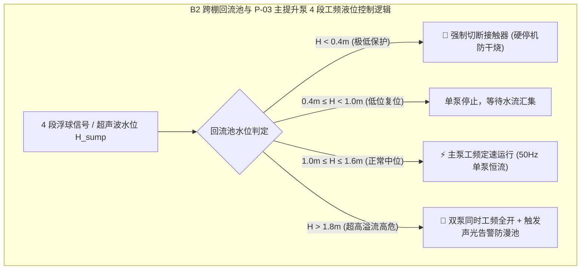

# 连锁数字化农业工厂（深圳光明基地）：双棚跨区大闭环水循环系统工程设计规范

> **工程定位与地理气象背景**  
> * **项目地点**：深圳市光明区（北纬约 $22^\circ 45'\text{N}$，东经约 $113^\circ 54'\text{E}$）。
> * **气候特征**：南亚热带季风气候。具有**“长夏无冬、湿热多雨、夏秋季易受强台风暴雨侵袭、日照充沛但夏季易产生极端温室温湿热停滞（水温 $>28^\circ\text{C}$ 热胁迫风险）”**的典型华南气候特征。
> * **文档属性**：全基地水力拓扑、物理管网标高、水泵扬程流量测算、水质调理与控制闭环的**一级工程事实源 (Single Source of Truth for Hydraulic Engineering)**。
> * **关联专项规范**：
>   * 动力配电与水泵分级控制：👉 [06_全厂强电动力配电与电气工程规划规范.md](./06_全厂强电动力配电与电气工程规划规范.md)
>   * 传感器选型与 485 布线：👉 [05_现场弱电线缆选型与布线施工规范.md](./05_现场弱电线缆选型与布线施工规范.md)
>   * 水动力拓扑 JSON 契约规范：👉 [09_水动力拓扑与水循环数据契约规范(Hydraulic_Topology_Schema).md](../03_system_architecture/09_水动力拓扑与水循环数据契约规范(Hydraulic_Topology_Schema).md)
>   * 调理池水力计算与加药自治：👉 [01_调节池水力计算与加药自治规范.md](../04_subsystems/02_hydroponics/01_调节池水力计算与加药自治规范.md)

---

## 1. 工程总体布局与物理水体总盘点

### 1.1 双大棚物理空间与高差关系 (3D Spatial Layout)

全基地由两座现代化连栋钢结构温室大棚构成，**总建筑占地面积约 $4,500\,\text{m}^2$**：
1. **B2 大棚（低位主力车间，右侧矩形大棚，建筑面积约 $2,590\,\text{m}^2$）**：
   * **功能分区**：集成了 **18 座高密度养殖鱼池**、**2 组三级生化过滤塔群**、**13 条平面跑道式深水菜床 (Raceways)** 以及 **跨棚主提升回流集水池**。
2. **B3 大棚（高位立体种植车间，左侧正方形大棚，建筑面积约 $1,920\,\text{m}^2$）**：
   * **标高与距离**：空间相对地势较高，**垂直扬程较 B2 大棚高出约 $5.0\,\text{m}$，两棚管道水平输送距离约 $120.0\,\text{m}$**。
   * **功能分区**：集成了 **角落多层气泡分离池（蛋白质分离与微细颗粒拦截）**、**多层高立体水培架（含增压供水泵）**、**矮架/平面水培床** 以及 **终端水质调节箱与 B3 闭环回流池（含重力直通+并联旁路辅助泵）**。


*注：全厂三维物理建模基准详见 SketchUp 布局方案（B3: 40m×48m, B2: 72m×36m/119m跨度，两棚合计约 4,500 ㎡）*

---

### 1.2 全系统水体容量与蓄水能力精算表

| 水体分区 | 设施/水池单元 | 单体几何规格 | 数量 | 单体满载容积 | 区域总容积 | 工艺有效水深与水体核算 |
| :--- | :--- | :--- | :---: | :---: | :---: | :--- |
| **水源与应急蓄水区** | 应急蓄水池 | $\Phi 8.0\,\text{m} \times H 1.2\,\text{m}$ | 2 座 | $60.32\,\text{m}^3$ | **$120.64\,\text{m}^3$** | 应急备用水源，防井水枯水与水网检修 |
| | 地下降温储水罐 | 混凝土地下水窖 / PE 储罐 | 1 座 | $30.00\,\text{m}^3$ | **$30.00\,\text{m}^3$** | 专供 $4500\,\text{m}^2$ 夏季棚顶高压喷淋降温（防蒸发失水） |
| **B2 鱼池养殖梯队** | 大型鱼池（鱼苗/标粗） | $\Phi 8.0\,\text{m} \times H 1.2\,\text{m}$ | 4 个 | $60.32\,\text{m}^3$ | **$241.28\,\text{m}^3$** | 有效水深 $1.0\,\text{m}$，有效水体 $\approx 201.1\,\text{m}^3$ |
| | 中型鱼池（成鱼育肥） | $\Phi 5.0\,\text{m} \times H 1.2\,\text{m}$ | 6 个 | $23.56\,\text{m}^3$ | **$141.36\,\text{m}^3$** | 有效水深 $1.0\,\text{m}$，有效水体 $\approx 117.8\,\text{m}^3$ |
| | 小型鱼池（分级养成） | $\Phi 3.0\,\text{m} \times H 1.2\,\text{m}$ | 8 个 | $8.48\,\text{m}^3$ | **$67.86\,\text{m}^3$** | 有效水深 $1.0\,\text{m}$，有效水体 $\approx 56.5\,\text{m}^3$ |
| **B2 生化与回流区** | 生物塔回流池 | $2.5\,\text{m} \times 2.0\,\text{m} \times 1.5\,\text{m}$ | 2 个 | $7.50\,\text{m}^3$ | **$15.00\,\text{m}^3$** | 生物塔跌水缓冲与二级循环泵吸水坑 |
| | B2 跨棚回流池 | $3.0\,\text{m} \times 2.5\,\text{m} \times 2.0\,\text{m}$ | 1 座 | $15.00\,\text{m}^3$ | **$15.00\,\text{m}^3$** | 跨棚主提升泵吸水坑（双潜水泵一用一备） |
| **B2 平面蔬菜水培区**| 跑道式水培菜床 | $35.0\,\text{m} \times 1.2\,\text{m} \times 0.3\,\text{m}$ | 13 条 | $12.60\,\text{m}^3$ | **$163.80\,\text{m}^3$** | DWC 深水浮板，有效水深 $0.20\,\text{m}$ ($\approx 109.2\,\text{m}^3$) |
| **B3 立体水培与调理**| 气泡蛋白质分离池 | 多层阶梯反应池 | 1 套 | $6.00\,\text{m}^3$ | **$6.00\,\text{m}^3$** | 旋流微气泡气浮分离，脱除蛋白质微粒 |
| | B3 立体与平面菜床 | 多层架 + 矮架槽 | 1 批 | 约 $45.00\,\text{m}^3$| **$45.00\,\text{m}^3$** | 多层 NFT/DWC 复合栽培立体空间 |
| | 水质调节箱与回流池 | 304不锈钢/PP集成箱 | 1 套 | $10.00\,\text{m}^3$ | **$10.00\,\text{m}^3$** | pH/EC 调理、微量元素脉冲加药中继缓冲 |
| **全系统总水体汇总** | — | — | — | — | **$\approx 855.94\,\text{m}^3$** | **全厂闭环循环动态水体约 $620 \sim 680\,\text{m}^3$** |

---

## 2. 全厂大闭环水循环工艺流程与拓扑架构

### 2.1 整体水力流向与工艺拓扑图 (Mermaid Topology)

```mermaid
flowchart TD
    %% 样式定义
    classDef wellStyle fill:#e0f7fa,stroke:#00838f,stroke-width:2px;
    classDef fishStyle fill:#e1f5fe,stroke:#0288d1,stroke-width:2px;
    classDef bioStyle fill:#fff3e0,stroke:#f57c00,stroke-width:2px;
    classDef b2vegStyle fill:#e8f5e9,stroke:#2e7d32,stroke-width:2px;
    classDef pumpStyle fill:#fce4ec,stroke:#c2185b,stroke-width:2px;
    classDef b3Style fill:#ede7f6,stroke:#512da8,stroke-width:2px;
    classDef returnStyle fill:#efebe9,stroke:#4e342e,stroke-width:2px;

    %% 1. 水源与一次分配
    subgraph Sec1 ["💧 1. 基地水源与一次供配水系统 (大棚外深井)"]
        direction TB
        DeepWell["🕳️ 地下深井水源 (P-01 潜水泵)<br>(恒温 20~22°C 深井取水)"] --> Pipe63["🔵 Φ63mm UPVC 主供水管"]
        Pipe63 --> StorageTanks["💧 2座大型应急蓄水池<br>(2 × Φ8m × H1.2m, 蓄水 120.6 m³)"]
        Pipe63 --> SprayTanks["🌧️ 地下降温储水罐 (30 m³)<br>(专供 4500㎡ 棚顶喷淋 P-05 泵)"]
        Pipe63 --> DirectMake["🚰 鱼池应急直补水路"]
    end

    %% 2. B2 鱼池区
    subgraph Sec2 ["🐟 2. B2 大棚：18座高密度循环水养殖鱼池 (RAS 养殖群)"]
        direction TB
        MainFeed110["🔵 110mm UPVC 环状进水总管"]
        subgraph TanksGroup ["养殖水体分级梯队 (总容积 450.5 m³)"]
            Tanks8m["【鱼苗/标粗组】 4座 Φ8.0m × 1.2m (241.3 m³)"]
            Tanks5m["【中鱼养成组】 6座 Φ5.0m × 1.2m (141.4 m³)"]
            Tanks3m["【小鱼分级组】 8座 Φ3.0m × 1.2m (67.9 m³)"]
        end
        MainFeed110 --> Tanks8m & Tanks5m & Tanks3m
        BottomDrain["底部集泥排污与循环重力汇水管网"]
        Tanks8m & Tanks5m & Tanks3m --> BottomDrain
    end

    %% 3. B2 生化过滤
    subgraph Sec3 ["🦠 3. B2 大棚：生化过滤与溶氧脱气塔群 (一用一备)"]
        direction TB
        BioLiftPump["⚡ P-02 生物塔提升潜水泵 (一用一备)"]
        BottomDrain --> BioLiftPump
        subgraph BioTowersGroup ["2组生物反应塔体系 (一用一备)"]
            TowerGroupA["【A组生物塔】 3座反应塔 (最高2.5m, 跌水硝化) + 1座回流池"]
            TowerGroupB["【B组生物塔】 3座反应塔 (最高2.5m, 备用切换) + 1座回流池"]
        end
        BioLiftPump --> TowerGroupA & TowerGroupB
    end

    %% 4. B2 水培区
    subgraph Sec4 ["🌱 4. B2 大棚：跑道式平面深水水培区 (DWC Raceways)"]
        direction TB
        BioOutMain["🔵 110mm 硝化出水分配主管"]
        TowerGroupA & TowerGroupB --> BioOutMain
        RacewayGroup["【13条深水跑道菜床】<br>(单条 L:35m × W:1.2m × H:0.3m，总长 455m)"]
        BioOutMain --> RacewayGroup
        B2DrainMain["🔵 110mm 跑道菜床汇流主管"]
        RacewayGroup --> B2DrainMain
    end

    %% 5. 跨棚主提升
    subgraph Sec5 ["🚀 5. 跨大棚重负荷高扬程主提升站 (B2 ➔ B3 动力枢纽)"]
        direction TB
        B2ReturnSump["💧 B2 跨棚回流池 (15 m³)"]
        B2DrainMain --> B2ReturnSump
        MainLiftPumps["⚡ P-03 跨棚重负荷主提升泵 (一用一备)<br>★ 工况：水平输送 120m，垂直扬程 5.0m<br>★ 软起动/接触器工频驱动、止回阀与 4段液位硬启停"]
        B2ReturnSump --> MainLiftPumps
    end

    %% 6. B3 水培与蛋白分离
    subgraph Sec6 ["🌿 6. B3 高位大棚：气泡微细分离与立体水培区"]
        direction TB
        BubbleFractionator["🧼 角落多层气泡池 (Protein Skimmer)<br>(旋流剪切微气泡，物理富集脱除残饵微颗粒与蛋白质)"]
        MainLiftPumps ==>|"跨棚 DN110 压力管路 [120m / 扬程 5.0m]"| BubbleFractionator
        B3MainIn["🔵 B3 种植区主配水管网"]
        BubbleFractionator --> B3MainIn
        subgraph B3Cultivation ["B3 种植体系"]
            B3HighRacks["【多层高立体水培架】<br>(配 P-04 专用加压增压泵)"]
            B3LowRacks["【矮架 / 平面栽培槽】<br>(重力自流平铺)"]
        end
        B3MainIn --> B3HighRacks & B3LowRacks
    end

    %% 7. 水质调理与回流闭环
    subgraph Sec7 ["🧪 7. 终端水质调理与全厂大闭环回流 (B3 ➔ B2)"]
        direction TB
        B3DrainMain["🔵 B3 尾水汇流主出水管"]
        B3HighRacks & B3LowRacks --> B3DrainMain
        ConditioningTank["🧪 水质调节箱 (10 m³)<br>(pH 自动校准 + 螯合铁/营养液脉冲加药 + DO 补氧)"]
        B3DrainMain --> ConditioningTank
        B3ReturnSump["💧 B3 回流池 (标高 +5.0m)"]
        ConditioningTank --> B3ReturnSump

        subgraph ParallelReturn ["【B3 ➔ B2 重力自流主路 + 旁路水泵并联架构】"]
            direction LR
            GravLine["🌿 主路: 100% 零电耗重力自流 (常开直通)"]
            PumpLine["⚡ 旁路: P-06 辅助加压泵 (边缘工况备用/常闭)"]
        end
        B3ReturnSump --> GravLine & PumpLine
    end

    %% 最终闭环连接
    GravLine ==>|"DN110 5米落差重力回水"| MainFeed110
    PumpLine -.->|"DN110 强排/冲淤压力回水"| MainFeed110
    DirectMake -.-> MainFeed110

    class DeepWell,Pipe63,StorageTanks,SprayTanks,DirectMake wellStyle;
    class MainFeed110,Tanks8m,Tanks5m,Tanks3m,BottomDrain fishStyle;
    class BioLiftPump,TowerGroupA,TowerGroupB bioStyle;
    class BioOutMain,RacewayGroup,B2DrainMain b2vegStyle;
    class B2ReturnSump,MainLiftPumps pumpStyle;
    class BubbleFractionator,B3MainIn,B3HighRacks,B3LowRacks b3Style;
    class B3DrainMain,ConditioningTank,B3ReturnSump,GravLine returnStyle;
    class PumpLine pumpStyle;
```



---

## 3. 七大核心流体节点工程设计与参数选型

### 3.1 节点一：水源、应急蓄水与 4,500 ㎡ 棚顶 2 分区喷淋降温系统
1. **水源属性与前置水质**：
   * 采用基地红线外深水井取水，常年水温在 $20\sim 22^\circ\text{C}$（天然冷源），无市政余氯干扰。
   * 井水抽升采用 $\Phi 63\,\text{mm}$ UPVC 承压集水主管，配置 **P-01 深井潜水泵（3.0~4.0 kW，工频/软起动）**。
2. **2 座 $\Phi 8.0\,\text{m}\times 1.2\,\text{m}$ 应急蓄水池（$120.6\,\text{m}^3$）**：
   * **战略作用**：防范华南干旱季节地下水位下降或井泵检修，为 18 座鱼池提供至少 **48~72 小时**的极端断水生命支持储备。
   * **水质均化**：井水入池后进行自然曝气除铁锰与温度均化，避免直充深井冷水造成鱼群温度应激。
3. **4,500 ㎡ 棚顶 2 分区独立温控喷淋机制（按棚独立轮喷，应对深圳光明区极端夏季高温）**：
   * **温室热工痛点**：深圳光明区 6~9 月室外气温常达 $36\sim 38^\circ\text{C}$，两座大棚合计 **$4,500\,\text{m}^2$** 的温室顶层辐射温度可超 $45^\circ\text{C}$。
   * **2 分区（按棚独立）脉冲轮喷工艺**：
     - **分区划分**：**B2 大棚区（约 $2,590\,\text{m}^2$）** 配备 V-04 喷淋电磁阀；**B3 大棚区（约 $1,920\,\text{m}^2$）** 配备 V-05 喷淋电磁阀。
     - **控制优势**：两棚热负荷与农艺要求不同（B2 养殖区重在防鱼池高水温，B3 重在防高空叶面灼伤），按棚独立控温最精准；且单棚开启时 $Q=20\sim 25\,\text{m}^3/\text{h}$ 水量能获得充沛的 $0.3\sim 0.35\,\text{MPa}$ 雾化压力，水膜覆盖均匀；
     - 采用 **“B2 喷 3 分钟 ➔ B3 喷 3 分钟 ➔ 停歇 5 分钟”** 的交替轮喷，配置 **P-05 高压卧式多级离心喷淋泵（$Q=20\sim 25\,\text{m}^3/\text{h}, H=42\sim 45\,\text{m}, P=4.0\sim 5.5\,\text{kW}$）**，将棚内降温 $3\sim 5^\circ\text{C}$，杜绝水温突破 $27.5^\circ\text{C}$ 鱼类翻塘警戒线。

---

### 3.2 节点二：B2 鱼池养殖水力梯队与排污布水
1. **进水分流管网**：
   * 主进水管采用 $\Phi 110\,\text{mm}$ UPVC 环形管网布设，降低局部水阻。
   * 每个鱼池进水口设置切向旋转喷嘴（水面呈 $15^\circ\sim 30^\circ$ 倾角注入），驱动池水形成均匀的环形旋流，驱使残饵与鱼粪向底部中心沉降。
2. **分级养殖配置**：
   * **4座 $\Phi 8\,\text{m}$ 大鱼池**：用于鱼苗高密度集约化孵化与大规格阶段标粗；
   * **6座 $\Phi 5\,\text{m}$ 中鱼池**：用于中等规格生长过渡；
   * **8座 $\Phi 3\,\text{m}$ 小鱼池**：用于精细分级育肥与成鱼出栏前排毒暂养。
3. **双旋流底部集污排污**：
   * 鱼池底部中心设置双层涡流排污斗（双旋流分离器，Dual-Drain System），底层浓缩排污（占流量 $10\sim 15\%$）定期排泥，中上层清净水（占流量 $85\sim 90\%$）重力自流入集水管排往生物塔。

---

### 3.3 节点三：B2 生化处理塔群与两组一用一备切换
1. **重力汇流与生化反应塔结构（高 $2.5\,\text{m}$）**：
   * **鱼池出水重力汇集**：18 座鱼池（水深 $1.0\sim 1.2\,\text{m}$）底部排污口先分别汇入 **2 根 $\Phi 110\,\text{mm}$ 出水支管**，再合并为 **1 根 $\Phi 160\,\text{mm}$ 主排污管**，利用 $0.5\%\sim 1.0\%$ 管道坡度**全重力自流（输送距离 $5\sim 35\,\text{m}$）**汇集到生物塔底部的集水吸水坑。
   * **提升与跌水接触**：**P-02 生物塔提升泵（2.2~3.0 kW，纯工频，1用1备）** 直接布置于生物塔底部回流池，仅需将水垂直提升 **$2.5\,\text{m}$** 至反应塔顶部分布器。每组由 3 座串联反应塔组成，填装 K3/火山石填料（$\ge 800\,\text{m}^2/\text{m}^3$），利用跌水曝气实现高效脱氨硝化。
2. **一用一备高可靠切换机制**：
   * 配置 **A 组 / B 组** 两套独立生化塔。正常运行时 A 组满负荷工频过滤（流量恒定保障硝化停留时间 HRT），B 组低流量微循环挂膜；检修或反洗时，PLC 联动电动蝶阀 $0.5\,\text{s}$ 平滑切换至 B 组。

---

### 3.4 节点四：B2 大棚 13 条平面跑道式深水菜床 (DWC Raceways)
1. **跑道参数**：
   * 共布置 **13 条** 标准化深水水培跑道（DWC, Deep Water Culture），单条尺寸：长 $35.0\,\text{m} \times$ 宽 $1.2\,\text{m} \times$ 高 $0.3\,\text{m}$，水深控制在 $0.20\,\text{m}$。
2. **水力流动特性**：
   * 生物塔出水通过 $\Phi 110\,\text{mm}$ 配水总管，经 13 组 DN32 分支微调球阀均匀注入各跑道前端。
   * 跑道水流速度设计为 $0.02\sim 0.05\,\text{m/s}$，提供平缓的推流动力，让水培生菜/空心菜根系充分浸润吸收硝酸盐营养；末端设可调高度溢流堰，汇入 $\Phi 110\,\text{mm}$ 出水主管。

---

### 3.5 节点五：跨棚重负荷主提升泵站 (B2 ➔ B3 动力枢纽)
本节点为全基地负荷最高、水力最关键的动力中枢：
1. **工况与管路走向剖面**：
   * **水平输送跨度**：管路展开总长约 **$120\,\text{m}\sim 130\,\text{m}$**，物理走向呈 **“平地敷设 ➔ 斜坡爬升 ➔ 平地过廊 ➔ 垂直竖直立管”** 结构，引至 B3 大棚角落气泡池顶部进水口。
   * **总静态几何高差**：地面地形净标高差 $\Delta z_{\text{ground}} = 5.0\,\text{m}$，加上气泡池顶部入水距地标高 $1.8\,\text{m}$，总静扬程 $\Delta z = \mathbf{6.8\,\text{m}}$。
2. **主泵冗余与纯工频定速控制**：
   * 在 B2 跨棚回流池（$15\,\text{m}^3$）内安装 **P-03 跨棚重负荷主提升泵（2台，一用一备，7.5~11.0 kW）**。
   * **电气驱动**：采用低成本 **软起动器 (Soft Starter)**（减小起动电流冲击）+ 交流接触器工频运转，彻底消除变频器对 485 弱电仪表的电磁干扰。
   * **控制方式**：结合回流池 **4 段式浮球液位开关** 实现“低位停泵防干烧、中位单泵定速运转、超高位双泵并联全开防溢流”，PLC 设定每 24 小时自动对倒轮换。
3. **管路附件安全防护**：
   * 出水端必须标配：**304 不锈钢微阻缓闭止回阀**（防管路水锤倒灌击毁水泵）+ **Y 型过滤器** + **最高点 DN25 复合排气阀** + **管路压力表/变送器**。

---

### 3.6 节点六：B3 高位大棚气泡池与立体水培区
1. **多层气泡池（蛋白质微细分离器）**：
   * B2 提升上来的水首先进入 B3 角落的多层气泡分离池。
   * 利用高速水流与微孔曝气盘产生的大量微细气泡（直径 $100\sim 300\,\mu\text{m}$），吸附水中的残余表面活性物质、溶解性微细悬浮物与有机胶体蛋白，通过溢流泡沫槽排出系统，大幅提高水体清澈度。
2. **立体高架与矮架复合栽培**：
   * **多层高立体架（NFT/立柱式）**：B3 主管道长约 **$45\,\text{m}$**，配备 **P-04 高架增压供水泵（1.1~1.5 kW，工频定速，1用1备）**。**控制逻辑并非机械定时，而是由 PLC 采集 B3 室内 3D 垂直温湿度（L1~L3）及蔬菜根区温度，根据作物环境温度动态按需启停**：
     - *高温工况（冠层 $>26^\circ\text{C}$ 或根温 $>22^\circ\text{C}$）*：PLC 自动缩短间歇时间、增加循环频次带走根区热量并补充溶氧，防范根腐病；
     - *低温/夜间工况*：延长停歇时间，避免根系过度浸润缺氧并节省电费。
   * **矮架/平面水培槽**：利用气泡池出水重力自流滋养。

---

### 3.7 节点七：B3 ➔ B2 自流汇聚、水质调理与回流闭环

#### 1. 空间物理位置与重力回流拓扑澄清
* **B3 ➔ B2 跨棚重力自流**：B3 大棚所有菜床出水汇入出水主管后，**利用 5.0 米的地势自然落差，顺着 120 米回水管 100% 零电耗重力自流回 B2 大棚**！
* **水质调节箱与回流池位置（位于低处 B2 大棚）**：水质综合调节箱（$10\,\text{m}^3$）与闭环回流池布置在 **B2 大棚内部，距离最近的鱼池仅 $5\,\text{m}$（最远鱼池约 $35\,\text{m}$）**。
* **调理与微量元素补加**：在 B2 调节箱内装配在线 pH/EC/水温传感器与蠕动加药泵，精准调理水质。

#### 2. B2 调节池 ➔ 鱼池“重力自流 + 旁路水泵并联”架构 (P-06)

```mermaid
flowchart LR
    classDef mainStyle fill:#e8f5e9,stroke:#2e7d32,stroke-width:2px;
    classDef pumpStyle fill:#fce4ec,stroke:#c2185b,stroke-width:2px;

    B3Drain["B3 菜床尾水 (标高 +5.0m)"] ==>|"120m 管道 100% 重力自流"| ConditionTank["🧪 B2 水质调节箱 (位于 B2 低处)"]
    ConditionTank --> B2ReturnSump["💧 B2 终端回流池 (距鱼池 5~35m)"]
    B2ReturnSump --> SplitPoint((分流三通))

    %% 主路：重力自流
    subgraph GravityPath ["主路：日常 100% 零电耗重力自流 (常开直通)"]
        SplitPoint -->|DN110 5~35m 管道| ValveGrav["电动/手动蝶阀 (常开)"]
        ValveGrav --> MergePoint((汇流三通))
    end

    %% 旁路：应急/特殊工况加压泵
    subgraph PumpPath ["旁路：农艺特殊工况加压支路 (平时停机/常闭)"]
        SplitPoint --> ValveIn["进口隔离阀"]
        ValveIn --> AuxPump["⚡ P-06 辅助加压泵 (1.5~2.2kW 工频)"]
        AuxPump --> CheckValve["304 缓闭止回阀"]
        CheckValve --> ValveOut["出口隔离阀"]
        ValveOut --> MergePoint
    end

    MergePoint -->|DN110 进水管网 (5~35m)| B2FishTanks["18座养殖鱼池进水管网"]

    class GravityPath,ValveGrav mainStyle;
    class PumpPath,AuxPump,CheckValve pumpStyle;
```

#### 3. 农艺师预留该并联水泵 (P-06) 的 4 大核心“边缘工况”支持：
1. **工况 1：鱼池进水管网高速冲淤 (Flushing)**：
   * 鱼池进水管网在低速流下长期运行底部易积微泥，定期启动 P-06 产生 $v > 2.5\,\text{m/s}$ 高速水流强力自冲洗；
2. **工况 2：应急快速倒池与大流量调理**：
   * 遇到水质异常需向 18 座鱼池大剂量调理补水时，工频启动 P-06 快速注入；
3. **工况 3：鱼池进水端“高背压”破阻**：
   * 若鱼池进水阀开度较小导致微弱自流水头受阻时，一键启动 P-06 强力破阻；
4. **工况 4：快速全厂大水体均化**：
   * 药剂注入后短时间内实现 18 座鱼池水质均质一致。

---

## 4. 基于现场实测管长与高程的水力学精算与水泵选型

### 4.1 全厂 6 处水泵水动力学理论阻力精算

根据您提供的实测管线长度与高程数据，采用达西-威斯巴哈及舍维列夫公式进行精确水力核算：

| 水泵编号与工况代号 | 输送介质与管路走向剖面 | 实测管长 $L$ 与管径 $\Phi$ | 静高差 $H_{\text{st}}$ | 沿程与局部阻力 $h_f + h_m$ | 额定设计扬程 $H_{\text{design}}$ | 理论轴功率与电机选型 $P$ | 选型优化依据与说明 |
| :--- | :--- | :--- | :---: | :--- | :--- | :--- | :--- |
| **P-01 深井取水泵** | 深井抽水 ➔ 蓄水池 / 储水罐 | 井深 $5\,\text{m}$，水平 $60\,\text{m}$<br>($\Phi 63\,\text{mm}$ UPVC, $d=57\text{mm}$) | $6.5\,\text{m}$ (井水5m + 池顶1.5m) | 沿程 $9.1\text{m}$ + 局部 $1.8\text{m}$ $= 10.9\,\text{m}$ | **$20.0 \sim 22.0\,\text{m}$** (流量 $20\sim 25\,\text{m}^3/\text{h}$) | **$3.0 \sim 4.0\,\text{kW}$** (软起动/工频) | 井浅（仅5m），原 5.5kW 估算下调至 3.0~4.0kW，大幅降本省电 |
| **P-02 生物塔提升泵** (2台 1用1备) | 鱼池排污重力自流入塔底 ➔ 提升至塔顶跌水 | 鱼池重力汇集 $5\sim 35\,\text{m}$<br>水泵出水仅提升至塔顶 ($L<3\,\text{m}$) | $2.5\,\text{m}$ (反应塔高度) | 沿程 $0.1\text{m}$ + 布水喷头 $1.5\text{m}$ $= 1.6\,\text{m}$ | **$4.5 \sim 5.5\,\text{m}$** (大流量 $150\,\text{m}^3/\text{h}$) | **$2.2 \sim 3.0\,\text{kW}$** (接触器工频直启) | 重力自流入底，水泵只负责 2.5m 提升，超低扬程大流量，能耗极低 |
| **P-03 跨棚主提升泵** (2台 1用1备) | B2回流池 ➔ 跨棚(平-斜-平-竖) ➔ B3气泡池顶 | 展开总长 $L=120\sim 130\,\text{m}$<br>(**DN160 UPVC 压力管**) | $6.8\,\text{m}$ (地形5m + 气泡池顶1.8m) | 沿程 $6.1\text{m}$ + 局部弯头 $1.5\text{m}$ $= 7.6\,\text{m}$ | **$16.0 \sim 18.0\,\text{m}$** (大流量 $150\,\text{m}^3/\text{h}$) | **$7.5 \sim 11.0\,\text{kW}$** (软起动器驱动) | 克服 120m 阻力与 6.8m 扬程，全厂第一大负荷动力枢纽 |
| **P-04 B3高架增压泵** (2台 1用1备) | 气泡池出水 ➔ B3高立体水培架顶层 | 水平主管 $45\,\text{m}$ (DN63/75)<br>垂直立管高 $4.0\,\text{m}$ | $4.0\,\text{m}$ (多层架顶高) | 沿程 $2.8\text{m}$ + 滴头余压 $2.0\text{m}$ $= 4.8\,\text{m}$ | **$10.0 \sim 12.0\,\text{m}$** (流量 $20\sim 25\,\text{m}^3/\text{h}$) | **$1.1 \sim 1.5\,\text{kW}$** (接触器工频直启) | **PLC 依据立体温控与根温传感器按需智能启停**加压供液 |
| **P-05 4500㎡棚顶喷淋泵** | 地下储水罐 ➔ 4500㎡屋脊微雾喷嘴 | 垂直提升 $9.0\,\text{m}$ (屋脊)<br>水平输送 $80\,\text{m}$ (DN63/75) | $9.0\,\text{m}$ (大棚屋脊标高) | 沿程 $6.0\text{m}$ + 雾化压力 $28.0\text{m}$ $= 34.0\,\text{m}$ | **$42.0 \sim 45.0\,\text{m}$** (流量 $20\sim 25\,\text{m}^3/\text{h}$) | **$4.0 \sim 5.5\,\text{kW}$** (接触器工频直启) | **2 分区按棚交替轮喷 (B2区 / B3区)**，提供 0.3MPa 高压雾化水膜蒸发降温 |
| **P-06 B3➔B2回流旁路泵** (并联备用) | B2回流池 ➔ 18座鱼池进水总管 (冲淤/倒池) | 水平管长仅 $5 \sim 35\,\text{m}$<br>($\Phi 110\,\text{mm}$ UPVC 管) | $1.2\,\text{m}$ (鱼池池壁高) | 沿程 $0.8\text{m}$ + 旋流喷头 $1.5\text{m}$ $= 2.3\,\text{m}$ | **$5.0 \sim 6.5\,\text{m}$** (流量 $60\sim 80\,\text{m}^3/\text{h}$) | **$1.5 \sim 2.2\,\text{kW}$** (接触器工频直启) | 调节池在 B2 距离近（5m），平时停机，边缘工况小功率加压 |

---

### 4.2 全厂关键水泵设备采购选型总览表 (P-01 ~ P-06 精准定型)

| 水泵编号 | 设备名称与工况定位 | 额定流量 $Q$ | 额定扬程 $H$ | 额定电机功率 $P$ | 数量配置 | 电气启动与控制方式 (非变频/纯工频) | 采购与安装关键要求 |
| :--- | :--- | :---: | :---: | :---: | :---: | :--- | :--- |
| **P-01** | **深井取水潜水泵** | $25\,\text{m}^3/\text{h}$ | $22\,\text{m}$ | **$3.0\sim 4.0\,\text{kW}$** | 1 台 | **软起动器** + 深井动水位电极硬联锁 | 304 不锈钢多级叶轮，配 $\Phi 63$ 止回阀 |
| **P-02** | **生物塔低扬程提升泵** | $150\,\text{m}^3/\text{h}$ | $5.0\,\text{m}$ | **$2.2\sim 3.0\,\text{kW}$** | 2 台 (1用1备) | **接触器工频直启 (DOL)** + 24h 自动对倒 | 超低扬程大流量潜水泵，带不锈钢提手与自动耦合底座 |
| **P-03** | **跨棚重负荷主提升泵** | $150\,\text{m}^3/\text{h}$ | $16\sim 18\,\text{m}$ | **$7.5\sim 11.0\,\text{kW}$** | 2 台 (1用1备) | **软起动器 (Soft Starter)** + 4段浮球液位启停 | 工业双绞刀排污泵，配 304 微阻缓闭止回阀与自动耦合 |
| **P-04** | **B3 高架水培增压泵** | $25\,\text{m}^3/\text{h}$ | $12\,\text{m}$ | **$1.1\sim 1.5\,\text{kW}$** | 2 台 (1用1备) | **接触器工频直启 (DOL)** + **PLC 立体温控按需启闭** | 304 不锈钢卧式管道离心泵 |
| **P-05** | **4500㎡ 棚顶喷淋泵** | $20\sim 25\,\text{m}^3/\text{h}$ | $45\,\text{m}$ | **$4.0\sim 5.5\,\text{kW}$** | 1 台 | **接触器工频直启 (DOL)** + 顶温温控触发 | 高压卧式多级离心泵，配 2 分区 24V 电动蝶阀/电磁阀 |
| **P-06** | **B3➔B2 回流旁路辅助泵**| $60\sim 80\,\text{m}^3/\text{h}$ | $6.0\,\text{m}$ | **$1.5\sim 2.2\,\text{kW}$** | 1 台 (并联备用) | **接触器工频直启 (DOL)** + 手动/边缘工况启闭 | 大流量低扬程管道离心泵，平时常闭断电 |

---

### 4.3 全厂自动化阀门选型与配置表 (V-01 ~ V-10 电动阀 / 电磁阀)

为了实现深井水源自动分流、4500㎡棚顶 2 分区独立轮喷、生化塔一用一备切换与高压水锤消除，全系统精简配置 10 组自动化阀门：

| 阀门编号 | 推荐阀门类型与规格 | 额定工作电压 | 口径管径 | 关联控制设备与触发逻辑 | 工程防范与选型依据 |
| :--- | :--- | :---: | :---: | :--- | :--- |
| **V-01** | **24V 电动球阀** (带开关到位反馈) | 24V DC | $\Phi 63\,\text{mm}$ | 联动 P-01 深井泵与 2 座应急蓄水池高低浮球 (谷电时段优先蓄水) | 5~8s 缓开缓闭，全通径零阻力，**彻底消灭水锤** |
| **V-02** | **24V 电动球阀** (带开关到位反馈) | 24V DC | $\Phi 63\,\text{mm}$ | 联动地下 $30\,\text{m}^3$ 降温水罐浮球，缺水时自动注满深井冷水 | 缓闭防冲击，IP67 防水防结露执行器 |
| **V-03** | **24V 电动球阀** (带开关到位反馈) | 24V DC | $\Phi 63\,\text{mm}$ | 鱼池应急直充与脉冲微量换水阀 (平时常闭，PLC 按需微补) | 严格限制开阀速率，防深井冷水温差应激 |
| **V-04** | **24V 先导式高压电磁阀 / 电动阀** | 24V DC | DN40 / DN50 | **B2 大棚棚顶喷淋总阀 (覆盖约 2,590 ㎡)**，B2 顶温超标时开启 | 动作响应快，耐水压 $\ge 0.8\,\text{MPa}$ |
| **V-05** | **24V 先导式高压电磁阀 / 电动阀** | 24V DC | DN40 / DN50 | **B3 大棚棚顶喷淋总阀 (覆盖约 1,920 ㎡)**，B3 顶温超标时开启 | 与 V-04 形成两棚交替轮喷或独立按棚降温 |
| **V-06~07**| **24V 工业电动蝶阀** (2只) | 24V DC | DN110 | B2 生化塔 A 组 / B 组进水一键切换阀门 (正常通 A 关 B) | 免去人工爬高开关阀门，配手动离合手柄 |
| **V-08** | **24V 工业电动蝶阀** | 24V DC | DN110 | P-06 回流旁路加压隔离阀 (平时常闭与主路隔离) | 防止日常重力自流主路高压水流倒灌旁路泵 |
| **V-09** | **气动高压电磁阀** | 24V DC | G1/4" | 气动吹扫 DO 探头 (每 4 小时开 10 秒，0.4MPa 高压气冲洗泥垢) | 铜阀体常闭型，防生物膜附着导致 DO 下漂 |
| **V-10** | **液氧急救低温电磁阀** | 24V DC | G1/2" | 溶解氧 $\text{DO}<4.0\,\text{mg/L}$ 硬件极速保命强开 | 304 不锈钢超低温线圈，0.1s 极速强开 |


---

## 5. 水质与环境自动化感知点位部署矩阵

根据水循环流动次序，全厂布置的工业级感知点位清单如下：

| 监测区域 | 核心感知物理量 | 推荐工业传感器选型 | 通信/接口 | 正常工艺控制区间 | 超标联锁与应急动作 |
| :--- | :--- | :--- | :--- | :--- | :--- |
| **B2 鱼池养殖区** | 溶解氧 (DO) | 深圳国数 `BSK-DO-100` (全不锈钢) | RS485 (Modbus) | $5.5 \sim 8.0\,\text{mg/L}$ | $\text{DO}<4.0$ 强开氧阀；$<3.0$ 熔断投喂 |
| | 在线总氨氮 / pH / 水温 | 山东塞恩 `SN-3003-NHN-N01-10` | RS485 (Modbus) | $\text{TAN}<1.5\,\text{mg/L}, \text{UIA}<0.02$| $\text{UIA}>0.05$ 切断投喂加开备用曝气 |
| | 鱼池防溢与防干烧液位 | 316L 不锈钢双浮球开关 | 24V DI 硬触点 | 标高 $1.0\sim 1.1\,\text{m}$ | 低液位停泵防干烧，高液位切断进水 |
| **B2 生物塔区** | 填料流化状态 / 进出水压 | 扩散硅压力变送器 | $4\sim 20\,\text{mA}$ | $0.02\sim 0.05\,\text{MPa}$ | 滤网压差过高触发自动反冲洗 |
| **B2 回流提升池** | 4 段式连续液位 / 浮球开关 | 工业超声波液位计 + 4组浮球 | RS485 + 24V DI | 水深 $1.2\sim 1.8\,\text{m}$ | 联动主提升泵工频启停（低位停/中位开/超高双开） |
| **B3 气泡池与菜床** | 蔬菜根区水温 / 液位 | PT1000 铠装探头 + 浮球开关 | RS485 / 24V DI | $18.0 \sim 22.0^\circ\text{C}$ | 水温 $>24^\circ\text{C}$ 提示根腐病风险 |
| **B3 水质调节箱** | 调理水质 pH / EC / 温度 | 联测双盐桥 pH + 四电极 EC | RS485 (Modbus) | $\text{pH: } 6.0\sim 6.8, \text{EC: } 1.2\sim 1.8$| 联动蠕动泵自动脉冲微量滴定加药 |
| **环境与能耗感知** | 棚内外微气象 / 三相电力 | 威胜 `DTSD342-P5` + 室外气象站 | RS485 (Modbus) | 尖峰平谷复费率能耗精算 | 暴风雨硬关天窗，避峰时段多蓄水 |

---

## 6. 安全联锁与工业级保命控制逻辑 (Safety Interlocks)



1. **跨棚提升泵“零断流”故障自投**：
   * PLC 实时监测主泵运行电流（通过威胜电表及热继电器常闭辅助触点）。若主泵发生过载跳闸或电机缺相，PLC 在 **$0.3\,\text{s}$ 内自动吸合备用泵接触器**，并向管理人员手机推送高危报警。
2. **防虹吸与防倒灌水锤消除机制**：
   * 由于 B3 大棚高于 B2 大棚 $5\,\text{m}$，若主泵停机，管道内数十吨水体将产生极大的反向重力倒灌，极易产生负压抽空与水锤。
   * **工程设计**：管道最高点设置 **真空破坏阀（防虹吸阀）**，水泵出口端安装 **微阻缓闭止回阀**，消除回水对水泵叶轮的冲击反转。
3. **断电保命与发电机应急切换**：
   * 遇市政突发断电，ATS 双电源柜在 $10\,\text{s}$ 内自动切换至柴油发电机/大容量工频 UPS，优先保证 **鱼池气泵、主循环泵 P-02 与关键监控 PLC** 持续供电。

---

## 7. 经验教训与防坑备忘录（【工程红线】）

> [!CAUTION]
> **【经验教训备注 1：跨棚 120米长距离管道的“假通水”与气阻爆管陷阱】**
> 在长距离塑料管道高低起伏铺设中，管道局部高点极易积聚水体析出的微气泡形成“气囊（气阻）”，导致水泵明明在转但末端流量下降 $50\%$ 以上，甚至产生严重气蚀爆管！
> **强制工程纪律**：
> 1. 跨棚输水管道在所有向上凸起的最高拐点，必须安装 **DN25 进排气阀（复合式高速排气阀）**；
> 2. 管道埋地或高空吊装必须保持不小于 $0.3\%$ 的单向坡度，严禁出现反复起伏的“波浪形”走线！

> [!WARNING]
> **【经验教训备注 2：大水体热惯性与深井冷水应激控制】**
> 全厂总水体达 $850\,\text{m}^3$。在深圳炎夏，若单次直接将大量深井冷水（$20^\circ\text{C}$）快速注入温度为 $26^\circ\text{C}$ 的鱼池，局部剧烈温差会造成鱼群大面积“感冒”应激翻塘。
> **强制工程纪律**：
> 1. 深井新水必须先进入 2 座 $\Phi 8\,\text{m}$ 应急蓄水池进行水温均化；
> 2. 补水执行 **“24小时微量脉冲补偿”** 策略，单小时水温温变率绝对严禁超过 $1.0^\circ\text{C/h}$！

> [!IMPORTANT]
> **【经验教训备注 3：深圳光明区峰谷电价套利与水泵运行调度】**
> 深圳属于广东电网峰谷电价区，峰谷电价比高达 $4.5:1$（低谷电价约 0.28 元/度，尖峰电价达 1.35 元/度）。
> **定频节能调度策略**：
> 1. **深井抽水与应急蓄水池注水**：强制设定在夜间低谷时段（00:00 ~ 08:00）全速蓄满；
> 2. **白天尖峰时段负荷削峰**：在白天尖峰时段（11:00~12:00, 15:00~17:00），PLC 强制闭锁非必要辅助水泵（如 P-05、P-06），主提升泵保持单台定速循环，严禁双泵同时启动以压降全厂最大需量电费！

> [!CAUTION]
> **【经验教训备注 4：B3➔B2 回流旁路泵 (P-06) 的“防锈死与防倒灌”运维纪律】**
> 并联旁路泵 P-06 平时处于停机备用状态，若长期（超 30 天）不运行，泵腔机械密封易结垢锈死，紧急启用时极易卡死跳闸或烧毁电机。
> **强制工程纪律**：
> 1. PLC 梯形图内必须写入 **“每周日凌晨 02:00 自动点动巡检程序”**：自动开启旁路阀并点动运行 P-06 泵 60 秒，保持叶轮运转自如；
> 2. P-06 泵出口必须硬性安装 **304 缓闭止回阀**，防止重力自流主路的高压水流倒灌反冲水泵叶轮。

> [!NOTE]
> **【经验教训备注 5：纯定频/工频驱动对消灭弱电传感器 EMI 干扰与降低运维门槛的决定性价值】**
> 现代数字化农业最大的误区就是“盲目给所有水泵上变频器”。变频器在高湿温室中不仅容易结露短路，其产生的 PWM 高频谐波还会导致附近的在线氨氮、pH 和微气象传感器发生严重信号畸变。
> **定频方案三大决定性优势**：
> 1. **电源纯净**：工频接触器通断无高频辐射，485 弱电总线信噪比极高，彻底根除传感器读数下漂与乱跳；
> 2. **造价降低**：省去 6 套变频器及控制柜散热风道，电控硬件 CAPEX 直接削减 $1.2\sim 1.8$ 万元；
> 3. **维保傻瓜化**：全厂采用正泰/施耐德标准化接触器与热继电器，任何普通电工 10 分钟即可完成更换。

---

## 8. 实施进度与责任交付矩阵

* **第 1 周**：核定管线高程测量、深井出水量测定、确定 DN160/DN110 管道预埋与开槽走向；
* **第 2~3 周**：B2 鱼池 18 座池体就位、底部双旋流排污管与集水干管安装；
* **第 4 周**：2 组生化塔组装与填料装填，B2 跨棚回流池土建与双泵安装；
* **第 5 周**：120米跨棚输水管线敷设（含高空排气阀与止回阀）、B3 气泡池与种植槽管路对接；
* **第 6 周**：全系统清水闭式循环打压试漏（0.6MPa / 24小时稳压无渗漏）；
* **第 7 周**：控制柜二次接线、PLC 接触器与软起动回路联调、4段浮球液位联动与故障自投断电演练；
* **第 8 周**：硝化细菌挂膜培养与微量元素水质平衡，正式投苗试运行。
