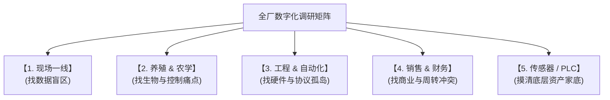

## 鱼菜共生全体系调研提纲设计

---

### 一、 针对【养殖长 / 动保专家】（关注点：鱼的存活率、料肉比、水质）

> **调研目的：** 找出水质预警的盲区，评估视觉 AI（水下/水上）落地的可行性，摸清化学参数化验与日常动保的实际流程，为 PLC 熔断和 AI 算法（精准投喂/软传感器/估重）提供机理支撑。

1. **水质物理监测与生化分析流程（软传感器与 PLC 保命设计）**
   * **在线传感器实战细节**：目前养殖池及生物滤池的溶解氧（DO）、pH、电导率（EC）、水温等是在线连续监测的吗？传感器的探头在现场高有机物环境中，容易发生什么损坏或生物膜附着？读数产生漂移的周期一般是几天？现场校准和清洗探头的人工作业频次是怎样的？
   * **高级生化指标测定**：总氨氮（TAN）、亚硝酸盐（$\text{NO}_2^-$）、硝酸盐（$\text{NO}_3^-$）、溶解磷以及碱度（Alkalinity）这些高级指标是怎样化验的？化验工具是化学试剂盒、便携比色计还是实验室级分光光度计？
   * **离线数据数字化流转**：每天离线化验的数据是由人工手写在记录本上、记录到 Excel 还是有统一的生产软件？化验结果从采样到最终录入完毕，中间平均滞后几个小时？
   * **水质突变历史演变**：过去曾发生过哪些严重的“水质崩溃”或“毒性物质飙升”事件？当时各指标的非线性变化趋势是怎样的（例如 pH 突然加速下滑、DO 消耗量异常增加）？从指标发生异常，到鱼群出现生理反应（如浮头、停食），中间留给人工干预的安全窗口期是多长？

2. **投喂决策、摄食动力学与饲料效率（视觉精准投喂算法设计）**
   * **传统投喂规则**：目前使用的饲料类型（高蛋白浮水料/沉水料）、颗粒度规格是怎样的？每天投喂的固定时刻和频次是怎样安排的？每天的投喂总量是根据出厂饲料配方表静态计算，还是根据水温、鱼体规格动态调整？
   * **人工摄食欲望评估机理**：饲养员在现场手动投喂或监督自动投喂时，是如何评估鱼群处于“极饥饿”、“饱食”或“厌食”状态的？最核心观察的是什么物理特征？（例如：落料区水花四溅的剧烈度、鱼群聚拢的速度、是否在水下 10 厘米内游动等）。
   * **自动投喂机局限性**：目前是否有自动投喂设备？它是怎么和水泵/曝气联动的？如果在投喂机下料期间水体溶解氧（DO）发生暴跌，投喂机会自动熔断吗？目前的残饵系数（未吃完沉底腐烂的饲料比例）大约是多少？

3. **活体生物量估测、应激应答与病害监测（3D 点云估重与病害筛查设计）**
   * **鱼类增重估测现状**：现在如何评估各个鱼池当前的“生物量（Biomass）”与“单尾均重”？平均多长时间进行一次抽样秤重？传统的捞鱼、麻醉、秤重流程，对鱼群造成的应激反应（如拒食、擦伤、诱发病害）有多严重？会造成百分之几的损耗？
   * **健康与表型监测**：当前养殖的高价值鱼种（如墨瑞鳕、三文鱼）最容易爆发出哪些流行性传染病（如白点病、车轮虫、水霉病）？这些病害在爆发初期，鱼体表面（鳞片溃烂、鳍部白斑）或游动姿态（离群独游、摩擦池壁、侧倾侧游）有什么肉眼可辨认的异常？动保人员通常在什么阶段才能发现？
   * **死鱼（死淘资产）处理流程**：每天捞出的死鱼数据是如何清点和记录的？是否能精确核算到具体的池号和投放批次（Batch ID）？

4. **极端生理极限、物理灾难与安全红线（本地安全闭环设计）**
   * **生理死线约束**：不同生长期（鱼苗期、育肥期、起捕期）下，该鱼种的**溶解氧极限死线**与**水温上限死线**分别精确是多少度/多少 mg/L？温度和氨氮的双重胁迫（例如水温升高导致非离子氨毒性成倍放大）在现场是如何评估和对冲的？
   * **断网与物理断电灾难重演**：若基地发生意外断电（如主电网故障），在应急发电机启动前，鱼池水体的天然含氧量（在不曝气状态下）可以支撑高密度鱼群存活几分钟？
   * **解耦安全防线**：若水培区的营养液调理（如加入了高浓度矿物质或调节了酸碱度）意外通过阀门渗漏/回流进 RAS 鱼池，对高价值鱼类的毒害阈值是多少？两端系统的物理隔断距离和单向流速是多少？

---

### 二、 针对【种植长 / 农学专家】（关注点：蔬菜产量、品相、病虫害、成熟度）

> **调研目的：** 评估 VPD/PPFD 等高阶指标的软计算计算与控制需求，寻找机械臂/机器人采收和视觉多光谱巡检的落地点，为温室 MPC 能耗算法和具身收割机器人的 3D 视觉/力控算法提供物理约束条件。

1. **空气微气候与植物气孔生理调控（VPD / PPFD / 环控策略）**
   * **饱和蒸汽压差（VPD）认知与监测**：现场种植人员目前在监控温室湿度时，有接触或应用过饱和蒸汽压差（VPD）的概念吗？目前温室内是否有测叶片表面温度的红外叶温仪？如果采用气温和湿度反演 VPD，温室内布置了哪些辅助传感器（如局部风速计、短波辐射表）？
   * **温光执行逻辑与约束**：外卷膜风机、遮阳幕帘、高压微雾、LED 补光灯和地源热泵（HVAC）目前的联动逻辑是怎样的？（是否有死板的 PID 控制？）LED 补光灯是按固定时间段定时开关，还是会累计一天的 PPFD，在日光照累积量（DLI）不足时进行智能化差额补光？作物在不同生长阶段对 DLI 和 VPD 的硬性安全阈值空间分别精确是多少？
   * **微气候空间不均性**：温室不同区域（如湿帘附近与门边、单层栽培与多层垂直栽培的各层）的温度、湿度分布是否极度不均？在梅雨季节或季节性降温期，最容易发生的“气孔闭合”或“物理结露”历史灾难记录是怎样的？

2. **表型特征、病虫害潜伏期与生长非线性（视觉多光谱巡检与生长模型）**
   * **早期病虫害物理表型**：常见的蚜虫、红蜘蛛或真菌霉斑（如灰霉病）在爆发前期，蔬菜叶片的微观表型（如叶绿素分布、局部的红光和近红外光反射率变异）会产生怎样的微妙变化？它们最容易滋生在冠层内部、叶片背面还是叶片边缘？
   * **人工巡检的盲区**：目前人工巡检一个占地数万平米温室的频次是多少？漏检率大概是多少？从虫害零星点状爆发，到大面积蔓延导致定植板蔬菜报废，中间留给物理隔离或靶向无毒处理的安全干预周期是多长？
   * **生长速率非线性方程**：不同蔬菜品种从定植到成熟（如生菜达到标准 250g 规格），其生长曲线受水温、EC 值和累积 PPFD 的影响有多大？在冬季低温种植和夏季高温种植中，成熟期相差多少天？

3. **机械化收割、柔性力控与物流对接（具身智能 3D 视觉与搬运调度）**
   * **物理采收流程拆解**：目前从栽培池中把水培漂浮板拔起、移动到采收区、拔起单株蔬菜、切根、剥除老叶、分级包装，这几个步骤中人工作业的耗时占比分别是多少？哪个环节的工人工资开支最高？
   * **蔬菜的力学耐受度**：蔬菜（如生菜/罗勒）叶片在物理碰撞或机械臂夹取时，加在叶片上的最大接触力阈值是多少（多大压力会造成脆嫩叶片组织压伤坏死发黑）？蔬菜根茎切割的精细度要求有多高（是否需要齐根切、能否带基质杯包装）？
   * **定植网格与托盘物流**：目前栽培池内的定植板是如何流动的？它们有统一的物理格网定位（Grid ID）或 Batch 批次标签吗？收割后的产品如何包装，是否直接进入冷链托盘？

---

### 三、 针对【工程&自动化主管 / 现场电工】（关注点：PLC、水泵、风机、电费、设备故障）

> **调研目的：** 摸清 5.1 边缘层与 5.2 传输层的物理真相，评估本地 PLC 看门狗应急控制、能耗 MPC 算法以及电机变频器预测性维护的硬件与网络可行性。

1. **底层 PLC 控制网络、通信总线与硬核保命逻辑（边缘与传输层底座）**
   * **PLC 拓扑与寄存器映射**：全场各区域（RAS养鱼、中继水池、温室水培、收割线）共有多少台 PLC？具体品牌型号（如西门子 S7-1200/1500、汇川 H5U/AM401、欧姆龙 NX）是怎样的？PLC 之间是通过什么协议组网的（Profinet、EtherCAT 还是 Modbus-TCP）？我们能拿到完整的寄存器地址映射表（Modbus Mapping Register）和梯形图（LAD）/结构化文本（ST）源码吗？
   * **I/O 扩展与接线物理空间**：各 PLC 柜体目前有多少剩余的 I/O 通道（数字输入 DI/DO、模拟输入 AI/AO）？柜体内是否还有加装 RS-485 串口模块或以太网协议板的物理接线空间？
   * **边缘控制与本地手动切换**：水泵、鼓风曝气机、加热锅炉、LED 补光灯等设备的控制箱面板上是否有“手/自动（Auto/Manual）”物理切换旋钮？设备运行状态（开/关/故障）是否有无源干接点或反馈电信号接入 PLC？
   * **本地应急熔断与互锁**：目前 PLC 固件中写死了哪些安全互锁逻辑？（例如：水泵在管道阀门未开启时是否有压力过载自动停机保护？溶解氧超限时是否有继电器级硬联动启动备用泵？）

2. **传感器物理接口、信号衰减与抗电磁干扰（感知层工程实践）**
   * **信号输出与传输物理介质**：现场在线传感器（pH、DO、电导率、温湿度等）的输出信号是哪种工业标准？（4-20mA 电流环、0-10V 电压、RS-485 Modbus-RTU 还是三线制热电阻？）信号线缆是否有采用带屏蔽的双绞线？线缆与现场高功率水泵变频器、鼓风机动力电缆是否存在平行排布或交叉干扰？
   * **安装物理条件与清洗**：pH 和 EC 传感器是直接浸泡在养殖池或栽培槽死角中，还是安装在旁路流通槽（Flow Cell）中？探头在污水中长生物膜（绿藻、黏液）的周期一般是几天？目前是否有气动自动喷冲、机械清洗毛刷或超声波防附着装置？

3. **供电回路设计、电力参数测量与变频器谐波（能耗 MPC 与预测性维护）**
   * **多级动力配电柜接线**：配电房及现场二级配电箱中，大功率执行器（如主循环泵、罗茨鼓风机）、HVAC 暖通空调系统、以及大功率 LED 补光灯阵列，在物理上是否有独立隔离的供电回路？
   * **电表选型与通信规约**：现有电表支持数字通信吗？是什么通信接口与协议规约？（例如：走 Modbus-TCP 还是电力标准 DL/T 645 或 Modbus-RTU 协议？）智能电表是否可以读取三相电流、电压、有功功率、无功功率、有功电能和无功电能？数据采集周期是秒级还是分钟级？
   * **分时电价与变频器谐波**：园区目前用的是固定电价，还是电网的“峰谷分时电价（TOU）”？什么时候电费最贵？大功率水泵和曝气鼓风机是否配备了变频器（VFD）？变频器的品牌型号是什么（如 ABB、西门子、汇川）？是否曾经发生过水泵轴承磨损、叶轮卡沙或电机过载烧毁事故？这些事故在发生前几天是否有观察到工作电流的微弱异常波动？

---

### 四、 针对【销售&财务 / CFO / 供应链主管】（关注点：周转率、CAPEX、OPEX、订单履约）

> **调研目的：** 将宏观系统架构设计与关键财务指标（云端 ERP 与排产系统对接）对齐，摸查“鱼菜周转错位”的现金流真实缺口，为供应链决策中台（APS）的产销平衡和短期香草排产对冲算法提供商业模型基础。

1. **成本拆解与资产折旧模型（OPEX 与 CAPEX 财务还原）**
   * **能耗与饲料财务精细化**：目前折合每公斤绿叶蔬菜和每公斤高价值鱼的电力消耗（kWh）与饲料成本（元）精确是多少？在历史电价尖峰期，温室的电力消耗是如何蚕食整体毛利率的？饲料采购（及料肉比 FCR 的细微波动）对每月变动 OPEX 的影响权重如何？
   * **固定资产折旧分摊**：温室主体钢结构、地源热泵暖通、工业 PLC 柜、水循环过滤系统以及规划中收割机械臂，各自的折旧年限与折旧计提方式是怎样的？折旧成本分摊到每平方米种植面积和每立方米养殖水体上的固定开支是多少？
   * **劳动力成本压力**：温室一线操作工、养殖组员与化验质检员的固定工资占每月 OPEX 的比例是多少？劳动力的流失与培训成本对日常管理的隐性影响有多高？

2. **商超采购订单契约、履约窗口与排产管理（对接 OMS/WMS 系统）**
   * **商超大宗订单契约约束**：目前主要的连锁商超（如盒马、山姆等）对蔬菜品质（单株克重、黄叶率、农残）与交付时刻的硬性合同条款是怎样的？若因遭遇自然灾害或病害延迟交付 24 小时以上，商超的处罚、扣款或违约金比例是如何计算的？是否有起降点惩罚？
   * **产销信息通道的时效性**：现阶段销售端拿到商超周计划，到农学专家在温室安排排产定植、养殖人员准备鱼苗起捕，中间的信息传递链路是怎样的（口头、Excel 还是独立系统）？如果超市突然临时增加 20% 订单或取消计划，生产端最快需几个小时进行调度响应？
   * **仓储包装与冷链物流衔接**：蔬菜收割和活鱼捕捞后，在厂内包装间和缓存冷库（WMS）的周转滞留时长一般是多少小时？冷链物流车辆的调度安排是固定班次，还是根据每日采收量弹性叫车？

3. **资产周转错位、排产套利与现金流安全（鱼菜对冲财务模型）**
   * **流动现金流倒挂缺口**：生菜等绿叶菜（30天/茬）卖菜的现金回笼，在哪些月份会因为鱼类（长达 12~18 个月生长周期）面临期末育肥、高昂高蛋白饲料采购费剧增而出现“流动现金流倒挂/断流”的风险？公司是否有相应的流动性对冲准备（如银行信贷、集团授信）？
   * **高溢价短期作物的排产弹性**：当面临现金流预警期时，生产端和销售端是否可以主动腾退部分生菜网格，临时增种**超短周期、高客单价特种香草（如罗勒、芝麻菜，周转期仅 20 天，克重单价高）**？销售渠道上是否存在这样即插即用的香草消纳商？
   * **鱼类销售渠道与账期**：起捕后的活鱼或冰鲜主要销售渠道是什么？（大宗批发、餐饮直供还是生鲜电商？）水产渠道的起批规模、平均账期是怎样的？是否有账期拖延的坏账风险？

---

### 五、 针对【现场一线操作工人】（关注点：易用性、防呆、纸质表单、交互负荷）

> **调研目的：** 消灭“数据荒漠”与“人为垃圾数据”的第一线。摸查工人的真实工作负荷与交互习惯，确保你设计的一线移动端 App/PDA 能够真正被用起来，并从人机交互（HCI）源头上防御录入数据失真。

1. **纸质表单、口头指令与生产行为数字化（消灭断裂数据流）**
   * **纸质表单与白板实物还原**：目前在现场，你们每天必须手写填报的表格有哪些？（例如：鱼池投喂卡、死鱼登记本、pH/水温巡检记录、水培区定植/采收单等）。这些表格上有哪些核心字段？每天手写填写需要花费多少时间？
   * **口头指令传递与执行容错**：场长或技术主管安排的临时工作（如：“把 2 号调理池 pH 调到 5.8”、“把 4 号池死鱼清一下”），通常是通过什么渠道下达的？（微信群、口头交待还是对讲机？）是否发生过因为听错、记错导致执行错误的事件？
   * **数据交接与二次录入**：这些填好的纸质表单每周或每月是如何录入电脑的？录入时如果发现字迹模糊或数据明显不合常理（例如：EC 值写错了一位小数点），录入员如何核实和纠正？

2. **防错防呆、软硬件交互负荷与设备限制（人机交互防线）**
   * **高频高错操作定位**：在栽培槽拔苗、加药配比、养殖池加盐、投料或捞死鱼的日常工作中，哪一步对你们来说最容易因疲劳或疏忽搞错？（例如：配肥时倒错原料罐、pH 校准标准液用混、或者是看错鱼池编号把饲料投进了空池？）
   * **手持终端（PDA/App）操作阻力**：如果给你们配备一部工业级三防（防水、防尘、防摔）PDA 扫码终端，你们会觉得麻烦吗？你们的手经常是湿的，或者戴着手套，这在操作触屏时体验怎么样？什么样的数据录入方式你们觉得最轻松？（例如：扫描定植板上的物理二维码自动识别，点按 2 下按钮完成录入，或通过 PDA 语音识别自动转写录入？）
   * **防漏报机制设计**：目前如果漏报了死鱼数量，或者漏记录了某次投喂，会有什么核对和惩罚机制吗？有没有可能因为害怕责备而选择选择性漏报、隐瞒生物死淘数据？

3. **现场恶劣物理环境阻力与工人生理/心理承受度（防范抗拒情绪）**
   * **物理环境阻力**：温室内夏季高温高湿（有时超过 40°C，相对湿度 90% 以上），水产区光线暗淡、水汽严重。在这种环境下使用电子设备，最担心的是什么？（例如：屏幕反光看不清、设备发热死机、WiFi/4G 信号被高电磁干扰等）。
   * **对“AI 和自动化”的抗拒心理**：对于公司要引进收割机器人、AMR 搬运车、以及摄像头监控鱼群抢食这些高科技，工人们的第一反应是什么？他们是否会担心这些设备操作太难自己无法学会，或者会夺走他们的工作，从而在推行数据录入规范时产生消极应付心理？

---

## 🛠️ IT 负责人调研“落地三原则”

在执行这次调研时，建议你记住以下三个实战技巧：

1. **带着“踏勘工具”去现场（不只在会议室听）：**
* 拿着手机拍照，记录每一个低压配电柜、每一台 PLC 的型号铭牌、每一个传感器探头的污染情况。

2. **别问“你需要什么软件”，要问“你最怕什么意外”：**
* 业务人员通常说不清楚软件需求，但他们非常清楚“最怕什么发生”。比如问电工“你最怕大半夜什么设备坏掉？”，就能直接导出设备预测性维护（7.1章节）的真需求。

3. **拿出一份“物理拓扑草图”现场画圈：**
* 带着前面总结的物理四大区（鱼池区、菜池区、调节池、大环境）拓扑图，跟他们一边聊一边在图上标出“这里有传感器、这里数据断层了、这里有阀门”，调研结束时，你的 **5.1 边缘感知层架构图** 就已经自动完成了 $80\%$！