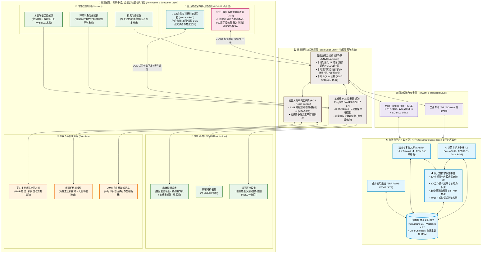
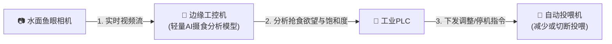
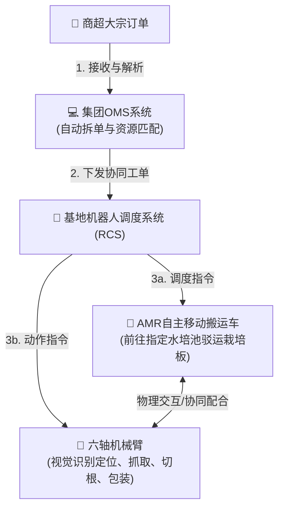
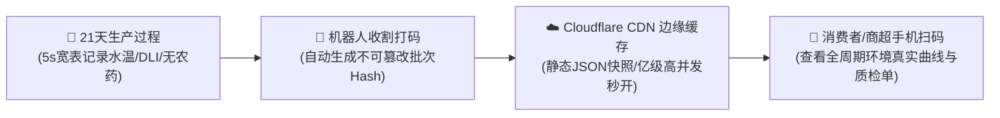
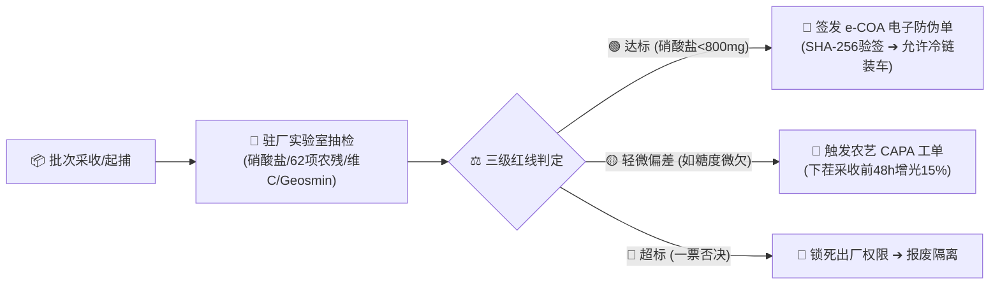
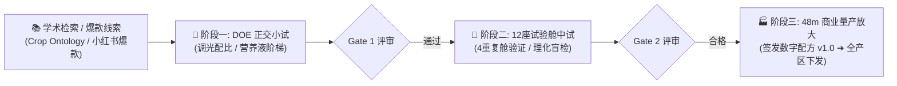
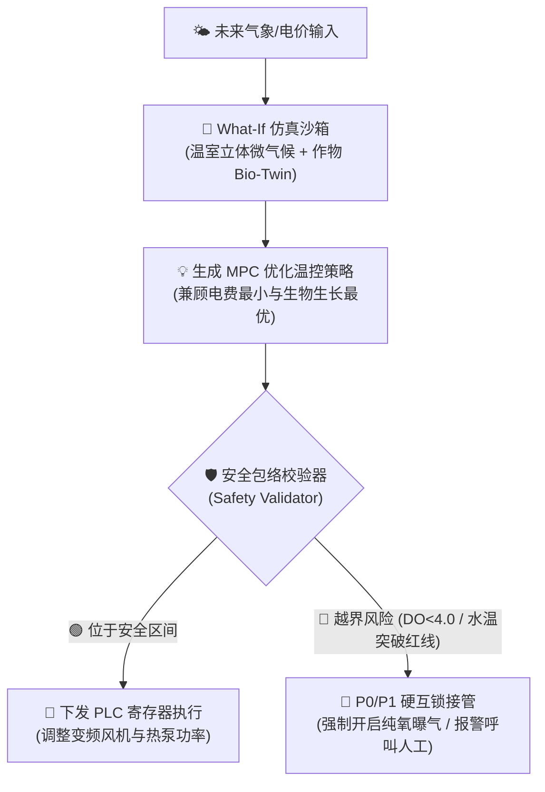

# 连锁数字化农业工厂：01_系统宏观架构设计 (System Architecture Design)

本文件详述了面向未来**多地连锁、集团化运营的数字化农业工厂**的宏观 IT 与硬件架构体系。整个系统设计遵循“**物理感知、边缘自治、云端统筹、云边协同**”的核心架构原则，实现跨学科（水产养殖、设施园艺、机器人、数据科学）的闭环控制。

---

## 📌 解耦子系统与标准协议索引

为降低开发与协作耦合度，宏观架构已拆分为以下专项设计文档（支持在 IDE 内直接点击跳转）：

* **📖 统一接口契约**：[03_接口与数据契约规范.md](./03_接口与数据契约规范.md)（规范 MQTT、JSON 格式与 ISO 8601 时限）
* **📷 04_YOLO11 活体生物数据集规范**：[04_YOLO11活体生物数据集构建规范.md](./04_YOLO11活体生物数据集构建规范.md)（生物表型、SQL Schema 与点云标注规范）
* **🏷️ 05_设施与物联网资产编码规范**：[05_设施与物联网资产编码规范.md](./05_设施与物联网资产编码规范.md)（L1~L6 六级设施编码字典、浮板解耦模型与 SketchUp 契约）
* **🌐 06_农业数字孪生与多尺度仿真体系规范**：[06_农业数字孪生与多尺度仿真体系规范.md](./06_农业数字孪生与多尺度仿真体系规范.md)（Macro几何、Meso流体微气候、Micro活体 Bio-Twin 与 What-If 推演）
* **🤖 07_AI分层自主决策与闭环控制规范**：[07_AI分层自主决策与闭环控制规范.md](./07_AI分层自主决策与闭环控制规范.md)（L0~L5 分级、多时间尺度控制闭环、P0~P3 仲裁与安全包络）
* **🐟 01_水产养殖子系统**：[01_aquaculture/README.md](../04_subsystems/01_aquaculture/README.md)（荧光 DO 监测、PLC 应急闭环、AI 抢食分析投喂与双目估重）
* **🌱 02_水培种植子系统**：[02_hydroponics/README.md](../04_subsystems/02_hydroponics/README.md)（VPD干湿反演、调理池脉冲加药自治、立体微气候感知与产量预测）
  - 细节规范：[01_调节池水力计算与加药自治规范.md](../04_subsystems/02_hydroponics/01_调节池水力计算与加药自治规范.md)
  - 细节规范：[02_大空间温室立体微气候感知与温控策略规范.md](../04_subsystems/02_hydroponics/02_大空间温室立体微气候感知与温控策略规范.md)
* **⚡ 03_能耗优化子系统**：[03_energy_optimization/README.md](../04_subsystems/03_energy_optimization/README.md)（动力/环控/补光分回路感知、TOU电价下的 MPC 策略控制）
* **🤖 04_智能调度与机器人**：[04_robotics_and_dispatch/README.md](../04_subsystems/04_robotics_and_dispatch/README.md)（RCS金字塔调度、VDA 5050、协作臂点云抓取柔性力控）
* **📊 05_供应链与商贸协同子系统**：[05_supply_chain_and_commerce/README.md](../04_subsystems/05_supply_chain_and_commerce/README.md)（产供销一体化、四维选品、30天ATP大盘、APS以销定产与COGS业财对冲）
* **💼 06_品牌溯源、客户运营与舆情感知子系统**：[06_brand_traceability_crm/README.md](../04_subsystems/06_brand_traceability_crm/README.md)（一物一码区块链溯源、B2B商超门户、B2C会员360°全息与全网社媒舆情AI大盘）
* **🔬 07_品质控制与实验室**：[07_quality_assurance_lab/README.md](../04_subsystems/07_quality_assurance_lab/README.md)（IQC/IPQC/OQC三道防线、普析分光/原子吸收仪器台账、4°C留样室与e-COA防伪存证）
  - 细节规范：[01_全球主要国家与地区农业食品安全标准比对规范.md](../04_subsystems/07_quality_assurance_lab/01_全球主要国家与地区农业食品安全标准比对规范.md)
* **🧑‍🔬 08_农艺机理与学术知识支持**：[08_agronomy_knowledge_rnd/README.md](../04_subsystems/08_agronomy_knowledge_rnd/README.md)（Crop Ontology/USDA本体、FvCB光合与Stanghellini蒸腾动力学、12座试验舱配方R&D与GraphRAG）
  - 细节规范：[01_温室作物蒸腾量估算与感知算法规范.md](../04_subsystems/08_agronomy_knowledge_rnd/01_温室作物蒸腾量估算与感知算法规范.md)
* **🔌 05_现场弱电线缆选型与布线施工规范**：[05_现场弱电线缆选型与布线施工规范.md](../02_requirements_and_plans/05_现场弱电线缆选型与布线施工规范.md)（Cat5e STP/RVSP 4芯选型、菊花链拓扑、两级线号与快拆施工）

---

## 1. 宏观系统架构图 (Mermaid)

---

## 2. 系统分层深度解构

> [!NOTE]
> 集团化架构的核心在于：**“让本地听得见炮火，让总部看得清全局，让品质立得住证据，让科研接得通前沿”**。

### A. 物理感知与执行层 (Perception & Execution)
直接作用于鱼、微生物、蔬菜三大生命系统：
* **传感器网 (Sensors)**：部署于鱼池、生物过滤池、水培跑道。通过光学荧光法 DO、ISE 在线氨氮电极秒级感知水质；通过立体温湿度测温柱与超声波气象站感知微气候；
* **执行机构 (Actuators)**：接收 PLC 下发的毫秒级指令，调整水流、溶氧、光照及温度；
* **机器人与智能装备 (Robotics)**：室内多光谱巡检无人机扫描病害，AMR 搬运重载水培浮板，六轴机械臂实现无菌切根包装。

### B. 连锁基地边缘计算层 (Base Edge Layer)
基地的“本地小脑”，负责数据清洗、本地高频推理和紧急自治：
* **智能边缘工控机 (Edge Gateway)**：运行本地轻量化 Container。执行鱼群摄食分析与 5 秒宽表聚合打包；
* **工业 PLC**：采用汇川 Easy320/西门子工业控制器，固件内固化 **0.1s 硬件保命硬互锁**（低溶氧强制爆气切断投喂），永不死机；
* **机器人控制系统 (RCS)**：协调多台 AMR 与收割机械臂基于 VDA 5050 协议平滑流转。

### C. 网络传输与安全层 (Network & Transport)
* **协议与安全**：现场 Modbus-TCP / Profinet 汇聚至边缘网关，通过基于 TLS 双向认证的 MQTT / HTTPS 协议上报云端，严格遵循 ISO 8601 UTC 毫秒时间戳；
* **断线续传**：公网中断时写入本地 SQLite/SSD，恢复后断点续传。

### D. 集团云平台与数字孪生中台 (Group Cloud Center & Digital Twin Hub)
集团的“中央大脑”，负责数据汇聚、数字孪生仿真、模型训练和战略统筹：
* **多尺度数字孪生中台 (06)**：集成 Macro 空间三维设施、Meso 8.1m 挑高温室立体微气候 CFD/VPD 场，以及 Micro 单株生菜/单池鱼群活体 Bio-Twin 代谢动力学，支持无损 What-If 虚拟假设推演；
* **AI 分层自主决策中枢 (07)**：统一管理 L0~L5 级自主权限，结合电网 TOU 分时电价、天气预报与热力学孪生向前滚动求解 MPC 优化策略；
* **学术知识中枢与 GraphRAG (08)**：直连 Crop Ontology、USDA GRIN 与 SCI 顶刊知识库，基于知识图谱进行多物理场机理求解。

### E. 供应链商贸协同与品牌客户价值层 (Supply Chain Commerce & Brand Experience - 05 & 06 子系统)
* **供应链与商贸协同 (05)**：四维选品、30 天动态可承诺量 (ATP) 大盘、APS 以销定产、鱼菜分离进销存时空双向对账、跨基地冷链调拨与 COGS 业财对冲；
* **品牌溯源与客户体验中枢 (06)**：C 端一物一码区块链防伪溯源、B2B 商超协同门户、B2C 会员 360° 全息档案与全网社媒舆情 AI 监控中枢。

### F. 🔬 驻厂品质控制与 LIMS 实验室中枢 (Quality Assurance & On-Site Lab Center - 07 子系统)
负责守牢食品安全与超额营养的第一线：
* **三道防线体系**：涵盖原材料入库 IQC、生长过程巡检 IPQC（采收前 7 天土腥味/采收前 48h 糖度）与出厂抽检 OQC（一票否决权）；
* **权威实验室仪器台账**：配置北京普析 T6 紫外分光光度计、TAS-990 原子吸收光谱仪、智云达 62 项农残速测仪及海尔生物医疗 4°C 恒温留样冷藏箱；
* **不可篡改 e-COA 电子防伪证明书**：批次检验数据自动签名并广播上链，向商超和消费者自证“农残0检出、硝酸盐 < 800mg/kg、活鱼0土腥味”。

### G. 🧑‍🔬 农艺机理仿真与科研试验中台 (Agronomy Mechanism & Nursery R&D - 08 子系统)
赋予数字化工厂自我进化与科研变现能力：
* **生物物理动力学引擎**：内置 FvCB 光合模型、Stanghellini 蒸腾模型与 Monod 硝化动力学模型；
* **12 座独立种植试验舱 (Nursery R&D)**：开展多光谱/水肥 DOE 正交试验，实现 14 天快速孵化新商业数字配方并放大至 48 米跑道量产。

---

## 3. 典型闭环控制场景流程

### 场景一：AI 驱动的闭环智能投喂（感知 ➔ 推理 ➔ 执行）

### 场景二：商超订单触发的自动化收割与补仓（需求 ➔ 调度 ➔ 机器人执行）

### 场景三：一物一码全生命周期数字可信溯源（生产 ➔ 存证 ➔ 销售 ➔ 信任溢价）

### 场景四：双维度出厂理化抽检、e-COA 签发与 CAPA 纠偏闭环（07 品质子系统）

### 场景五：顶刊学术机理 ➔ 12座试验舱 DOE 中试 ➔ 48m商业量产放大（08 科研子系统）

### 场景六：数字孪生 What-If 虚拟推演与 AI 分层安全包络仲裁（06 & 07 核心规范）

