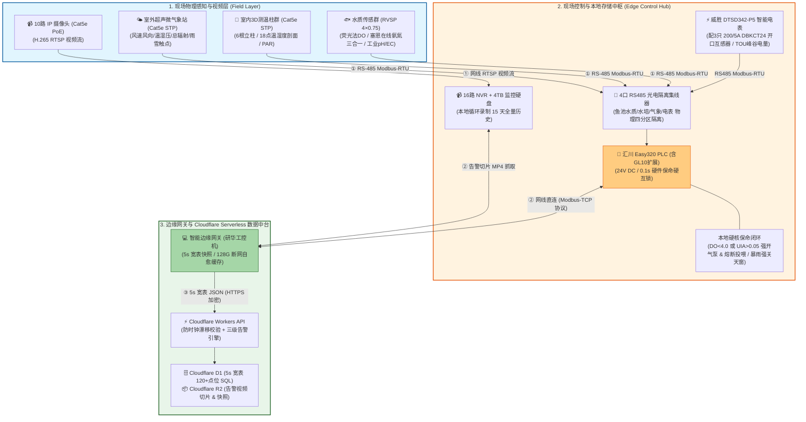

# 连锁数字化农业工厂：02_MVP物理与物联拓扑 (MVP Physical & IoT Topology)

这是一个最基础、最核心的 **第一期 MVP（最小可行性产品）物理与物联拓扑结构图**。

它抛弃了所有复杂的冗余设计，用最直观的层级结构，讲清楚数据是如何从物理世界的**原子（传感器）**，经过控制层的**转换（汇川 PLC）**，最终变成软件世界的**比特（边缘网关与 Cloudflare Serverless 数据湖）**。

---

## 💡 MVP 拓扑结构的核心原理精解

这个 MVP 结构只讲透三个最根本的工业物联网（IIoT）数据流转原理：

### 原理一：物理信号的“数字量化与保命硬锁闭”（Layer 1 $\rightarrow$ Layer 2）

* **过程：** 现场的传感器把水质或光照的物理变化，通过工业标准的 RS-485 (Modbus-RTU) 信号发给汇川 Easy320 PLC（进阶多轴控制扩建时可选用汇川 AM400 系列）。
* **IT 负责人的安全防线：** 核心控制必须先过 PLC。这样即使后面的网关断网或服务器死机，PLC 依然能靠本地的梯形图硬核代码闭环保命（如发现严重缺氧，不经云端直接拉高液氧电磁阀继电器并切断投喂机电源）。

### 原理二：工业协议到 IT 协议的“翻译与脱水”（Layer 2 $\rightarrow$ Layer 3 网关）

* **过程：** PLC 把换算好的物理数值（如 `pH = 6.2`、`DO = 6.8 mg/L`）存放在内部保持寄存器（Holding Registers）里。
* **网关的角色：** 部署在现场的研华/研祥边缘工控机通过网线连接 PLC，利用 **Modbus-TCP 协议** 每秒轮询寄存器地址，将底层的工业字节数据解析出来。

### 原理三：数据资产的“规范化、5秒宽表打包与落湖”（网关 $\rightarrow$ Cloudflare Serverless）

* **过程：** 网关拿到原始数据并过滤噪点后，按 **5 秒一次** 聚合全厂点位，强制打包为带有 ISO 8601 UTC 毫秒时间戳的 JSON 宽表。
  1. 资产身份标识：`base_id`、`zone_id`、`device_id`。
  2. 物理采集时间：**严格遵循 ISO 8601 的 UTC 毫秒级时间戳**（如 `2026-07-12T16:56:18.000Z`）。
  3. **流体时空对齐标签**（依据《[03_接口与数据契约规范.md](./03_接口与数据契约规范.md)》，附加由流速算出的 `water_origin_timestamp` 和 `lag_seconds`）。
* **进入数据湖：** 最终，网关将带有高价值时空标签的 JSON 数据加密上传至 Cloudflare Workers，写入 Cloudflare D1 边缘数据库；告警视频切片则写入 Cloudflare R2 对象存储，将云端数据库与流量开支死锁在 **0 元/月**（详见 [03_分期实施计划书.md](../02_requirements_and_plans/03_分期实施计划书.md)）！

---

## 🔗 相关专项技术规范索引 (Single Source of Truth)

* **水产保命与生物识别**：👉 [01_水产养殖子系统.md](../04_subsystems/01_水产养殖子系统.md) & [01_YOLO11活体生物数据集构建规范.md](../05_specifications/01_YOLO11活体生物数据集构建规范.md)
* **大空间温湿度立体阵列与温控策略**：👉 [04_大空间温室立体微气候感知与温控策略规范.md](../05_specifications/04_大空间温室立体微气候感知与温控策略规范.md)
* **现场线缆选型、两级编码与布线施工**：👉 [05_现场弱电线缆选型与布线施工规范.md](../05_specifications/05_现场弱电线缆选型与布线施工规范.md)
* **实施步骤与采购预算明细**：👉 [03_分期实施计划书.md](../02_requirements_and_plans/03_分期实施计划书.md)