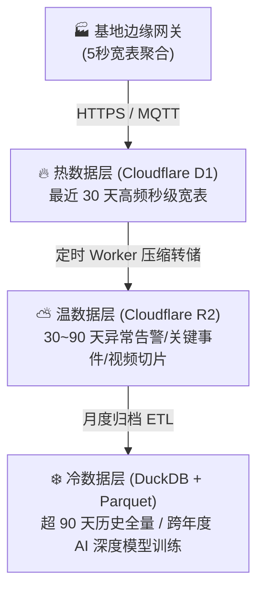

# 连锁数字化农业工厂：03_接口与数据契约规范 (Interface & Data Contract Specification)

本文件作为整个数字化农业工厂 IT 系统（微服务/子系统）的“全局宪法”。所有子系统在进行数据交互、API 设计、消息总线发布时，必须严格遵守本规范，以确保跨学科（水产、园艺、机器人、财务）系统的高内聚低耦合与数据一致性。

---

## 1. 数据处理与时间格式归一化

为了彻底消除跨系统协作中的时区混淆与精度差异，系统在后端业务逻辑、数据库持久化及 API 接口数据流中强制统一采用如下规范：

### 1.1 统一时间戳格式
* **标准格式**：**严格遵循 ISO 8601 规范，采用 UTC 时间并精确到毫秒级。**
  * 示例：`2026-07-12T16:56:18.000Z`
* **约束条件**：
  1. 严禁使用 Unix 时间戳（秒级/毫秒级整数）。
  2. 严禁使用带时区偏差但无标准符号的本地时间（例如：`2026-07-12 16:56:18`）。
  3. 数据库（如 Cloudflare D1 / PostgreSQL / InfluxDB）的底层存储和 API 的 JSON 字段统一处理为上述 UTC 字符串形式。

---

## 2. 物联网消息总线（MQTT Topic）设计规范

各子系统与边缘传感器/执行机构之间采用 MQTT 协议进行异步发布/订阅协作。主题结构树（Topic Tree）遵循以下层级定义（完整字典见 [05_设施与物联网资产编码规范.md](./05_设施与物联网资产编码规范.md)）：

`farm/{base_id}/{zone_id}/{system_id}/{component_id}/{direction}/{action_or_metric}`

### 2.1 参数变量说明
* `{base_id}`：L1 基地编号。如 `SH01`（上海崇明基地）、`KS01`（江苏昆山基地）。
* `{zone_id}`：L2 区域/车间编号。`AQ`（水产养殖区）、`HP`（水培种植区）、`NC`（育苗试验区）、`UT`（动力配电区）。
* `{system_id}`：子系统标识。`aqua`（水产）、`hydro`（水培）、`energy`（能耗）、`robot`（机器人）、`trace`（溯源）。
* `{component_id}`：L3/L4 设施或测点编号。如 `TK-01`（1号鱼池）、`RW-A`（A号跑道）、`CB-HV-01`（强电柜）、`RFT-2026-00128`（浮板UID）。
* `{direction}`：数据流向。`telemetry`（数据上报）、`command`（指令下发）、`status`（设备心跳）、`event`（状态机事件）。

### 2.2 核心 Topic 示例

| 场景 | MQTT Topic 路径 | 报文流向 |
| :--- | :--- | :--- |
| **水质数据上报** | `farm/SH01/AQ/aqua/TK-01/telemetry/DO` | 传感器 $\rightarrow$ 消息总线 |
| **设备指令控制** | `farm/SH01/HP/hydro/RW-A/command/pump` | 种植子系统 $\rightarrow$ 执行器 |
| **设备心跳/遗嘱** | `farm/SH01/AQ/aqua/CB-LV-01/status/heartbeat` | 网关 $\rightarrow$ 运维中心 |
| **浮板调池事件** | `farm/SH01/HP/trace/RFT-2026-00128/event/transfer` | 扫码枪/AGV $\rightarrow$ 溯源中台 |

---

## 3. 时空同步时间戳（Spatiotemporal Timestamping）规范

由于鱼菜共生系统以水流为介质进行物料与养分周转，水体在生物过滤器、管道和栽培槽的流动存在显著的**空间物理流动**与**时间滞后性**。为了让 AI 模型能够计算出正确的生态学因果关系，每个上报的遥测 JSON 报文必须包含统一的时空定位标签。

### 3.1 JSON 通用数据结构契约

所有遥测数据上送至 MQTT 总线时，必须打包为如下格式的 JSON 字符串：

```json
{
  "message_id": "uuid-v4-standard-string",
  "base_id": "base_01",
  "zone_id": "zone_A",
  "system_id": "aqua",
  "device_id": "tank_01",
  "timestamp": "2026-07-12T16:56:18.000Z",
  "telemetry_data": {
    "metric": "pH",
    "value": 7.62,
    "unit": "pH"
  },
  "spatiotemporal_tag": {
    "water_origin_timestamp": "2026-07-12T16:21:18.000Z",
    "lag_seconds": 2100,
    "flow_rate_lps": 4.5
  }
}
```

#### 水培跑道综合遥测 Payload 契约示例 (Raceway Telemetry)
```json
{
  "message_id": "uuid-v4-hydro-01",
  "base_id": "base_01",
  "zone_id": "zone_B",
  "system_id": "hydro",
  "device_id": "raceway_A",
  "timestamp": "2026-07-12T16:56:18.000Z",
  "telemetry_data": {
    "root_do": 6.85,
    "root_temp": 20.5,
    "ec": 1.65,
    "vpd_leaf": 0.85,
    "dli_today": 16.8,
    "ppfd": 320,
    "water_level_mm": 280,
    "aeration_status": "RUNNING",
    "crop_variety": "特级奶油生菜",
    "growth_days": 20,
    "maturity_percent": 95
  }
}
#### 单株孔位全息表型与病虫害遥测 Payload (Plant Slot Phenotyping Telemetry)
> 依托浮板双定位角标与透视变换算法（详见 [05_设施与物联网资产编码规范.md](./05_设施与物联网资产编码规范.md)），无人机高空巡检反演单株孔位：

```json
{
  "message_id": "uuid-v4-pheno-001",
  "base_id": "SH01",
  "zone_id": "HP",
  "system_id": "hydro",
  "device_id": "uav_patrol_01",
  "board_uid": "RFT-2026-00128",
  "slot_relative_id": "R02C04",
  "plant_logical_uid": "RFT-2026-00128#R02C04",
  "spatial_slot_uid": "SH01-HP-RW01-SL12-R02C04",
  "timestamp": "2026-07-12T16:56:18.000Z",
  "phenotype_data": {
    "canopy_diameter_cm": 18.5,
    "estimated_weight_g": 215.0,
    "target_weight_g": 250.0,
    "chlorophyll_spad": 46.2,
    "health_score": 98.5,
    "phenotype_class": "healthy_plant",
    "pest_alert": false,
    "tipburn_risk": "NONE",
    "transplant_timestamp": "2026-06-22T08:00:00.000Z",
    "harvest_eta_hours": 60
  }
}
```

#### 浮板跨池调运与生命周期事件 Payload (Board Transfer & Lifecycle Event)
```json
{
  "message_id": "uuid-v4-evt-board-transfer-089",
  "base_id": "SH01",
  "zone_id": "HP",
  "system_id": "trace",
  "event_type": "BOARD_TRANSFER",
  "timestamp": "2026-08-20T11:20:00.000Z",
  "board_uid": "RFT-2026-00128",
  "batch_id": "BATCH-20260810-BUTTER-01",
  "crop_variety": "特级奶油生菜",
  "transfer_details": {
    "from_facility_id": "RW-A",
    "from_slot_index": "SL-40",
    "to_facility_id": "RW-B",
    "to_slot_index": "SL-01",
    "orientation": "NORMAL",
    "operator_type": "AGV_ROBOT",
    "operator_id": "AGV-FORKLIFT-01"
  },
  "water_spatiotemporal_history": {
    "total_water_residence_days": 10,
    "last_water_temp_avg": 20.4,
    "last_ec_avg": 1.62,
    "accumulated_dli_mol": 165.2
  }
}
```

#### 近 1 小时能耗与动力设备运行时序统计 Payload (1h Energy & Equipment Runtime Rollup)
```json
{
  "message_id": "uuid-v4-energy-1h-001",
  "base_id": "base_01",
  "system_id": "energy",
  "timestamp": "2026-07-12T17:00:00.000Z",
  "energy_rollup_1h": {
    "kwh": 18.25,
    "cost_yuan": 12.41,
    "tou_rate_current": 0.68,
    "power_factor_avg": 0.962,
    "telemetry_frames_1h": 720,
    "telemetry_points_1h": 92160,
    "network_bytes_mb": 1.85,
    "crc_error_rate": 0.00
  },
  "equipment_runtime_timeline": [
    { "device_id": "pump_01", "name": "#1主水循环泵", "status_24h": "11111111", "today_hours": 24.0, "current_status": "RUNNING" },
    { "device_id": "pump_02", "name": "#2备用循环泵", "status_24h": "00000000", "today_hours": 0.0, "current_status": "STANDBY" },
    { "device_id": "blower_01", "name": "鱼池微孔罗茨风机", "status_24h": "11111111", "today_hours": 24.0, "current_status": "RUNNING" },
    { "device_id": "hydro_aerator_01", "name": "菜池水槽增氧泵", "status_24h": "11111101", "today_hours": 21.0, "current_status": "RUNNING" },
    { "device_id": "hvac_fans_group", "name": "温室高空环流风机群", "status_24h": "11011001", "today_hours": 15.0, "current_status": "RUNNING" },
    { "device_id": "heatpump_main", "name": "地源热泵中央机组", "status_24h": "11000001", "today_hours": 9.0, "current_status": "ECO_IDLE" }
  ]
}
```

#### 鱼菜分离采销与进销存时空对账 Payload (Supply Chain Procure-Sales Telemetry)
```json
{
  "message_id": "uuid-v4-supply-chain-001",
  "base_id": "base_01",
  "timestamp": "2026-07-12T17:00:00.000Z",
  "veggie_portfolio": {
    "month_output_kgs": 142500,
    "month_revenue_yuan": 1088000,
    "gross_margin_rate": 0.665,
    "atp_locked_rate": 0.864,
    "cogs_per_kg": 2.85,
    "avg_sale_price_per_kg": 8.50,
    "recent_7d_actuals": { "sales_tons": 31.5, "revenue_yuan": 268000, "procure_seeds_qty": 50000, "procure_cost_yuan": 15000 },
    "future_30d_forecast": { "sales_tons_forecast": 142.5, "procure_seeds_qty_plan": 150000, "procure_budget_yuan": 52000 }
  },
  "aquaculture_portfolio": {
    "biomass_standing_kgs": 38500,
    "standing_valuation_yuan": 982000,
    "gross_margin_rate": 0.528,
    "fcr_feed_conversion": 0.98,
    "cogs_per_kg": 13.20,
    "avg_sale_price_per_kg": 28.00,
    "recent_7d_actuals": { "harvest_tons": 8.2, "revenue_yuan": 229000, "feed_tons_procured": 12.0, "procure_cost_yuan": 96000 },
    "future_30d_forecast": { "harvest_tons_forecast": 25.0, "revenue_forecast_yuan": 700000, "feed_tons_needed": 28.0, "fry_heads_needed": 60000, "procure_budget_yuan": 272000 }
  }
}
```

#### B2C 自有品牌零售与投资者加盟模型 Payload (Retail DTC & Franchise Telemetry)
```json
{
  "message_id": "uuid-v4-retail-dtc-001",
  "base_id": "base_01",
  "timestamp": "2026-07-12T17:00:00.000Z",
  "dtc_brand_metrics": {
    "brand_name": "碧波鲜源 · 数字化活泉鱼菜",
    "dtc_avg_price_per_kg": 35.0,
    "dtc_gross_margin_rate": 0.785,
    "active_subscribers_qty": 1280,
    "weekly_arpu_yuan": 128.0,
    "weekly_retention_rate": 0.825,
    "qr_scan_rate": 0.684,
    "nps_satisfaction_score": 86.5
  },
  "member_retention_metrics": {
    "mom_baby_family_pct": 0.45,
    "fitness_salad_pct": 0.32,
    "senior_adoption_pct": 0.23,
    "avg_stay_duration_sec": 48
  }
}
```

#### 会员小程序交互与 AI 决策 Copilot Payload (Member AI Feedback & Copilot Telemetry)
```json
{
  "message_id": "uuid-v4-member-feedback-001",
  "ticket_id": "TKT-20260819-041",
  "member_id": "MBR-88201",
  "member_tier": "DIAMOND_ADOPTION_VIP",
  "timestamp": "2026-08-19T02:15:30.000Z",
  "feedback_type": "QUALITY_ISSUE",
  "content": "这周收到的奶油生菜有两片外叶微黄，希望注意冷链保温",
  "ai_analysis": {
    "sentiment_score": -0.32,
    "urgency": "MEDIUM",
    "linked_batch_id": "LOT-20260818-VEG03",
    "ai_auto_response": "尊敬的钻石会员张女士：调取您专属认养跑道 #A03 采收档案，该批次均重265g且0农残合格。因盛夏冷链末端微温差影响，已为您自动补发一张 ¥20 鲜萃券，并已联动冷链主管加强保温！",
    "compensation_voucher_issued": "VOUCHER_20_YUAN"
  },
  "ai_decision_insights": {
    "target_role": "RETAIL_OPERATIONS_MANAGER",
    "actionable_suggestion": "近7天有18位会员提议增加羽衣甘蓝与芝麻菜，建议在下周排产中将 #04 跑道 20% 面积切换为嫩叶羽衣甘蓝以提升周留存率",
    "confidence_rate": 0.94
  }
}
```

#### B2B 大客户履约调度与客诉应急 Payload (B2B Account OTIF & Dispatch Telemetry)
```json
{
  "message_id": "uuid-v4-b2b-fulfillment-001",
  "client_id": "CLIENT_HEMA_EAST_DC",
  "client_name": "盒马鲜生华东供应链 DC 仓",
  "timestamp": "2026-08-19T03:30:00.000Z",
  "sla_contract": {
    "daily_target_delivery_time": "05:30:00.000Z",
    "monthly_otif_rate": 0.998,
    "allocated_raceway": "RACEWAY_A_AND_B",
    "penalty_threshold_delay_min": 30
  },
  "in_transit_shipment": {
    "shipment_id": "SHP-20260819-01",
    "truck_plate": "苏E·5882F (顺丰冷链专车)",
    "cargo_weight_kg": 850.0,
    "temperature_celsius": 2.8,
    "planned_eta_iso": "2026-08-19T05:00:00.000Z",
    "predicted_eta_iso": "2026-08-19T04:35:00.000Z",
    "eta_variance_minutes": -25,
    "eta_alert_level": "GREEN_EARLY_ON_TIME",
    "gps_coordinates": [120.62, 31.32],
    "status": "ON_SCHEDULE_EARLY",
    "root_cause": "HIGHWAY_FLOW_OPTIMIZED",
    "mitigation_action": "APPLY_EARLY_UNLOAD_GREEN_CHANNEL"
  },
  "b2b_complaint_ticket": {
    "ticket_id": "B2B-TKT-20260819-003",
    "issue_type": "PACKAGING_DAMAGE",
    "affected_qty_boxes": 30,
    "ecoa_certificate_id": "ECOA-20260819-VEG01",
    "cross_base_dispatch": {
      "source_base": "CHANGZHOU_SATELLITE_HUB",
      "dispatched_qty_boxes": 30,
      "eta_minutes": 25,
      "resolution_status": "DISPATCHED_IN_TRANSIT"
    }
  }
}
```

```json
/* 3.3 驻厂品质实验室双维度批次检测与 e-COA 放行数据契约 (QualityLabBatchInspectionPayload) */
{
  "batch_id": "LOT-20260819-01",
  "product_category": "VEGGIE_BUTTERHEAD_LETTUCE",
  "facility_zone": "RACEWAY_A_SUZHOU_01",
  "harvest_timestamp": "2026-08-19T00:30:00.000Z",
  "inspection_timestamp": "2026-08-19T01:15:00.000Z",
  "inspector_id": "QC_LEAD_WANG_003",
  "lab_instruments_status": {
    "uv_vis_spectrophotometer": "CALIBRATED_ONLINE",
    "pesticide_rapid_tester": "CALIBRATED_ONLINE",
    "digital_refractometer_brix": "CALIBRATED_ONLINE",
    "atomic_absorption_aas": "CALIBRATED_ONLINE"
  },
  "safety_parameters": {
    "nitrate_mg_kg": 620.5,
    "nitrate_threshold_max": 800.0,
    "pesticide_residues_detected_count": 0,
    "heavy_metals": {
      "lead_pb_mg_kg": 0.0012,
      "cadmium_cd_mg_kg": 0.0005,
      "arsenic_as_mg_kg": 0.0018,
      "mercury_hg_mg_kg": 0.0001
    },
    "antibiotics_detected_count": 0,
    "geosmin_earthy_odor_ng_kg": 0.0,
    "pathogenic_bacteria_salmonella": "NEGATIVE_UNDETECTED",
    "safety_verdict": "PASSED_GRADE_A_INFANT"
  },
  "nutrition_parameters": {
    "vitamin_c_mg_100g": 28.5,
    "vitamin_c_benchmark_lift_pct": 110.0,
    "brix_sugar_content": 4.2,
    "crude_protein_pct": 2.1,
    "micro_elements_fe_mg_100g": 1.85,
    "nutrition_verdict": "SUPERIOR_GRADE"
  },
  "retention_sample": {
    "chamber_id": "SAMPLE_ROOM_4C_01",
    "storage_temp_c": 4.1,
    "shelf_life_days": 5,
    "weight_loss_rate_72h_pct": 1.2,
    "vc_retention_rate_72h_pct": 92.5
  },
  "release_status": "APPROVED_RELEASED",
  "ecoa_certificate": {
    "certificate_id": "eCOA-20260819-A01-9982",
    "digital_signature_sha256": "0x8f4a7c1b8923e54d89a2bcfe109842bc194a20b29c",
    "blockchain_hash_anchor": "0x3e8a719bf200...c81b",
    "qr_access_url": "https://trace.aquaponics.io/coa/eCOA-20260819-A01-9982"
  }
}
```

#### 生产过程动态质检与前置干预数据契约 (InProcessQualityInspectionPayload)
```json
{
  "ipqc_sample_id": "IPQC-20260819-002",
  "facility_unit_id": "RACEWAY_B_SUZHOU",
  "growth_phase": "PRE_HARVEST_48H",
  "growth_day": 18,
  "sampling_timestamp": "2026-08-19T03:00:00.000Z",
  "planned_harvest_timestamp": "2026-08-21T00:30:00.000Z",
  "in_process_metrics": {
    "current_brix": 3.75,
    "target_brix_at_harvest": 4.20,
    "nitrate_tissue_sap_mg_kg": 680.0,
    "spad_chlorophyll": 46.8,
    "microbial_surface_atp_rlu": 18
  },
  "risk_forecast": {
    "risk_level": "WARNING_SUGAR_LOWER_THAN_BENCHMARK",
    "predicted_deficiency": "若维持当前环控，预计出厂糖度仅为 3.85°Brix，未达标杆 4.2°Brix"
  },
  "preemptive_intervention": {
    "recommended_action": "TRIGGER_PRE_HARVEST_SUGAR_BOOST_SPECTRUM",
    "parameter_adjustments": {
      "led_supplement_spectrum": "RED_BLUE_8_1_HIGH_PPFD",
      "extended_photoperiod_hours": 4.0,
      "night_temp_celsius_target": 14.5,
      "day_night_temp_diff_celsius": 10.0
    },
    "auto_dispatch_target": "AGRONOMIST_WORKSTATION",
    "status": "DISPATCHED_ACTIVE"
  }
}
```

### 3.2 字段释义与对齐算法
* **`timestamp`**：该数据采集时的物理时刻（ISO 8601 格式）。
* **`planned_eta_iso` / `predicted_eta_iso`**：商超合同原定到达时刻与基于实时路况/作物生长综合推演的动态预计到达时刻（ISO 8601 格式）。
* **`eta_variance_minutes`**：到达时间偏差（分钟，负值代表提前，正值代表延后）。
* **`eta_alert_level`**：时效三色预警级别（`GREEN_EARLY_ON_TIME` 准点/提前, `YELLOW_MINOR_DELAY` 轻度延后, `RED_CRITICAL_DELAY` 严重延后违约风险）。
* **`safety_parameters` / `nutrition_parameters`**：驻厂实验室安全红线（硝酸盐/农残/抗生素/土腥味）与营养风味（维C/糖度Brix/粗蛋白）实测值与合格评定。
* **`ecoa_certificate`**：电子出厂检验报告编号、私钥 SHA-256 数字签名与区块链锚定哈希。
* **`monthly_otif_rate`**：B2B 商超大客户月度准时足额交付率（On-Time In-Full Rate）。
* **`ecoa_certificate_id`**：批次全链路电子质检合格证书编号（Electronic Certificate of Analysis）。
* **`ai_analysis`**：AI 客服对会员提报内容的情感评分、批次关联与自动补偿记录。
* **`ai_decision_insights`**：AI Copilot 针对零售经理、农艺师与物流主管生成的行动建议。
* **`dtc_brand_metrics`**：B2C 自有品牌零售高溢价率、周期购订阅会员数、扫码率与 NPS 净推荐值。
* **`member_retention_metrics`**：会员画像结构分布（母婴/轻食/银发）与平均互动停留时长。
* **`veggie_portfolio`**：水培蔬菜板块独立采销实绩、未来 30 天 ATP 期货锁单与种苗采购预算。
* **`aquaculture_portfolio`**：循环水产板块独立存塘估值、饲料系数（FCR）、成鱼出塘实绩与大宗饲料采购预算。
* **`energy_rollup_1h`**：近 1 小时有功电度积分（kWh）、电费（元）与 IIoT 宽表通信健康度统计。
* **`status_24h`**：全天 8 个 3小时时段的开停位图（`1`=运行，`0`=停机，`2`=降频）。
* **`slot_uid`**：浮板定植孔三级全局唯一空间编码（如 `RA-B03-R02C04` 代表 #A跑道-B03浮板-第2行第4列）。
* **`root_do`**：水培跑道深水层（280mm）根区实时溶解氧浓度（mg/L，维持在 $6.0 \sim 8.0\,\text{mg/L}$）。
* **`water_origin_timestamp`**：**水体源头时刻。** 指该部分水体最早从水产养殖区（鱼池）排出的物理时刻。
* **`lag_seconds`**：该水流从鱼池流至当前测点所消耗的流动时间（单位：秒）。
  $$\text{lag\_seconds} = \text{timestamp} - \text{water\_origin\_timestamp}$$
  *注：此数值由边缘网关或流计算引擎依据当前的管道主泵流速和物理容积进行动态积分计算生成，作为 AI 时序关联模型训练的直接特征参数。*

---

## 4. 异常处理与断线续传自愈规范

1. **边缘网关断网自愈**
   * 当网关检测到公网连接中断时，MQTT 客户端必须自动切换至本地缓存机制，将带有时空标签的数据暂存于本地 SQLite 或本地 InfluxDB 中。
   * 公网恢复后，网关应按**平滑流控（最大 50 条/秒）**的速度异步补报数据，补报报文中的 `timestamp` 必须为采集时的历史时刻，禁止使用重发时刻覆盖。
2. **网关遗嘱机制 (LWT)**
   * 所有网关在建立 MQTT 连接时必须配置遗嘱消息：
     * Topic: `farm/{base_id}/{zone_id}/{system_id}/{device_id}/status/heartbeat`
     * Payload: `{"status": "offline", "offline_timestamp": "2026-07-12T16:56:18.000Z"}`
   * 当 Broker 检测到网关异常断开时，自动向全网分发该遗嘱，触发异常工单。

---

## 5. 全生命周期数据湖存储架构与冷热分层治理策略

为在支撑全集团多基地千万级时序遥测的同时，将云端数据库与存储开支**死锁在 0 元/月**（免费额度安全包络内），系统确立“热-温-冷”三层数据生命周期流转规范：



### 5.1 三层存储介质与查询特性比对

| 存储分层 | 存储介质与技术选型 | 数据保留周期 | 包含数据类型与读写特征 | 成本与性能目标 |
| :--- | :--- | :--- | :--- | :--- |
| **🔥 热数据层 (Hot Layer)** | **Cloudflare D1** (Serverless 分布式 SQLite) | **最近 30 天** | 全厂 5 秒级网关聚合宽表、实时控制状态、待处理工单、30天 ATP 库存快照 | 高并发点查，P99 延迟 $<20\text{ms}$，控制在免费额度内 |
| **⛅ 温数据层 (Warm Layer)** | **Cloudflare R2** (零出口费 S3 兼容对象存储) | **30 ~ 90 天** | 质检 e-COA 原始 PDF/哈希、水霉病/病害视觉切片、设备故障前后 5 分钟黑匣子宽表 | 零 Egress 流量费，月度批处理检索 |
| **❄️ 冷数据层 (Cold Layer)** | **DuckDB + Apache Parquet** (列式存储归档) | **永久归档** | 跨年度环境时序、生菜全周期生长动力学曲线、鱼体 3D 点云生物量大盘 | 压缩比 $>85\%$，支持科研级 SQL OLAP 分析 |

---

## 6. 反复调整成功的经验教训（【备注与防护墙】）

> [!IMPORTANT]
> **【经验教训备注：时钟漂移避坑】**
> 在多基地部署中，曾经发生过因现场工控机与云端时钟不一致，导致 AI 产量预测模型把“先种菜、后施肥”的荒谬时间序识别为因果规律。**在此警告**：所有基地现场的 PLC 与边缘工控机必须配置 NTP (网络时间协议) 每小时强行与集团 NTP 服务器进行对齐，时钟偏差一旦超过 $100\,\text{ms}$，系统数据中台将拒绝接收其遥测数据。

---

## 🔗 相关设计与规范链接

* **宏观系统架构设计**：👉 [01_系统宏观架构设计.md](./01_系统宏观架构设计.md)
* **MVP 物理拓扑与网关配置**：👉 [02_MVP物理与物联拓扑.md](./02_MVP物理与物联拓扑.md)
* **YOLO11 活体生物数据集规范**：👉 [04_YOLO11活体生物数据集构建规范.md](./04_YOLO11活体生物数据集构建规范.md)
* **供应链与商贸协同子系统**：👉 [05_supply_chain_and_commerce/README.md](../04_subsystems/05_supply_chain_and_commerce/README.md)
* **品牌溯源、客户运营与舆情感知子系统**：👉 [06_brand_traceability_crm/README.md](../04_subsystems/06_brand_traceability_crm/README.md)
