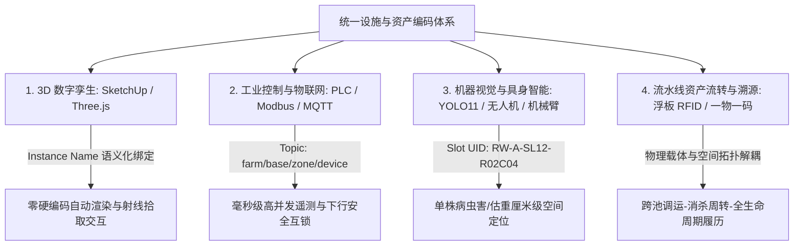
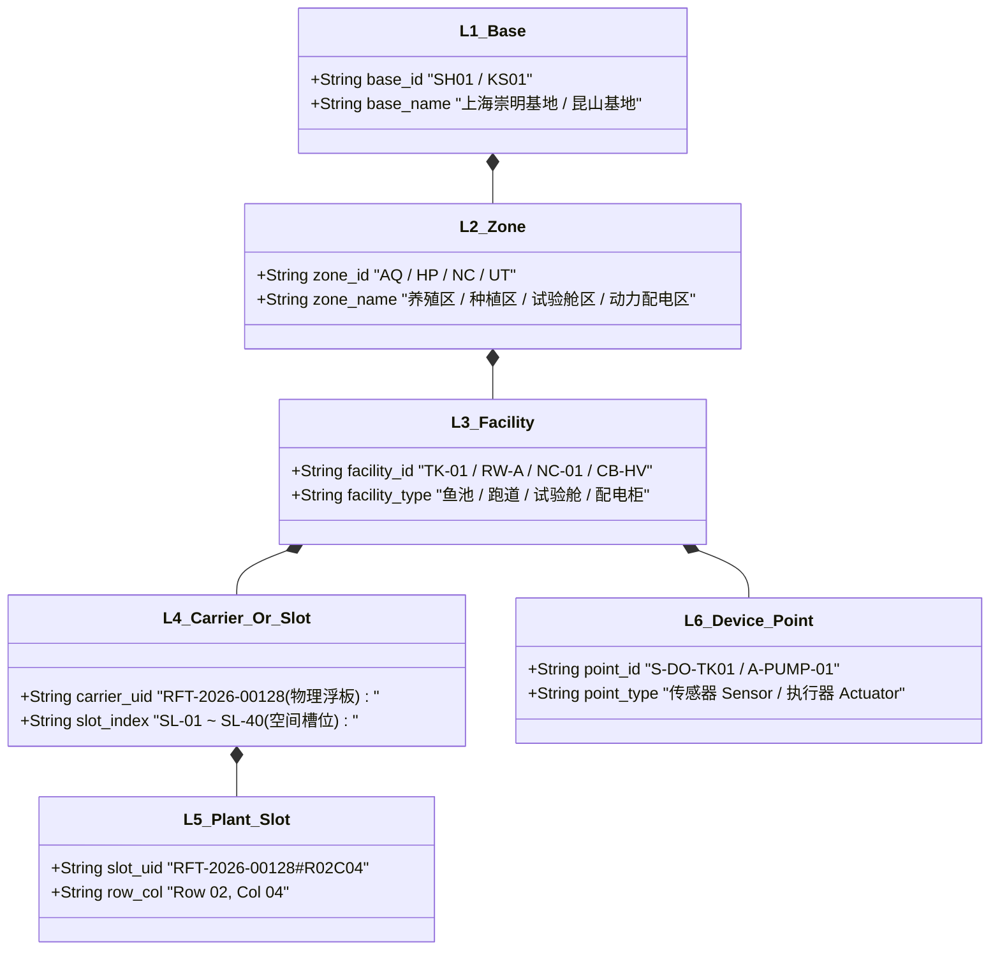
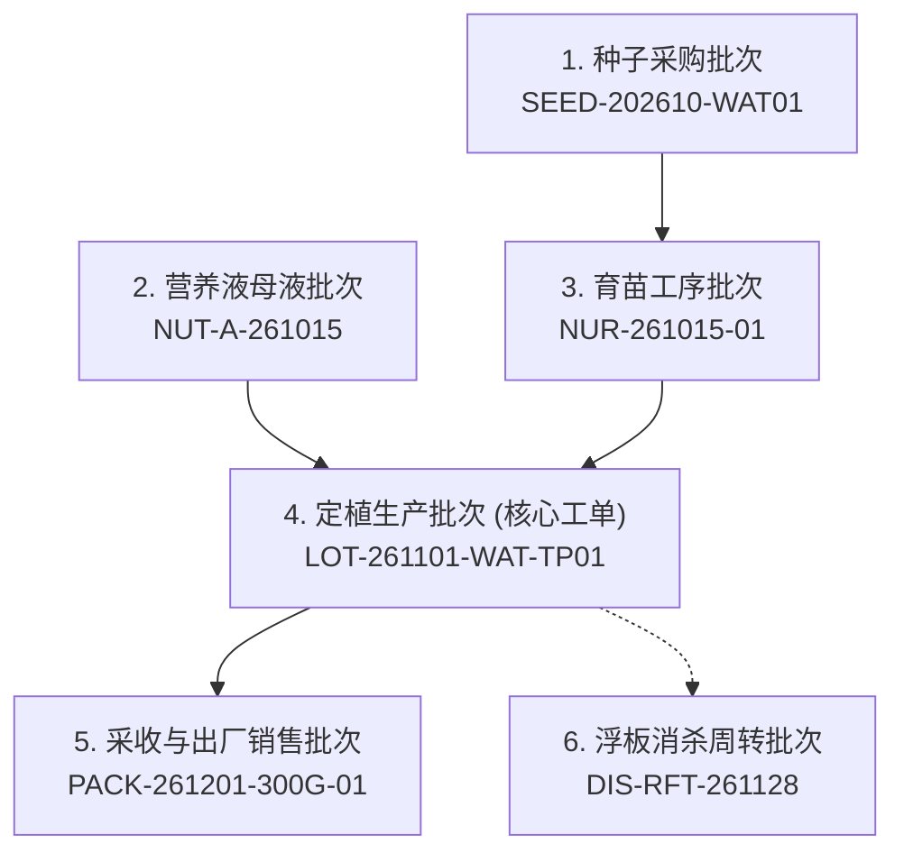
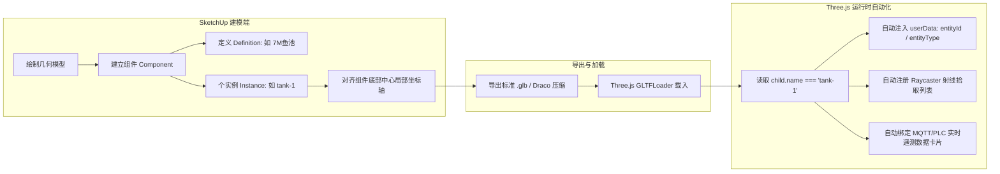
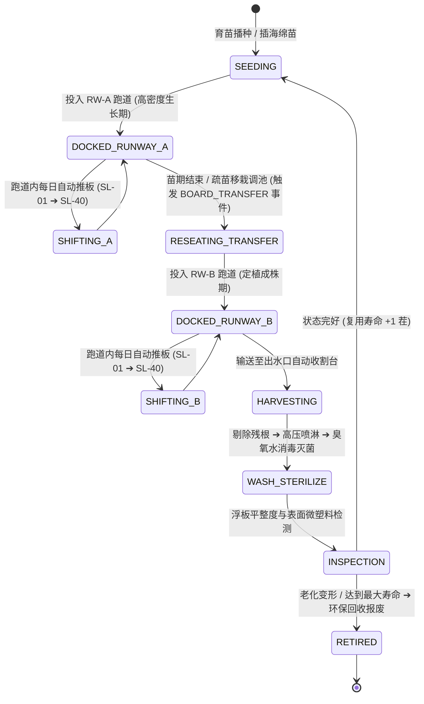
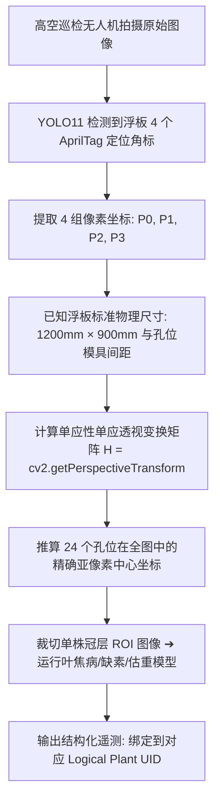

# 连锁数字化农业工厂：05_设施与物联网资产编码规范 (Facility & IIoT Asset Encoding Specification)

> **核心定位**：本规范是数字化农业工厂（鱼菜共生系统）在物理世界、工业控制（PLC/SCADA）、计算机视觉（YOLO11）、3D 数字孪生（SketchUp/Three.js）以及商业溯源（一物一码）之间的**全局统一空间坐标与资产标识字典**。所有软硬件工程团队在设备安装、建模贴图、点位配置、数据库建模及 API 契约设计时，必须无条件严格遵守。

---

## 1. 编码体系顶层设计原则



1. **唯一性（Uniqueness）**：在集团多基地范围内，每个物理单元、移动载具和单株孔位在任意给定时间戳均具备唯一的全局可识别标识。
2. **解耦性（Decoupling）**：**固定空间拓扑（如菜池跑道、温室柱网）**与**可移动载具（如浮板、料箱）**物理标识彻底解耦，通过动态状态机实现时空绑定。
3. **可读性与紧凑性（Readability & Compactness）**：采用“字母语义段 + 定长数字”结构，兼顾人眼直观辨识、工业级条码/二维码/RFID 印刷容量以及数据库 B-Tree 索引效率。
4. **全栈连通性（End-to-End Consistency）**：SketchUp 模型组件名、PLC 寄存器点位名、MQTT 主题段、Three.js 节点名与 SQL 数据库主键实现 1:1 无损对齐。

---

## 2. 六级层级编码标准 (L1 ~ L6 Hierarchy)

系统采用自顶向下的树状六级编码架构：

$$\text{【L1 基地 Base】} - \text{【L2 区域 Zone】} - \text{【L3 设施 Facility】} - \text{【L4 载具/槽位 Carrier/Slot】} - \text{【L5 孔位/点位 Slot/Point】}$$

```text
示例：SH01-HP-RW01-SL12-R02C04
含义：上海崇明01基地 ➔ 水培种植区 ➔ 01号跑道 ➔ 第12号浮板槽位 ➔ 第2行第4列生菜定植孔
```



---

### 2.1 L1：基地/工厂层 (Base / Factory Code)
采用 **2 位大写城市拼音缩写 + 2 位流水号**：
* `SH01`：上海崇明一号数字化示范工厂
* `KS01`：江苏昆山现代农业产业园工厂
* `HN01`：海南三亚南繁基地数字化温室

---

### 2.2 L2：功能区域/车间层 (Zone Code)
采用 **2 位固定大写字母**：

| 区域代码 | 英文全称 | 中文含义 | 物理空间范围与建筑特性 |
| :--- | :--- | :--- | :--- |
| **`AQ`** | Aquaculture Zone | 循环水水产养殖区 (RAS) | 116m × 35m 钢构保温温室，10座鱼池与微滤生化区 |
| **`HP`** | Hydroponics Zone | 设施水培蔬菜种植区 | 48m × 48m 文洛式连栋温室，4条48m深水跑道 |
| **`NC`** | Nursery & Chambers | 育苗与独立配方试验舱区 | 12 座密闭独立人工气候舱与育苗播种作业区 |
| **`UT`** | Utility & Power | 动力、配电与中控机房 | 380V配电间、冷热源机房、中央水泵房与PLC中控室 |
| **`QA`** | Quality & Lab | 品质控制与理化检验室 | IQC/IPQC检验室、留样室与光谱分析工位 |
| **`SR`** | Showroom & Reception | 客户体验展厅与接待区 | 温室生态吧台、客户品鉴长桌、视察动线与文化展示墙 |

---

### 2.3 L3：核心设施与生产单元层 (Facility Code)
采用 **2~4 位功能缩写 + 分隔符 + 2 位编号/字母**：

#### 🐟 养殖设施 (`AQ` 区域)
* **`TK-01` ~ `TK-06`**：7 米直径加州鲈鱼成鱼养殖池（有效水体约 $70\text{m}^3 \times 6$）
* **`TK-07` ~ `TK-10`**：4 米直径幼鱼育苗/暂养池（有效水体约 $22\text{m}^3 \times 4$）
* **`WT-DRUM-01`**：转鼓式全自动微滤机（去除大颗粒残饵粪便）
* **`WT-MBBR-01`**：移动床生物反应器（硝化细菌挂膜除氨氮）
* **`WT-SUMP-01`**：解耦式水力集水与加药调节总池

#### 🥬 水培与基质设施 (`HP` 区域)
* **`BED-TP-01` ~ `BED-TP-04`**：4 座刀刮布落地水培菜池（低成本大宗深水种植，800g/㎡防渗夹网布，长48m×宽1.2m，容纳40块标准浮板）
* **`BED-SS-01` ~ `BED-SS-02`**：2 座不锈钢离地水培菜池（SUS304离地0.85m免弯腰，极净精品生菜与研学展示）
* **`RACK-AF-01` ~ `RACK-AF-04`**：4 组 A 字架立体基质栽培架（三角形双侧斜面多层，高架红颜草莓与高坪效特色香草）
* **`ROW-DB-01` ~ `ROW-DB-04`**：4 排独立荷兰桶滴灌垄（小番茄、黄瓜等藤蔓果菜高垄吊蔓滴灌专线）
* **`FL-GUTTER-01` ~ `04`**：NFT 营养液膜管道栽培槽（叶菜绿化育苗与草莓立体补光槽）

#### 🌱 独立试验舱 (`NC` 区域)
* **`NC-01` ~ `NC-12`**：12 座带独立温湿度/多光谱 LED/水肥脉冲控制的农艺配方科研方舱

#### ⚡ 电气与动力设施 (`UT` 区域)
* **`CB-HV-01`**：380V 强电动力配电柜（威胜智能多功能电表、施耐德断路器）
* **`CB-LV-01`**：24V 弱电自动化控制柜（汇川 Easy320 PLC、安全隔离栅、Modbus 网关）
* **`HP-MAIN-01`**：地源热泵中央温控机组

#### ☕ 展厅与接待设施 (`SR` 区域)
* **`SR-BAR-01`**：生态阳光水吧台与饮品保鲜工位
* **`SR-TBL-01`**：客户品鉴与洽谈原木大长桌（配额6~8人）
* **`SR-WALL-01`**：数字化工厂多模态文化与数据孪生大屏展示墙

---

### 2.4 L4：可移动载具与空间槽位层 (Carrier & Slot Code)

> [!IMPORTANT]
> **物理载体与空间槽位严格解耦**：
> * **浮板/基质槽本身**是流动的**物理载体（Carrier）**，具有固定的资产码；
> * **菜池/种植架内部**是静止的**空间槽位（Slot）**，具有固定的地理位置。

* **菜池空间槽位号 (Slot Index，固定位置)**：`SL-01` ~ `SL-40`
  * 示例：`SL-01` 代表水培菜池入水口第 1 个推板工位；`SL-40` 代表出水口收割工位。
* **浮板物理资产码 (Raft UID，流动载具)**：`RFT-{孔数}-{尺寸简码}-{流水4位}`
  * 示例：`RFT-24H-A-0088`（24孔A型板，尺寸 $1.2\text{m} \times 0.9\text{m}$，物理永久编号 0088 号高密度 HDPE 食品级抑藻浮板）。
* **立体基质条载具码 (Substrate Slab UID)**：`SLAB-{材质}-{年份2位}-{流水4位}`
  * 示例：`SLAB-COCO-26-0032`（2026年投产的第 0032 条草莓专用高压缩椰糠栽培条）。
* **育苗穴盘海绵载具码 (Nursery Tray UID)**：`TRY-{孔数}{材质}-{流水4位}`
  * 示例：`TRY-96S-0120`（96孔方块育苗聚氨酯海绵托盘，资产号 0120 号）。

---

### 2.5 L5：单株定植孔位层 (Plant Slot Code)

* **孔位相对坐标（板内矩阵，出厂固定）**：
  * 采用 `R{行号2位}C{列号2位}`（Row / Column）。
  * 示例：对于 $4 \text{行} \times 6 \text{列}$ 标准 24 孔浮板，孔位从 `R01C01`（左上角）排布至 `R04C06`（右下角）。
* **单株全局逻辑 UID (Logical Plant UID)**：
  $$\text{Logical Plant UID} = \text{Raft UID} + \text{"\#"} + \text{Row/Col}$$
  * 示例：`RFT-24H-A-0088#R02C04`（无论这块浮板被推移到哪个池子，该株作物的生命周期身份全局唯一锁定）。
* **单株绝对空间定位 UID (Spatial Plant UID)**：
  $$\text{Spatial Plant UID} = \text{Base} + \text{"-"} + \text{Zone} + \text{"-"} + \text{Facility} + \text{"-"} + \text{Slot} + \text{"-"} + \text{Row/Col}$$
  * 示例：`GM01-HP-BED-TP01-SL15-R02C04`（当前巡检或机械臂执行时对应的绝对地理坐标）。

> [!TIP]
> **一线操作防反感与防造假减负策略**：
> 在日常手工定植、巡检和采收时，**严禁要求工人逐孔记录**！日常只按整板记录（如“定植了 10 块 24 孔浮板，计 240 株”）；只有在**发生异常死苗、病株拔除或抽样化验**时，才在系统中按 `浮板号#孔位`（如 `RFT-24H-A-0088#R02C04 发现蚜虫拔除`）做例外标记。


---

### 2.6 L6：传感器与执行器点位层 (Point Code)

采用 **点位性质 (S: Sensor / A: Actuator) + 物理量/设备类型 + 所属设施 ID**：

| 点位代码 | 类别 | 中文描述 | 信号物理类型 | 所属设施 |
| :--- | :--- | :--- | :--- | :--- |
| `S-DO-TK01` | 传感器 | 1号鱼池水质荧光溶解氧探头 | RS-485 Modbus-RTU | `TK-01` |
| `S-TEMP-TK01` | 传感器 | 1号鱼池高精度水温探头 | PT100 / Modbus | `TK-01` |
| `S-PH-SUMP01` | 传感器 | 解耦集水调节池 pH 电极探头 | 4-20mA 模拟量 | `WT-SUMP-01` |
| `S-EC-RWA` | 传感器 | A跑道营养液电导率探头 | RS-485 Modbus-RTU | `RW-A` |
| `S-VPD-HP01` | 传感器 | 水培区高空温湿度红外叶温算力点 | 软件数学反演流 | `HP` |
| `A-PUMP-O2-01` | 执行器 | 变频纯氧锥增压水泵 | 380V 接触器 + PLC DO | `UT` |
| `A-FEED-TK01` | 执行器 | 1号鱼池高频气动自动投饵机 | 24V 继电器 / PLC DO | `TK-01` |
| `A-VALVE-RW01` | 执行器 | 1号跑道气动比例补水调节阀 | 4-20mA 模拟量输出 | `RW-A` |

---

### 2.7 非 IIoT 实物资产、5S工器具与配套设施编码标准 (Physical, 5S & Amenities Code)

> [!NOTE]
> **经验教训记录（现场 5S 精益防乱防丢与防交叉污染原则）**：
> 1. 在温室生产与研学大棚中，切忌将“美工刀、扫把、折叠椅”与“380V动力变频泵、PLC柜”等同按照财务固定资产进行无差别单件立卷。否则一线工人每天借还、报废、盘点流程繁琐，表格必将在 3 周内沦为僵尸表。
> 2. 美工刀等工具第二天就找不到的根源在于**“物理现场没有固定工位”**。工器具必须与**物理定置点（影子板 Shadow Board / 工作台）**强绑定，实施**形迹管理**与**下班 1 分钟目视化交接**。
> 3. 客户接待冰箱、品鉴桌椅属于**品牌形象与食安体验触点**，重点在于**定额套件管理**与**冰箱每周 5S 食安消杀打卡**，严禁员工在客用冰箱存放异味外卖残留破坏高品质有机农业形象。

#### 2.7.1 实物资产大类代码 (Category Code)
采用 **2 位固定大写字母**：
* **`EQ`**（Equipment 动力与生产设备）：变频水泵、罗茨风机、配电柜、微滤机、紫外消杀器等。
* **`IN`**（Instrument 实验与计量仪器）：紫外分光光度计、电子分析天平、便携式水质分析仪、移液枪。
* **`AP`**（Appliance 通用电器与客用设施）：客用双门冰箱、冷热管线饮水机、咖啡机、研学展示大屏。
* **`FN`**（Furniture 办公与接待家具）：实木洽谈桌、接待椅套件、储物柜、展示货架。
* **`TL`**（Tool 5S专用工器具）：美工刀、收割弯刀、嫁接剪、手电钻、打孔器、卷尺。
* **`CL`**（Cleaning 5S清洁卫生用具）：大扫把、拖把、地面吸水刮板、消杀喷雾器、高压水枪。
* **`SA`**（Safety & PPE 劳保防护器材）：防毒面具、防割手套架、洗眼器、灭火器。

#### 2.7.2 5S 定置点与工作台代码 (Station Code)
* **`SB01` ~ `SB09`**：**工具影子板 (Shadow Board)**（挂立柱/墙面上的工具形迹洞洞板）
* **`CP01` ~ `CP09`**：**5S清洁卫生角 (Cleaning Point)**（扫把、拖把、地刮专用定位悬挂架）
* **`WS01` ~ `WS09`**：**固定工作台 (Workstation)**（播种流水线台、收割包装台、维修作业台）

#### 2.7.3 空间定置编码范式 (Encoding Paradigm)
$$\text{【Base 基地】} - \text{【Zone 区域】} - \text{【定置点/设施】} - \text{【类别】} - \text{【槽位序号/套件】}$$

| 资产编码示例 | 对应实物 | 物理含义与管理逻辑 |
| :--- | :--- | :--- |
| `SH01-HP-SB01-TL-01` | 重型美工刀 (18mm) | 水培区 ➔ 1号工具影子板 ➔ 工具类 ➔ 第01号位（板上黑影对齐，防丢目视化） |
| `SH01-HP-CP01-CL-01` | 1.2m竹丝大扫把 | 水培区 ➔ 1号清洁卫生角 ➔ 清洁类 ➔ 第01号挂钩 |
| `SH01-SR-BAR-AP-01` | 客用双门保鲜冰箱 (218L) | 展厅区 ➔ 阳光水吧台 ➔ 通用电器 ➔ 01号机（周五定期除味消杀打卡） |
| `SH01-SR-TBL-FN-SET01` | 接待实木长桌椅套件 | 展厅区 ➔ 品鉴岛 ➔ 家具类 ➔ 01套件（1长桌+6椅，定额不拆散贴码） |
| `SH01-QA-LAB-IN-01` | 紫外可见分光光度计 | 质检中心 ➔ 理化检验室 ➔ 仪器类 ➔ 01号台（严格计量检定周期与证书存档） |

#### 2.7.4 三色生物安全区域隔离防线 (Biosecurity Color-Coding)
鱼菜共生系统必须严防跨工种、跨区域交叉感染，所有现场工器具、清洁用具手柄均缠绕耐磨聚酯色标环：
* **🔵 蓝色标贴（Blue）**：设施水培种植区（`HP`）专用，严禁进入养殖生化区；
* **🟡 黄色标贴（Yellow）**：循环水养殖区（`AQ`）专用，**绝对严禁带入水培即食叶菜区**，防止鱼粪弧菌病原体污染成品蔬菜；
* **⚪ 白色标贴（White）**：理化检验室与质检中心（`QA`）专用，仅限洁净受控环境内周转。

> 完整字段字典与飞书多维表格（Base）落地实施见：[10_全厂实物资产台账与5S定置管理数据契约规范(Asset_and_5S_Ledger_Schema).md](./10_全厂实物资产台账与5S定置管理数据契约规范(Asset_and_5S_Ledger_Schema).md)。

---

## 3. 全生命周期生物与农资流转批次编码标准 (Bio & Agri-input Batch Code)

为了建立从“种子采购 ➔ 浸润催芽 ➔ 育苗补光 ➔ 定植分苗 ➔ 采收初加工 ➔ e-COA 出厂检验”的**无缝责任溯源闭环**，生物材料与农资物料统一采用以下编码规范：



### 3.1 核心流转批次编码字典

| 业务对象 | 编码结构 | 典型示例 | 业务含义与溯源要素 |
| :--- | :--- | :--- | :--- |
| **种子采购批次** | `SEED-{年月6位}-{品种简码}{流水2位}` | `SEED-202610-WAT01` | 2026年10月购入第01批西洋菜种子，记录包装袋原厂批号、供应商、发芽率 |
| **营养液母液批次** | `NUT-{母液槽A/B/C}-{配液日期6位}` | `NUT-A-261015` | 2026年10月15日调配的 A 母液（大量元素），追溯化肥原料纯度与水质 |
| **育苗穴盘批次** | `NUR-{播种日期6位}-{当日序号2位}` | `NUR-261015-01` | 10月15日播种的第01批苗，关联种子批次、育苗架层位与暗室出苗时间 |
| **定植生产批次** | `LOT-{定植日期6位}-{作物简码}-{单元}` | `LOT-261101-WAT-TP01` | **核心生产工单主键**：11月1日在1号刀刮布池定植的西洋菜批次 |
| **浮板洗消批次** | `DIS-{设施载具类型}-{消杀日期6位}` | `DIS-RFT-261128` | 11月28日集中高压清洗并经二氧化氯/次氯酸浸泡消毒的浮板批次 |
| **采收包装批次** | `PACK-{采收日期6位}-{规格}-{序号2位}`| `PACK-261201-300G-01` | 300g精品免洗盒装，直印包装盒作为防伪追溯码（直通 e-COA 质检报告） |

---

## 4. 飞书多维表格（Base）手工过渡期实操与防呆指南

在尚未上线自研 MES/ERP 软件之前，现场全员依托**飞书多维表格**进行手工敏捷流转。为防止人工录入繁琐和出错，推行以下实战架构：

### 4.1 核心五表联动架构
1. **【种子与种苗台账】**：登记种子批号、实测发芽率、包装袋批次与剩余库存；
2. **【育苗与播种记录表】**：登记播种日期、海绵盘数、理论出苗数与状态机（暗室催芽/绿化补光/待定植）；
3. **【菜池设施空间表】**：登记各菜池物理尺寸、额定浮板容量与责任技术员；
4. **【浮板实物资产台账】**：登记浮板物理唯一码、孔数规格、当前所在菜池与累计采收茬数；
5. **【定植生产与采收生命周期表】**：**核心业务大表**，通过公式自动拼接 `LOT` 批次号，批量关联浮板编号，汇总定植株数，跟踪预计采收日、实测毛重与糖度。

### 4.2 一线防呆三项策略 (Poka-Yoke)
1. **公式自动拼装批次号**：
   * 严禁技术员手工键盘输入 15 位以上的批次长字符串；
   * 在飞书中配置文本公式：`"LOT-" + TEXT(定植日期,"YYMMDD") + "-" + 作物代码 + "-" + 菜池编号`，由系统自动生成，避免手误；
2. **Shift 批量勾选板号**：
   * 定植 10 块板时，在多选关联字段中按住 Shift 批量勾选 `RFT-24H-A-0001` 到 `0010`，3秒完成，自动汇总总株数；
3. **推板时钟模型与目视化色标（FIFO）**：
   * 菜池推板遵循“先进先出”自然流动：入水口永远填入最新批次，老批次自然推向出水口；
   * 在每批浮板的首尾插入**彩色塑料记号小旗（如周一定植插红旗，周四插蓝旗）**，工人肉眼即知哪批该收割，无需每日更新浮板空间槽位号。

---

## 5. SketchUp 3D 建模与 Three.js 映射契约


为了彻底杜绝 3D 场景开发中坐标手动对齐和代码写死位置的弊端，SketchUp 建模必须遵循以下工程契约：



### 3.1 图元信息填报规范

| 面板字段 | 规范填写内容 | 示例 | 作用与机制 |
| :--- | :--- | :--- | :--- |
| **定义 (Definition)** | 设备/建筑母模标准型号 | `7M_Fish_Tank`、`48M_Raceway`、`Nursery_Chamber_Box` | 相同规格的几何体共用同一份 Geometry，大幅降低 GLB 导出体积和 WebGL 显存占用（GPU Instancing）。 |
| **个实例 (Instance)** | **全局唯一的设施标准编码** | `tank-1`、`tank-2`、`raceway-a`、`cabinet-hv`、`nursery-1` | **核心交互主键！** 导出的 glTF 节点 `child.name` 严格等于该值，Three.js 据此实现 0 硬编码绑定。 |
| **局部坐标原点 (Axes)** | 统一设定在**设备底部几何中心** | 选中组件 ➔ 右键“更改轴” | 保证在 Three.js 中通过代码生成悬浮全息牌、声呐光圈、无人机降落点时高度和定位绝对精确。 |

### 3.2 节点名称与 Three.js 自动化装载字典

```javascript
/**
 * Three.js 自动语义化装载映射表 (SketchUp Instance Name ➔ 业务实体)
 */
const SCENE_ENTITY_MAPPINGS = {
  // 鱼池系列
  'tank-1': { type: 'fish_tank', id: 'TK-01', name: '🐟 鱼池 #01 (加州鲈成鱼池)', zone: 'AQ' },
  'tank-2': { type: 'fish_tank', id: 'TK-02', name: '🐟 鱼池 #02 (加州鲈成鱼池)', zone: 'AQ' },
  // 水培跑道系列
  'raceway-a': { type: 'raceway', id: 'RW-A', name: '🥬 水培跑道 #A 槽 (奶油生菜)', zone: 'HP' },
  'raceway-b': { type: 'raceway', id: 'RW-B', name: '🥬 水培跑道 #B 槽 (红帆生菜)', zone: 'HP' },
  // 配电与控制柜
  'cabinet-hv': { type: 'cabinet_hv', id: 'CB-HV-01', name: '⚡ 强电动力配电柜 (380V/威胜电表)', zone: 'UT' },
  'cabinet-lv': { type: 'cabinet_lv', id: 'CB-LV-01', name: '📡 弱电自动化控制柜 (汇川PLC/安全栅)', zone: 'UT' },
  // 育苗试验舱
  'nursery-1': { type: 'nursery', id: 'NC-01', name: '🌱 试验舱 #01 (小叶茼蒿高钙配方)', zone: 'NC' }
};
```

---

## 4. 浮板动态跨池调动与空间解耦模型

针对“浮板随生长周期在不同菜池调动流转”的工业生产特征，采用**“双定位角标 + 进池事件注册 + 状态机流转”**机制。

### 4.1 浮板硬件标定规范（一板一码 + 双角标防呆）
1. **对角线双芯片布局**：
   * 在浮板**左上角（Top-Left）**与**右下角（Bottom-Right）**分别注塑嵌入 1 枚 IP68 级无源超高频抗金属防水 RFID 芯片。
   * **A 码（标头）**：`RFT-2026-00128-A`；**B 码（标尾）**：`RFT-2026-00128-B`。
   * **防呆机制**：系统根据扫码读写器感应到 A/B 芯片的时序与信号强度，自动判断浮板放入水池时的**正反朝向（Normal / Rotated 180°）**。
2. **表面视觉定位标识**：
   * 在浮板四周边缘激光直接蚀刻 **4 个抗藻类磨损的 AprilTag / ArUco 视觉定位二维码（36h11 格式）**。

### 4.2 浮板跨池调运与生命周期状态机



### 4.3 浮板调池/移位事件 Payload 契约 (`BOARD_TRANSFER`)

当 AGV 叉车、龙门吊或人工使用手持 PDA 将浮板调运至新菜池时，边缘网关发布如下事件至 MQTT 消息总线：

```json
{
  "message_id": "uuid-v4-evt-board-transfer-089",
  "base_id": "SH01",
  "event_type": "BOARD_TRANSFER",
  "timestamp": "2026-08-20T11:20:00.000Z",
  "board_uid": "RFT-2026-00128",
  "batch_id": "BATCH-20260810-BUTTER-01",
  "crop_variety": "特级奶油生菜",
  "transfer_details": {
    "from_facility_id": "RW-A",
    "from_slot_index": "SL-40",
    "to_facility_id": "RW-B",
    "to_slot_index": "SL-01",
    "orientation": "NORMAL",
    "operator_type": "AGV_ROBOT",
    "operator_id": "AGV-FORKLIFT-01"
  },
  "water_spatiotemporal_history": {
    "total_water_residence_days": 10,
    "last_water_temp_avg": 20.4,
    "last_ec_avg": 1.62,
    "accumulated_dli_mol": 165.2
  }
}
```

---

## 5. 计算机视觉与无人机巡检反演算法契约

高空多光谱巡检无人机或龙门架导轨相机拍摄水培跑道时，**无需在每个孔位贴标签**，通过单张浮板的 4 点透视变换（Perspective Transform）即可毫秒级计算出所有孔位的像素及物理空间坐标。



### 5.1 透视变换推算孔位算法规范（Python / OpenCV 伪代码）

```python
import cv2
import numpy as np

def resolve_plant_slots(board_image, detected_corners, board_spec):
    """
    基于浮板4个角标推算该板上所有孔位的精确图像坐标与空间编码
    :param detected_corners: 视觉检测到的4个角点像素坐标 [[x0,y0], [x1,y1], [x2,y2], [x3,y3]]
    :param board_spec: 浮板规格 (如 6行4列, 间距150mm)
    :return: 包含每个孔位 (Row, Col, Plant_UID, Pixel_Center) 的字典列表
    """
    # 1. 定义浮板模具标准物理平面坐标 (单位: mm)
    width_mm, height_mm = board_spec['width_mm'], board_spec['height_mm']
    src_pts = np.float32(detected_corners)
    dst_pts = np.float32([[0, 0], [width_mm, 0], [width_mm, height_mm], [0, height_mm]])
    
    # 2. 计算反向透视变换矩阵 (Perspective Transform Matrix)
    matrix_inv = cv2.getPerspectiveTransform(dst_pts, src_pts)
    
    slots_result = []
    # 3. 遍历孔位行列矩阵
    for r in range(1, board_spec['rows'] + 1):
        for c in range(1, board_spec['cols'] + 1):
            # 计算该孔在浮板物理平面上的中心点 (mm)
            px_mm = board_spec['offset_x_mm'] + (c - 1) * board_spec['pitch_x_mm']
            py_mm = board_spec['offset_y_mm'] + (r - 1) * board_spec['pitch_y_mm']
            
            # 通过透视变换逆矩阵映射回拍摄原图中的像素坐标
            pt_physical = np.array([[[px_mm, py_mm]]], dtype=np.float32)
            pt_pixel = cv2.perspectiveTransform(pt_physical, matrix_inv)[0][0]
            
            slot_id = f"R{r:02d}C{c:02d}"
            plant_logical_uid = f"{board_spec['board_uid']}#{slot_id}"
            
            slots_result.append({
                "slot_id": slot_id,
                "plant_logical_uid": plant_logical_uid,
                "pixel_center": (int(pt_pixel[0]), int(pt_pixel[1])),
                "physical_coord_mm": (px_mm, py_mm)
            })
            
    return slots_result
```

---

## 7. 全生命周期数据闭环与一物一码商超溯源

当水培蔬菜在菜池末端收割打包时，系统将生产全程的“时空数据链条”固化并生成唯一的**消费端防伪溯源防伪码（Traceability QR Code / e-COA）**：

```text
消费端溯源数据链 (e-COA 电子防伪履历):
├── 种子批次：SEED-202610-BUT01 (荷兰瑞克斯旺萨拉诺瓦绿奶油)
├── 育苗阶段：2026-10-15 ~ 2026-10-29 | 育苗架 NUR-261015-01 (高蓝光健壮配方)
├── 快速生长：2026-10-29 ~ 2026-11-20 | 刀刮布菜池 BED-TP-01 (载具 RFT-24H-A-0088, 生产工单 LOT-261029-BUT-TP01)
├── 采收前调优：2026-11-20 ~ 2026-11-22 | 不锈钢离地菜池 BED-SS-01 (纯水循环降硝酸盐)
├── 出厂质检：2026-11-22T04:00:00.000Z | 检验室 QA-LAB (0化学农药, 0重金属超标, 硝酸盐≤1800mg/kg, 糖度4.2°)
└── 出厂打包：2026-11-22T06:30:00.000Z | PACK-261122-300G-01 (精品免洗即食冷链直达)
```

---

## 8. 实施与审计自查清单 (Checklist)

| 检查项 | 验证标准与合格判定 | 责任角色 | 状态 |
| :--- | :--- | :--- | :--- |
| **SketchUp 命名审查** | 所有鱼池、菜池、电柜在「个实例」中严格填写标准英文编码（如 `tank-1`, `bed-tp-1`, `cabinet-hv`），绝无空白。 | 3D 建模工程师 | [ ] |
| **坐标系与原点** | 厂房基准点严密对齐世界原点 `(0,0,0)`，单位严格为米（m），组件轴固定于底部几何中心。 | 3D 建模工程师 | [ ] |
| **浮板物理编码** | 所有出厂浮板在边缘蚀刻/打标激光码，资产库录入 `RFT-{孔数}-{规格}-{流水4位}`。 | 硬件/车间主管 | [ ] |
| **PLC/MQTT 契约对齐** | 汇川 PLC 变量表与边缘网关 MQTT 主题严格采用本标准分层编码，无任何非标硬编码点位。 | IIoT 自动化工程师 | [ ] |
| **时间格式归一化** | 所有的事件流、遥测流、调池记录严格采用 `YYYY-MM-DDTHH:mm:ss.000Z` 毫秒 UTC 时间戳。 | 后端架构师 | [ ] |

---

## 9. 经验教训与工程踩坑记录 (Lessons Learned 20~23)

* **经验 20（一线防抵触与防造假原则）**：在系统起步手工记录阶段，**绝对严禁要求工人逐孔（上万个孔）录入数据**！日常定植与采收只按整板批次（如 10 块 24 孔板）操作，只有在**发生死苗拔除、病虫害定位或抽检取样**时，才在系统中按 `浮板号#孔位`（如 `RFT-24H-A-0088#R02C04`）做例外标记，确保工人愿意用且数据真实。
* **经验 21（时空解耦之推板动态模型）**：菜池空间槽位（`SL-01` ~ `SL-40`）固定不动，浮板（`RFT`）每天向前推移。通过 FIFO 先进先出顺序排产与首尾浮板插入“彩色记号小旗”的目视化管理，现场工人肉眼即知采收批次，无需工人每天在飞书里繁琐修改浮板的槽位号。
* **经验 22（全链条农资与消杀闭环）**：种子、海绵穴盘（`TRY`）、定植篮（`CUP`）、A/B营养液母液（`NUT`）以及浮板高压清洗消杀（`DIS`）必须具备唯一批次号。一旦发生幼苗根腐病或藻类暴发，可迅速倒查是哪一批消杀未彻底或母液原料失衡。
* **经验 23（百元级低成本打码防呆）**：利用便携热敏打码机打印耐水泥水资产标贴，结合飞书多维表格的公式自动拼装批次号，杜绝技术员手动键盘输入 15 位以上长字符串造成的笔误和串号。

---

## 🔗 相关设计与规范链接

* **宏观系统架构设计**：👉 [01_系统宏观架构设计.md](./01_系统宏观架构设计.md)
* **MVP 物理拓扑与网关配置**：👉 [02_MVP物理与物联拓扑.md](./02_MVP物理与物联拓扑.md)
* **接口与数据契约规范 (严格 ISO 8601 UTC)**：👉 [03_接口与数据契约规范.md](./03_接口与数据契约规范.md)
* **设施物理拓扑与多作物排产数据契约规范**：👉 [11_设施物理拓扑与多作物排产数据契约规范(Facility_and_Agronomy_Schema).md](./11_设施物理拓扑与多作物排产数据契约规范(Facility_and_Agronomy_Schema).md)
* **YOLO11 活体生物数据集规范**：👉 [04_YOLO11活体生物数据集构建规范.md](./04_YOLO11活体生物数据集构建规范.md)
* **农业数字孪生与多尺度仿真体系**：👉 [06_农业数字孪生与多尺度仿真体系规范.md](./06_农业数字孪生与多尺度仿真体系规范.md)
* **水培种植子系统主设计**：👉 [02_hydroponics/README.md](../04_subsystems/02_hydroponics/README.md)
* **品牌溯源、客户运营与舆情感知**：👉 [06_brand_traceability_crm/README.md](../04_subsystems/06_brand_traceability_crm/README.md)


