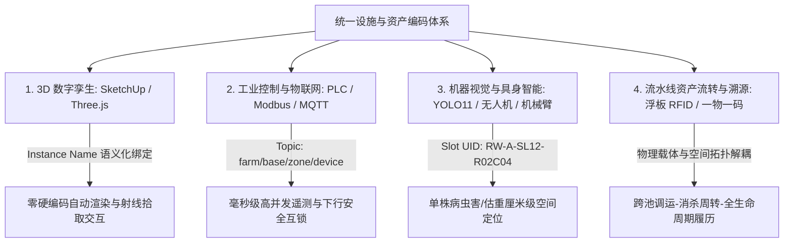
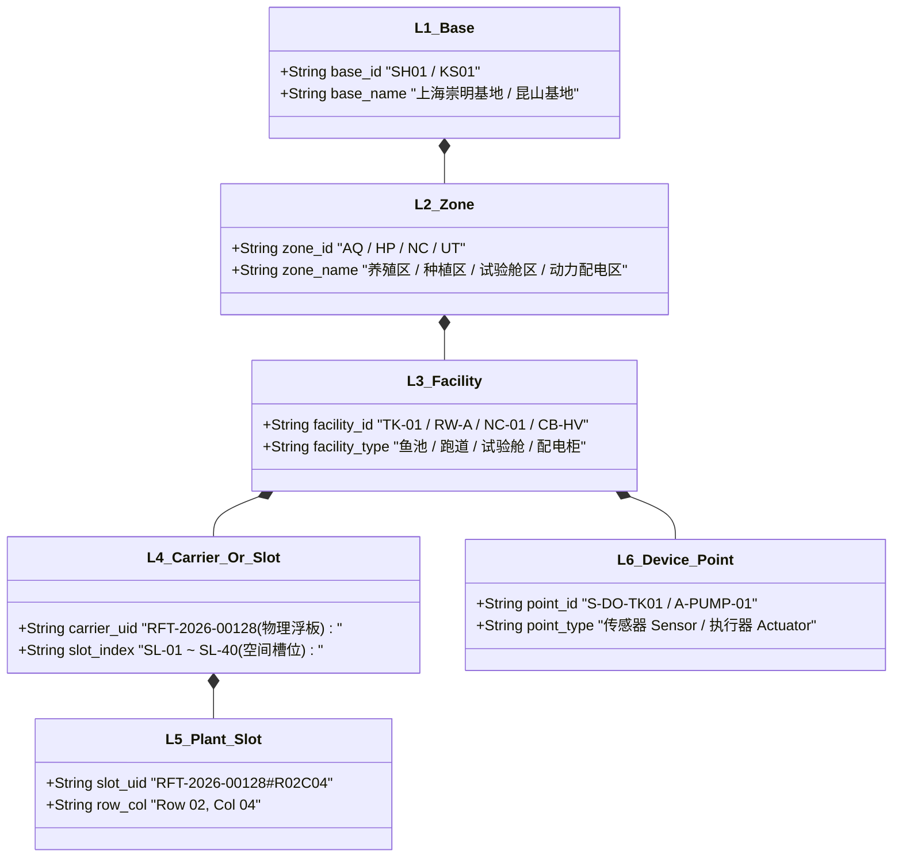
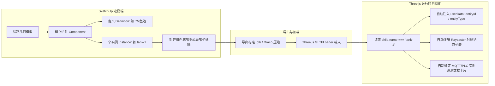
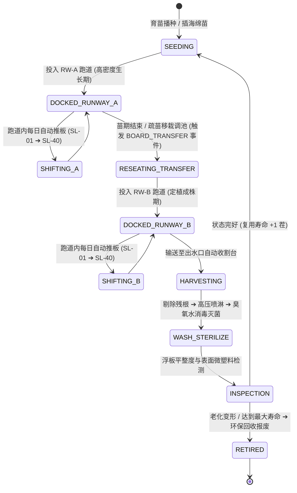
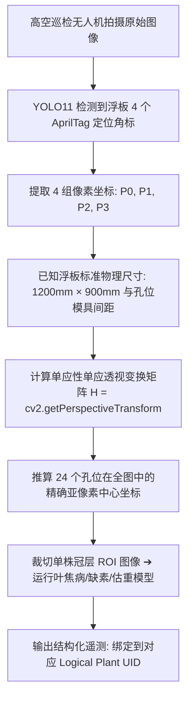

# 连锁数字化农业工厂：05_设施与物联网资产编码规范 (Facility & IIoT Asset Encoding Specification)

> **核心定位**：本规范是数字化农业工厂（鱼菜共生系统）在物理世界、工业控制（PLC/SCADA）、计算机视觉（YOLO11）、3D 数字孪生（SketchUp/Three.js）以及商业溯源（一物一码）之间的**全局统一空间坐标与资产标识字典**。所有软硬件工程团队在设备安装、建模贴图、点位配置、数据库建模及 API 契约设计时，必须无条件严格遵守。

---

## 1. 编码体系顶层设计原则



1. **唯一性（Uniqueness）**：在集团多基地范围内，每个物理单元、移动载具和单株孔位在任意给定时间戳均具备唯一的全局可识别标识。
2. **解耦性（Decoupling）**：**固定空间拓扑（如菜池跑道、温室柱网）**与**可移动载具（如浮板、料箱）**物理标识彻底解耦，通过动态状态机实现时空绑定。
3. **可读性与紧凑性（Readability & Compactness）**：采用“字母语义段 + 定长数字”结构，兼顾人眼直观辨识、工业级条码/二维码/RFID 印刷容量以及数据库 B-Tree 索引效率。
4. **全栈连通性（End-to-End Consistency）**：SketchUp 模型组件名、PLC 寄存器点位名、MQTT 主题段、Three.js 节点名与 SQL 数据库主键实现 1:1 无损对齐。

---

## 2. 六级层级编码标准 (L1 ~ L6 Hierarchy)

系统采用自顶向下的树状六级编码架构：

$$\text{【L1 基地 Base】} - \text{【L2 区域 Zone】} - \text{【L3 设施 Facility】} - \text{【L4 载具/槽位 Carrier/Slot】} - \text{【L5 孔位/点位 Slot/Point】}$$

```text
示例：SH01-HP-RW01-SL12-R02C04
含义：上海崇明01基地 ➔ 水培种植区 ➔ 01号跑道 ➔ 第12号浮板槽位 ➔ 第2行第4列生菜定植孔
```



---

### 2.1 L1：基地/工厂层 (Base / Factory Code)
采用 **2 位大写城市拼音缩写 + 2 位流水号**：
* `SH01`：上海崇明一号数字化示范工厂
* `KS01`：江苏昆山现代农业产业园工厂
* `HN01`：海南三亚南繁基地数字化温室

---

### 2.2 L2：功能区域/车间层 (Zone Code)
采用 **2 位固定大写字母**：

| 区域代码 | 英文全称 | 中文含义 | 物理空间范围与建筑特性 |
| :--- | :--- | :--- | :--- |
| **`AQ`** | Aquaculture Zone | 循环水水产养殖区 (RAS) | 116m × 35m 钢构保温温室，10座鱼池与微滤生化区 |
| **`HP`** | Hydroponics Zone | 设施水培蔬菜种植区 | 48m × 48m 文洛式连栋温室，4条48m深水跑道 |
| **`NC`** | Nursery & Chambers | 育苗与独立配方试验舱区 | 12 座密闭独立人工气候舱与育苗播种作业区 |
| **`UT`** | Utility & Power | 动力、配电与中控机房 | 380V配电间、冷热源机房、中央水泵房与PLC中控室 |
| **`QA`** | Quality & Lab | 品质控制与理化实验室 | IQC/IPQC检测室、留样室与光谱分析工位 |

---

### 2.3 L3：核心设施与生产单元层 (Facility Code)
采用 **2~4 位功能缩写 + 分隔符 + 2 位编号/字母**：

#### 🐟 养殖设施 (`AQ` 区域)
* **`TK-01` ~ `TK-06`**：7 米直径加州鲈鱼成鱼养殖池（有效水体约 $70\text{m}^3 \times 6$）
* **`TK-07` ~ `TK-10`**：4 米直径幼鱼育苗/暂养池（有效水体约 $22\text{m}^3 \times 4$）
* **`WT-DRUM-01`**：转鼓式全自动微滤机（去除大颗粒残饵粪便）
* **`WT-MBBR-01`**：移动床生物反应器（硝化细菌挂膜除氨氮）
* **`WT-SUMP-01`**：解耦式水力集水与加药调节总池

#### 🥬 水培设施 (`HP` 区域)
* **`RW-A`、`RW-B`、`RW-C`、`RW-D`**：4 条 48 米深水浮板水培跑道（DWC，各容纳 40 块标准浮板）
* **`FL-GUTTER-01` ~ `04`**：NFT 营养液膜管道栽培架（叶菜育苗与草莓立体补光槽）

#### 🌱 独立试验舱 (`NC` 区域)
* **`NC-01` ~ `NC-12`**：12 座带独立温湿度/多光谱 LED/水肥脉冲控制的农艺配方科研方舱

#### ⚡ 电气与动力设施 (`UT` 区域)
* **`CB-HV-01`**：380V 强电动力配电柜（威胜智能多功能电表、施耐德断路器）
* **`CB-LV-01`**：24V 弱电自动化控制柜（汇川 Easy320 PLC、安全隔离栅、Modbus 网关）
* **`HP-MAIN-01`**：地源热泵中央温控机组

---

### 2.4 L4：可移动载具与空间槽位层 (Carrier & Slot Code)

> [!IMPORTANT]
> **物理载体与空间槽位严格解耦**：
> * **浮板本身**是流动的**物理载体（Carrier）**，具有固定的资产码；
> * **跑道内部**是静止的**空间槽位（Slot）**，具有固定的地理位置。

* **浮板物理资产码 (Raft UID)**：`RFT-{年份4位}-{流水号5位}`
  * 示例：`RFT-2026-00128`（2026 年采购投产的第 128 号高密度聚乙烯 HDPE 抑藻浮板，尺寸 $1.2\text{m} \times 0.9\text{m}$）。
* **跑道空间槽位号 (Slot Index)**：`SL-01` ~ `SL-40`
  * 示例：`SL-01` 代表水培跑道入水口第 1 个推板工位；`SL-40` 代表出水口收割工位。

---

### 2.5 L5：单株定植孔位层 (Plant Slot Code)

* **孔位相对坐标（板内矩阵，出厂固定）**：
  * 采用 `R{行号2位}C{列号2位}`（Row / Column）。
  * 示例：对于 $6 \text{行} \times 4 \text{列}$ 标准 24 孔浮板，孔位从 `R01C01`（左上角）排布至 `R06C04`（右下角）。
* **单株全局逻辑 UID (Logical Plant UID)**：
  $$\text{Logical Plant UID} = \text{Raft UID} + \text{"\#"} + \text{Row/Col}$$
  * 示例：`RFT-2026-00128#R02C04`（无论这块浮板被调运到哪个池子，该株作物的生命周期身份全局唯一锁定）。
* **单株绝对空间定位 UID (Spatial Plant UID)**：
  $$\text{Spatial Plant UID} = \text{Base} + \text{"-"} + \text{Zone} + \text{"-"} + \text{Facility} + \text{"-"} + \text{Slot} + \text{"-"} + \text{Row/Col}$$
  * 示例：`SH01-HP-RW01-SL15-R02C04`（当前无人机巡检或机械臂执行时对应的绝对地理坐标）。

---

### 2.6 L6：传感器与执行器点位层 (Point Code)

采用 **点位性质 (S: Sensor / A: Actuator) + 物理量/设备类型 + 所属设施 ID**：

| 点位代码 | 类别 | 中文描述 | 信号物理类型 | 所属设施 |
| :--- | :--- | :--- | :--- | :--- |
| `S-DO-TK01` | 传感器 | 1号鱼池水质荧光溶解氧探头 | RS-485 Modbus-RTU | `TK-01` |
| `S-TEMP-TK01` | 传感器 | 1号鱼池高精度水温探头 | PT100 / Modbus | `TK-01` |
| `S-PH-SUMP01` | 传感器 | 解耦集水调节池 pH 电极探头 | 4-20mA 模拟量 | `WT-SUMP-01` |
| `S-EC-RWA` | 传感器 | A跑道营养液电导率探头 | RS-485 Modbus-RTU | `RW-A` |
| `S-VPD-HP01` | 传感器 | 水培区高空温湿度红外叶温算力点 | 软件数学反演流 | `HP` |
| `A-PUMP-O2-01` | 执行器 | 变频纯氧锥增压水泵 | 380V 接触器 + PLC DO | `UT` |
| `A-FEED-TK01` | 执行器 | 1号鱼池高频气动自动投饵机 | 24V 继电器 / PLC DO | `TK-01` |
| `A-VALVE-RW01` | 执行器 | 1号跑道气动比例补水调节阀 | 4-20mA 模拟量输出 | `RW-A` |

---

## 3. SketchUp 3D 建模与 Three.js 映射契约

为了彻底杜绝 3D 场景开发中坐标手动对齐和代码写死位置的弊端，SketchUp 建模必须遵循以下工程契约：



### 3.1 图元信息填报规范

| 面板字段 | 规范填写内容 | 示例 | 作用与机制 |
| :--- | :--- | :--- | :--- |
| **定义 (Definition)** | 设备/建筑母模标准型号 | `7M_Fish_Tank`、`48M_Raceway`、`Nursery_Chamber_Box` | 相同规格的几何体共用同一份 Geometry，大幅降低 GLB 导出体积和 WebGL 显存占用（GPU Instancing）。 |
| **个实例 (Instance)** | **全局唯一的设施标准编码** | `tank-1`、`tank-2`、`raceway-a`、`cabinet-hv`、`nursery-1` | **核心交互主键！** 导出的 glTF 节点 `child.name` 严格等于该值，Three.js 据此实现 0 硬编码绑定。 |
| **局部坐标原点 (Axes)** | 统一设定在**设备底部几何中心** | 选中组件 ➔ 右键“更改轴” | 保证在 Three.js 中通过代码生成悬浮全息牌、声呐光圈、无人机降落点时高度和定位绝对精确。 |

### 3.2 节点名称与 Three.js 自动化装载字典

```javascript
/**
 * Three.js 自动语义化装载映射表 (SketchUp Instance Name ➔ 业务实体)
 */
const SCENE_ENTITY_MAPPINGS = {
  // 鱼池系列
  'tank-1': { type: 'fish_tank', id: 'TK-01', name: '🐟 鱼池 #01 (加州鲈成鱼池)', zone: 'AQ' },
  'tank-2': { type: 'fish_tank', id: 'TK-02', name: '🐟 鱼池 #02 (加州鲈成鱼池)', zone: 'AQ' },
  // 水培跑道系列
  'raceway-a': { type: 'raceway', id: 'RW-A', name: '🥬 水培跑道 #A 槽 (奶油生菜)', zone: 'HP' },
  'raceway-b': { type: 'raceway', id: 'RW-B', name: '🥬 水培跑道 #B 槽 (红帆生菜)', zone: 'HP' },
  // 配电与控制柜
  'cabinet-hv': { type: 'cabinet_hv', id: 'CB-HV-01', name: '⚡ 强电动力配电柜 (380V/威胜电表)', zone: 'UT' },
  'cabinet-lv': { type: 'cabinet_lv', id: 'CB-LV-01', name: '📡 弱电自动化控制柜 (汇川PLC/安全栅)', zone: 'UT' },
  // 育苗试验舱
  'nursery-1': { type: 'nursery', id: 'NC-01', name: '🌱 试验舱 #01 (小叶茼蒿高钙配方)', zone: 'NC' }
};
```

---

## 4. 浮板动态跨池调动与空间解耦模型

针对“浮板随生长周期在不同菜池调动流转”的工业生产特征，采用**“双定位角标 + 进池事件注册 + 状态机流转”**机制。

### 4.1 浮板硬件标定规范（一板一码 + 双角标防呆）
1. **对角线双芯片布局**：
   * 在浮板**左上角（Top-Left）**与**右下角（Bottom-Right）**分别注塑嵌入 1 枚 IP68 级无源超高频抗金属防水 RFID 芯片。
   * **A 码（标头）**：`RFT-2026-00128-A`；**B 码（标尾）**：`RFT-2026-00128-B`。
   * **防呆机制**：系统根据扫码读写器感应到 A/B 芯片的时序与信号强度，自动判断浮板放入水池时的**正反朝向（Normal / Rotated 180°）**。
2. **表面视觉定位标识**：
   * 在浮板四周边缘激光直接蚀刻 **4 个抗藻类磨损的 AprilTag / ArUco 视觉定位二维码（36h11 格式）**。

### 4.2 浮板跨池调运与生命周期状态机



### 4.3 浮板调池/移位事件 Payload 契约 (`BOARD_TRANSFER`)

当 AGV 叉车、龙门吊或人工使用手持 PDA 将浮板调运至新菜池时，边缘网关发布如下事件至 MQTT 消息总线：

```json
{
  "message_id": "uuid-v4-evt-board-transfer-089",
  "base_id": "SH01",
  "event_type": "BOARD_TRANSFER",
  "timestamp": "2026-08-20T11:20:00.000Z",
  "board_uid": "RFT-2026-00128",
  "batch_id": "BATCH-20260810-BUTTER-01",
  "crop_variety": "特级奶油生菜",
  "transfer_details": {
    "from_facility_id": "RW-A",
    "from_slot_index": "SL-40",
    "to_facility_id": "RW-B",
    "to_slot_index": "SL-01",
    "orientation": "NORMAL",
    "operator_type": "AGV_ROBOT",
    "operator_id": "AGV-FORKLIFT-01"
  },
  "water_spatiotemporal_history": {
    "total_water_residence_days": 10,
    "last_water_temp_avg": 20.4,
    "last_ec_avg": 1.62,
    "accumulated_dli_mol": 165.2
  }
}
```

---

## 5. 计算机视觉与无人机巡检反演算法契约

高空多光谱巡检无人机或龙门架导轨相机拍摄水培跑道时，**无需在每个孔位贴标签**，通过单张浮板的 4 点透视变换（Perspective Transform）即可毫秒级计算出所有孔位的像素及物理空间坐标。



### 5.1 透视变换推算孔位算法规范（Python / OpenCV 伪代码）

```python
import cv2
import numpy as np

def resolve_plant_slots(board_image, detected_corners, board_spec):
    """
    基于浮板4个角标推算该板上所有孔位的精确图像坐标与空间编码
    :param detected_corners: 视觉检测到的4个角点像素坐标 [[x0,y0], [x1,y1], [x2,y2], [x3,y3]]
    :param board_spec: 浮板规格 (如 6行4列, 间距150mm)
    :return: 包含每个孔位 (Row, Col, Plant_UID, Pixel_Center) 的字典列表
    """
    # 1. 定义浮板模具标准物理平面坐标 (单位: mm)
    width_mm, height_mm = board_spec['width_mm'], board_spec['height_mm']
    src_pts = np.float32(detected_corners)
    dst_pts = np.float32([[0, 0], [width_mm, 0], [width_mm, height_mm], [0, height_mm]])
    
    # 2. 计算反向透视变换矩阵 (Perspective Transform Matrix)
    matrix_inv = cv2.getPerspectiveTransform(dst_pts, src_pts)
    
    slots_result = []
    # 3. 遍历孔位行列矩阵
    for r in range(1, board_spec['rows'] + 1):
        for c in range(1, board_spec['cols'] + 1):
            # 计算该孔在浮板物理平面上的中心点 (mm)
            px_mm = board_spec['offset_x_mm'] + (c - 1) * board_spec['pitch_x_mm']
            py_mm = board_spec['offset_y_mm'] + (r - 1) * board_spec['pitch_y_mm']
            
            # 通过透视变换逆矩阵映射回拍摄原图中的像素坐标
            pt_physical = np.array([[[px_mm, py_mm]]], dtype=np.float32)
            pt_pixel = cv2.perspectiveTransform(pt_physical, matrix_inv)[0][0]
            
            slot_id = f"R{r:02d}C{c:02d}"
            plant_logical_uid = f"{board_spec['board_uid']}#{slot_id}"
            
            slots_result.append({
                "slot_id": slot_id,
                "plant_logical_uid": plant_logical_uid,
                "pixel_center": (int(pt_pixel[0]), int(pt_pixel[1])),
                "physical_coord_mm": (px_mm, py_mm)
            })
            
    return slots_result
```

---

## 6. 全生命周期数据闭环与一物一码商超溯源

当水培蔬菜在跑道末端收割打包时，系统将生产全程的“时空数据链条”固化并生成唯一的**消费端防伪溯源防伪码（Traceability QR Code）**：

```text
消费端溯源数据链 (e-COA 电子防伪履历):
├── 种子批次：SND-20260715-BUTTER-NETHERLANDS (荷兰进口特级奶油生菜)
├── 育苗阶段：2026-07-20 ~ 2026-07-30 | 试验舱 NC-03 (高蓝光健壮配方)
├── 快速生长：2026-07-30 ~ 2026-08-10 | 水培跑道 RW-A (载具 RFT-2026-00128, 孔位 R02C04)
├── 调运成熟：2026-08-10 ~ 2026-08-18 | 水培跑道 RW-B (槽位 SL-38)
├── 农残检测：2026-08-18T04:00:00.000Z | 实验室 QA-LAB (0化学农药, 0重金属超标, 检出限<0.01ppm)
└── 出厂打包：2026-08-18T06:30:00.000Z | 顺丰冷链车 (苏E·5882F, 2~6℃温控)
```

---

## 7. 实施与审计自查清单 (Checklist)

| 检查项 | 验证标准与合格判定 | 责任角色 | 状态 |
| :--- | :--- | :--- | :---: |
| **SketchUp 命名审查** | 所有鱼池、跑道、电柜在「个实例」中严格填写标准英文编码（如 `tank-1`, `raceway-a`, `cabinet-hv`），绝无空白。 | 3D 建模工程师 | [ ] |
| **坐标系与原点** | 厂房基准点严密对齐世界原点 `(0,0,0)`，单位严格为米（m），组件轴固定于底部几何中心。 | 3D 建模工程师 | [ ] |
| **浮板物理编码** | 所有出厂浮板在对角嵌入 2 枚 IP68 RFID 芯片并蚀刻 4 处定位角标，资产库录入 `RFT-YYYY-XXXXX`。 | 硬件/车间主管 | [ ] |
| **PLC/MQTT 契约对齐** | 汇川 PLC 变量表与边缘网关 MQTT 主题严格采用本标准六级编码，无任何非标硬编码点位。 | IIoT 自动化工程师 | [ ] |
| **时间格式归一化** | 所有的事件流、遥测流、调池记录严格采用 `YYYY-MM-DDTHH:mm:ss.000Z` 毫秒 UTC 时间戳。 | 后端架构师 | [ ] |

---

## 🔗 相关设计与规范链接

* **宏观系统架构设计**：👉 [01_系统宏观架构设计.md](./01_系统宏观架构设计.md)
* **MVP 物理拓扑与网关配置**：👉 [02_MVP物理与物联拓扑.md](./02_MVP物理与物联拓扑.md)
* **接口与数据契约规范 (严格 ISO 8601 UTC)**：👉 [03_接口与数据契约规范.md](./03_接口与数据契约规范.md)
* **YOLO11 活体生物数据集规范**：👉 [04_YOLO11活体生物数据集构建规范.md](./04_YOLO11活体生物数据集构建规范.md)
* **农业数字孪生与多尺度仿真体系**：👉 [06_农业数字孪生与多尺度仿真体系规范.md](./06_农业数字孪生与多尺度仿真体系规范.md)
* **AI 分层自主决策与闭环控制规范**：👉 [07_AI分层自主决策与闭环控制规范.md](./07_AI分层自主决策与闭环控制规范.md)
* **水培种植子系统主设计**：👉 [02_hydroponics/README.md](../04_subsystems/02_hydroponics/README.md)
* **品牌溯源、客户运营与舆情感知**：👉 [06_brand_traceability_crm/README.md](../04_subsystems/06_brand_traceability_crm/README.md)

