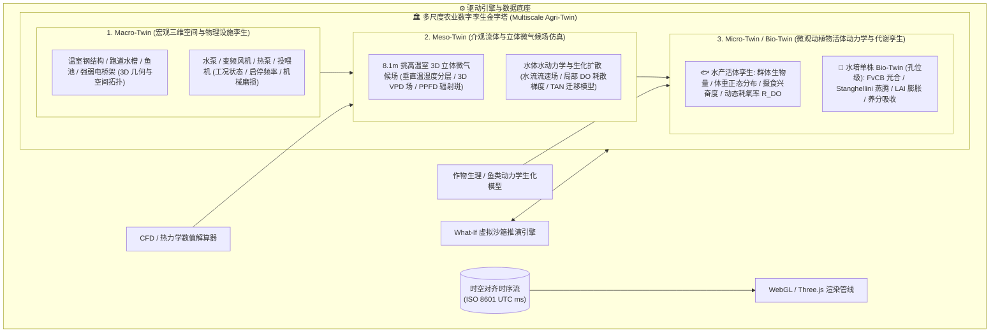
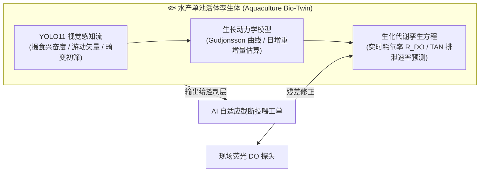
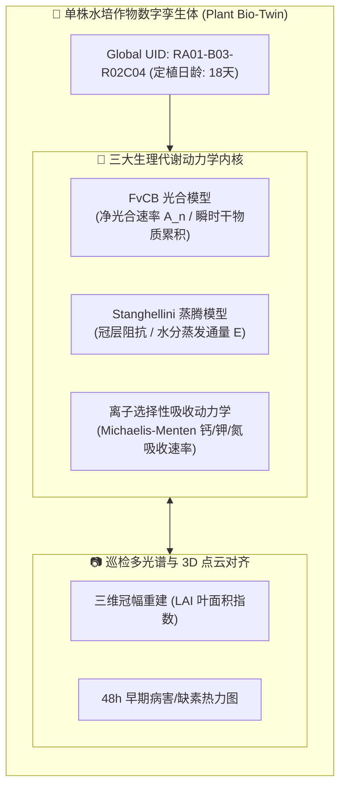
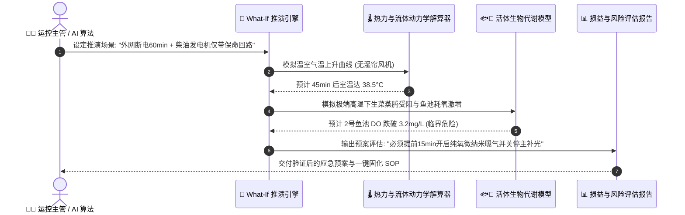

# 连锁数字化农业工厂：06_农业数字孪生与多尺度仿真体系规范 (Agri-Digital Twin & Multiscale Simulation Specification)

> **核心定位**：本规范是数字化农业工厂（鱼菜共生系统）在**物理世界与数字世界双向映射、机理驱动仿真、流体与微气候场反演、动植物活体代谢（Bio-Twin）以及 What-If 虚拟假设推演**的全局技术标准。
> 
> 本规范明确确立：**农业数字孪生绝非单纯供汇报展示的 3D 几何建模（“好看的大屏”），而是以生物机理动力学为内核、以流体热力学为支撑、以物理安全包络为底线的数字计算沙箱与决策仿真中枢。**

---

## 🗺️ 多尺度数字孪生金字塔架构

农业工厂是兼具**宏观物理设备、介观流体环境与微观活体生物**的跨学科复杂巨系统。本规范将数字孪生划分为自上而下的三层模型：



---

## 1. Macro-Twin：宏观三维空间与物理设施孪生

### 1.1 资产编码与空间拓扑严格绑定
所有三维孪生实体必须无条件继承 [05_设施与物联网资产编码规范.md](./05_设施与物联网资产编码规范.md) 中定义的 **L1 ~ L6 六级编码字典**：
* 3D 模型节点命名（Node Name）与材质名必须与资产字典完全一致（如 `GH01-RA01-B03` 代表 1号温室 A跑道 3号浮板）；
* 任何设备（水泵、传感器、风机）的三维世界坐标 $(X, Y, Z)$ 必须在系统初始化时存入元数据表 `asset_spatial_metadata`，作为流场插值与热力图计算的空间锚点。

### 1.2 物理工况与健康度映射
* **实时工况上色**：三维场景中设备网格（Mesh）的材质发光属性（Emissive）根据 PLC 运行状态动态着色：
  * `绿色脉冲 (0x00FF88)`：正常额定运行；
  * `橙色常亮 (0xFF8800)`：告警但处于降级运行（如变频器过热限频）；
  * `红色急闪 (0xFF0033)`：硬故障或触发 PLC 硬件保命硬互锁停机；
  * `灰色透明 (0x666666, Opacity 0.4)`：计划性停机或离线。
* **机械磨损与寿命预测孪生**：基于设备累计运行小时数、启停冲击次数与电机振动频谱，在三维模型上悬浮显示剩余健康度（RUL, Remaining Useful Life）。

---

## 2. Meso-Twin：介观流体与立体微气候场仿真

### 2.1 8.1m 大空间温室 3D 立体微气候场
针对高挑高连栋温室存在的**垂直温湿度分层与热压气流死角**，系统在空间中部署垂直分层测温阵列（0.5m 冠层、3.5m 中层、7.0m 顶层），结合 Navier-Stokes 流体力学偏微分方程做实时空间插值反演：

$$\frac{\partial T}{\partial t} + (\mathbf{u} \cdot \nabla) T = \alpha \nabla^2 T + \frac{S_{thermal}}{\rho c_p}$$

* **3D VPD 空间标量场**：在 Three.js 空间中以体素网格（Voxel Grid, $1\text{m} \times 1\text{m} \times 1\text{m}$）或等值面（Isosurface）形式动态渲染饱和蒸汽压差（VPD）分布。
* **气流死角与结露告警**：当反演计算出局部区域风速 $u < 0.1\,\text{m/s}$ 且相对湿度 $\text{RH} > 92\%$ 时，孪生大屏在对应三维空间中高亮渲染红色“高风险冷凝水结露球”，超前 48 小时预警灰霉病（Botrytis cinerea）潜伏区。

```
+-------------------------------------------------------------+
| 8.1m 顶层: 热空气滞留区 (T=32.5°C, RH=45%) [天窗开启对流]     |
|   ↑ 热浮力羽流 (Thermal Plume)                               |
| 3.5m 中层: 环流风机驱动混合区 (T=26.0°C, RH=68%, VPD=1.05kPa) |
|   ↓ 环流下压气流                                             |
| 0.5m 冠层: 生菜活跃蒸腾微环境 (T=22.5°C, RH=78%, VPD=0.85kPa) |
+-------------------------------------------------------------+
```

### 2.2 水体水动力学与溶氧扩散场
* **水力停留时间与混合动力学**：基于 [01_调节池水力计算与加药自治规范.md](../04_subsystems/02_hydroponics/01_调节池水力计算与加药自治规范.md) 的物料守恒推导，在调理池与跑道水槽建立一维/二维平流扩散模型：

$$\frac{\partial C_{DO}}{\partial t} = -u \frac{\partial C_{DO}}{\partial x} + D_x \frac{\partial^2 C_{DO}}{\partial x^2} - R_{root} + K_L a (C^* - C_{DO})$$

* **盲区消杀**：孪生引擎实时计算水槽盲端低氧区（Dead Zone），当预测局部 $\text{DO} < 4.5\,\text{mg/L}$ 时，自动驱动三维界面聚焦高亮并向控制引擎请求开启对应区域射流。

---

## 3. Micro-Twin / Bio-Twin：活体生物动力学与代谢孪生

### 3.1 🐟 水产活体群体孪生 (Aquaculture Bio-Twin)
水产孪生体以“养殖池 (`TK01~TK04`)”为单元，集成实时视觉与生化动力学：



* **群体动态耗氧率方程**：

$$R_{DO}(t) = \alpha \cdot W_{total}^{0.8} \cdot \exp\left(\beta (T_{water} - 20)\right) + \gamma \cdot \text{FeedingRate}(t)$$

* **数字生物量看板**：数字孪生界面实时呈现该池鱼群体重正态分布图（如 1号池加州鲈平均 $485\text{g} \pm 32\text{g}$），无需人工捞鱼称重。

---

### 3.2 🌱 水培单株活体生物孪生 (Hydroponics Single-Plant Bio-Twin)
依托“跑道-浮板-孔位”绝对编码，为全厂每棵生菜建立具有全局唯一标识（Global UID, 如 `RA01-B03-R02C04`）的数字孪生卡片：



* **生理指标实时反演**：
  * **瞬时蒸腾通量 $E$**：结合实时叶温与冠层 VPD 计算，用于指导根区溶氧补给；
  * **成熟度与鲜重在线预估**：

$$\text{FreshWeight}(t) = \text{FreshWeight}(t_0) + \int_{t_0}^t \left( \eta \cdot A_n(t) \cdot \text{LAI}(t) - R_{maint}(t) \right) dt$$

* **单孔靶向指令生成**：当单株孪生体检测到边缘微斑（叶焦边潜伏期）时，孪生系统将坐标直发 AMR 协作臂，执行单株标记剔除或微量生物制剂点喷。

---

## 4. 🔀 What-If 虚拟假设推演引擎 (What-If Simulation Sandbox)

What-If 引擎允许运控团队在数字空间“**快进未来**”，在零物理风险前提下评估复杂策略与极限突发工况：



### 4.1 典型 What-If 推演场景矩阵

| 场景代码 | 场景名称 | 模拟扰动条件 | 预测输出与决策反哺 |
| :--- | :--- | :--- | :--- |
| **WI-01** | **极寒寒潮袭击** | 室外气温骤降 $15^\circ\text{C}$，伴随大雪光照衰减 $80\%$ | 仿真双层内保温幕闭合时机与热泵功率阶梯，输出最低能耗保苗供暖曲线 |
| **WI-02** | **TOU 峰谷套利预演** | 白天电价尖峰期关停热泵 2 小时，深夜谷电期深冷/过蓄热 | 验证蔬菜根区水温波动是否突破 $\pm 2^\circ\text{C}$ 生物红线，确保节电不伤苗 |
| **WI-03** | **水产急性摄食异常** | 模拟投喂机卡料或水体游离氨突增导致鱼群抢食中断 | 评估氨氮峰值扩散至种植区的时间延迟（35min），提前向调理池下发补酸配方 |
| **WI-04** | **30天订单定制排产** | 大宗商超追加 5000 盒生菜订单，要求可溶性糖含量提升 $15\%$ | 逆向求解未来 14 天的最佳光配方 (PPFD/红蓝比) 与 EC 浓缩梯度，生成 APS 工单 |

---

## 5. 渲染管道与性能优化规范

为了确保数字孪生大屏在**工控机浏览器、移动平板及大屏中央调度中心**均能以 $\ge 60\,\text{FPS}$ 流畅运行，制定以下硬性工程规范：

1. **几何实例化 (Instancing)**：水培跑道上的数万个定植孔网格与生菜叶片模型，必须采用 Three.js `InstancedMesh` 合并绘制调用（Draw Calls $\le 50$）；
2. **LOD（Level of Detail）多层次细节**：
   * `LOD 0（距离 < 3m）`：高精度生菜网格（含叶脉法线贴图与单孔病害高亮）；
   * `LOD 1（距离 3m ~ 15m）`：低多边形简模（Low-Poly Mesh）；
   * `LOD 2（距离 > 15m）`：热力图点云与纯色标量体素看板。
3. **时序数据流增量驱动**：前端严禁高频全量轮询。统一采用 Cloudflare SSE / WebSocket 管道，仅当下发的数据变化幅度突破死区阈值（Deadband, 如水温变化 $>0.1^\circ\text{C}$、DO 变化 $>0.05\,\text{mg/L}$）时触发三维节点属性局部更新。
4. **时间标准绝对统一**：所有孪生数据帧的时间戳必须严格为 **ISO 8601 UTC 毫秒字符串 (`YYYY-MM-DDTHH:mm:ss.000Z`)**，消除时区与系统时钟不同步误差。

---

## 🔗 关联文档与架构导航

* 设施资产编码标准：👉 [05_设施与物联网资产编码规范.md](./05_设施与物联网资产编码规范.md)
* AI 自主决策与控制分级：👉 [07_AI分层自主决策与闭环控制规范.md](./07_AI分层自主决策与闭环控制规范.md)
* 调理池水力计算推导：👉 [01_调节池水力计算与加药自治规范.md](../04_subsystems/02_hydroponics/01_调节池水力计算与加药自治规范.md)
* 挑高温室立体微气候温控：👉 [02_大空间温室立体微气候感知与温控策略规范.md](../04_subsystems/02_hydroponics/02_大空间温室立体微气候感知与温控策略规范.md)
* 作物蒸腾动力学计算：👉 [01_温室作物蒸腾量估算与感知算法规范.md](../04_subsystems/08_agronomy_knowledge_rnd/01_温室作物蒸腾量估算与感知算法规范.md)
