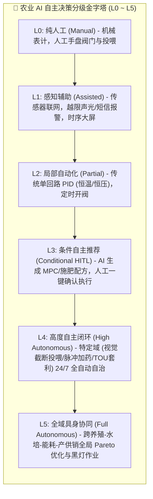
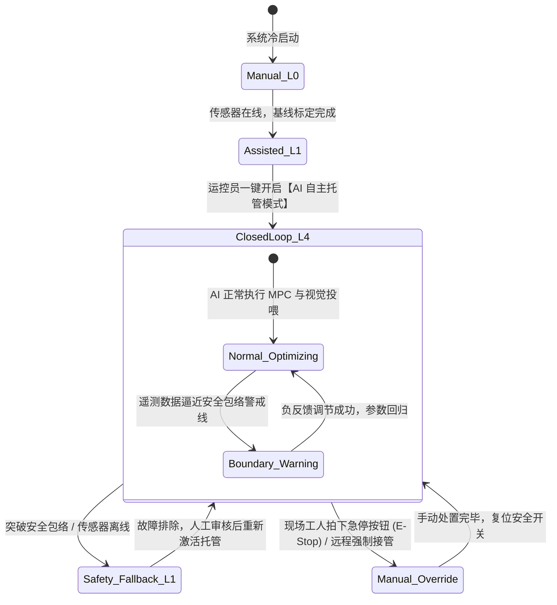

# 连锁数字化农业工厂：07_AI分层自主决策与闭环控制规范 (Agri-AI Autonomous Decision & Closed-Loop Control Specification)

> **核心定位**：本规范确立了数字化农业工厂（鱼菜共生智能系统）在 **AI 自主决策分级标准 (L0~L5)、多时间尺度协同闭环、控制权冲突仲裁矩阵、物理与生物安全包络 (Safety Envelope) 以及人机协同 (Human-in-the-Loop)** 的工程规范。
> 
> 本规范明确确立：**AI 自主决策必须服务于生物安全与综合效益最优；坚决坚守“软硬分层、安全包络兜底、PLC 物理保命硬互锁具有最高仲裁权”的工程底线，绝不因追求形式主义的无人化而让算法穿透底层硬件保命逻辑。**

---

## 🏛️ AI 自主决策分级标准体系 (Agri-Autonomous Levels, L0 ~ L5)

参照工业自动化标准与自动驾驶分级理念，结合农业工厂的生物学特性与热惯性，定义 6 级自主决策标准：



### 1.1 分级权责与技术特征矩阵

| 级别 | 名称 | 感知方式 | 决策主体 | 执行方式 | 典型应用场景 | 人工介入角色 |
| :--- | :--- | :--- | :--- | :--- | :--- | :--- |
| **L0** | **纯人工操作** | 人工肉眼看水色、便携计读数 | 现场老师傅经验 | 手动扳动球阀、人工撒料 | 传统露天鱼塘与老式土棚 | 全流程主导 |
| **L1** | **感知告警辅助** | 在线传感器（DO/氨氮/温湿） | 静态阈值规则引擎 | 现场人工赶往处置 | 超限发送短信/钉钉告警通知 | 接收告警并现场操作 |
| **L2** | **局部规则控制** | 现场变送器信号 | 传统 PLC 梯形图 / 仪表 PID | 继电器动作、电动阀常开常闭 | 单回路恒温水箱、定时定量给料机 | 定期巡检与设定固定值 |
| **L3** | **条件自主推荐 (HITL)** | 多源传感器 + 天气预报 | 云端 AI 算法 / 机理模型 | 人工点击 App/看板确认后下发指令 | MPC 温控建议、Crop Ontology 施肥配方 | **人在回路 (一键审核确认)** |
| **L4** | **特定域高度自主** | 工业视觉 + 边缘高频时序流 | 边缘 AI 模型 + 局部求解器 | 边缘工控机 $\rightarrow$ PLC 寄存器闭环 | **YOLO11 摄食截断投喂、调理池脉冲补酸、TOU 峰谷套利** | **异常接管与日常审计** |
| **L5** | **全域具身协同** | 全域多模态传感 + 具身点云 | 集团云端中枢 + 边缘具身智能 | AMR + 六轴机械臂 + 智能网关协同 | **黑灯自主采收切根、以销定产全流程自动博弈排产** | **仅负责顶层战略与系统维保** |

---

## ⏱️ 多时间尺度分层闭环控制架构

系统按**物理响应速度与生物滞后性**，严密划分为四大时间尺度闭环：

```mermaid
flowchart TB
    subgraph CloudScale["☁️ 集团级云端中枢: 天/月级经营与农艺决策 (1 day ~ 1 month)"]
        APS["APS 智能以销定产引擎 (平衡 30天 ATP 订单与产能)"]
        Ontology["Crop Ontology 数字配方演进 (12座试验舱配方 R&D)"]
    end

    subgraph HourlyScale["⚡ 基地级边缘优化: 小时/分钟级工艺优化 (15 min ~ 1 hour)"]
        MPC["MPC 能耗模型预测控制 (TOU 电价套利 / 温室热力学温控)"]
        Irrigation["水动力循环平衡调度 (跑道回水分配 / 蒸腾补液)"]
    end

    subgraph SecondScale["🏭 现场级实时自治: 秒级边缘视觉与生化闭环 (1 s ~ 10 s)"]
        VisionFeed["YOLO11 摄食活跃度分析 $\rightarrow$ 动态截断投喂"]
        AcidDosing["调理池脉冲加药自治 (物料守恒防振荡)"]
    end

    subgraph MicroScale["🛡️ 底层物理保命: 0.1s 硬件保命硬互锁 ($\le 0.1$ s)"]
        PLC_Lock["汇川 PLC 硬件梯形图 (0.1s 溶氧跌落强启 / 水位防抽空 / 变频过载断开)"]
    end

    CloudScale -->|下发天级优化参数| HourlyScale
    HourlyScale -->|下发设定值 setpoint| SecondScale
    SecondScale -->|下发运行寄存器| MicroScale
    MicroScale -.->|状态与遥测回传 (5s宽表)| SecondScale
    SecondScale -.->|时序汇总推送| HourlyScale
    HourlyScale -.->|冷热数据湖同步| CloudScale
```

### 2.1 各时间尺度控制职责与约束

1. **$\le 0.1\text{s}$ 硬件保命层（汇川 Easy320 PLC）**：
   * **绝对铁律**：独立运行于硬件梯形图中，**完全脱离操作系统、公网与上层 AI 进程**；
   * 负责溶氧跌落强启纯氧曝气机、液位跌破下限毫秒级切断变频水泵（防气蚀烧毁）、热过载保护硬互锁。
2. **$1\text{s} \sim 10\text{s}$ 边缘自治层（智能工控机）**：
   * 部署本地轻量化 YOLO11 推理引擎与 PID 脉冲加药逻辑；
   * 每秒采集水面扰动像素，当鱼群抢食兴奋度下降至设定阈值时，直接向 PLC 发送停机信号（截断投喂），防止残饵败水。
3. **$15\text{min} \sim 1\text{h}$ 过程工艺优化层（MPC 求解器）**：
   * 接入电力市场分时电价表（TOU）与未来 24 小时气象预报；
   * 基于温室热力学模型向前滚动求解，在谷电期利用地源热泵蓄冷/蓄热，在峰电期平稳滑行。
4. **$1\text{day} \sim 1\text{month}$ 集团战略协同层（Cloudflare Serverless + D1）**：
   * 汇集各基地生长模型（SUCROS）、销售大宗订单（OMS）与试验舱研发数据，生成跨基地月度排产与选品工单。

---

## 🛡️ 控制权冲突仲裁矩阵与安全包络 (Safety Envelope)

当不同层级下发的控制指令发生冲突时，系统必须遵循严格的**优先级仲裁矩阵 (Arbitration Matrix)**：

```
                    【控制权仲裁优先级】
                    
  [P0: 极高] 🚨 PLC 0.1s 硬件保命硬互锁 (不可跨越、硬件强制接管)
      ↓ 允许执行
  [P1: 高]   🛡️ 本地物理与生物安全包络 (Safety Envelope 越限拦截)
      ↓ 允许执行
  [P2: 中]   ⚡ 现场边缘 MPC / 视觉闭环控制指令
      ↓ 允许执行
  [P3: 低]   ☁️ 云端推荐与远程调度工单
```

### 3.1 生物与物理安全包络定义 (Safety Envelope Limits)

任何算法（无论 L3、L4 或 L5）生成的控制指令，在写入 PLC 寄存器前必须经过边缘网关的 **安全包络校验器 (Safety Validator)**：

| 监测对象 | 核心参数 | 正常自主运行区间 | 安全包络硬边界 (Safety Limits) | 越界处置与仲裁动作 |
| :--- | :--- | :--- | :--- | :--- |
| **水产养殖池** | 溶解氧 (DO) | $5.5 \sim 8.0\,\text{mg/L}$ | $\text{DO} < 4.0\,\text{mg/L}$ | **P0 接管**：PLC 硬联锁强开主/备气泵，切断投喂，向全员广播最高级报警 |
| **水产养殖池** | 总氨氮 (TAN) | $0.2 \sim 1.5\,\text{mg/L}$ | $\text{TAN} > 2.5\,\text{mg/L}$ 或 $\text{NH}_3 > 0.05\,\text{mg/L}$ | **P1 接管**：停止喂食，开启旁路微孔纯氧曝气，启动调理池换水稀释 |
| **水培调节池** | 水体 pH 值 | $6.2 \sim 6.8$ | $\text{pH} < 5.5$ 或 $\text{pH} > 7.5$ | **P1 接管**：锁定酸液/碱液计量泵，禁止 AI 加药，提示电极漂移校准 |
| **温室微气候** | 气温 / VPD | $18\sim 26^\circ\text{C}$ / $0.8\sim 1.2\,\text{kPa}$ | $T > 35^\circ\text{C}$ 或 $\text{VPD} > 2.0\,\text{kPa}$ | **P1 接管**：强开湿帘与外遮阳帘，开启高压微雾降温，抑制叶焦病 |
| **主循环泵** | 进水管液位 | 高于泵体吸入口 $0.5\text{m}$ | 液位低于防抽空浮球下限 | **P0 接管**：PLC 硬件干簧管断电跳闸，杜绝变频泵干磨烧毁 |

---

## 🔄 自主控制状态机与人机协同 (HITL State Machine)

系统自主控制引擎在运行过程中维护严格的有限状态机（Finite State Machine, FSM）：



### 4.1 人工紧急接管机制 (Emergency Takeover)
1. **硬件级急停 (Hard E-Stop)**：现场控制柜配备双回路机械蘑菇头急停按钮，按下直接切断 PLC 输出继电器供电，瞬间回到安全常闭状态；
2. **软件级一键接管 (Soft Takeover)**：监控大屏与手机 App 顶部常驻 **“🔴 紧急接管 / 暂停 AI 自主”** 红色按钮，点击后 50ms 内向边缘网关下发握手指令，将所有回路切换为手动点动模式；
3. **可解释 AI (XAI) 决策审计日志**：
   * 每一条由 AI 发起的自主调控指令必须以结构化 JSON 格式写入 D1 审计日志表 `autonomous_audit_logs`；
   * 必须记录：`timestamp` (ISO 8601 UTC ms)、`algorithm_id`、`trigger_features` (当前温湿度/DO)、`decision_rationale` (决策理由，如“预测电价即将进入尖峰期，提前蓄热”)、`execution_result` (PLC 回执状态)。

---

## 🔗 关联文档与架构导航

* 农业数字孪生与仿真规范：👉 [06_农业数字孪生与多尺度仿真体系规范.md](./06_农业数字孪生与多尺度仿真体系规范.md)
* 系统宏观拓扑设计：👉 [01_系统宏观架构设计.md](./01_系统宏观架构设计.md)
* 统一接口与数据契约：👉 [03_接口与数据契约规范.md](./03_接口与数据契约规范.md)
* 调理池加药自治规范：👉 [01_调节池水力计算与加药自治规范.md](../04_subsystems/02_hydroponics/01_调节池水力计算与加药自治规范.md)
* 能耗优化与 MPC 控制：👉 [03_energy_optimization/README.md](../04_subsystems/03_energy_optimization/README.md)
