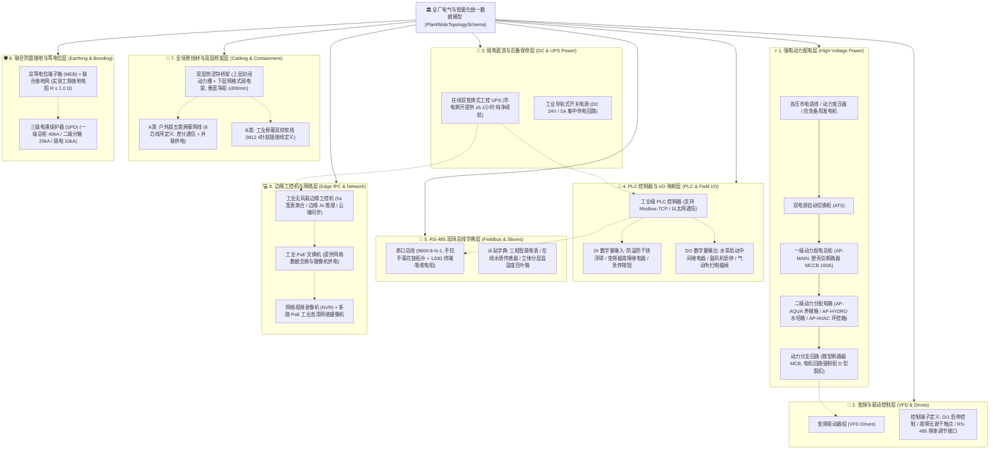
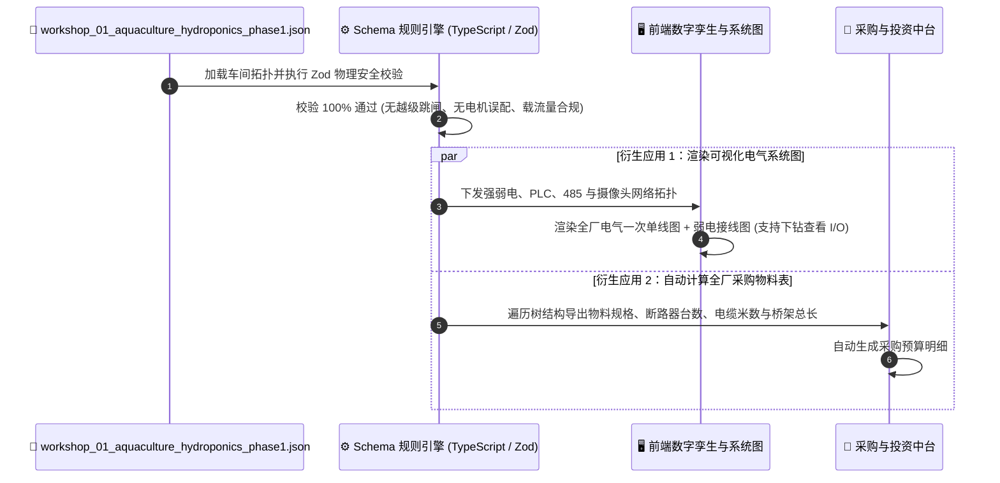

# 连锁数字化农业工厂：08_全要素电气与智能化拓扑数据契约规范 (Full-Stack Electrical & IIoT Unified Topology Schema)

> **核心定位**：本规范是数字化农业工厂在 **380V/220V 强电动力配电、24V 弱电直流供电与 UPS 保命、工业 PLC 控制器与 I/O 映射、RS-485 现场总线站号字典、工业边缘工控机与 PoE 网络、全场景线材接线工艺及联合防雷接地** 领域的全要素、厂商中立 (Vendor-Neutral)、机器可读统一数据契约标准。
> 
> 本规范明确确立：**“电气与智能化即代码 (Full-Stack Infrastructure-as-Code, IaC)”原则，以及“标准规范 (Schema) 保持厂商中立与物理抽象，具体品牌和选型归入车间落地实例 (Instance Data)”的工程治理架构。**
> 
> * **规范层 (Schema)**：本文档定义纯粹的物理属性、字段标准、TypeScript 类型、Zod 规则引擎与电气安全物理断言；
> * **实例数据层 (Instance Data)**：各个具体车间/基地的真实品牌选型与全要素电气拓扑数据，统一以标准 JSON 格式存放于 [`topologies/`](./topologies/) 资产目录中。

---

## 1. 全要素统一拓扑架构蓝图 (Unified Topology Architecture)

全厂电气与智能化系统在数据模型上被划分为 **八大紧密协同的实体子体系**（纯物理功能抽象，不绑定特定厂商）：



---

## 2. 全要素国际/国家标准与 JSON 字段映射字典 (厂商中立)

| 物理系统分类 | 实体对象 | 规范 JSON 字段名 | 类型定义 | 核心工程参数与物理意义 |
| :--- | :--- | :--- | :--- | :--- |
| **强电动力** | 主进线柜 | `incomer` | `IncomerPanel` | 塑壳总断路器 (MCCB)、三相智能电表、开口电流互感器 |
| **强电动力** | 二级动力箱 | `sub_panels` | `Array<SubPanel>`| 养殖动力箱、水培动力箱、温室环控动力箱 |
| **强电动力** | 分支回路 | `circuits` | `Array<Circuit>` | 独立 D 型微断、电力电缆截面、动力设备额定功率与电流 |
| **变频驱动** | 变频控制器 | `vfd_drive` | `VfdDriveSpec` | 驱动器额定容量、DI 启停控制端子、故障报警无源干触点 |
| **弱电直流** | 集中电源/UPS | `dc_and_ups_system`| `DcAndUpsSystem` | 在线式工控 UPS、直流开关电源、直流供电回路压降校验 |
| **PLC 控制** | PLC 主控与I/O| `plc_controller` / `plc_controllers` | `PlcController` / `Array<PlcController>` | 控制器唯一ID、角色(RAS/温室/水肥)、IP、DI 浮球/急停点位、DO 继电器点位 |
| **PLC 扩展** | 扩展卡槽与子站 | `expansion_modules` | `Array<PlcExpansionModule>` | 槽位号 (Slot 1~16)、订货型号 (如 GL10-1600END)、本地卡槽/远程以太网子站 |
| **PLC 联动** | 跨机通信与互锁 | `inter_plc_links` | `Array<InterPlcLink>` | 跨 PLC 间 Modbus-TCP / Profinet 联动条件、目标响应动作、安全互锁等级 |
| **现场总线** | RS-485 字典 | `rs485_fieldbus` | `Rs485Fieldbus` | 串口参数 (9600-8-N-1)、从站地址表、终端匹配电阻配置 |
| **边缘网络** | 工控机与监控 | `edge_and_network` | `EdgeAndNetwork` | 边缘工控机、PoE 工业交换机、网络摄像机固定 IP 映射 |
| **线材桥架** | 线缆与走线架 | `cabling_system` | `CablingSystem` | 8芯网线并联线序、4芯屏蔽线接线定义、双层桥架垂直间距 |
| **防雷接地** | 接地与等电位 | `earthing_system` | `EarthingSystem` | 联合接地电阻实测值 ($\le 1.0\,\Omega$)、总等电位 MEB 箱、三级 SPD |

---

## 3. 生产级 TypeScript + Zod Schema 规则引擎源码 (厂商中立)

在系统中创建 `full_stack_electrical_schema.ts`，作为全厂电气与智能化统一数据契约：

```typescript
import { z } from "zod";

// ============================================================================
// 1. 基础电气枚举与通用标量验证
// ============================================================================

/** 严格 ISO 8601 UTC 毫秒时间戳正则 */
export const IsoUtcDateTimeSchema = z.string().regex(
  /^\d{4}-\d{2}-\d{2}T\d{2}:\d{2}:\d{2}\.\d{3}Z$/,
  "时间戳必须为严格 ISO 8601 UTC 毫秒格式 (例如: 2026-08-23T11:30:00.000Z)"
);

export const Ipv4AddressSchema = z.string().regex(
  /^192\.168\.\d{1,3}\.\d{1,3}$/,
  "IP 地址必须为工业局域网 IPv4 格式 (例如: 192.168.1.10)"
);

export const VoltageSystemEnum = z.enum(["TN-S 380V/220V 50Hz", "TN-C-S 380V/220V 50Hz", "TT 380V/220V 50Hz"]);
export const PoleCountEnum = z.enum(["1P", "2P", "3P", "4P", "3P+N"]);
export const TripCurveEnum = z.enum(["B", "C", "D"]);
export const CableTypeEnum = z.enum(["YJV", "VV", "RVV", "RVSP", "Cat5e_STP", "BVR"]);

export const LoadTypeEnum = z.enum([
  "pump_motor",        // 循环水泵 (重载动力电机，强制配 D 型微断)
  "blower_motor",      // 鼓风机 (重载动力电机，强制配 D 型微断)
  "screen_filter",     // 机械微滤机减速电机
  "hvac_fan",          // 高空环流风机
  "actuator_motor",    // 电动开窗机/卷膜/遮阳电机
  "dosing_pump",       // 脉冲计量加药泵
  "ups_it_load",       // 弱电中台 / 工控机 / PLC
  "facility_lighting"  // 厂房照明与检修用电
]);

// ============================================================================
// 2. 强电断路器、电缆与变频器 Schema (厂商中立)
// ============================================================================

export const CircuitBreakerSchema = z.object({
  brand: z.string().optional(), // 品牌为可选实例属性，规范不设硬编码默认值
  model: z.string(),           // 断路器型号代号
  poles: PoleCountEnum,
  rated_current_a: z.number().positive("额定电流必须大于 0A"),
  trip_curve: TripCurveEnum,
  breaking_capacity_ka: z.number().positive("短路分断能力必须大于 0kA"),
  magnetic_trip_instant_a: z.number().positive().optional(),
  status: z.enum(["OPEN", "CLOSED", "TRIPPED"]).default("CLOSED"),
});

export const CableSchema = z.object({
  cable_type: CableTypeEnum,
  spec: z.string(), // 如 "4x16 + 1x10", "RVSP 4x0.75"
  conductors: z.object({
    live_conductors_count: z.number().int().min(1).max(8),
    live_cross_section_mm2: z.number().positive(),
    has_neutral: z.boolean(),
    neutral_cross_section_mm2: z.number().nonnegative().optional(),
    pe_cross_section_mm2: z.number().nonnegative(),
  }),
  installation_method: z.enum(["CT", "SC25", "SC32", "SC50", "FC"]).default("CT"),
  length_m: z.number().positive("敷设长度必须大于 0米"),
  allowable_ampacity_a: z.number().positive("允许持续载流量必须大于 0A"),
  calculated_voltage_drop_pct: z.number().nonnegative().max(5.0, "末端计算电压降严禁超过 5.0%"),
});

export const VfdDriveSchema = z.object({
  brand: z.string().optional(),
  model: z.string(),
  rated_power_kw: z.number().positive(),
  control_terminals: z.object({
    start_stop_di: z.string(),   // 启停输入端子
    fault_relay: z.string(),     // 故障继电器输出端子
    analog_freq_input: z.string().optional(),
  }),
});

// ============================================================================
// 3. 动力分支回路 Schema (含电气安全物理断言)
// ============================================================================

export const CircuitSchema = z.object({
  circuit_id: z.string(),
  name: z.string(),
  breaker: CircuitBreakerSchema,
  cable: CableSchema,
  load: z.object({
    device_id: z.string(),
    name: z.string(),
    type: LoadTypeEnum,
    rated_power_kw: z.number().positive(),
    rated_voltage_v: z.union([z.literal(380), z.literal(220)]),
    rated_current_a: z.number().positive(),
    is_vfd_driven: z.boolean().default(false),
    vfd_config: VfdDriveSchema.optional(),
    duty_cycle_hours_per_day: z.number().min(0).max(24).default(24),
  }),
  telemetry: z.object({
    timestamp: IsoUtcDateTimeSchema,
    current_a: z.number().nonnegative(),
    power_kw: z.number().nonnegative(),
    status: z.enum(["RUNNING", "STANDBY", "WARNING", "OVERLOAD", "OFFLINE"]),
  }).optional(),
}).superRefine((val, ctx) => {
  // ⚡ 电气安全规则 1：动力电机类负载必须选配 D 型脱扣断路器 (防启动冲击误跳闸)
  if (["pump_motor", "blower_motor"].includes(val.load.type) && val.breaker.trip_curve !== "D") {
    ctx.addIssue({
      code: z.ZodIssueCode.custom,
      path: ["breaker", "trip_curve"],
      message: `【电气安全违规】负载 '${val.load.name}' 属于重载动力电机，断路器必须采用 D 型脱扣特性 (D-Curve)，当前为 '${val.breaker.trip_curve}' 型！`,
    });
  }
  // ⚡ 电气安全规则 2：电缆持续载流量严禁小于断路器额定电流 (防电缆过热自燃)
  if (val.cable.allowable_ampacity_a < val.breaker.rated_current_a) {
    ctx.addIssue({
      code: z.ZodIssueCode.custom,
      path: ["cable", "allowable_ampacity_a"],
      message: `【电缆过载隐患】电缆载流量 (${val.cable.allowable_ampacity_a}A) 小于断路器额定电流 (${val.breaker.rated_current_a}A)！`,
    });
  }
});

// ============================================================================
// 4. 弱电直流、UPS 与集中供电 Schema
// ============================================================================

export const DcAndUpsSystemSchema = z.object({
  ups_unit: z.object({
    brand: z.string().optional(),
    model: z.string(),
    capacity_kva: z.number().positive(),
    battery_spec: z.string(),
    backup_hours_at_full_load: z.number().positive(),
  }),
  dc_power_supply: z.object({
    brand: z.string().optional(),
    model: z.string(),
    output_voltage_v: z.literal(24),
    output_current_a: z.number().positive(),
    max_measured_line_drop_v: z.number().max(2.4, "DC 24V 末端压降严禁超过 10% (即最低工作电压 ≥ 21.6V)"),
  }),
});

// ============================================================================
// 5. PLC 控制器、扩展模块与跨机联动 (DCS 分布式控制架构)
// ============================================================================

export const DigitalInputPointSchema = z.object({
  point_id: z.string(),      // 如 "X00", "X01"
  signal_name: z.string(),   // 逻辑点位名
  description: z.string(),   // 功能描述
  contact_type: z.enum(["NO", "NC"]),
  wire_id: z.string(),
});

export const DigitalOutputPointSchema = z.object({
  point_id: z.string(),      // 如 "Y01", "Y02"
  signal_name: z.string(),
  description: z.string(),
  wire_id: z.string(),
});

/** PLC 扩展模块类型枚举 */
export const PlcModuleTypeEnum = z.enum([
  "LOCAL_DI",         // 本地数字量输入扩展 (如 16DI)
  "LOCAL_DO",         // 本地数字量输出扩展 (如 16DO / 继电器)
  "LOCAL_AI",         // 本地模拟量电压电流输入
  "LOCAL_AO",         // 本地模拟量输出 (0-10V / 4-20mA)
  "LOCAL_TEMP",       // 本地 PT100 / 热电偶高精度温度模块
  "REMOTE_IO_STATION" // 远程分布式以太网/485子站 (Remote I/O)
]);

/** 单个 PLC 扩展模块 Schema */
export const PlcExpansionModuleSchema = z.object({
  module_id: z.string(),                                  // 扩展模块ID (如 "EXP-SLOT-01" / "RIO-FISH-02")
  slot_number: z.number().int().min(1).optional(),        // 导轨槽位号 (1 ~ 16)
  module_model: z.string(),                               // 采购订货型号 (如 "GL10-1600END")
  module_type: PlcModuleTypeEnum.default("LOCAL_DI"),
  is_remote: z.boolean().default(false),                  // 是否为远程分布式子站
  location: z.string().optional(),                        // 物理安装位置
  digital_inputs: z.array(DigitalInputPointSchema).default([]),
  digital_outputs: z.array(DigitalOutputPointSchema).default([]),
});

/** PLC 控制器与 I/O 映射 Schema (支持单机与多机集群) */
export const PlcIoMappingSchema = z.object({
  controller_id: z.string().default("PLC-MAIN-01"),       // 控制器唯一标识
  controller_role: z.string().default("主控中央PLC"),     // 角色 (鱼池主控 / 温室环境 / 水肥加药)
  controller_brand: z.string().optional(),
  controller_model: z.string(),
  ip_address: Ipv4AddressSchema,
  port: z.number().default(502),
  protocol: z.literal("Modbus-TCP"),
  // CPU 本体自带 I/O
  digital_inputs: z.array(DigitalInputPointSchema),
  digital_outputs: z.array(DigitalOutputPointSchema),
  // ⭐️ 级联扩展模块与远程子站列表
  expansion_modules: z.array(PlcExpansionModuleSchema).default([]),
});

/** 跨 PLC 间工业以太网/硬线联动链路 Schema */
export const InterPlcLinkSchema = z.object({
  link_id: z.string(),                                    // 联动链路ID (如 "LINK-RAS-CLIMATE-01")
  from_plc_id: z.string(),                                // 发起方 PLC ID
  to_plc_id: z.string(),                                  // 接收方 PLC ID
  protocol: z.enum(["Modbus-TCP", "Profinet", "S7", "EtherNet/IP", "Hardwired_DryContact"]).default("Modbus-TCP"),
  sync_cycle_ms: z.number().positive().default(100),      // 同步周期 (ms)
  trigger_condition: z.string(),                          // 触发联动条件 (如 "鱼池超高水位 / DO急剧下降")
  target_action: z.string(),                              // 联动响应动作 (如 "调理池紧急停机补水 / 开启制氧机加压")
  safety_interlock_level: z.enum(["L1_CRITICAL", "L2_PROCESS", "L3_INFO"]).default("L1_CRITICAL"),
});

// ============================================================================
// 6. RS-485 现场总线与从站字典 Schema
// ============================================================================

export const Rs485SlaveDeviceSchema = z.object({
  slave_address_hex: z.string(), // 如 "0x01", "0x02"
  device_name: z.string(),
  model: z.string().optional(),
  baud_rate: z.literal(9600),
  data_bits: z.literal(8),
  stop_bits: z.literal(1),
  parity: z.literal("None"),
  polling_interval_ms: z.number().positive(),
});

export const Rs485FieldbusSchema = z.object({
  bus_id: z.string(),
  topology_type: z.literal("Daisy-Chain-Hand-In-Hand"),
  has_120_ohm_terminator_at_end: z.literal(true),
  slaves: z.array(Rs485SlaveDeviceSchema).min(1),
});

// ============================================================================
// 7. 边缘工控机与安防视频网络 Schema
// ============================================================================

export const EdgeAndNetworkSchema = z.object({
  edge_ipc: z.object({
    model: z.string(),
    ip_address: Ipv4AddressSchema,
    os: z.string(),
    services_running: z.array(z.string()),
  }),
  poe_switch: z.object({
    model: z.string(),
    total_power_budget_w: z.number().positive(),
  }),
  nvr_recorder: z.object({
    model: z.string(),
    ip_address: Ipv4AddressSchema,
    storage_capacity_tb: z.number().positive(),
  }),
  ip_cameras: z.array(z.object({
    camera_id: z.string(),
    ip_address: Ipv4AddressSchema,
    location_and_target: z.string(),
    poe_powered: z.literal(true),
  })),
});

// ============================================================================
// 8. 全场景线材标准与双层桥架 Schema
// ============================================================================

export const CablingSystemSchema = z.object({
  cat5e_stp_pinout: z.object({
    pair1_blue_white_blue: z.string(),
    pair2_3_orange_green_parallel: z.string(),
    pair4_brown_white_brown: z.string(),
    shield_pe: z.string(),
  }),
  rvsp_m12_pinout: z.object({
    pin1_brown: z.string(),
    pin2_white: z.string(),
    pin3_blue: z.string(),
    pin4_black: z.string(),
  }),
  containment_trays: z.object({
    tray_material: z.string(),
    upper_power_tray_spec: z.string(),
    lower_data_tray_spec: z.string(),
    vertical_clearance_mm: z.number().min(300, "强弱电双层桥架垂直净间距必须 ≥ 300mm"),
  }),
});

// ============================================================================
// 9. 联合防雷接地与等电位联结 Schema
// ============================================================================

export const EarthingSystemSchema = z.object({
  measured_earthing_resistance_ohm: z.number().max(1.0, "联合接地网工频接地电阻实测严禁超过 1.0 Ω"),
  meb_box_location: z.string(),
  spd_levels: z.object({
    level1_main_panel: z.string(),
    level2_sub_panels: z.string(),
    level3_control_cabinet: z.string(),
  }),
});

// ============================================================================
// 10. 全厂电气与智能化统一数据模型根契约 (Root Schema)
// ============================================================================

export const PlantWideTopologySchema = z.object({
  schema_version: z.literal("2.0.0"),
  system_id: z.string(),
  facility_name: z.string(),
  workshop_code: z.string(),
  voltage_system: VoltageSystemEnum,
  updated_at: IsoUtcDateTimeSchema,
  
  // 八大实体子系统
  power_distribution: z.object({
    transformer_capacity_kva: z.number().positive(),
    main_incomer: z.object({
      panel_id: z.literal("AP-MAIN"),
      name: z.string(),
      physical_location: z.string(),
      main_breaker: CircuitBreakerSchema,
      metering: z.object({
        meter_model: z.string(),
        ct_ratio: z.string(),
        ct_spec: z.string().optional(),
      }),
      spd_surge_protection: z.object({
        nominal_discharge_current_ka: z.number().positive(),
        test_class: z.enum(["T1", "T2"]),
      }),
    }),
    sub_panels: z.array(z.object({
      panel_id: z.string(),
      name: z.string(),
      ip_rating: z.enum(["IP54", "IP65", "IP66"]),
      physical_location: z.string(),
      incoming_switch: CircuitBreakerSchema,
      feeder_cable: CableSchema,
      circuits: z.array(CircuitSchema).min(1),
    })),
  }),
  
  dc_and_ups_system: DcAndUpsSystemSchema,
  plc_controller: PlcIoMappingSchema.optional(),                        // 单机主控中央 PLC (兼容既有)
  plc_controllers: z.array(PlcIoMappingSchema).default([]),             // ⭐️ 多 PLC 集群架构
  inter_plc_links: z.array(InterPlcLinkSchema).default([]),             // ⭐️ 跨 PLC 工业以太网通信与联动链路
  rs485_fieldbus: Rs485FieldbusSchema,
  edge_and_network: EdgeAndNetworkSchema,
  cabling_system: CablingSystemSchema,
  earthing_system: EarthingSystemSchema,
});

export type PlantWideTopology = z.infer<typeof PlantWideTopologySchema>;
export type PlcController = z.infer<typeof PlcIoMappingSchema>;
export type PlcExpansionModule = z.infer<typeof PlcExpansionModuleSchema>;
export type InterPlcLink = z.infer<typeof InterPlcLinkSchema>;
```

---

## 4. 车间多实例数据资产管理规范 (Workshop Instances Management)

为支撑集团多车间、多基地的标准化复制，具体的设备品牌与实际物理参数统一存放于 [`topologies/`](./topologies/) 目录下：

```text
docs/03_system_architecture/topologies/
├── workshop_01_aquaculture_hydroponics_phase1.json  # 🐟🌱 01号车间: 一期鱼菜共生综合车间 (全量落地数据)
├── workshop_02_fish_hatchery_template.json          # 🐣 02号车间: 鱼苗孵化车间 (规划模板)
└── workshop_03_cold_chain_processing_template.json  # ❄️ 03号车间: 净菜冷链加工车间 (规划模板)
```

👉 **查看第一期 01 号车间完整落地数据**：请直接查阅 [workshop_01_aquaculture_hydroponics_phase1.json](./topologies/workshop_01_aquaculture_hydroponics_phase1.json)。

---

## 5. 衍生应用：自动生成采购 BOM 与数字孪生看板



---

## 🔗 相关设计与系统架构规范

* **01号车间全要素标准 JSON 实例数据**：👉 [workshop_01_aquaculture_hydroponics_phase1.json](./topologies/workshop_01_aquaculture_hydroponics_phase1.json)
* **全厂强电动力配电与电气工程规划规范**：👉 [06_全厂强电动力配电与电气工程规划规范.md](../02_requirements_and_plans/06_全厂强电动力配电与电气工程规划规范.md)
* **现场弱电智能化与工控网络规划施工规范**：👉 [05_现场弱电线缆选型与布线施工规范.md](../02_requirements_and_plans/05_现场弱电线缆选型与布线施工规范.md)
* **第一期数据采集与自动控制硬件采购 BOM 与工程施工清单**：👉 [04_第一期数据采集与自动控制硬件采购BOM与工程施工清单.md](../02_requirements_and_plans/04_第一期数据采集与自动控制硬件采购BOM与工程施工清单.md)
* **接口与数据契约规范 (严格 ISO 8601 UTC)**：👉 [03_接口与数据契约规范.md](./03_接口与数据契约规范.md)
* **农业数字孪生与多尺度仿真体系规范**：👉 [06_农业数字孪生与多尺度仿真体系规范.md](./06_农业数字孪生与多尺度仿真体系规范.md)
* **能耗优化子系统总体设计 (MPC 峰谷套利)**：👉 [03_energy_optimization/README.md](../04_subsystems/03_energy_optimization/README.md)
