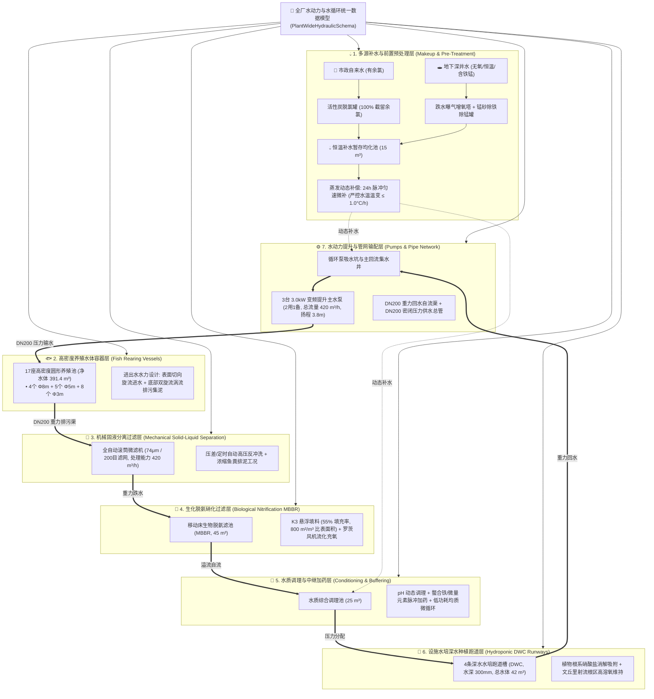
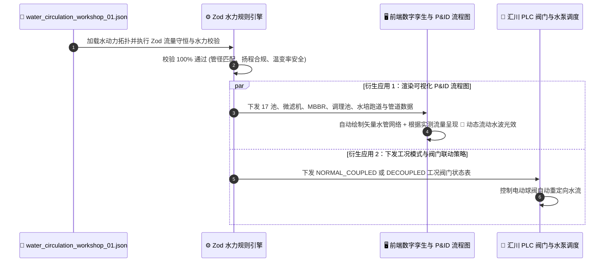

# 连锁数字化农业工厂：09_全厂水动力拓扑与水循环数据契约规范 (Full-Stack Hydraulic & Water Circulation Unified Topology Schema)

> **核心定位**：本规范是数字化农业工厂在 **多源补水与前置脱毒预处理（自来水脱氯/井水曝气除铁降温）、高密度养殖池水力模型、机械固液分离微滤、MBBR 生化脱氨硝化、水质中继调理脉冲加药、设施水培 DWC 深水跑道槽及变频水动力管网输配** 领域的全要素、厂商中立 (Vendor-Neutral)、机器可读统一数据契约标准。
> 
> 本规范确立：**“水力与水质动力学即代码 (Hydraulic-and-WaterQuality-as-Code, HWaC)”原则，以及“标准规范 (Schema) 保持物理抽象与规则校验，具体车间管网参数归入落地实例 (Instance Data)”的工程治理架构。**
> 
> * **规范层 (Schema)**：本文档定义纯粹的水力学与生物水质物理属性、TypeScript 强类型、Zod 规则引擎与流量守恒物理断言；
> * **实例数据层 (Instance Data)**：各个具体车间/基地的真实水力管网拓扑与几何水体数据，统一存放于 [`topologies/`](./topologies/) 资产目录中。

---

## 1. 全厂水循环系统七大实体层架构蓝图 (Hydraulic Architecture)



---

## 2. 水系统国际/国家标准与 JSON 字段映射字典 (厂商中立)

本规范对齐《室外给水设计标准》(GB 50013)、《室外排水设计标准》(GB 50014) 及联合国粮农组织 (FAO) 循环水养殖与水培技术标准：

| 物理功能分类 | 实体对象 | 规范 JSON 字段名 | 类型定义 | 核心物理参数与工程意义 |
| :--- | :--- | :--- | :--- | :--- |
| **多源补水** | 补水水源 | `sources_available` | `Array<WaterSource>`| 自来水/深井水/雨水、余氯、溶解氧、铁锰含量、前置脱毒预处理 |
| **补水缓冲** | 补水蓄水池 | `makeup_buffer_tank` | `Object` | 补水暂存容积 ($15\,\text{m}^3$)、超声波液位连续感知、水温预均化 |
| **补水控制** | 蒸发补偿策略 | `evaporation_makeup_rules`| `Object` | 日蒸发量预估、24小时匀速微脉冲注水、**水温温变率 $\le 1.0^\circ\text{C/h}$** |
| **养殖容器** | 鱼池水体组 | `vessels_and_units` | `Array<Vessel>` | 鱼池几何尺寸（直径/水深/容积）、切向旋流进水喷嘴、中心沉降排污孔 |
| **机械固液** | 滚筒微滤机 | `mechanical_filter` | `Object` | 74μm (200目) 滤网、最大过流能力 ($420\,\text{m}^3/\text{h}$)、压差/定时自动反冲洗 |
| **生化脱氨** | MBBR 滤池 | `biofilter_mbbr` | `Object` | 有效生化容积 ($45\,\text{m}^3$)、K3 填料填充率 ($55\%$)、日硝化去氨负荷 |
| **水质调理** | 调理中继池 | `conditioning_tank` | `Object` | 容积 ($25\,\text{m}^3$)、pH/EC 脉冲加药接口、均质微循环搅拌 |
| **水培种植** | DWC 跑道槽 | `hydroponic_runway` | `Object` | 4条跑道槽长宽高、水深 300mm、流速 $0.05\,\text{m/s}$、植物吸收负荷 |
| **动力提升** | 变频主水泵 | `pumps_and_actuators`| `Array<Pump>` | 3台变频主泵（2用1备）、额定流量 ($140\,\text{m}^3/\text{h}$/台)、额定扬程 ($3.8\,\text{m}$) |
| **输配管网** | 水力管路拓扑 | `pipe_network` | `Array<Pipe>` | PVC-U 材质、公称管径 (DN200/DN160)、重力坡度、流速与水头阻力损失 |
| **工况切换** | 运行工况模式 | `operating_hydraulic_modes`| `Array<Mode>`| 全闭环共生模式 (`NORMAL_COUPLED`)、解耦独立内循环模式 (`DECOUPLED_STANDALONE`) |

---

## 3. 生产级 TypeScript + Zod Schema 规则引擎源码

在系统中创建 `full_stack_hydraulic_schema.ts`，作为全厂水循环系统的数据契约与物理安全校验规则引擎：

```typescript
import { z } from "zod";

// ============================================================================
// 1. 通用标量验证与枚举定义
// ============================================================================

export const IsoUtcDateTimeSchema = z.string().regex(
  /^\d{4}-\d{2}-\d{2}T\d{2}:\d{2}:\d{2}\.\d{3}Z$/,
  "时间戳必须为严格 ISO 8601 UTC 毫秒格式 (例如: 2026-08-23T12:30:00.000Z)"
);

export const WaterSourceTypeEnum = z.enum([
  "municipal_tap_water",     // 市政自来水 (必须配置活性炭脱氯)
  "groundwater_well",         // 地下深井水 (必须配置曝气充氧与除铁锰)
  "rainwater_harvesting"      // 雨水收集回用 (必须配置沉淀过滤与 UV 消毒)
]);

export const PipeFlowTypeEnum = z.enum([
  "gravity_free_surface",    // 重力明渠/有坡度重力自流管
  "gravity_overflow",        // 溢流堰自流
  "gravity_distribution",   // 调理池重力分配
  "pressurized_closed_pipe"  // 水泵密闭压力输水管
]);

// ============================================================================
// 2. 多源补水与前置脱毒预处理 Schema
// ============================================================================

export const WaterSourceSchema = z.object({
  source_id: z.string(),
  source_type: WaterSourceTypeEnum,
  nominal_pipeline_dn: z.number().positive(),
  supply_pressure_mpa: z.number().positive().optional(),
  baseline_temp_c: z.number(),
  residual_chlorine_mg_l: z.number().nonnegative(),
  dissolved_oxygen_mg_l: z.number().nonnegative().optional(),
  iron_content_mg_l: z.number().nonnegative(),
  required_pre_treatment: z.string(),
});

export const MakeupWaterSystemSchema = z.object({
  active_source_type: WaterSourceTypeEnum,
  sources_available: z.array(WaterSourceSchema).min(1),
  pre_treatment_units: z.object({
    carbon_filter: z.object({
      unit_id: z.string(),
      media: z.string(),
      design_flow_capacity_m3_per_h: z.number().positive(),
      target_chlorine_outlet_mg_l: z.number().max(0.02, "自来水经活性炭脱氯后余氯严禁超过 0.02 mg/L (防杀死硝化细菌与烧伤鱼鳃)"),
    }),
    aeration_and_degassing_tower: z.object({
      unit_id: z.string(),
      type: z.string(),
      target_do_outlet_mg_l: z.number().min(5.0, "地下井水经曝气后溶氧必须 ≥ 5.0 mg/L (防死水缺氧)"),
      co2_stripping_efficiency_pct: z.number().positive(),
    }),
    manganese_sand_iron_filter: z.object({
      unit_id: z.string(),
      media: z.string(),
      target_iron_outlet_mg_l: z.number().max(0.3, "除铁滤后水铁含量必须 ≤ 0.3 mg/L (防氧化沉淀堵塞管网)"),
    }),
  }),
  makeup_buffer_tank: z.object({
    vessel_id: z.string(),
    geometry: z.object({
      shape: z.enum(["rectangular", "circular"]),
      volume_m3: z.number().positive(),
    }),
    sensors: z.object({
      level_sensor_type: z.string(),
      temp_sensor: z.string(),
      do_sensor: z.string(),
    }),
  }),
  evaporation_makeup_rules: z.object({
    estimated_daily_evaporation_m3: z.number().positive(),
    dosing_mode: z.literal("continuous_micro_pulse"),
    max_hourly_makeup_volume_m3: z.number().positive(),
    temp_gradient_limit_c_per_hour: z.number().max(1.0, "为防止冷/热冲击鱼群，补水引发的系统水温温变率严禁超过 1.0 ℃/h"),
  }),
});

// ============================================================================
// 3. 水体容器与生化处理单元 Schema
// ============================================================================

export const VesselNodeSchema = z.object({
  node_id: z.string(),
  name: z.string(),
  unit_type: z.enum([
    "fish_rearing_tank",         // 养殖圆池
    "mechanical_screen_filter",  // 机械微滤机
    "biological_filter_mbbr",    // MBBR 生物滤池
    "water_conditioning_tank",   // 水质调理中继池
    "hydroponic_dwc_runway",     // 水培深水跑道
    "sump_pit"                   // 循环泵吸水井/坑
  ]),
  count: z.number().int().positive().default(1),
  effective_volume_m3: z.number().positive().optional(),
  total_group_volume_m3: z.number().positive().optional(),
  target_turnover_rate_per_hour: z.number().positive().optional(), // 循环水换水率 (如 1.07次/h)
});

// ============================================================================
// 4. 水泵与驱动执行器 Schema
// ============================================================================

export const HydraulicPumpSchema = z.object({
  pump_id: z.string(),
  name: z.string(),
  duty_type: z.enum(["duty_active", "standby_auto_switch", "maintenance_spare"]),
  rated_power_kw: z.number().positive(),
  rated_flow_m3_per_h: z.number().positive(),
  rated_head_m: z.number().positive(),
  efficiency_pct: z.number().positive(),
  is_vfd_speed_controlled: z.boolean().default(true),
});

// ============================================================================
// 5. 水力输配管道 Schema
// ============================================================================

export const PipelineSchema = z.object({
  pipe_id: z.string(),
  name: z.string(),
  from_node: z.string(),
  to_node: z.string(),
  material: z.enum(["PVC-U", "HDPE", "PPR", "StainlessSteel_304", "ConcreteChannel"]),
  nominal_diameter_dn: z.number().positive(),
  length_m: z.number().positive(),
  flow_type: PipeFlowTypeEnum,
  slope_pct: z.number().nonnegative().optional(),
  design_flow_m3_per_h: z.number().positive(),
  velocity_m_per_s: z.number().positive().optional(),
  calculated_head_loss_m: z.number().nonnegative().optional(),
});

// ============================================================================
// 6. 全厂水循环系统根契约 (Root Schema + 物理安全规则断言)
// ============================================================================

export const PlantWideHydraulicSchema = z.object({
  schema_version: z.literal("2.0.0"),
  system_id: z.string(),
  facility_name: z.string(),
  workshop_code: z.string(),
  updated_at: IsoUtcDateTimeSchema,
  
  water_balance_summary: z.object({
    total_system_volume_m3: z.number().positive(),
    total_fish_tank_volume_m3: z.number().positive(),
    total_hydroponic_runway_volume_m3: z.number().positive(),
    treatment_and_buffer_volume_m3: z.number().positive(),
    target_circulation_flow_rate_m3_per_h: z.number().positive(),
    fish_tank_turnover_rate_per_hour: z.number().positive(),
  }),

  makeup_water_system: MakeupWaterSystemSchema,
  vessels_and_units: z.array(VesselNodeSchema).min(1),
  pumps_and_actuators: z.array(HydraulicPumpSchema).min(1),
  pipe_network: z.array(PipelineSchema).min(1),
  operating_hydraulic_modes: z.array(z.object({
    mode_code: z.string(),
    mode_name: z.string(),
    description: z.string(),
    valve_states: z.record(z.string(), z.string()),
  })).min(1),
}).superRefine((val, ctx) => {
  // 🌊 水力安全规则 1：主循环水泵供水流量与回水主干管过流能力必须匹配 (防鱼池溢流漫顶)
  const mainDeliveryPipe = val.pipe_network.find(p => p.flow_type === "pressurized_closed_pipe");
  const mainDrainPipe = val.pipe_network.find(p => p.flow_type === "gravity_free_surface");
  if (mainDeliveryPipe && mainDrainPipe && mainDrainPipe.nominal_diameter_dn < mainDeliveryPipe.nominal_diameter_dn) {
    ctx.addIssue({
      code: z.ZodIssueCode.custom,
      path: ["pipe_network"],
      message: `【水力致命隐患】重力回水主干管管径 (DN${mainDrainPipe.nominal_diameter_dn}) 小于压力供水管 (DN${mainDeliveryPipe.nominal_diameter_dn})，会导致重力回水不畅引发鱼池大面积溢流！`,
    });
  }

  // 🌊 水力安全规则 2：主水泵扬程必须大于管道计算总水头损失
  const activePumps = val.pumps_and_actuators.filter(p => p.duty_type === "duty_active");
  const totalPumpCapacity = activePumps.reduce((sum, p) => sum + p.rated_flow_m3_per_h, 0);
  if (totalPumpCapacity < val.water_balance_summary.target_circulation_flow_rate_m3_per_h) {
    ctx.addIssue({
      code: z.ZodIssueCode.custom,
      path: ["pumps_and_actuators"],
      message: `【水泵循环量不足】运行主水泵总流量 (${totalPumpCapacity} m³/h) 小于系统目标循环流量 (${val.water_balance_summary.target_circulation_flow_rate_m3_per_h} m³/h)！`,
    });
  }
});

export type PlantWideHydraulic = z.infer<typeof PlantWideHydraulicSchema>;
```

---

## 4. 车间多实例数据资产管理规范 (Hydraulic Instances Management)

与电气拓扑规范保持高度一致，所有车间级实际落地的水力管网与水体参数统一存放于 [`topologies/`](./topologies/) 目录下：

```text
docs/03_system_architecture/topologies/
├── water_circulation_workshop_01.json                 # 🐟🌱 01号车间: 一期鱼菜共生水循环落地数据 (470 m³ 真实管网)
├── water_circulation_workshop_02_hatchery.json        # 🐣 02号车间: 鱼苗孵化水循环模板 (规划模板)
└── water_circulation_workshop_03_processing.json      # ❄️ 03号车间: 净菜冷链水循环模板 (规划模板)
```

👉 **查看第一期 01 号车间完整水力落地数据**：请直接查阅 [water_circulation_workshop_01.json](./topologies/water_circulation_workshop_01.json)。

### 4.1 前端与流体仿真算法动态加载示例

```typescript
import { PlantWideHydraulicSchema, type PlantWideHydraulic } from "./full_stack_hydraulic_schema";

export async function loadWorkshopHydraulicTopology(workshopCode: string): Promise<PlantWideHydraulic> {
  const response = await fetch(`/api/topologies/water_circulation_${workshopCode}.json`);
  const rawData = await response.json();
  
  // 🌊 执行 Zod 水力平衡与流量守恒安全校验
  const validatedHydraulicTopology = PlantWideHydraulicSchema.parse(rawData);
  return validatedHydraulicTopology;
}
```

---

## 5. 衍生应用：自动生成 P&ID 管道仪表流程图与水流波光动态效果



---

## 🔗 相关设计与系统架构规范

* **01号车间水动力与水循环标准 JSON 实体数据**：👉 [water_circulation_workshop_01.json](./topologies/water_circulation_workshop_01.json)
* **08_全要素电气与智能化拓扑契约规范**：👉 [08_电气系统图与拓扑数据契约规范(Electrical_Topology_Schema).md](./08_电气系统图与拓扑数据契约规范(Electrical_Topology_Schema).md)
* **01_调节池水力计算与加药自治规范**：👉 [01_调节池水力计算与加药自治规范.md](../04_subsystems/02_hydroponics/01_调节池水力计算与加药自治规范.md)
* **水产养殖子系统详细设计 (DO 监测与 PLC 0.1s 保命)**：👉 [01_aquaculture/README.md](../04_subsystems/01_aquaculture/README.md)
* **接口与数据契约规范 (严格 ISO 8601 UTC)**：👉 [03_接口与数据契约规范.md](./03_接口与数据契约规范.md)
* **农业数字孪生与多尺度仿真体系规范**：👉 [06_农业数字孪生与多尺度仿真体系规范.md](./06_农业数字孪生与多尺度仿真体系规范.md)
