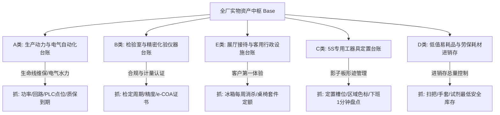
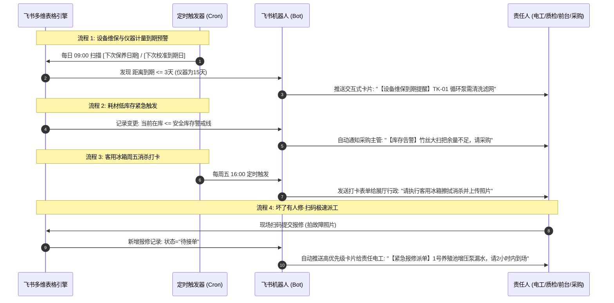

# 连锁数字化农业工厂：10_全厂实物资产台账与5S定置管理数据契约规范 (Asset & 5S Ledger Schema)

> **核心定位**：本规范是数字化农业工厂（鱼菜共生系统）在物理世界、精益现场管理（5S 形迹目视化）、多维数据中台（飞书多维表格 Base）以及集团资产管控制度之间的**实物资产分层分级与数据契约标准**。所有基地工程电工、农艺种植员、水产养殖员、化验质检员及行政后勤团队在资产采购、标签贴附、工位定置、日常交接及系统建账时，必须严格遵守。

---

## 1. 顶层设计原则与经验教训



### 1.1 经验教训与管理避坑指南（Engineering Lessons Learned）

> [!NOTE]
> **经验教训记录（反思“一张表管所有”的形式主义陷阱）**：
> 1. **严禁“扫把与变频电机一张表”**：电机关注额定电压、功率、回路、PLC I/O 寄存器与轴承润滑周期；一把扫把价值十几元，属于易耗品。强塞进一张表会导致 90% 的专业字段常年留空，产生严重的稀疏矩阵与维护抵触，表格必在 3 周内弃用。
> 2. **美工刀丢失的本质是“物理现场没有固定工位”**：工具随手一搁，在几千平米的连栋大棚里瞬间消失。数字化防丢的核心绝不是让工人借一把刀在电脑里登记一次（反人性操作），而是通过**物理影子板（Shadow Board）形迹管理 + 现场定置编码 + 下班 1 分钟目视化交接**。
> 3. **接待设施是食品安全与品牌形象的第一触点**：客用冰箱给客户拿冰水，若里面冻着员工发霉的外卖剩菜，数字化工厂的“高精科技、极净食品”信任瞬间归零。因此客用设施重点在于**定额套件管理**与**每周食安消杀打卡流**。
> 4. **禁止普通纸质标签进温室大棚**：温室高湿度、强紫外线和水汽弥漫，普通热敏纸或不干胶标签 1~2 周即卷边模糊脱落。现场必须强制使用**耐候聚酯（PET）或乙烯基覆膜耐撕标签**。
> 5. **锁死“采购日期、采购人与日常管理人”权责金三角**：台账不可缺失采购日期（折旧与质保起点）、采购经办人（追溯供应商合同与配件渠道）与日常保管维护人（责任到人，杜绝“都在用等于没人管”）。对于 5S 工具，管理人必须锁定为“该影子板的法定监护人（区域班组长）”，而非变动不居的借用人。

---

## 2. 5S 现场定置与生物安全实施 SOP

### 2.1 影子板形迹目视化（Shadow Board SOP）
1. **安装位置**：在水培区（`HP`）、养殖区（`AQ`）、育苗区（`NC`）的主动线立柱或包装作业台侧壁安装标准洞洞板。
2. **1:1 形迹喷漆**：将美工刀、收割弯刀、嫁接剪、手电钻等工具放在板上，使用油漆或刻字胶带描绘出 **1:1 实体黑白轮廓**。
3. **双向编码标贴**：
   * 影子板轮廓内贴上定置标签：如 `SH01-HP-SB01-TL-01`；
   * 工具手柄贴相同定置标签及二维码。
4. **目视化效果**：班组长经过影子板时，只要看到露出黑色实物轮廓，**0.5 秒内即可判定工具未归位**。

### 2.2 三色生物安全管理防线（Biosecurity Color-Coding）
鱼菜共生系统对病原体交叉感染极度敏感，全厂现场工器具与清洁用品的手柄必须缠绕耐磨彩色色标环：

| 标贴颜色 | 适用区域 | 核心生物安全规则 |
| :---: | :--- | :--- |
| **🔵 蓝色 (Blue)** | 设施水培种植区 (`HP`) | 水培专用，严禁进入水产养殖生化池，防止藻种与微肥带入鱼池。 |
| **🟡 黄色 (Yellow)** | 循环水水产养殖区 (`AQ`) | **高危隔离**：严禁带入水培即食叶菜区，严防鱼粪寄生虫与弧菌污染成品菜。 |
| **⚪ 白色 (White)** | 理化分析检验室 (`QA`) | 洁净环境专用，严禁带入泥泞生产区。 |

### 2.3 5S 清洁卫生角（Cleaning Point SOP）
* 扫把、拖把、地面吸水刮板必须吊挂在专用的 5S 悬挂架（`CP01`~`CP09`）上，离地 15cm，严禁斜靠在温室墙角或设备箱旁。
* 悬挂卡扣上方标明品名（如 `1.2m竹丝扫把`）。

---

## 3. 飞书多维表格（Base）资产台账与闭环工单 Schema 字典

Base 资源名称规划：`连锁数字化工厂_实物资产与5S中枢_SH01`。由 **5 张分层资产主表 + 1 张闭环报修工单表** 构成。

### 3.1 表1：生产设施、动力与电气自动化台账 (`tbl_production_equipment`)

* **管理重心**：核心生命线、电气水力参数、PLC/Modbus 通讯、保命逻辑与维保周期。

| 字段名称 (Field Name) | 字段类型 (Field Type) | 必填 | 枚举选项 / 格式约束 / 校验规则 | 业务说明 |
| :--- | :--- | :---: | :--- | :--- |
| **资产编码** (主键) | Text (单行文本) | 是 | 严格遵守 `L1-L2-L3-EQ-XX` 规范 | 如 `SH01-UT-CB-LV-01`、`SH01-AQ-PUMP-01` |
| **设备名称** | Text (单行文本) | 是 | 常用设备工业名称 | 如 `变频增氧锥增压水泵` |
| **品牌及规格型号** | Text (单行文本) | 是 | 采购订货 SKU | 如 `格兰富 CR15-3 / 3.0kW` |
| **安装设施位置** | SingleSelect (单选) | 是 | `TK-01~06`、`RW-A~D`、`WT-SUMP-01`、`CB-HV-01` 等 | 物理空间锚定 |
| **所属配电箱与回路** | Text (单行文本) | 是 | 如 `CB-HV-01 / 回路 AL1-3` | 对接电气拓扑 Schema |
| **额定功率 (kW)** | Number (数字) | 是 | 保留 2 位小数，$\ge 0$ | 能耗与电费测算基准 |
| **额定电压 (V)** | SingleSelect (单选) | 是 | `380V 三相`、`220V 单相`、`24V 安全直流` | 电气安全等级 |
| **通讯协议与点位** | Text (单行文本) | 否 | 如 `485 Modbus-RTU 站号 03 / PLC %Q0.2` | 自控联调点位 |
| **资产原值 (元)** | Currency (货币) | 否 | 人民币金额 | 财务资产建账 |
| **采购日期** | Date (日期) | 是 | `YYYY-MM-DD` 格式 | 资产进场与折旧计算起点 |
| **采购经办人** | User (人员) | 是 | 飞书组织架构内人员 | 负责商务对接与原厂沟通 |
| **使用与维保部门** | SingleSelect (单选) | 是 | `动力配电班组`、`水产养殖部`、`水培种植部`、`机电自控组` | 归属车间/责任部门 |
| **供货商与服务电话** | Text (单行文本) | 否 | 供货单位与售后联系人 | 质保报修直接拨打 |
| **质保截止日** | Date (日期) | 是 | `YYYY-MM-DD` 格式 | 到期前预警 |
| **运行健康状态** | SingleSelect (单选) | 是 | `正常在运(绿)`、`带病观察(黄)`、`故障停机(红)`、`报废拆除(灰)` | 现场设备稼动率基准 |
| **保养周期 (天)** | Number (数字) | 是 | 整数，如 `30`、`90`、`180` | 轴承注油、滤网清洗周期 |
| **下次保养日期** | Date (日期) | 是 | `YYYY-MM-DD` 格式 | 触发飞书维保自动化卡片 |
| **责任电工/工程师** | User (人员) | 是 | 飞书组织架构内人员 | 现场第一维保责任人 |
| **设备铭牌照片** | Attachment (附件) | 否 | 现场通电实拍照片 | 验机与防伪存证 |
| **采购合同与发票** | Attachment (附件) | 否 | 合同/出厂合格证/发票 PDF | 质保售后查验存证 |

---

### 3.2 表2：检验室与计量化验仪器台账 (`tbl_laboratory_instruments`)

* **管理重心**：检测合规、计量校准周期、e-COA 报告存证。

| 字段名称 (Field Name) | 字段类型 (Field Type) | 必填 | 枚举选项 / 格式约束 / 校验规则 | 业务说明 |
| :--- | :--- | :---: | :--- | :--- |
| **仪器编码** (主键) | Text (单行文本) | 是 | 遵循 `L1-QA-LAB-IN-XX` 规范 | 如 `SH01-QA-LAB-IN-01` |
| **仪器全称** | Text (单行文本) | 是 | 官方全称，如 `双光束紫外可见分光光度计` | 普析/梅特勒等专业仪器 |
| **出厂序列号 (S/N)** | Text (单行文本) | 是 | 设备金属铭牌出厂唯一编号 | 计量检定机构证书对应号 |
| **测量精度与量程** | Text (单行文本) | 否 | 如 `波长范围 190-1100nm / 精度 ±0.3nm` | 实验能力边界 |
| **存放房间与工位** | SingleSelect (单选) | 是 | `IQC理化检测室`、`4°C留样室`、`水质快速检测台` | 检验室空间定置 |
| **采购日期** | Date (日期) | 是 | `YYYY-MM-DD` | 进场建账起点 |
| **采购经办人** | User (人员) | 是 | 质检采购专员 | 售后与配件联系人 |
| **机长/专职保管人** | User (人员) | 是 | 质检中心实验专员 | 专人专机操作与维护 |
| **检定/校准状态** | SingleSelect (单选) | 是 | `合格在用(绿)`、`准用降级(黄)`、`待送检(橙)`、`停用(红)` | 法定计量合规状态 |
| **校准周期 (天)** | Number (数字) | 是 | 常用值：`365`（一年一检） | 法定强检/校准频次 |
| **上次检定日期** | Date (日期) | 是 | `YYYY-MM-DD` | 检定证书签发日 |
| **下次校准到期日** | Date (日期) | 是 | `YYYY-MM-DD`（提前15天自动化报警） | 临期送检提醒 |
| **校准证书 (e-COA)** | Attachment (附件) | 否 | 第三方计量院出具的 PDF 证书 | 飞书文档在线查验 |
| **采购合同与验收单** | Attachment (附件) | 否 | 仪器采购合同及出厂验收单 | 合规资质归档 |

---

### 3.3 表3：展厅接待与客用行政设施台账 (`tbl_showroom_amenities`)

* **管理重心**：客户第一印象、客用冰箱 5S 食安消杀、家具定额管理。

| 字段名称 (Field Name) | 字段类型 (Field Type) | 必填 | 枚举选项 / 格式约束 / 校验规则 | 业务说明 |
| :--- | :--- | :---: | :--- | :--- |
| **设施编码** (主键) | Text (单行文本) | 是 | 遵循 `L1-SR-设施-类别-序号` | 如 `SH01-SR-BAR-AP-01` |
| **设施品名与规格** | Text (单行文本) | 是 | 如 `海尔风冷无霜双门客用冰箱 (218L)` | 清楚描述品牌与容量 |
| **定置具体位置** | SingleSelect (单选) | 是 | `阳光水吧台`、`客户品鉴长桌岛`、`研学宣讲区` | 展厅内精确功能区 |
| **管理模式** | SingleSelect (单选) | 是 | `单机一档(电器类)`、`套件定额(桌椅类)` | 杜绝桌椅单把贴码 |
| **定额配置数量** | Number (数字) | 是 | 整数，如套件配 `8` 把椅子 | 盘点总数标准 |
| **采购日期** | Date (日期) | 是 | `YYYY-MM-DD` 格式 | 资产进场建账日 |
| **采购经办人** | User (人员) | 是 | 行政/后勤采购负责人 | 商务合同与保修经办人 |
| **质保期限 (年)** | Number (数字) | 否 | 整数，如电器类 `3` 年，家具类 `5` 年 | 质保寿命 |
| **外观与可用完整度** | SingleSelect (单选) | 是 | `崭新完好`、`轻微划痕(可接待)`、`破损需换` | 客户面貌维护 |
| **日常消杀打卡周期** | Number (数字) | 否 | 天数，客用冰箱设定为 `7` 天 | 周五定期清洁 |
| **下次消杀打卡日** | Date (日期) | 否 | 每周五下午自动触发 | 飞书推送给前台行政 |
| **食安管理要求** | Text (单行文本) | 否 | `仅存放瓶装饮用水与品鉴净菜，严禁放员工外卖` | 品牌红线提示 |
| **现场管理责任人** | User (人员) | 是 | 展厅讲解员 / 前台行政 | 日常卫生与客户服务责任人 |
| **采购发票与凭证** | Attachment (附件) | 否 | 发票 PDF / 采购订单截图 | 售后维修查验凭证 |
| **现场定置全景照** | Attachment (附件) | 否 | 展示区与吧台整洁照片 | 5S 目视核对 |

---

### 3.4 表4：5S 专用工器具定置台账 (`tbl_5s_tools`)

* **管理重心**：物理影子板对齐、区域色标防交叉污染、下班 1 分钟点检防丢。

| 字段名称 (Field Name) | 字段类型 (Field Type) | 必填 | 枚举选项 / 格式约束 / 校验规则 | 业务说明 |
| :--- | :--- | :---: | :--- | :--- |
| **定置编码** (主键) | Text (单行文本) | 是 | 严格格式：`L1-L2-定置点-TL-槽位` | 如 `SH01-HP-SB01-TL-01` |
| **工具品名与规格** | Text (单行文本) | 是 | 如 `得力重型美工刀 18mm SK5刀片` | 现场实物名称 |
| **定置载体类型** | SingleSelect (单选) | 是 | `影子板 (Shadow Board)`、`作业台 (Workstation)` | 物理家底 |
| **定置点代号** | SingleSelect (单选) | 是 | `HP-SB01(水培1号板)`、`AQ-SB01`、`HP-WS01` | 精确到具体板号 |
| **槽位序号** | Text (单行文本) | 是 | 如 `01号位`、`02号位` | 板上喷漆轮廓编号 |
| **启用/上架日期** | Date (日期) | 是 | `YYYY-MM-DD` 格式 | 新工具拆包挂板日 |
| **采购批次经办人** | User (人员) | 是 | 基地综合后勤采购专员 | 批次采购与备件补库人 |
| **生物安全色标** | SingleSelect (单选) | 是 | `🔵 蓝色 (水培专区)`、`🟡 黄色 (水产专区)`、`⚪ 白色 (质检专区)` | 防交叉污染手柄色标 |
| **当前在位状态** | SingleSelect (单选) | 是 | `在位备用(绿)`、`领用作业中(蓝)`、`报损待补(黄)`、`遗失异常(红)` | 状态看板管理 |
| **最后盘点打卡时间** | DateTime (日期时间) | 否 | ISO 8601 UTC 格式 | 每日交接打卡记录 |
| **区域法定保管人** | User (人员) | 是 | 水培组长 / 养殖班长 | **该影子板法定监护人**（追责防丢第一人） |
| **槽位挂载特写照** | Attachment (附件) | 否 | 挂在影子板上的正确形态照 | 供新人对齐识别 |

---

### 3.5 表5：低值易耗品与耗材进销存 (`tbl_consumables_inventory`)

* **管理重心**：扫把、拖把、手套、试剂消耗总量控制，安全库存预警，**不做单件独立编号**。

| 字段名称 (Field Name) | 字段类型 (Field Type) | 必填 | 枚举选项 / 格式约束 / 校验规则 | 业务说明 |
| :--- | :--- | :---: | :--- | :--- |
| **耗材编码** (主键) | Text (单行文本) | 是 | 格式：`MAT-类别-四位流水` | 如 `MAT-CL-0001` (大扫把) |
| **耗材品名与规格** | Text (单行文本) | 是 | 如 `1.2m竹丝大扫把`、`丁腈手套 L号(100只/盒)` | 采购标准品名 |
| **所属分类** | SingleSelect (单选) | 是 | `保洁用具`、`劳保防护`、`水质试纸试剂`、`农艺辅材` | 物料品类 |
| **计量单位** | SingleSelect (单选) | 是 | `把`、`盒`、`包`、`瓶`、`卷` | 数量单位 |
| **当前在库数量** | Number (数字) | 是 | 整数，$\ge 0$ | 仓库实时余量 |
| **安全库存警戒线** | Number (数字) | 是 | 整数，如大扫把设 `2`，手套设 `5` | 触发采购底线 |
| **库存健康度** | Formula (公式) | 是 | `IF(当前在库 <= 安全库存, "⚠️ 需紧急补货", "✅ 充足")` | 自动红黄告警 |
| **最近入库/采购日期** | Date (日期) | 否 | `YYYY-MM-DD` 格式 | 最近一次到货入库日 |
| **采购经办专员** | User (人员) | 是 | 基地采购员 | 补货与询价对接人 |
| **存放货架/储物柜** | Text (单行文本) | 是 | 如 `综合库房 A 架 02 层` | 存放物理地址 |
| **最近采购单价 (元)** | Currency (货币) | 否 | 人民币金额 | 成本核算 |
| **保管责任人** | User (人员) | 是 | 仓库管理员 / 综合内勤 | 盘点与领用审批人 |

---

### 3.6 表6：设备与工器具报修及维保工单履历表 (`tbl_maintenance_records`)

* **管理重心**：**“坏了有人修”**。闭环跟踪现场报修、责任电工接单、配件耗材消耗与修复验收，沉淀设备“终身健康病历本”。

| 字段名称 (Field Name) | 字段类型 (Field Type) | 必填 | 枚举选项 / 格式约束 / 校验规则 | 业务说明 |
| :--- | :--- | :---: | :--- | :--- |
| **工单编号** (主键) | Text (单行文本) | 是 | 格式：`WO-YYYYMMDD-四位流水` | 如 `WO-20260916-0001` |
| **关联资产编码** | Link (单向/双向关联) | 是 | 关联到表1/表2/表3/表4的主键编码 | 准确定位报修对象 |
| **设备/资产名称** | Lookup (查找引用) | 是 | 自动从关联资产表中带出 | 避免重复手工输入 |
| **工单类型** | SingleSelect (单选) | 是 | `故障紧急报修(红)`、`周期润滑保养(蓝)`、`精度校准维护(紫)`、`报废鉴定评测(灰)` | 区分紧急修与预防保 |
| **故障现象与描述** | Text (多行文本) | 是 | 如 `电机剧烈异常振动伴随焦糊味 / 水泵机械密封漏水` | 现场第一手故障描述 |
| **现场故障实拍** | Attachment (附件) | 是 | 现场拍照或录制异响短视频 | 证据留存，辅助预判配件 |
| **报修提交人** | User (人员) | 是 | 现场一线操作工 / 巡检人员 | 提单第一人 |
| **报修提交时间** | DateTime (日期时间) | 是 | ISO 8601 UTC 格式 | 记录故障发生精确时刻 |
| **主修责任人** | User (人员) | 是 | 责任电工 / 机电工程师 / 综合后勤 | **“坏了有人修”的第一执行人** |
| **维修处理状态** | SingleSelect (单选) | 是 | `待接单(红)`、`排查抢修中(黄)`、`待配件采购(橙)`、`修复待验收(蓝)`、`验收关闭(绿)`、`无法修复报废(灰)` | 工单流转看板状态机 |
| **故障根因分析** | Text (多行文本) | 否 | 如 `轴承滚珠严重磨损碎裂，导致转子扫膛` | 维修人复盘填报 |
| **更换备件与耗材** | Text (多行文本) | 否 | 如 `更换 6204-2RS 高速轴承 2 只、耐温骨架油封 1 个` | 备件消耗与成本核算 |
| **维修耗时 (小时)** | Number (数字) | 否 | 精确到 0.5 小时，如 `2.5` | 维修工时核算 |
| **修复完成时间** | DateTime (日期时间) | 否 | ISO 8601 UTC 格式 | 闭环时戳 |
| **验收确认人** | User (人员) | 否 | 区域长 / 车间主管 / 报修人 | 试运转无误后确认签字 |

---

## 4. 飞书自动化工作流（Workflow Block）触发逻辑

基于 `lark-base` 原生自动化引擎，部署以下 4 个零代码/低代码工作流：



### 4.1 每日下班 1 分钟 5S 点检表单（SOP）
* **表单形态**：基于表4（`tbl_5s_tools`）生成的移动端极简打卡单。
* **极简交互设计**：
  1. 班组长在 17:30 走向本区域影子板（`SB01`）；
  2. 观察板上是否有黑白阴影外露：
     * **若全满**：直接在手机快捷面板点击【全员归位打卡】，耗时 5 秒；
     * **若缺少工具（如 01 号美工刀不在）**：点击对应编号，状态置为“遗失异常”，系统自动向本区域班组群推送通知：
       > “【5S未归位预警】水培区 1 号影子板【01号重型美工刀】尚未归位，请最后使用者立即放回原位并复位色标！”

### 4.2 【丢了有人负责】—— 5S 工器具遗失判定与 24h 追溯 SOP
为了防止责任蒸发，工厂实行**“法定监护人制 + 24小时时空收敛”**：
1. **法定责任锁定**：工具不按变动不居的“借用人”立卷，每块影子板的**区域班组长即为该板所有工具的法定监护人**。
2. **24小时时空收敛**：
   * **T + 0h (当天17:30)**：点检发现缺失，机器人群内点名。当天现场谁在该区域作业清清楚楚，当场追回率达 95% 以上。
   * **T + 12h (次日早会08:30)**：若仍未归还，班组长早会第一件事排查前一日末班使用者；
   * **T + 24h (次日17:30第二次点检)**：仍未找回，系统判定为**“正式遗失”**，状态变更为 `遗失异常(红)`；
3. **闭环补库与定损**：
   * 触发《工器具遗失补购审批》，由班组长签字确认并说明遗失原因，流转采购专员补发备件并重新打码上板；
   * 杜绝“丢了一把没人管，大家继续共用剩下的，直到彻底没得用”的恶性循环。

### 4.3 【坏了有人修】—— 一机一码扫码极速报修与一机一病历闭环 SOP
杜绝“坏了扔角落、谁也不说、停摆两周”的推诿现象：
1. **现场 10 秒扫码提单**：
   * 所有 A/B/C/E 类设备均贴有耐候二维码（内容包含设备编码及多维表格报修表单链接）；
   * 操作工发现设备异响、漏水、卡死或损坏，直接微信/飞书扫码，**10 秒内完成：拍照存证 + 选择故障现象 + 点击提交**；
2. **机器人自动智能派单**：
   * 表6（`tbl_maintenance_records`）生成新工单；
   * 系统根据设备类别与安装设施，**在 60 秒内自动推送飞书卡片至主修责任人**（如责任电工、机电工长、后勤维修员）：
     > “🔴【设备紧急报修派工】
     > 设施：`TK-01 鲈鱼成鱼池`
     > 设备：`SH01-AQ-PUMP-01 (变频增压水泵)`
     > 故障：机械密封漏水，伴随电流过载异响
     > 报修人：张三 (138xxxx)
     > 请责任电工 李四 在 2 小时内到场诊断！”
3. **现场抢修与备件登记**：
   * 责任电工接单后，在飞书卡片上点击【已到场排查】，状态流转为 `抢修处理中(黄)`；
   * 维修完成后，填报：`故障根因`、`消耗备件型号与数量`、`工时`；
4. **机长验收与健康状态自愈复位**：
   * 区域长/报修人通电试运转无误后，点击【验收通过】；
   * **底层联动触发**：工单状态变为 `验收关闭(绿)`，主表对应设备的 `运行健康状态` 自动从 `故障停机(红)` 变回 `正常在运(绿)`，完成闭环。

---

## 5. 机器可读 TypeScript 与 Zod 数据契约

为保持与整体中台架构 `@aquaponics/schema` 的统一强类型断言，提供以下核心 TypeScript/Zod 定义：

```typescript
import { z } from 'zod';

/**
 * 资产五大分治层级枚举
 */
export const AssetTierEnum = z.enum([
  'PRODUCTION_EQUIPMENT', // A类: 核心生产动力与自控设备
  'LAB_INSTRUMENT',       // B类: 检验室与计量分析仪器
  'SHOWROOM_AMENITY',     // E类: 展厅接待与客用行政设施
  'FIVE_S_TOOL',          // C类: 5S专用工器具 (影子板定置)
  'CONSUMABLE_SUPPLY',    // D类: 低值易耗品与劳保耗材 (总量进销存)
]);

/**
 * 三色生物安全管理色标
 */
export const BiosecurityColorEnum = z.enum([
  'BLUE_HYDROPONICS',     // 蓝色: 水培种植专用
  'YELLOW_AQUACULTURE',   // 黄色: 循环水养殖专用 (禁入水培区)
  'WHITE_LABORATORY',     // 白色: 洁净检验室专用
]);

/**
 * 5S 工具定置记录 Zod Schema (C类)
 */
export const FiveSToolSchema = z.object({
  toolCode: z.string().regex(/^[A-Z]{2}\d{2}-[A-Z]{2}-[A-Z0-9]+-TL-\d{2}$/, {
    message: '工具编码必须符合 L1-L2-Station-TL-Index 标准格式',
  }),
  toolName: z.string().min(2),
  stationType: z.enum(['SHADOW_BOARD', 'WORKSTATION', 'CLEANING_POINT']),
  stationId: z.string(),
  slotIndex: z.string(),
  deployedDate: z.string().regex(/^\d{4}-\d{2}-\d{2}$/, '启用日期必须为 YYYY-MM-DD 格式'),
  purchaserUserId: z.string().min(1, '必须指定采购批次经办人'),
  custodianUserId: z.string().min(1, '必须指定区域法定保管人(班组长)'),
  biosecurityColor: BiosecurityColorEnum,
  status: z.enum(['IN_PLACE', 'IN_USE', 'DAMAGED', 'LOST']),
  lastCheckedAt: z.string().datetime({ offset: true }), // 严格 ISO 8601 UTC
});

export type FiveSTool = z.infer<typeof FiveSToolSchema>;

/**
 * 生产动力与电气设备 Zod Schema (A类)
 */
export const ProductionEquipmentSchema = z.object({
  assetCode: z.string().regex(/^[A-Z]{2}\d{2}-[A-Z]{2}-[A-Z0-9]+-EQ-\d{2}$/),
  equipmentName: z.string().min(2),
  modelSpec: z.string().min(1),
  locationFacility: z.string(),
  powerKw: z.number().nonnegative(),
  ratedVoltage: z.enum(['380V_3P', '220V_1P', '24V_DC']),
  purchaseDate: z.string().regex(/^\d{4}-\d{2}-\d{2}$/),
  purchaserUserId: z.string(),
  managerUserId: z.string(), // 责任电工
  warrantyExpiresAt: z.string().regex(/^\d{4}-\d{2}-\d{2}$/),
  maintenanceCycleDays: z.number().int().positive(),
  nextMaintenanceDate: z.string().regex(/^\d{4}-\d{2}-\d{2}$/),
  healthStatus: z.enum(['NORMAL', 'OBSERVE', 'FAULT_STOP', 'SCRAPPED']),
});

export type ProductionEquipment = z.infer<typeof ProductionEquipmentSchema>;

/**
 * 客用展厅与行政设施 Zod Schema (E类)
 */
export const ShowroomAmenitySchema = z.object({
  amenityCode: z.string().regex(/^[A-Z]{2}\d{2}-SR-[A-Z0-9]+-(AP|FN)-\w+$/),
  name: z.string().min(2),
  locationZone: z.string(),
  managementMode: z.enum(['SINGLE_APPLIANCE', 'SUITE_QUOTA']),
  quotaQuantity: z.number().int().positive(),
  purchaseDate: z.string().regex(/^\d{4}-\d{2}-\d{2}$/),
  purchaserUserId: z.string(),
  managerUserId: z.string(), // 卫生与接待责任人
  hygieneCheckCycleDays: z.number().int().positive().optional(),
  nextHygieneCheckDate: z.string().regex(/^\d{4}-\d{2}-\d{2}$/).optional(),
});

export type ShowroomAmenity = z.infer<typeof ShowroomAmenitySchema>;

/**
 * 设备与工器具报修工单 Zod Schema (表6)
 */
export const MaintenanceTicketSchema = z.object({
  ticketId: z.string().regex(/^WO-\d{8}-\d{4}$/, '工单号格式必须为 WO-YYYYMMDD-XXXX'),
  assetCode: z.string(),
  ticketType: z.enum(['EMERGENCY_REPAIR', 'ROUTINE_MAINTENANCE', 'CALIBRATION', 'SCRAP_EVALUATION']),
  issueDescription: z.string().min(5, '故障描述不得少于5个字'),
  reporterUserId: z.string(),
  reportedAt: z.string().datetime({ offset: true }), // 严格 ISO 8601 UTC
  assignedLeadUserId: z.string(), // 主修责任人 (责任电工/机电主管)
  ticketStatus: z.enum([
    'PENDING_DISPATCH',    // 待接单
    'IN_REPAIR',           // 抢修中
    'WAITING_PARTS',       // 待配件
    'WAITING_ACCEPTANCE',  // 修复待验收
    'CLOSED_ACCEPTED',     // 验收关闭
    'UNREPAIRABLE_SCRAP',  // 无法修复报废
  ]),
  rootCauseAnalysis: z.string().optional(),
  replacedPartsSummary: z.string().optional(),
  laborHours: z.number().nonnegative().optional(),
  completedAt: z.string().datetime({ offset: true }).optional(),
  inspectorUserId: z.string().optional(),
});

export type MaintenanceTicket = z.infer<typeof MaintenanceTicketSchema>;
```

---

## 6. 实施 Checklist 与验收标准 (Go-Live Checklist)

- [ ] **物理环境**：已安装耐候洞洞板（影子板）与 5S 清洁角悬挂架，1:1 工具黑色阴影喷漆完成。
- [ ] **标签工艺**：全厂工具手柄已粘贴聚酯覆膜标签及三色生物安全绝缘色标环。
- [ ] **飞书 Base**：已在 `lark-base` 建立 5 张标准分表，字段约束与公式已全部配置完毕。
- [ ] **自动化测试**：维保到期提醒、耗材低库存告警、客用冰箱消杀流程已跑通测试。
- [ ] **员工培训**：完成现场一线工人“物归其家、过目知缺、下班1分钟快速交接”宣贯，严防形式主义。
