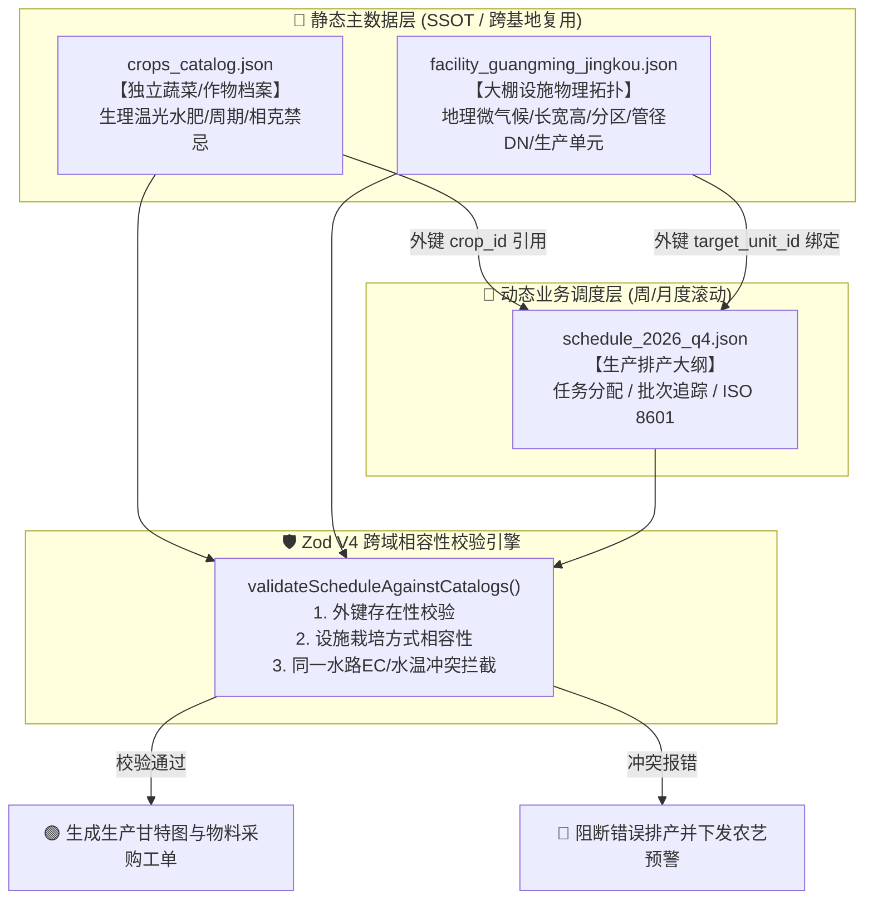

# 数字化农业工厂：11_设施物理拓扑与多作物排产数据契约规范 (Facility & Agronomy Schema)

> **核心定位**：本规范是鱼菜共生与多形态现代化设施农业在**大棚空间几何**、**生产单元（深水跑道/高架草莓/荷兰桶/鱼池）**、**水力循环回路**、**作物农艺生理主数据**以及**动态生产排产调度**之间的统一数据契约标准（SSOT）。基于 `@aquaponics/schema` 与 Zod V4 强类型规则引擎驱动，实现多大棚通用适配、主数据跨基地解耦复用与物理相容性自动拦截。

---

## 1. 顶层设计原则与架构解耦思想

在现代化设施农业的工业化落地中，最大的软件设计陷阱就是**“将物理不动产与日常排产业务强行揉死在一个 JSON”**。本规范坚决贯彻三大架构解耦原则：



### 1.1 核心经验教训与避坑备忘 (Engineering Lessons Learned)

> [!CAUTION]
> **严谨理性反思：设施拓扑与作物排产五大高危陷阱**：
> 1. **【经验教训记录 11】主数据与业务数据分离原则**：严禁在排产单中就地硬编码蔬菜的水温和 EC 参数。不同大棚的排产单必须通过唯一的 `crop_id`（如 `crop_watercress`）外键引用统一的 `crops_catalog.json`。农艺师校准一项生理指标，全厂所有排产计划即刻全量生效，杜绝多份孤岛数据互相打架。
> 2. **【经验教训记录 12】水力回路共线冲突是隐形杀手**：决定两种作物能否同时种植的，不仅是空间距离，更是**水流管网回路**！若将高肥高 EC 的西瓜与低耐受的生菜绑在同一条给回水回路（`HydraulicLoop`）中，水肥一旦互通，生菜必死无疑。排产引擎必须强制对同回路下所有单元的作物进行**交集验证（EC 区间重叠度与显式相克列表）**。
> 3. **【经验教训记录 13】判别联合类型（Discriminated Union）破解未来大棚扩展死结**：未来温室可能有高架草莓槽、荷兰桶吊蔓、刀刮布/不锈钢水培菜池、气雾塔等多种生产单元。严禁将所有单元拍平在一个充满 optional 字段的稀疏大表中！必须使用 Zod 的 `z.discriminatedUnion('unit_type', [...])`，严格区分每种物理单元专有的几何与工程参数。
> 4. **【经验教训记录 14】地理气候上下文决定排产上限**：大棚不是孤立的盒子。深圳光明迳口村山谷微盆地高湿易结露、夏季水温突破 28℃ 的现实，直接决定了夏季必须换茬为耐热耐水温的空心菜/木耳菜，严禁逆天硬抗生菜。
> 5. **【经验教训记录 15】全生命周期时间严格归一化**：播种、移栽、采收、批次追溯时间戳一律强制执行严格 ISO 8601 UTC 毫秒格式（`2026-10-15T08:00:00.000Z`），直接与溯源区块链和 e-COA 证书哈希对齐。

---

## 2. 作物农艺生理主数据契约 (`agronomy`)

独立作物库文件路径：`packages/schema/data/crops_catalog.json`

### 2.1 作物分类与生态习性 (`CropProfileSchema`)

| 字段名称 | 类型 | 说明与业务约束 |
| :--- | :--- | :--- |
| `crop_id` | `string` | 唯一主键，必须全小写下划线，如 `crop_watercress`、`crop_butterhead_lettuce` |
| `common_name` | `string` | 商业与通用中文名，如 `西洋菜 (豆瓣菜)` |
| `botanical_name` | `string` | 拉丁植物学名，如 `Nasturtium officinale` |
| `variety_name` | `string` | 细分商业品种，如 `萨拉诺瓦绿奶油 (Salanova Green Butter)` |
| `category` | `enum` | `lettuce` (生菜), `aquatic_herb` (水生草本), `brassica_greens` (十字花科), `medicinal_herb` (药食同源), `solanaceous_fruit` (茄果), `berry_fruit` (浆果), `warm_summer_greens` (夏菜) |
| `seasonality` | `enum` | `cool_season` (冷凉型 18~22℃), `warm_season` (喜温耐热 26~32℃), `neutral_flexible` (广温型) |
| `supported_systems` | `array` | 支持设施类型：`dwc_raceway`、`nft_gully`、`substrate_trough`、`dutch_bucket` 等 |
| `harvest_mode` | `enum` | `single_cut_head` (整株单切), `continuous_cut` (连续割茬), `fruit_picking` (多次采摘), `leaf_stripping` (剥叶) |

### 2.2 核心生理参数与耐受阈值

* **温度容忍度 (`OptimalTemperatureRangeSchema`)**：昼温 `day_temp_c`、夜温 `night_temp_c`、水温 `water_temp_c`、热害临界线 `critical_high_temp_c`、冷害临界线 `critical_low_temp_c`；
* **水肥要求 (`FertigationRequirementsSchema`)**：最适 EC `[min, max]`、最适 pH `[min, max]`、最低溶氧 `min_dissolved_oxygen_mg_l`、顶烧病敏感度 `tipburn_sensitivity`；
* **光照需求 (`LightingPhotoperiodSchema`)**：日累积光照量 DLI (`mol/m²·day`)、光饱和点 (`Lux`)。

---

## 3. 大棚设施物理拓扑与空间几何契约 (`facility`)

设施物理拓扑文件路径：`packages/schema/data/facility_guangming_jingkou.json`

### 3.1 树状拓扑层次关系

```text
FacilityTopology (光明迳口大棚 GH-GUANGMING-JINGKOU-01)
├── geo_location (经度: 113.9482, 纬度: 22.7756, 海拔: 38.5m, 山谷微盆地)
├── greenhouse_structure (长: 64m, 宽: 32m, 肩高: 4.5m, 脊高: 8.1m, 面积: 2048㎡)
├── zones (4大独立微气候分区)
│   ├── ZONE-COOL-01 (冷凉跑道与草莓高架区，800㎡，配外遮阳75%+独立水冷)
│   ├── ZONE-WARM-02 (喜温高光果菜区，640㎡，小番茄吊蔓+夏菜)
│   ├── ZONE-RAS-03 (加州鲈水产养殖闭环车间，400㎡)
│   └── ZONE-NURSERY-04 (暗室催芽与炼苗舱，208㎡)
├── hydraulic_loops (3大独立水力回路，杜绝水肥冲突)
│   ├── LOOP-AQUAPONICS-MAIN (鱼菜共生双循环主干水路: DN90供水, DN110回水, 45m³/h)
│   ├── LOOP-STRAWBERRY-DRIP (A字架高架草莓专用低浓度水肥一体滴灌回路: DN50, EC 1.0~1.4)
│   └── LOOP-TOMATO-DRIP (五彩圣女果专用高浓度水肥一体滴灌回路: DN63, EC 2.2~2.8)
└── production_units (生产单元判别联合体 · 落地菜池/离地菜池/A字架)
    ├── BED-TARPAULIN-01 (1号刀刮布落地水培菜池，800g/㎡夹网布，30m长，低成本大宗走量)
    ├── BED-STAINLESS-02 (2号不锈钢离地水培菜池，SUS304离地0.85m，站立免弯腰极净展示)
    ├── BED-TARPAULIN-03 (3号刀刮布落地水培菜池，30m长，广东菜心/菠菜/茼蒿)
    ├── RACK-AFRAME-01 (A字架立体基质栽培架，双侧斜面6层，高坪效草莓/香草)
    ├── BKT-TOMATO-01 (240只独立荷兰桶，3.2m吊蔓天线，五彩圣女果专区)
    └── RAS-TANK-01 ~ RAS-TANK-02 (加州鲈成鱼圆形循环养殖池，直径5m，水深1.4m)
```

---

## 4. 生产排产计划与跨域校验规则 (`schedule`)

排产计划示范文件路径：`packages/schema/data/schedule_2026_q4.json`

### 4.1 单项排产任务 (`ProductionScheduleAssignmentSchema`)
* `assignment_id`：如 `SCH-ASN-20261015-001`；
* `target_unit_id`：外键指向生产单元（如 `DWC-BED-01`）；
* `crop_id`：外键指向蔬菜主数据（如 `crop_watercress`）；
* `batch_lot_number`：批次追溯码，出厂直通 e-COA；
* `start_seeding_date` / `start_transplanting_date` / `expected_harvest_date`：全生命周期 ISO 8601 时间。

### 4.2 校验器三大核心拦截逻辑 (`validateScheduleAgainstCatalogs`)
1. **外键存在性校验**：引用的 `crop_id` 和 `target_unit_id` 必须 100% 存在于主数据中；
2. **栽培系统合法性校验**：草莓只能排在 `substrate_trough`，若排入 `dwc_raceway` 则直接报错；
3. **水力回路共线冲突拦截**：
   * 检查连接在同一 `HydraulicLoop` 下的作物是否存在**显式相克禁忌**（`incompatible_crop_ids`）；
   * 检查作物的 **EC 容许区间是否存在物理重叠**（如草莓 EC 1.0~1.4 与西瓜 EC 2.2~2.8 共享水路立即拦截）。

---

## 5. 深圳光明迳口大棚实战落地种子作物清单

首批在 `crops_catalog.json` 中结构化录入的 17 个作物细分品类：

| 作物代码 | 通用名 / 细分品种 | 所属品类 | 栽培系统 | 适宜水温 | 适宜 EC | 生长周期 |
| :--- | :--- | :--- | :--- | :---: | :---: | :---: |
| `crop_watercress` | 西洋菜 (广府大叶西洋菜) | 水生草本 | 刀刮布/不锈钢水培菜池 | 16~20℃ | 1.4~1.8 | 28 天 (连续割茬) |
| `crop_butterhead_lettuce` | 奶油生菜 (萨拉诺瓦绿奶油) | 生菜沙拉 | 刀刮布/不锈钢水培菜池 | 16~20℃ | 1.2~1.6 | 32 天 |
| `crop_red_oakleaf_lettuce`| 红橡叶生菜 (红沙拉/红罗莎) | 生菜沙拉 | 刀刮布/不锈钢水培菜池 | 16~20℃ | 1.2~1.5 | 30 天 |
| `crop_green_oakleaf_lettuce`| 绿橡叶生菜 (绿珊瑚) | 生菜沙拉 | 刀刮布/不锈钢水培菜池 | 17~20℃ | 1.3~1.6 | 28 天 |
| `crop_romaine_lettuce` | 罗马生菜 (凯撒长叶生菜) | 生菜沙拉 | 刀刮布/不锈钢水培菜池 | 16~19℃ | 1.4~1.8 | 35 天 |
| `crop_sabah_snake_grass` | 忧遁草 (优盾草/鳄嘴花/青箭草) | 药食同源 | 菜池 / A字架 / 基质 | 20~25℃ | 1.5~2.2 | 35 天 (剪枝扦插) |
| `crop_xuetongcai` | 血通菜 (红凤菜/紫背菜/补血菜) | 药食同源 | 菜池 / A字架 / 基质 | 18~24℃ | 1.4~2.0 | 28 天 (富花青素与铁) |
| `crop_gynura_divaricata` | 片仔癀草 (白背三七/神仙草) | 药食同源 | 菜池 / A字架 / 基质 | 18~24℃ | 1.4~2.0 | 30 天 (药膳采摘) |
| `crop_choy_sum` | 广东菜心 (四九油青特选) | 十字花科 | 刀刮布/不锈钢水培菜池 | 18~22℃ | 1.5~2.0 | 26 天 |
| `crop_spinach` | 大叶菠菜 (日本水培甜菠菜) | 绿叶菜类 | 刀刮布/不锈钢水培菜池 | 15~18℃ | 1.4~1.8 | 30 天 |
| `crop_garland_chrysanthemum`| 茼蒿菜 (细叶芳香茼蒿) | 绿叶菜类 | 刀刮布/不锈钢水培菜池 | 16~20℃ | 1.4~1.9 | 25 天 (火锅明星) |
| `crop_youmaicai` | 油麦菜 (四季香油麦菜) | 绿叶菜类 | 刀刮布/不锈钢水培菜池 | 17~21℃ | 1.4~1.8 | 28 天 |
| `crop_kale_curly` | 羽衣甘蓝 (科西嘉深绿卷叶) | 超级食物 | DWC / 基质 | 16~20℃ | 1.6~2.2 | 40 天 (剥叶90天) |
| `crop_cherry_tomato_red` | 多彩圣女果 (千禧红宝石) | 茄果类 | 荷兰桶吊蔓 | 18~22℃ | 2.2~2.8 | 75 天 (糖度9~10) |
| `crop_cherry_tomato_yellow`| 多彩圣女果 (黄珍珠黄金蜜) | 茄果类 | 荷兰桶吊蔓 | 18~22℃ | 2.0~2.6 | 72 天 (低酸纯甜) |
| `crop_cherry_tomato_black` | 多彩圣女果 (黑珍珠巧克力) | 茄果类 | 荷兰桶吊蔓 | 18~22℃ | 2.2~2.8 | 78 天 (富花青素) |
| `crop_strawberry_elevated` | 高架草莓 (日本红颜/隋珠) | 浆果类 | A字架立体基质架 | 16~19℃ | 1.0~1.4 | 90 天 (采摘顶流) |
| `crop_water_spinach` | 空心菜 (泰国白骨水蕹菜) | 盛夏耐热 | 刀刮布/不锈钢水培菜池 | 24~29℃ | 1.8~2.5 | 20 天 (狂吸鱼肥) |

---

## 🔗 关联代码与数据文件

* **农艺主数据契约与定义**：👉 [packages/schema/src/agronomy/index.ts](../../packages/schema/src/agronomy/index.ts)
* **独立蔬菜与作物知识库**：👉 [packages/schema/data/crops_catalog.json](../../packages/schema/data/crops_catalog.json)
* **设施物理拓扑契约与定义**：👉 [packages/schema/src/facility/index.ts](../../packages/schema/src/facility/index.ts)
* **深圳光明迳口大棚拓扑实例**：👉 [packages/schema/data/facility_guangming_jingkou.json](../../packages/schema/data/facility_guangming_jingkou.json)
* **排产计划契约与跨域校验器**：👉 [packages/schema/src/schedule/index.ts](../../packages/schema/src/schedule/index.ts)
* **2026年Q4排产计划示范文件**：👉 [packages/schema/data/schedule_2026_q4.json](../../packages/schema/data/schedule_2026_q4.json)
* **数据契约包入口导出**：👉 [packages/schema/src/index.ts](../../packages/schema/src/index.ts)
