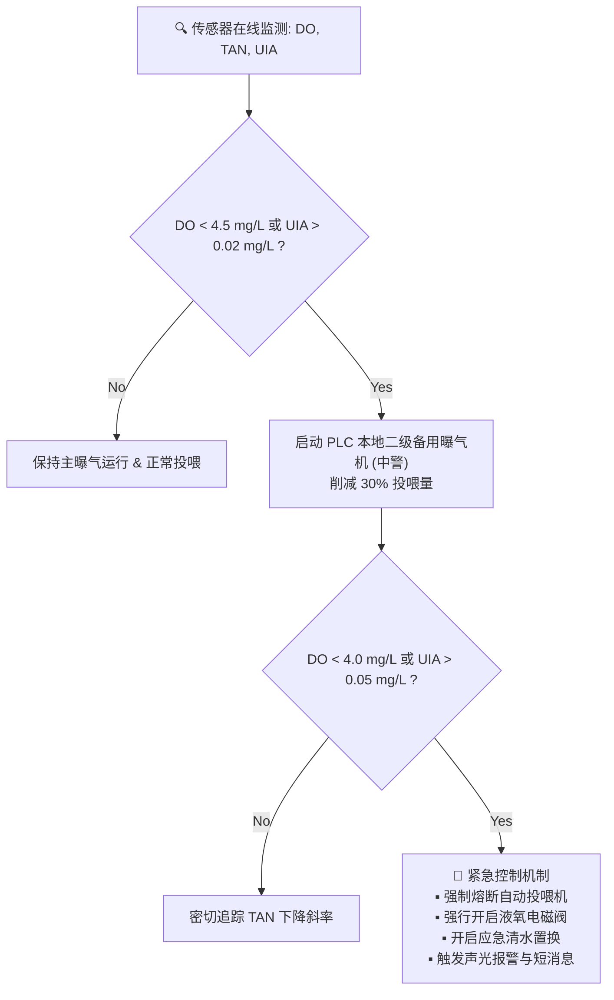

# 连锁数字化农业工厂：01_水产养殖子系统设计 (Aquaculture Subsystem Design)

水产养殖子系统（`aqua`）是本数字化工厂的生物源头。主要职责是确保鱼类生物资产的生命安全与健康，高精度监控水质，并通过 AI 算法实现饲料投入的最优化。

---

## 1. 系统范畴与物理边界

本子系统覆盖的物理设备和控制节点包括：
1. **陆基循环水养殖池 (RAS Tank)**：高密度鱼群居住地。
2. **生物过滤器/硝化滤池 (Biofilter)**：硝化细菌生化反应区，将有毒氨氮转化为无毒硝酸盐。
3. **气动自动投喂机 (Feeder)**：高蛋白饲料的物理投放器。
4. **曝气与制氧设备 (DO Actuators)**：鼓风曝气机、纯氧混合器、应急液氧阀。

---

## 2. 传感器选型与集成规范

根据现场的多悬浮物、易生物附着环境，严禁使用廉价开源玩具级传感器，必须强制执行以下集成规范：

### 2.1 溶解氧 (DO) 传感器
* **原理与精准选型**：**工业数字荧光法 (Optical DO) 传感器 (深圳国数 `BSK-DO-100` 全不锈钢型)**。
  * **测量参数**：量程 $0 \sim 20\,\text{mg/L}$，测量精度 $\pm 2\%$，分辨率 $0.01\,\text{mg/L}$，输出信号 RS485 (Modbus-RTU)，**官方质保三年**；
  * **材质与稳定性优势**：采用 **316L 全不锈钢金属外壳**（自重大，垂直入水垂度好，不漂浮受气泡干扰），机械强度高，完全抵御大规格鱼群冲撞；
* **线缆与快拆工艺**：采用 **`RVSP 4×0.75` 屏蔽双绞软线**（通信+24V供电一根搞定）配合 **M12 A-Code 防水航空插头**，满足探头频繁手提清洗与抗振要求（详见 👉 [05_现场弱电线缆选型与布线施工规范.md](../../02_requirements_and_plans/05_现场弱电线缆选型与布线施工规范.md)）。
* **物理集成**：在电极头部集成**自动气动吹扫喷嘴**，由本地 PLC 控制每 4 小时喷射一次高压空气进行清洗，防止藻类与生物膜覆盖导致读数发生下漂。

### 2.2 pH 与 水温传感器
* **原理与选型**：**双盐桥工业级玻璃 pH 电极**（耐受鱼池高浓度溶解性有机物） + **PT1000 铂热电阻**。
* **物理集成**：禁止直接悬挂于大鱼池死角。必须接入由循环水主管引出的**旁路流通槽 (Flow Cell)**，确保水流平稳，电极头部每两周需用 pH 4.01 与 7.00 标准液进行一次人工两点校准。
* **调理池中继交互**：水质数据同步推送至解耦调理池加药系统（详见 👉 [01_调节池水力计算与加药自治规范.md](../02_hydroponics/01_调节池水力计算与加药自治规范.md)）。

### 2.3 总氨氮 (TAN) 与游离有毒氨 (UIA) 24小时在线监测与反演

* **传感器选型与集成**：
  * **选型**：**工业级离子选择性 (ISE) 氨氮/pH/温度三合一传感器 (山东塞恩 `SN-3003-NHN-N01-10`)**。
  * **量程与精度**：量程 $0 \sim 10\,\text{mg/L}$ (分辨率 $0.01\,\text{mg/L}$，误差 $\pm 3\%\text{FS}$)，采用 RS485 Modbus-RTU 协议（`0000H` 读氨氮、`0001H` 读 pH、`0002H` 读水温）。
  * **物理安装规范**：严禁直接投放大鱼池（防止鱼体碰撞与大颗粒残饵刮破离子膜）。必须安装在具有 $0.5\sim 1.0\,\text{L/min}$ 稳流控制的 **旁路流通槽 (Flow Cell)** 中，配套自动气动吹扫喷嘴。

* **游离有毒氨 ($\text{NH}_3$ / UIA) 实时化学动力学动态反演**：
  水体中的总氨氮由无毒的铵根离子（$\text{NH}_4^+$）和剧毒的非离子化游离氨（$\text{NH}_3$）组成。PLC与边缘网关依据 Emerson 经典公式进行毫秒级动态解算：
  $$\text{UIA} (\text{mg/L}) = \text{TAN} \times \frac{1}{10^{(\text{pK}_a - \text{pH})} + 1}$$
  $$\text{pK}_a = 0.09018 + \frac{2729.92}{T_{\text{water}} + 273.15}$$
  * **报警门限**：
    * **一级黄警 (注意)**：$\text{TAN} > 1.5\,\text{mg/L}$ 或 $\text{UIA} > 0.02\,\text{mg/L}$，触发自动减少 $30\%$ 投料量；
    * **二级橙警 (高危)**：$\text{TAN} > 2.0\,\text{mg/L}$ 或 $\text{UIA} > 0.05\,\text{mg/L}$，PLC 本地强制切断投喂机，启动二级备用曝气机；
    * **三级红警 (保命)**：$\text{UIA} > 0.10\,\text{mg/L}$，PLC 自动打开硝化回流加速阀与应急清水置换电磁阀。

* **🚨 ISE 在线氨氮传感器 5 大运维风险与防漂移治理规范 (Risk Governance)**：
  1. **【电极寿命与易耗品成本风险】**：
     * *风险事实*：氨氮离子膜使用寿命仅 **3 ~ 6 个月**（pH 电极 6 ~ 12 个月），电极无原厂质保，属于高频易耗品。
     * *治理对策*：建立物资储备台账，常备 $1\sim 2$ 支备用膜头，系统根据通电运行时长（累计 90 天）自动在看板上触发更换膜头预警。
  2. **【生物膜污染与读数钝化风险】**：
     * *风险事实*：水产养殖水中富含有机碎屑和异养菌，附着在离子膜表面会导致测量值严重滞后并向下漂移（出现“假安全”）。
     * *治理对策*：接入每 4 小时一次的 $0.4\,\text{MPa}$ 气动脉冲吹扫，且每周人工用去离子水软毛刷轻柔清洗一次膜头。
  3. **【标定依赖与漂移风险】**：
     * *风险事实*：ISE 电极长期浸泡在水体中会发生电位漂移，超过 20 天不标定误差可能扩大至 $30\%$ 以上。
     * *治理对策*：**强制执行双周两点标定 SOP**。每 14 天由水质员使用 $10\,\text{mg/L}$ 与 $100\,\text{mg/L}$ 氨氮标准溶液进行两点校准，通过上位机向 `0x1200 / 0x1201` 寄存器写入修正值。
  4. **【离子交叉干扰风险 (钾离子 $K^+$)】**：
     * *风险事实*：高浓度钾离子（$K^+$）会对氨氮铵根离子膜产生交叉电位干扰。
     * *治理对策*：水培区添加硫酸钾/硝酸钾等肥料的点位**必须严格置于调理池之后**，严禁高浓度肥水倒灌至养殖鱼池流通槽。
  5. **【脱水干涸报废风险】**：
     * *风险事实*：流通槽若断水露空超过 2 小时，离子膜将脱水干涸失效。
     * *治理对策*：流通槽进水管路设置防虹吸 U 型弯与常闭低液位探针，断水时自动切断排水保持浸泡，重新启用前必须在标液中浸泡活化 12 小时。

---

## 3. PLC 本地保命逻辑（安全底线）

> [!IMPORTANT]
> 绝对不允许将生物的命交托给云端网络。如果云端服务器或边缘网关死机，本地 PLC（一期：汇川 Easy320 PLC，架构详见 [02_MVP物理与物联拓扑.md](../03_system_architecture/02_MVP物理与物联拓扑.md)）必须无条件执行硬闭环保护：

* **PLC 互锁机制**：一旦溶解氧跌破 $4.0\,\text{mg/L}$ 或游离有毒氨 $\text{UIA} > 0.05\,\text{mg/L}$，PLC 直接硬件熔断投喂机控制继电器，防止投料后鱼群因消化耗氧加剧或氨中毒导致急性翻塘。

---

## 4. 边缘 AI 核心算法实现

### 4.1 基于计算机视觉的精准投喂算法
* **硬件布局**：鱼池上方垂直悬挂 IP66 广角 RGB 相机，对准下料区。
* **算法流**：
  1. 投喂机单次只投放计划量的 $10\%$。
  2. 边缘网关（研华工控机/NVIDIA Jetson）利用**光流法 (Optical Flow)** 实时计算溅水花的频率与振幅，并统计鱼群的“空间群聚密集变异系数”。
  3. 当鱼群“抢食度指数”滑落至 30 以下（说明鱼已吃饱），AI 触发停机指令给 PLC，**提前熔断剩余饲料投放**。
* **商业效益**：经测试该算法可**减少 $15\% \sim 20\%$ 的饲料开支 (OPEX)**，并防止未吃完的饲料污染水体。

### 4.2 水下双目估重与病害初筛
* **估重算法**：利用水下双目 IP68 相机捕捉鱼群，通过 **YOLO11-3D** 算法提取鱼体骨架三维点云，反算鱼体体积，误差控制在 $3\%$ 以内，为供应链中台提供高频生物量（Biomass）评估（模型训练与数据标注标准详见 👉 [04_YOLO11活体生物数据集构建规范.md](../../03_system_architecture/04_YOLO11活体生物数据集构建规范.md)）。
* **病虫害筛查**：采用 **YOLO11-Seg (实例分割)** 分割鱼体表面，若识别出白色霉斑（水霉病潜伏期）或鳞片局部溃烂，自动在数字孪生平台标记该池为“高风险黄标”。

---

## 5. 反复调整成功的经验教训（【备注与防护墙】）

> [!CAUTION]
> **【经验教训备注 1：高价值墨瑞鳕的温控死线】**
> 在 2025 年江苏基地的实际调试中，曾因地源热泵控制策略失误，导致 3 号池水温在中午上升至 28.5°C。**高价值墨瑞鳕在该水温下会发生急性应激性翻塘，死淘率达 90%**。
> **在此设置系统硬性约束**：水产养殖系统（特别是高价值鳕鱼类）的水温控制，其 PLC 本地报警阈值必须写死为 **27.5°C**，一旦水温超标，必须无条件自动切断温室补光 LED（减少辐射热），并导入冷水调理，绝不可交由云端 AI 缓慢决策（联动温控详见 [02_大空间温室立体微气候感知与温控策略规范.md](../02_hydroponics/02_大空间温室立体微气候感知与温控策略规范.md)）。

> [!WARNING]
> **【经验教训备注 2：ISE 在线氨氮探头的“漂移假数据”与防坑指南】**
> 在早期测试中，曾出现养殖员过度依赖在线氨氮读数，由于探头 4 周未做标准液校准且离子膜附着一层极薄生物膜，**氨氮实际已达 3.2 mg/L（严重中毒），但仪表仍显示 0.6 mg/L（虚假安全）**，险些导致翻塘！
> **在此确立工程纪律**：
> 1. 在线 ISE 氨氮探头必须与“每周一次的手工试剂化验比色”做交叉验证；
> 2. 凡是电极累计运行超 14 天未完成标定确认的，系统大屏必须打上“⚠️ 待校准/低可信度”黄标，禁止作为唯一闭环依据；
> 3. 氨氮电极膜头使用满 4 个月必须进行斜率测试，衰减超 30% 坚决更换，严禁超期服役！

---

## 🔗 相关设计与规范链接

* **物联与控制架构**：👉 [02_MVP物理与物联拓扑.md](../../03_system_architecture/02_MVP物理与物联拓扑.md)
* **线缆与快拆接线标准**：👉 [05_现场弱电线缆选型与布线施工规范.md](../../02_requirements_and_plans/05_现场弱电线缆选型与布线施工规范.md)
* **生物视觉模型与数据库**：👉 [04_YOLO11活体生物数据集构建规范.md](../../03_system_architecture/04_YOLO11活体生物数据集构建规范.md)
* **品质控制与出厂土腥味抽测**：👉 [07_quality_assurance_lab/README.md](../07_quality_assurance_lab/README.md)
* **全球主要国家与地区水产食品安全标准**：👉 [01_全球主要国家与地区农业食品安全标准比对规范.md](../07_quality_assurance_lab/01_全球主要国家与地区农业食品安全标准比对规范.md)
* **鱼菜长慢周期资产错位对冲**：👉 [05_supply_chain_finance/README.md](../05_supply_chain_finance/README.md)
