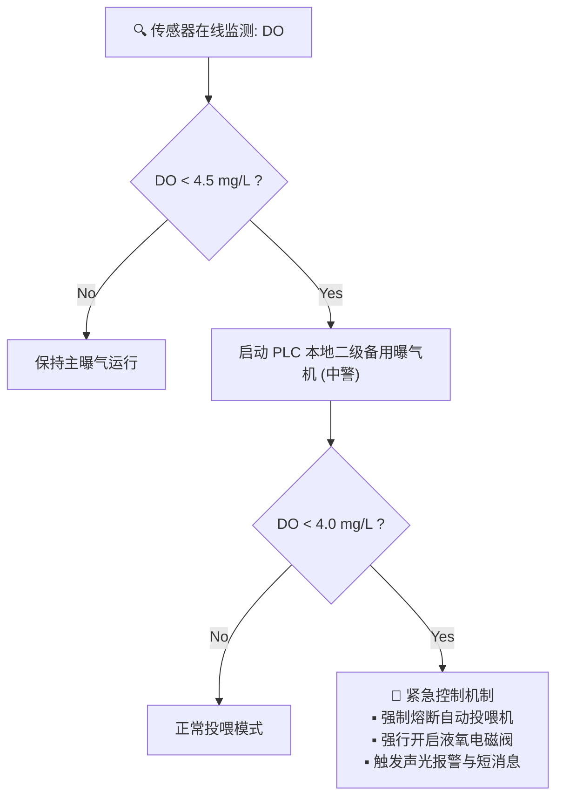

# 鱼菜共生系统：01_水产养殖子系统设计 (Aquaculture Subsystem Design)

水产养殖子系统（`aqua`）是本数字化工厂的生物源头。主要职责是确保鱼类生物资产的生命安全与健康，高精度监控水质，并通过 AI 算法实现饲料投入的最优化。

---

## 1. 系统范畴与物理边界

本子系统覆盖的物理设备和控制节点包括：
1. **陆基循环水养殖池 (RAS Tank)**：高密度鱼群居住地。
2. **生物过滤器/硝化滤池 (Biofilter)**：硝化细菌生化反应区，将有毒氨氮转化为无毒硝酸盐。
3. **气动自动投喂机 (Feeder)**：高蛋白饲料的物理投放器。
4. **曝气与制氧设备 (DO Actuators)**：鼓风曝气机、纯氧混合器、应急液氧阀。

---

## 2. 传感器选型与集成规范

根据现场的多悬浮物、易生物附着环境，严禁使用廉价开源玩具级传感器，必须强制执行以下集成规范：

### 2.1 溶解氧 (DO) 传感器
* **原理与选型**：**荧光法 (Optical DO) 传感器**（具有抗流速干扰、免频繁校准特征）。
* **物理集成**：在电极头部集成**自动气动吹扫喷嘴**，由本地 PLC 控制每 4 小时喷射一次高压空气进行清洗，防止藻类与生物膜覆盖导致读数发生下漂。

### 2.2 pH 与 水温传感器
* **原理与选型**：**双盐桥工业级玻璃 pH 电极**（耐受鱼池高浓度溶解性有机物） + **PT1000 铂热电阻**。
* **物理集成**：禁止直接悬挂于大鱼池死角。必须接入由循环水主管引出的**旁路流通槽 (Flow Cell)**，确保水流平稳，电极头部每两周需用 pH 4.01 与 7.00 标准液进行一次人工两点校准。

### 2.3 总氨氮 (TAN) 与亚硝酸盐测定
* **双轨方案**：
  1. **每日离线实验室精测**：由化验员手工取样，用比色计/分光光度计分析，数据通过实验室系统（LIMS）的 API 以 ISO 8601 时间戳自动录入水质数仓。
  2. **AI 虚拟软传感器 (Soft Sensor) 预测**：云端部署神经网络模型，输入 `[DO消耗率、pH下降斜率、历史TAN、水温、投喂量]`，反演输出分钟级的 TAN 估算值，用于早期报警。

---

## 3. PLC 本地保命逻辑（安全底线）

> [!IMPORTANT]
> 绝对不允许将生物的命交托给云端网络。如果云端服务器或边缘网关死机，本地 PLC（汇川/西门子）必须无条件执行硬闭环保护：

* **PLC 互锁机制**：一旦溶解氧跌破 $4.0\,\text{mg/L}$，PLC 直接硬件熔断投喂机控制继电器，防止投料后鱼群因消化耗氧导致急性窒息死亡。

---

## 4. 边缘 AI 核心算法实现

### 4.1 基于计算机视觉的精准投喂算法
* **硬件布局**：鱼池上方垂直悬挂 IP66 广角 RGB 相机，对准下料区。
* **算法流**：
  1. 投喂机单次只投放计划量的 $10\%$。
  2. 边缘网关（NVIDIA Jetson）利用**光流法 (Optical Flow)** 实时计算溅水花的频率与振幅，并统计鱼群的“空间群聚密集变异系数”。
  3. 当鱼群“抢食度指数”滑落至 30 以下（说明鱼已吃饱），AI 触发停机指令给 PLC，**提前熔断剩余饲料投放**。
* **商业效益**：经测试该算法可**减少 $15\% \sim 20\%$ 的饲料开支 (OPEX)**，并防止未吃完的饲料污染水体。

### 4.2 水下双目估重与病害初筛
* **估重算法**：利用水下双目 IP68 相机捕捉鱼群，通过 **YOLOv8-3D** 算法提取鱼体骨架三维点云，反算鱼体体积，误差控制在 $3\%$ 以内，为供应链系统提供高频生物量（Biomass）评估。
* **病虫害筛查**：采用 **Mask R-CNN** 分割鱼体表面，若识别出白色霉斑（水霉病潜伏期）或鳞片局部溃烂，自动在数字孪生平台标记该池为“高风险黄标”。

---

## 5. 反复调整成功的经验教训（【备注与防护墙】）

> [!CAUTION]
> **【经验教训备注：高价值墨瑞鳕的温控死线】**
> 在 2025 年江苏基地的实际调试中，曾因地源热泵控制策略失误，导致 3 号池水温在中午上升至 28.5°C。**高价值墨瑞鳕在该水温下会发生急性应激性翻塘，死淘率达 90%**。
> **在此设置系统硬性约束**：水产养殖系统（特别是高价值鳕鱼类）的水温控制，其 PLC 本地报警阈值必须写死为 **27.5°C**，一旦水温超标，必须无条件自动切断温室补光 LED（减少辐射热），并导入冷水调理，绝不可交由云端 AI 缓慢决策。
