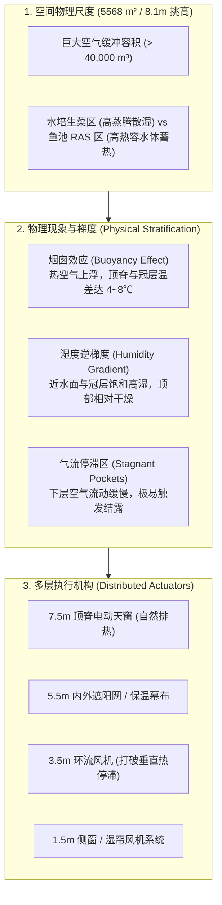
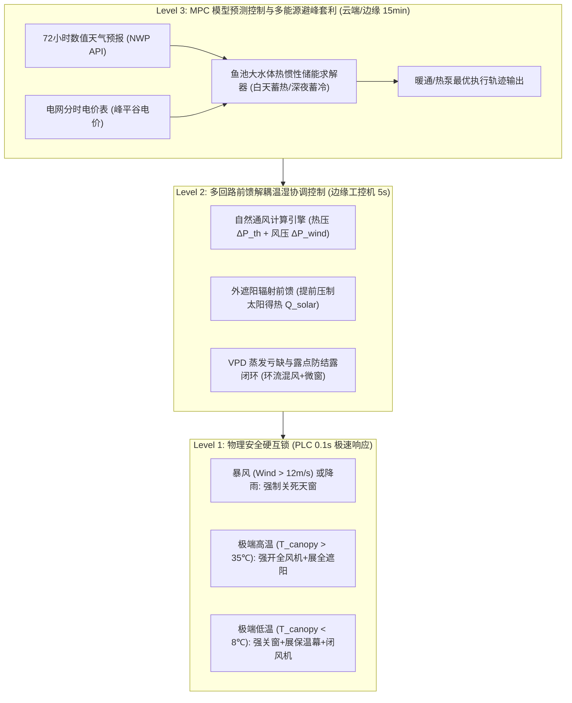
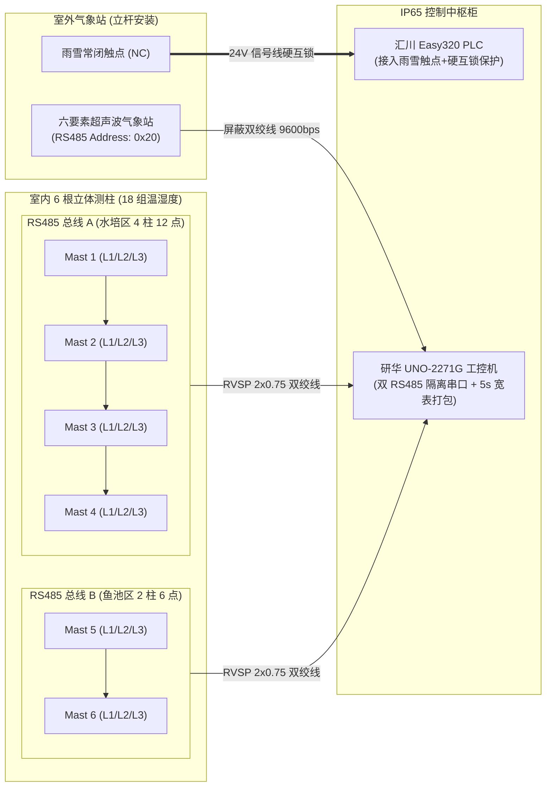

# 连锁数字化农业工厂：04_大空间温室立体微气候感知与温控策略规范 (High-Clearance Greenhouse 3D Microclimate Sensing & Thermal Control Specification)

在大型设施水培与鱼菜共生农业工厂中，温室物理空间尺度（如 $116\,\text{m} \times 48\,\text{m} \times 8.1\,\text{m}$，占地约 $5,568\,\text{m}^2$，内部空气容积超 $40,000\,\text{m}^3$）决定了其内部决非传统的“均匀单质水箱”，而是呈现出极其强烈的**空间异质性（Spatial Heterogeneity）、热分层（Thermal Stratification）以及微气候微环境分区割裂**。

如果仅在温室中央悬挂单个或单层温湿度传感器，将直接导致“顶部积热排不出、作物冠层遭冷应激、夜间高湿结露烂叶、通风控制频繁震荡”等灾难性后果。

本规范详述了 8 米挑高大空间温室的空气动力学与热力学物理机理、三维立体传感器感知阵列布网规范、室外综合气象站选型要求、分级协同温控策略算法（自然通风、辐射前馈、VPD 闭环与 MPC 避峰储热）以及工业总线实施标准。

---

## 1. 8米大空间温室热力学机理与控制难点

### 1.1 垂直热分层与烟囱效应（Thermal Stratification）
在无强机械强制对流时，气体密度随温度升高而降低，形成显著的垂直温度梯度：
$$\Delta T_v = T_{\text{ridge}}(z = 7.5\,\text{m}) - T_{\text{canopy}}(z = 1.2\,\text{m}) \approx 3.0 \sim 8.0^\circ\text{C}$$

* **控制矛盾**：若依据底部作物区温度控制顶窗，当底部刚达到阈值时，顶部已严重过热，造成蓄热过载；若依据顶部温度控制侧窗或遮阳，会导致底部作物光照不足或降温过猛。
* **物理机遇**：利用 8 米高度差形成的热浮力压头（Thermal Buoyancy Head $\Delta P_{\text{th}}$），可通过屋脊天窗实现极高效的“烟囱效应自然排热”，在春夏季节大幅减少轴流风机电费。

### 1.2 鱼菜双区热水汽耦合与不对称性
* **水培生菜区**：大面积水培床与作物旺盛蒸腾，造成近地表 $0 \sim 1.5\,\text{m}$ 区域水汽高度聚集，露点温度高。若通风不良，夜间极易在叶片凝结露水（$T_{\text{leaf}} \le T_{\text{dew}}$），诱发霜霉病和软腐病。
* **鱼池 RAS 区**：包含数百吨水体，水体比热容（$c_w \approx 4.184\,\text{kJ}/(\text{kg}\cdot^\circ\text{C})$）远大于空气。水体在白天吸收大量热量，夜间持续向空气释热排湿，形成天然的低通滤波热阻容网络。

---

## 2. 室内外三维立体传感器感知阵列规范 (3D Sensing Matrix)

为消除大空间监测盲区，系统推行 **“垂直 3 层立体分层 + 平面 6 柱网格覆盖 + 室外全要素微气象站”** 的完整感知架构：

| 空间垂直标高 | 对应功能层级 | 测点配置与标高 | 核心监测参数与目标 | 覆盖测柱网格分布 |
| :--- | :--- | :--- | :--- | :--- |
| **8.1m (顶脊)** $\sim$ 5.5m (幕布) | **[L3 顶层] 积热排热层** | 测点-3 ($z = 7.5\,\text{m}$) | 监测屋脊热气聚集强度、烟囱效应热浮力压头及天窗自然排风温差 ($T_{\text{ridge}}, RH_{\text{ridge}}$) | 覆盖全厂 6 根测柱顶部 （水培区 4 柱 + 鱼池区 2 柱） |
| **5.5m (幕布)** $\sim$ 2.0m (空中) | **[L2 中层] 空气混合层** | 测点-2 ($z = 3.8\,\text{m}$) | 监测环流风机高度出风扩散、评估上下温差梯度与热停滞死区 ($T_{\text{mid}}, RH_{\text{mid}}$) | 覆盖全厂 6 根测柱中段 （进风端 / 核心区 / 排风端） |
| **2.0m (活动区)** $\sim$ 0.0m (地面) | **[L1 冠层] 生物受控核心区** | 测点-1 ($z = 1.2\,\text{m}$) | **核心闭环控制量**：生菜冠层蒸腾、叶温饱和差、露点预测与光积累 ($T_{\text{canopy}}, RH_{\text{canopy}}, \text{PAR}, T_{\text{leaf}}, \text{VPD}$) | 紧贴生菜冠层上方 20~30cm 与鱼池水面操作区 |

### 2.1 室内垂直测柱布局与测点定义 (6 根测柱 × 3 层 = 18 组温湿度)

在 $116\,\text{m} \times 48\,\text{m}$ 平面上，设立 **6 根垂直测温柱（Vertical Sensor Masts）**：
* **水培蔬菜区（4 根）**：沿主风向/湿帘到风机流线布置 3 根（进风区、中心区、排风区），横向补充 1 根（防死角）。
* **鱼池养殖区（2 根）**：布设于循环水池上空与操作廊道。

| 垂直高度层级 | 安装高度 ($z$) | 传感器配置 | 物理测量意义与控制映射 |
| :--- | :--- | :--- | :--- |
| **Level 1 (冠层受控层)** | **1.2m ~ 1.5m** (生菜叶面上方 $20\sim30\text{cm}$) | 工业温湿度探头 (SHT40) + PAR 光量子计 + 非接触红外叶温计 | **核心反馈控制量（Process Value, PV）** • 计算真实叶面饱和水汽压差 $\text{VPD}_{\text{leaf}}$ 与露点； • 维持作物舒适区间 ($18\sim 24^\circ\text{C}$, VPD $0.8\sim 1.2\,\text{kPa}$)； • 驱动侧窗开度与环流除湿。 |
| **Level 2 (中层混合层)** | **3.5m ~ 4.0m** (环流风机出风标高) | 工业温湿度探头 (SHT35) + 超声波微风速探头 | **空间均匀度与热混合评估** • 计算垂直温差 $\Delta T_{1-2} = T_{\text{canopy}} - T_{\text{mid}}$； • 当 $\Delta T_{1-2} > 2.0^\circ\text{C}$ 时启动环流风机强制混风。 |
| **Level 3 (顶层积热层)** | **7.0m ~ 7.5m** (天窗开口下方 $50\text{cm}$) | 工业耐高温温湿度探头 (SHT35) | **烟囱效应与排热控制量** • 评估屋脊聚热强度与保温幕上部漏热； • 计算热浮力驱动压头，驱动电动天窗比例调节。 |

### 2.2 室外综合微气象站感知规范 (Outdoor Micro-Weather Station)

室外气象站安装在温室迎风侧高出屋脊 $2.0\,\text{m}$ 的专用立杆上，为温控系统提供**不可替代的前馈扰动数据（Feedforward Inputs）**与**气象灾害硬保护信号**：

| 监测模块 | 选型技术规范 | 测量参数与范围 | 控制逻辑与系统价值 |
| :--- | :--- | :--- | :--- |
| **超声波风速风向仪** | 固态四探头超声波原理，无机械旋转轴承，IP66，自带电加热除冰 | 风速: $0 \sim 60\,\text{m/s}$ ($\pm 2\%$) 风向: $0 \sim 359^\circ$ ($\pm 3^\circ$) | 1. **大风防掀硬保护**：风速 $> 12\,\text{m/s}$ 时 0.1s 强制全关顶窗； 2. **风压通风调节**：识别迎风面与背风面，开启背风窗形成负压抽风，防止冷风倒灌。 |
| **室外总辐射 / PAR 计** | 硅光电池/热电堆式总辐射表 + 光量子传感器 | 总辐射: $0 \sim 2000\,\text{W/m}^2$ PAR: $0 \sim 2500\,\mu\text{mol}/(\text{m}^2\cdot\text{s})$ | 1. **辐射前馈控制**：辐射突增 $>600\,\text{W/m}^2$ 时，提前 20 分钟展开外遮阳，压制温室热惯性超调； 2. **DLI 积分光照累积计算**。 |
| **室外高精度温湿压** | 双层防辐射百叶箱，SHT40 工业芯片 + 压阻式大气压计 | 温度: $-40 \sim 80^\circ\text{C}$ 湿度: $0 \sim 100\%RH$ 气压: $300 \sim 1100\,\text{hPa}$ | 1. **室内外焓差计算**：判断室外空气是否具备“免费自然冷源”价值； 2. **通风散热量精确换算**。 |
| **光学雨雪传感器** | 红外光学感应式（非机械翻斗），常闭 (NC) 继电器触点硬输出 | 雨雪触发响应时间 $< 0.5\,\text{s}$ | **物理第一级硬安全保护**：感应到降水瞬间，硬接线直接熔断天窗电机使能，强关天窗防雨水倒灌。 |

---

## 3. 多级协同温控策略与数学模型

### 3.1 自然通风热压与风压耦合数学模型（Natural Ventilation Model）
温室通风驱动力由**热浮力压头（Thermal Buoyancy）**与**风压（Wind Pressure）**共同决定：

1. **热压压头计算**：
   $$\Delta P_{\text{thermal}} = \rho_{\text{air}} g H \frac{T_{\text{ridge}} - T_{\text{out}}}{T_{\text{ridge}} + 273.15}$$
   其中 $H = 7.5\,\text{m}$（高差），$g = 9.8\,\text{m/s}^2$。当室内外温差大且无风时，仅靠 8 米高差即可产生强大的自抽风力。

2. **风压压头计算**：
   $$\Delta P_{\text{wind}} = \frac{1}{2} C_p \rho_{\text{air}} v_{\text{wind}}^2$$
   其中 $C_p$ 为建筑物风压体型系数（迎风面 $C_p > 0$，背风面 $C_p < 0$），$v_{\text{wind}}$ 为室外超声波风速。

3. **最优天窗开度解算**：
   综合通风量流量公式：
   $$Q_v = C_d A_{\text{eff}} \sqrt{\frac{2 (\Delta P_{\text{thermal}} + \Delta P_{\text{wind}})}{\rho_{\text{air}}}}$$
   系统根据目标降温速率，动态逆解计算天窗有效开启面积 $A_{\text{eff}}$，驱动步进/变频开窗电机，实现平滑无冲击控温。

### 3.2 太阳辐射前馈控制模型（Solar Radiation Feedforward）
太阳辐射透射进入温室后被地面、水体和植株吸收转换为长波热辐射（温室效应）。该过程存在 **$15 \sim 25\,\text{分钟}$ 的物理热滞后**。

* **传统反馈控制缺陷**：待室内冠层温度超标再展开遮阳网时，大量蓄积的辐射热已进入室内，导致温度大幅冲顶（Overshoot $> 4^\circ\text{C}$）。
* **前馈控制算法**：
  $$Q_{\text{solar\_in}} = \tau_{\text{cover}} \cdot S_{\text{outdoor}} \cdot A_{\text{floor}}$$
  当室外总辐射 $S_{\text{outdoor}} > 650\,\text{W/m}^2$ 且持续超 5 分钟时，控制器直接前馈触发外遮阳网展开至预设开度（如 $70\%$），将热负荷拦截在温室玻璃/薄膜外部。

### 3.3 鱼池大水体协同的 MPC 能耗避峰套利（Thermal MPC Arbitrage）
将鱼池水体（约数百吨）视为一个巨大的集总热容模型（Lumped Thermal Mass）：
$$C_{\text{water}} \frac{d T_{\text{water}}}{dt} = U A_s (T_{\text{air}} - T_{\text{water}}) + Q_{\text{heat\_pump}} + Q_{\text{bio}}$$

* **目标函数**：在满足生菜 ($16 \le T_{\text{air}} \le 25^\circ\text{C}$) 与成鱼 ($22 \le T_{\text{water}} \le 26^\circ\text{C}$) 生长下限的前提下，最小化全天总用电成本：
  $$\min \sum_{k=1}^{96} \text{Price}_{\text{TOU}}(k) \cdot \left[ P_{\text{HVAC}}(k) + P_{\text{Fans}}(k) \right] \Delta t$$
* **控制行为**：
  * **白天谷电/平电期 + 强光照**：允许温室水体轻度过充蓄热（水温提升至 $25.5^\circ\text{C}$）；
  * **傍晚尖峰电价期（18:00~21:00）**：全闭或低频运行大功率电加热/热泵，依靠白天水体释放的潜热与显热维持夜间初始室温，实现电费降低 $15\% \sim 25\%$。

---

## 4. 硬件电气布网、总线隔离与通信规范

在大空间温室（长边 116m，环境湿度 $>85\%RH$，存在大功率风机变频器与水泵干扰）环境下，硬件部署必须遵守以下工业级防灾标准：

### 4.1 传感器电气选型与总线拓扑
1. **探头工业防护**：室内探头必须选用具备 **IP65 防水透气膜（PTFE）+ 烧结铜过滤罩** 的工业探头，杜绝高湿环境下探头结露导致电路腐蚀损坏。
2. **总线双路物理隔离**：
   * **总线 A (室内网)**：串联水培区 4 根测柱（12 个节点）与鱼池区 2 根测柱（6 个节点），手拉手菊花链拓扑，两端加装 $120\,\Omega$ 终端匹配电阻。
   * **总线 B (室外网)**：独立接入室外气象站，避免室外雷击/浪涌沿 RS485 串入室内核心传感网。
3. **数据采集周期与时间契约**：
   * 边缘工控机每 **2 秒** 完成全网 19 个环境节点（18 室内 + 1 室外）轮询；
   * 每 **5 秒** 生成 1 张包含空间坐标与严格 ISO 8601 UTC 毫秒时间戳（如 `2026-08-17T09:46:00.000Z`）的温室空间微气候快照，打包写入本地 SQLite 与 Cloudflare D1 边缘数据中台。

---

## 5. FMEA 故障模式与边缘工况防护矩阵

| 故障模式 (Failure Mode) | 潜在危害与后果 | 硬件/软件防御机制 (Mitigation) |
| :--- | :--- | :--- |
| **突发暴雨但室外气象站通信中断** | 无法通过软件下发关窗指令，导致雨水倒灌漫池淹没电柜 | **硬件双保险**：雨雪传感器配置独立的常闭继电器触点，通过硬接线直接接入 PLC 数字量输入（DI），无需工控机介入即可触发硬互锁关窗。 |
| **夏季局部出现热停滞死区（Thermal Inversion）** | 作物冠层高温无风，蒸腾受阻诱发生理病害 | **三维温差自愈**：当任意测柱检测到 $T_{\text{canopy}} - T_{\text{mid}} > 2.5^\circ\text{C}$ 时，自动启动该区域对应的变频环流风机，强制打破热停滞。 |
| **单点传感器积尘或水汽结露导致读数漂移** | 导致温控策略错误开启排风或过度加热 | **空间相邻校验（Spatial Outlier Filter）**：边缘网关比对同一水平层相邻测柱读数，若单点偏差超过同层均值 $3\sigma$（且持续 3 个周期），自动隔离该点并标记为告警，使用插值法临时替代。 |
| **夜间高湿骤冷引发叶面结露** | 相对湿度达 $100\%$，叶片表面凝水诱发病害 | **露点预警与微通风除湿**：根据实时冠层温湿度计算露点 $T_{\text{dew}}$，当叶温 $T_{\text{leaf}} - T_{\text{dew}} \le 1.0^\circ\text{C}$ 时，自动开启天窗微缝（$5\%$）与小功率环流风机微排湿。 |

---

## 🔗 相关设计与施工规范索引 (Single Source of Truth)

* **现场弱电布线、快拆与线缆选型**：👉 [05_现场弱电线缆选型与布线施工规范.md](./05_现场弱电线缆选型与布线施工规范.md)
* **水培作物蒸腾量估算与气孔模型**：👉 [03_温室作物蒸腾量估算与感知算法规范.md](./03_温室作物蒸腾量估算与感知算法规范.md)
* **水培种植微环境与 VPD 控制**：👉 [02_水培种植子系统.md](../04_subsystems/02_水培种植子系统.md)
* **能耗优化与分时电价 MPC 调度**：👉 [03_能耗优化子系统.md](../04_subsystems/03_能耗优化子系统.md)
* **第一期硬件采购与实施计划**：👉 [03_分期实施计划书.md](../02_requirements_and_plans/03_分期实施计划书.md)
