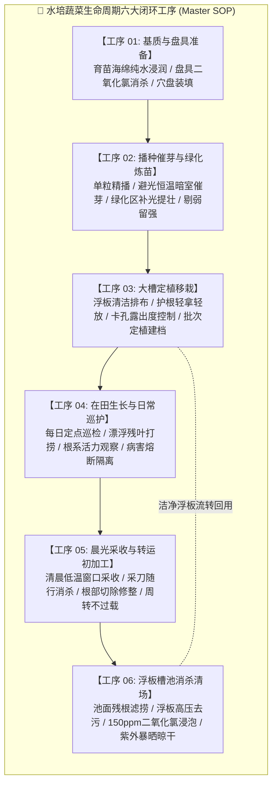
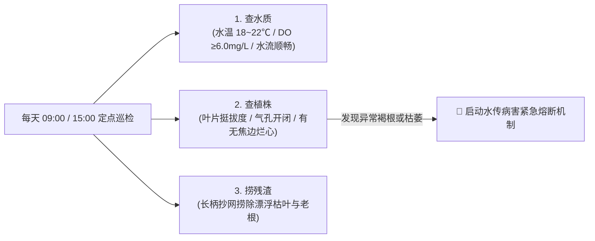
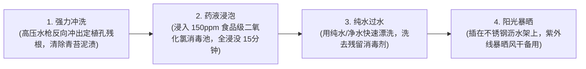

# 鱼菜共生数字工业化工厂 · 生产作业技术规范
# 03. 水培蔬菜全周期通用标准作业程序 (Master SOP)

---

> **文档版本**: v1.0.0  
> **编制归口**: 种植工程部 / 农业科技R&D中心 / 驻厂检验室 (QA/QC)  
> **发布日期**: 2026-09-23T11:30:00.000Z  
> **适用范围**: 基地全体水培操作工、育苗技术员、巡检专员、清池保洁员及农艺车间主管  
> **核心原则**: **动作标准化、生物安全一票否决、工步防错 (Poka-Yoke)、批次全程溯源**

---

## 1. 目的与作业指导体系架构

水培种植子系统采用深液流跑道 (DWC) 与浮板漂浮栽培模式。由于水体连通循环，**任何单点的人工卫生漏洞或违规操作均会在 48 小时内引发全系统水传病害（如腐霉菌根腐病）扩散，造成不可逆的毁灭性减产**。

本通用主干规程（Master SOP）旨在规范水培蔬菜从“基质准备”到“采收清场”的共通工步与生物安全底线。具体作物品种的生理参数与专用收割手法，必须配套执行相应的《专项作业指导书 (WI)》。

为贯彻**精益生产（TPS）与食品工厂目视化管理（Visual Management）**原则，本规程各工序均已独立拆分为**单工位现场作业看板（SOP Kanban）**，可直接打印塑封上墙或在工位工业平板上单页显示，工位责任人依卡作业并每日打卡交接。

### 1.1 现场独立工位看板快速导航矩阵 (Station Kanban Quick Links)

| 看板编号 | 看板名称与直达链接 | 物理悬挂/显示工位 | 关键防错红线 (Poka-Yoke) |
| :---: | :--- | :--- | :--- |
| **KB-00** | 👉 [车间入口二级生物安全与手消看板](./sop_kanban/KB-00_车间入口二级生物安全与手消看板.md) | 更衣室门前、风淋室与二级消毒闸口 | 严禁沾带泥土入场；严禁头发外露；踏垫滞留 ≥ 5 秒 |
| **KB-01** | 👉 [海绵浸润脱气与穴盘准备工位看板](./sop_kanban/KB-01_海绵浸润脱气与穴盘准备工位看板.md) | 育苗播种间前处理水槽与基质准备台 | 严禁自来水直接泡海绵；吸水率 ≥ 95%；旧盘必须二氧化氯浸消 |
| **KB-02** | 👉 [精量播种与暗室催芽工位看板](./sop_kanban/KB-02_精量播种与暗室催芽工位看板.md) | 播种操作台、催芽暗室门上、绿化补光架 | 严禁生菜 > 25℃ 催芽（防热休眠）；露白 70% 即刻出室炼苗 |
| **KB-03** | 👉 [分苗定植与浮板入水工位看板](./sop_kanban/KB-03_分苗定植与浮板入水工位看板.md) | 定植流水线、深水跑道入水端起步工位 | 严禁手指触碰白色幼根；撕苗不伤根；单板扫码绑定 RFID |
| **KB-04** | 👉 [深水跑道日常巡检与病弱株隔离看板](./sop_kanban/KB-04_深水跑道日常巡检与病弱株隔离看板.md) | 主通道立柱、各跑道移动巡检车、隔离间 | 严禁夜间停曝气；严禁水下扯病根；整板装入红标密闭桶隔离 |
| **KB-05** | 👉 [成熟蔬菜采收切根与初分级工位看板](./sop_kanban/KB-05_成熟蔬菜采收切根与初分级工位看板.md) | 各跑道末端出水区、采收作业操作台 | 严禁拔根扯出碎根；空心菜留节 5~8cm 且割口离水 ≥ 3cm；每板酒精擦刀 |
| **KB-06** | 👉 [浮板高压清洗与三级消杀工位看板](./sop_kanban/KB-06_浮板高压清洗与三级消杀工位看板.md) | 洗板区、浸泡消毒池、暴晒立体晾板架 | 严禁未干湿板复用；浮板必须 100% 浸没消杀池 15 分钟；严禁次氯酸钠 |
| **KB-07** | 👉 [大棚设施与生态环境日常巡检看板](./sop_kanban/KB-07_大棚设施与生态环境日常巡检看板.md) | 温室主通道中央立柱、巡检移动推车 | 严禁双门同开；严禁水下刷散青苔（喷3%双氧水）；格栅下无死水小黑飞 |



---

## 2. 人员进出与温室生物安全铁律（二级物理屏障）

进入种植温室的所有人员必须无条件严格执行以下三步防护流程：

```
[ 更鞋区: 脱下外来便鞋 ➔ 换穿食品级防滑白雨靴 ] 
                       ⬇
[ 更衣区: 穿戴防静电防飞絮连体工作服 ➔ 佩戴透气发网帽 (头发完全包覆) ] 
                       ⬇
[ 风淋与手消通道: 30秒风淋除尘 ➔ 感应洗手 (纯水洗净) ➔ 75% 酒精感应揉搓20秒 ➔ 踏入消毒垫过闸 ]
```

> [!CAUTION]
> **一线操作三大一票否决红线（违者直接离岗停职）**：
> 1. **严禁徒手触碰根系**：手指皮脂、汗液及外界携带的真菌孢子是根腐病的头号载体，任何移栽、分苗操作**必须只捏取海绵块中上部**，严禁用手接触裸露白色根须！
> 2. **严禁带泥土入温室**：大棚外土壤潜伏着大量线虫、立枯病菌与镰刀菌。外来任何工具、鞋靴沾带土壤进入水培跑道区，按严重生物安全事故处理！
> 3. **工具专色专用与随身消杀**：
>    * 🟢 **绿色工具**：专用于育苗与移栽定植；
>    * 🔵 **蓝色工具**：专用于成熟蔬菜采收与修整；
>    * 🔴 **红色工具**：专用于病株处理与清池垃圾打捞；
>    * **跨槽作业时，刀剪必须浸入消毒桶消毒，严禁混用！**

---

## 3. 六大核心工序标准作业规范 (SOP Work Steps)

### 工序 01：基质浸润与穴盘准备工序

* **工位目标**：消除育苗海绵酸碱残毒与杂菌污染，确保基质含水均匀饱和。
* **作业时间**：计划播种前 4 小时完成。

| 工步号 | 操作动词 | 标准作业手法与控制指标 | 专用物料与工具 | 防错红线与违规判定 (Don'ts) |
| :---: | :--- | :--- | :--- | :--- |
| 1.1 | **盘具消杀** | 塑料育苗盘（128/200穴）全浸没于配制好的 **$100\sim 150\,\text{mg/L}$ 二氧化氯水池** 中浸泡 15 分钟，捞出沥干。 | 浸泡水槽、二氧化氯试纸、PVC防化手套 | 严禁使用未消杀的返还旧盘直接装填！ |
| 1.2 | **海绵脱气** | 选用 $25\times 25\times 25\,\text{mm}$ 开十字口水培专用聚氨酯海绵块，放入专用揉洗水槽中，通入纯水反复挤压排出内部空气。 | 专用揉洗水槽、检验室商用 RO 纯水 | 严禁使用含余氯的自来水直接浸泡海绵！必须排出海绵内部气泡，确保吸水率 $\ge 95\%$。 |
| 1.3 | **平整铺盘** | 将完全吸饱水的水培海绵整张平整铺入育苗盘内，海绵表面距盘口边缘齐平，盘底无空隙倾斜。 | 128穴/200穴育苗平底盘 | 严禁海绵表面凹凸不平，否则后续播种深度不一导致出苗参差不齐。 |

---

### 工序 02：精量播种、暗室催芽与绿化炼苗工序

* **工位目标**：出苗整齐率 $\ge 92\%$，幼苗根白茎壮，无徒长、无烧心、无藻类滋生。

| 工步号 | 操作动词 | 标准作业手法与控制指标 | 专用物料与工具 | 防错红线与违规判定 (Don'ts) |
| :---: | :--- | :--- | :--- | :--- |
| 2.1 | **精量点播** | 种子置于海绵十字切口正中心，深度严格控制在 **$3\sim 5\,\text{mm}$**；每穴严格定额点入指定粒数（生菜单粒，空心菜按细则）。 | 气吸式播种机或无磁不锈钢移种镊 | 严禁种子下陷太深（超过8mm缺氧闷种），严禁浮在海绵表面（干燥不发芽）。 |
| 2.2 | **暗室催芽** | 播种盘送入恒温催芽暗室，码垛高度 $\le 8$ 层，底层垫托架；控制室内温度 $18\sim 22^\circ\text{C}$，相对湿度 $85\%\sim 90\%$，保持全黑避光。 | 催芽架、温湿度记录仪 | 严禁催芽室漏光（生菜等光敏种子出芽不齐）；每 12 小时检查一次露白状态。 |
| 2.3 | **适时转绿** | 当胚根破皮露白率达 **$80\%$** 时（通常 36~48 小时），立即移出暗室推入育苗绿化架，严禁暗室过夜长成黄化豆芽苗！ | 移苗周转推车 | 露白后超时滞留暗室属于严重违规，会导致幼苗胚轴严重徒长直接报废！ |
| 2.4 | **光肥管理** | 开启 LED 育苗补光灯（PPFD 控制在 $150\sim 200\,\mu\text{mol}/(\text{m}^2\cdot\text{s})$，光周期 14h 光照/10h 黑暗）；底部潮汐托盘供给 **$1/4$ 标准剂量营养液**（EC 控制在 $0.8\sim 1.0\,\text{mS/cm}$，pH $5.8\sim 6.2$）。 | 潮汐补肥车、便携式 EC/pH 笔 | 严禁用全浓度高 EC 营养液浇灌幼苗，防止高渗透压烧焦嫩根！ |
| 2.5 | **剔弱检苗** | 定植前 24 小时执行苗质大检，严格执行**“三不移原则”**：①子叶畸形黄化苗不移；②根尖发褐无毛细根苗不移；③胚轴细长倒伏苗不移。 | 剔苗镊、废苗回收桶 | 严禁将病弱苗混入大水槽！弱苗直接镊除淘汰。 |

---

### 工序 03：大槽定植移栽工序

* **工位目标**：轻放护根、卡孔稳固，成活率 $\ge 98\%$。
* **移栽标准**：幼苗达到 3~4 片真叶、茎基粗壮、盘底根系穿出海绵块 $2\sim 4\,\text{cm}$ 时为最佳移栽期。

| 工步号 | 操作动词 | 标准作业手法与控制指标 | 专用物料与工具 | 防错红线与违规判定 (Don'ts) |
| :---: | :--- | :--- | :--- | :--- |
| 3.1 | **浮板排查** | 从清洁晾干区提取经过消杀的白色 EPP/泡沫浮板，检查定植孔内壁无青苔残根，浮力测试无破损吸水。 | $1200\times 800\,\text{mm}$ 标准浮板 | 严禁使用带有上一茬青苔或发霉黑斑的浮板！ |
| 3.2 | **起苗手法** | 双手轻托育苗盘底部向上顶起，单手用食指与拇指轻轻捏住海绵块中上部，垂直平稳向上提拉出盘，**绝不允许用力揪扯叶片或根系**。 | 专用顶盘模具 | 严禁用手抓扯嫩叶拔苗！叶片破损会导致软腐病菌从伤口侵染。 |
| 3.3 | **入孔深度** | 将海绵块自浮板孔正上方垂直推入，**海绵块底部露出浮板下底面 $5\sim 8\,\text{mm}$**，确保下部根系自然垂入水体，同时海绵顶端低于浮板表面，防止水体倒灌淹没心叶。 | 浮板定位架 | 严禁海绵顶端露出浮板过多（海绵风干脱水死苗）；严禁海绵全部沉入水下（淹没生长点导致烂心）。 |
| 3.4 | **浮板入水** | 两人双手平托浮板两侧，平稳轻放入深液流水槽中，沿导轨向前轻推，板与板之间轻触靠拢，严禁剧烈撞击荡起波浪冲翻幼苗。 | 跑道导向限位条 | 严禁单手掀板扔入水中！水面剧烈晃动会导致根系缠绕断裂。 |

---

### 工序 04：在田生长与每日巡检工序

* **工位目标**：维持健康水体微环境，阻断病虫害滋生，实现单株全息溯源。
* **作业班次**：每日上午 **09:00** 与下午 **15:00** 固定双巡检制度。



| 工步号 | 操作动词 | 标准作业手法与控制指标 | 专用物料与工具 | 防错红线与违规判定 (Don'ts) |
| :---: | :--- | :--- | :--- | :--- |
| 4.1 | **捞残净槽** | 手持细眼尼龙抄网沿跑道巡视，打捞掉落水中的脱落黄叶、残枯老根及浮尘杂物，放入专用带盖收集桶。 | 细目不锈钢长柄抄网、封闭废料桶 | 严禁残叶在水槽内浸泡腐烂！腐殖质在水中会急剧消耗溶解氧并滋生腐霉菌。 |
| 4.2 | **根系翻检** | 每条跑道随机抽翻 3~5 块浮板，肉眼观察根系：健康根系呈**“雪白色至乳白色、毛细根丰富、无黏腻手感、无异味”**。 | 随身强光检查手电 | 若根系出现**“微黄色、浅褐色、水浸状软化、有酸臭腥味”**，属于严重根腐预警，必须立即上报！ |
| 4.3 | **病害熔断** | 一旦判定某浮板出现疑似病株（枯萎萎蔫、黑根软腐）：**立即停用该区域一切工具**；工人戴一次性手套连板完整托出温室，装入黑色加厚密封袋运往废弃物处理站。整槽水体启动臭氧/双氧水紧急冲击消杀。 | 加厚密封袋、75%手消液、次氯酸消毒喷壶 | 严禁徒手拔除病株扔在过道上！严禁翻动病株水槽后再去触碰健康槽！双手必须立即酒精彻底消杀。 |

---

### 工序 05：晨光采收与转运初加工工序

* **工位目标**：黄金采收窗口锁水，切口规整，无泥无杂，符合出厂商品规格。
* **采收窗口**：必须严格执行**早晨 06:00 ~ 09:30** 低温高水分窗口期采收（严禁正午高温强光蒸腾期采收，否则失水萎蔫货架期减半）。

| 工步号 | 操作动词 | 标准作业手法与控制指标 | 专用物料与工具 | 防错红线与违规判定 (Don'ts) |
| :---: | :--- | :--- | :--- | :--- |
| 5.1 | **采刀消杀** | 采收专员佩戴食品级一次性丁腈手套；随身携带挂腰式消杀杯（内置 75% 酒精脱脂棉），采刀每收割一板必须在酒精棉上滑擦消毒一次。 | 弧形不锈钢采收弯刀、挂腰消毒杯 | 严禁使用生锈或未消毒的刀具！严禁用采刀直接剔除地面积水杂物。 |
| 5.2 | **规范收割** | 依品种规程下刀：整株采收类（生菜）在根茎交界处（海绵块上方 2~3mm）水平一刀切断，切口平整无撕裂；割茬类（空心菜）按留节标准剪取嫩梢。 | 采收刀具、采收操作小车 | 严禁向上硬拔！硬拔会导致根系碎屑掉落水中污染水体。 |
| 5.3 | **去老分级** | 现场剥除最外层接触浮板的 1~2 片老化枯萎底叶，叶面保持清爽无腐烂，称重符合该品种出厂标准等级。 | 称重台称、去叶废料篓 | 严禁将带黄斑、虫伤、褐变烂叶装入商品周转箱！ |
| 5.4 | **装筐不过载** | 蔬菜根部朝下或侧卧平整码入食品级打孔通风周转筐内，单筐净重严格限制在 **$\le 5.0\,\text{kg}$**（不得超过筐沿），防止下层叶片受压挤伤出水。 | 食品级绿色透气周转筐 | 严禁野蛮扔菜扔筐！严禁超高堆叠压碎菜叶！采收后 15 分钟内必须推入隔壁包装车间进行预冷。 |

---

### 工序 06：浮板清洗与槽池消杀清场工序

* **工位目标**：彻底切断上一茬病原菌与藻类残留，实现浮板“无菌化”复用流转。
* **作业地点**：温室配套的专用清洗消毒区（非栽培区）。



| 工步号 | 操作动词 | 标准作业手法与控制指标 | 专用物料与工具 | 防错红线与违规判定 (Don'ts) |
| :---: | :--- | :--- | :--- | :--- |
| 6.1 | **高压除藻** | 采空浮板送至洗板槽，使用 $6\sim 8\,\text{MPa}$ 扇形高压水枪反向冲刷定植孔孔口及板面，冲净残留须根与附着青苔。 | 高压清洗机、尼龙硬毛刷 | 严禁用钢丝球刮擦浮板，防止破坏发泡表面形成粗糙凹坑藏匿病菌。 |
| 6.2 | **全没消杀** | 冲净的浮板压入配制好的 **$150\,\text{mg/L}$ 食品级稳定型二氧化氯** 浸泡池，使用压板条固定确保浮板 100% 没入水面以下，浸泡时间必须满 **$15\,\text{分钟}$**。 | 二氧化氯浸泡池、计时器、浓度测试条 | **严禁私自使用次氯酸钠 (84消毒液) 替代二氧化氯！**（微孔残留导致下茬严重烧根烂死）；严禁浮板漂在药水表面只泡到底面！未浸没的孔位将成为真菌温床。 |
| 6.3 | **立式暴晒** | 消毒完毕后用纯水快速冲刷沥干，单块插在专用不锈钢通风沥水架上，在通风阳光充足区晾晒至少 **24 小时** 完全干燥方可周转。 | 立式不锈钢晾板架 | 严禁湿板直接套叠存放！潮湿紧密堆叠会发生厌氧发酵产生黏滑黑霉。 |

> [!NOTE]
> **【经验教训备注：消杀药剂选型红线】**
> 在以往生产测试中，曾有班组擅自采用工业次氯酸钠（84消毒液）浸泡浮板，由于发泡板材蜂窝孔隙的吸附效应，次氯酸钠无法通过普通晾晒挥发，导致定植的 200 余块浮板幼苗入水后发生**“根尖烧焦发黑坏死”**全批报废；且消杀池因强碱导致有效氯迅速失效，反而诱发了腐霉菌交叉感染。自此确立铁律：**全厂浮板与器具消杀唯一指定食品级二氧化氯，严禁次氯酸钠入场！**

---

## 4. 异常工况应急熔断响应机制

遇到以下严重环境或水质异常时，一线工人必须停止常规作业，并在 **5 分钟内** 启动熔断上报流程：

1. **溶解氧骤降红线（$\text{DO} < 4.0\,\text{mg/L}$）**：
   * **现象**：巡检发现整池鱼跳出水面或蔬菜根须周围无气泡；
   * **紧急动作**：工人立即手动合上配电箱“应急纯氧射流备用开关”，检查罗茨风机空气滤芯是否堵塞，通知电气值班员；
2. **水泵跳闸断流（停水停电事件）**：
   * **应急动作**：深液流系统具备 280mm 储水缓冲（可支撑 12 小时无水流不干枯），工人切勿慌乱排空水槽；必须第一时间拉起应急警报，确认备用柴油发电机自动投切并手动开启各水槽气动隔断阀；
3. **农药或有害化学品误入水体**：
   * **最高级事故**：严禁私自将漂白水、高浓度杀虫剂倾倒于跑道水体。一旦发生误投误溅，立即按下急停按钮切断进排水循环，物理隔离该水槽，挂红牌警示封存整池蔬菜。

---

## 5. 【工程经验教训记录】（Engineering Lessons Learned）

> [!CAUTION]
> **一线运行深刻血泪教训（写入培训必考大纲）**：
> 1. **【切刀交叉感染是死苗的第一推手】**：某批次生菜发生软腐病，调查发现工人用同一把采收刀先切除了病株，未消毒直接去切采健康优质菜，导致整垄 2000 棵生菜在包装出库 24 小时后全线软烂流脓。**必须强制执行“每切一板，刀刃在酒精棉上滑擦一次”的标准动作**。
> 2. **【浮板不晒透等于种下真菌炸弹】**：刚清洗完还滴着水的湿浮板直接用来定植，孔洞缝隙内残留的厌氧菌会在 24 小时内直接侵蚀新苗嫩根。**浮板必须执行“洗-泡-晒”满 24 小时绝对风干方可回用**。
> 3. **【海尔 4°C 留样每批必留】**：包装出厂的每一批蔬菜，采收专员必须随机抽取 2 株整菜，装入专用留样自封袋并贴上二维码，直接交送室 2 放入海尔冷藏箱冷藏留样 72 小时。这是应对商超及客户异议唯一的法定免责物证！

---

## 🔗 关联文档与设计规范

* **品类专向栽培作业指导书 (生菜与空心菜)**：👉 [04_水培生菜与空心菜品类专向栽培作业指导书(WI).md](./04_%E6%B0%B4%E5%9F%B9%E7%94%9F%E8%8F%9C%E4%B8%8E%E7%A9%BA%E5%BF%83%E8%8F%9C%E5%93%81%E7%B1%BB%E4%B8%93%E5%90%91%E6%A0%BD%E5%9F%B9%E4%BD%9C%E4%B8%9A%E6%8C%87%E5%AF%BC%E4%B9%A6%28WI%29.md)
* **驻厂检验室建设与出厂放行表**：👉 [docs/04_subsystems/07_quality_assurance_lab/02_驻厂检验室建设预算规划与投资测算表(设备与装修).md](../07_quality_assurance_lab/02_驻厂检验室建设预算规划与投资测算表(设备与装修).md)
* **大空间温室立体微气候感知与温控规范**：👉 [02_大空间温室立体微气候感知与温控策略规范.md](./02_大空间温室立体微气候感知与温控策略规范.md)
* **水培种植子系统总览**：👉 [README.md](./README.md)
