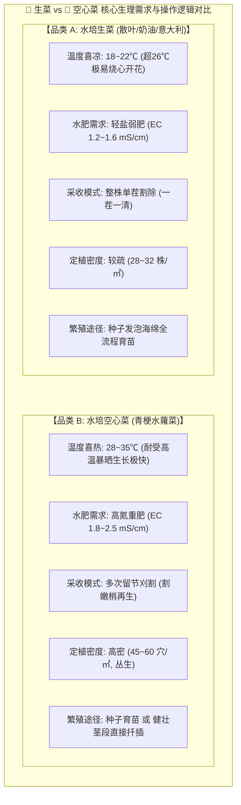
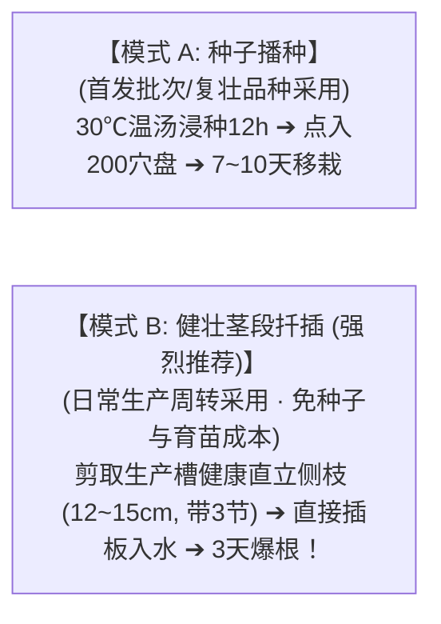

# 鱼菜共生数字工业化工厂 · 现场作业指导规范
# 04. 水培生菜与空心菜品类专向栽培作业指导书 (Crop-Specific WI)

---

> **文档版本**: v1.0.0  
> **编制归口**: 种植工程部 / 农业科技R&D中心 / 驻厂检验室 (QA/QC)  
> **发布日期**: 2026-09-23T11:30:00.000Z  
> **执行依据**: 必须在严格遵循 👉 [03_水培蔬菜全周期通用标准作业程序(Master_SOP).md](./03_水培蔬菜全周期通用标准作业程序(Master_SOP).md) 基础上执行  
> **核心原则**: **品类生理特化、定植密度刚性、采收动作精准、环境参数动态自适应**

---

## 1. 适用范围与品类生理特性对比

本指导书针对数字工厂水培深液流（DWC）栽培系统中的两大核心支柱作物品类——**耐凉轻肥型生菜类** 与 **耐热喜氮型空心菜类** 制定细项操作准则。



---

## 2. 专项作业指导 01：水培生菜类 (WI-HYD-LET)

### 2.1 种子选型与专用催芽参数
* **主力商业品种**：意大利散叶生菜、罗莎红散叶生菜、波士顿奶油生菜（耐抽薹杂交一代表包种子）；
* **催芽温湿度**：恒温催芽室内保持温度 **$18.0 \sim 20.0^\circ\text{C}$**（严禁超过 25℃，生菜种子在高温下会诱发热休眠不发芽！），相对湿度 **$85\% \sim 90\%$**；
* **光照控制**：**全避光暗室催芽 36~42 小时**。每 12 小时抽检一次，当看到海绵十字缝内幼芽破壳露白率达 **$80\%$** 时，必须立即推出暗室推入育苗架补光，超时将迅速形成黄化线苗报废。

### 2.2 苗期管理与定植指标（育苗时长：14~18 天）
* **绿化光配方**：采用红蓝比 $4:1$ 的专用水培 LED 光源，PPFD 维持在 $150 \sim 180\,\mu\text{mol}/(\text{m}^2\cdot\text{s})$，光周期 $14\,\text{h}$ 光照 / $10\,\text{h}$ 黑暗；
* **苗期潮汐水肥**：采用 $1/4$ 剂量标准液，EC 控制在 **$0.8 \sim 1.0\,\text{mS/cm}$**，pH **$5.8 \sim 6.2$**；
* **定植出圃硬指标**：
  1. 日龄：出苗后第 $14 \sim 18\,\text{天}$；
  2. 叶龄：具有 **$3 \sim 4$ 片平展深绿真叶**，心叶舒展，无畸形卷叶；
  3. 根系：底部主根穿出海绵块 **$3 \sim 5\,\text{cm}$**，根色晶莹雪白，毛细根密集。

### 2.3 浮板定植密度与跑道布设
* **浮板规格**：$1200\text{mm} \times 800\text{mm}$ 食品级白色 EPP 浮板，厚度 $30\text{mm}$；
* **开孔与密度**：采用 **$6\text{行} \times 4\text{列} = 24\text{孔/板}$**（行距 200mm，株距 200mm），折合单位面积种植密度为 **$25 \sim 30\,\text{株/m}^2$**；
* **放苗深度**：海绵块底部露出浮板底面 **$5\sim 8\,\text{mm}$**，确保幼根充分没入流动水流，但海绵上表面凹陷于板面 $3\,\text{mm}$，严防水波浸泡心叶。

### 2.4 在田环境与水质靶标控制
* **跑道水温管理**：深液流跑道水温严格控制在 **$18.0 \sim 22.0^\circ\text{C}$**（极端夏季依靠湿帘风机与深水体大热容压制，水温 $>24^\circ\text{C}$ 时启动制冷机组联锁）；
* **根区溶解氧 (DO)**：保持 **$\text{DO} \ge 6.0\,\text{mg/L}$**（必须维持微纳米射流曝气）；
* **营养液指标**：EC 控制在 **$1.2 \sim 1.6\,\text{mS/cm}$**，pH 维持在 **$5.8 \sim 6.2$**；
* **【高温季防顶烧心 (Tipburn) 专用动作】**：
  * **机理**：顶烧心实质是蒸腾过旺或根系缺氧导致的“幼嫩心叶局部缺钙”；
  * **工人标准动作**：夏季若环境 VPD 超过 $1.3\,\text{kPa}$，巡检工人必须在每日 11:00~14:00 检查垂直环流风机，确保叶冠层微风速在 **$0.3 \sim 0.5\,\text{m/s}$**，促进心叶蒸腾拉动钙素吸收；若发现微弱焦边，立即通知调理池微补 $0.05\,\text{mmol/L}$ 硝酸钙。

### 2.5 采收与整修标准
* **采收窗口**：大槽定植后第 **$22 \sim 28\,\text{天}$**，清晨 **06:00 ~ 09:00** 进行；
* **商品单株规格**：单株毛重达到 **$180 \sim 220\,\text{g}$**，冠幅舒展直径 $20 \sim 25\,\text{cm}$；
* **下刀手势与动作**：
  1. 左手轻托生菜腰部，右手持消毒采收弯刀，贴紧浮板上表面，在海绵块上方 **$2 \sim 3\,\text{mm}$** 水平一刀利落切断；
  2. 严禁向上用力拉拔断根！切口必须平齐呈白色；
  3. 现场轻巧剥除紧贴浮板的老化黄叶 $1 \sim 2$ 片，保持商品菜叶球紧实洁净，装筐送入冷库预冷。

---

## 3. 专项作业指导 02：水培空心菜类 (WI-HYD-SPN)

### 3.1 两种高效繁殖途径（种子育苗 vs 茎段扦插）
空心菜具有极强的无性克隆再生能力，基地推行两种并行的繁殖模式：



1. **种子育苗法（春季首期）**：
   * 采用 $35^\circ\text{C}$ 温汤浸种 12 小时打破种皮硬度，点入 200 穴育苗海绵，每穴点播 **$2 \sim 3\,\text{粒}$**（保证成丛）；
   * 催芽温度控制在 **$25 \sim 30^\circ\text{C}$**，露白后绿化，苗龄 $10 \sim 12\,\text{天}$ 即可定植。
2. **茎段扦插法（日常周转极推）**：
   * 在健康空心菜槽中，选取粗壮（节间粗度 $\ge 4\text{mm}$）、无斑无虫的直立侧枝；
   * 使用消毒剪刀剪取长度 **$12 \sim 15\,\text{cm}$**、具有 **$3 \sim 4$ 个节位** 的健壮茎段，去除基部 1 片叶；
   * 基部穿过海绵块固定插入浮板定植孔，使基部 1 个节位浸入水流中。**扦插后 72 小时即可从节位萌发出茂密白根，比播种快 5 天以上，且株系极其纯正整齐！**

### 3.2 浮板定植密度与立式丛生控制
* **浮板规格**：$1200\text{mm} \times 800\text{mm}$ 白色 EPP 浮板；
* **开孔与密度**：采用 **$8\text{行} \times 6\text{列} = 48\text{孔/板}$**（孔距约 $150\text{mm} \times 130\text{mm}$），每孔定植 **$2 \sim 3\,\text{株}$**，折合单位面积综合密度为 **$45 \sim 55\,\text{穴/m}^2$（约 120~150 株/㎡）**；
* **立式丛生姿态**：空心菜依靠高密丛生互相依附向上直立拔高，严禁过稀导致植株在水面上倒伏蔓延。

### 3.3 在田水肥与温湿靶标（喜热喜氮重肥）
* **跑道水温管理**：最适水温 **$24.0 \sim 28.0^\circ\text{C}$**；空心菜极耐高温，夏季大棚内气温达到 $35^\circ\text{C}$ 时生长速度最快，无需开启湿帘强力降温；
* **营养液指标**：
  * EC 控制在 **$1.8 \sim 2.5\,\text{mS/cm}$**（耐肥能力极强，高 EC 能促进嫩茎增粗）；
  * pH 维持在 **$6.0 \sim 6.8$**；
  * 氮素水平维持在 $200 \sim 250\,\text{mg/L}$（硝态氮与铵态氮平衡比 $7:3$），促进叶绿素合成与茎秆脆嫩。

### 3.4 专用多次留节刈割收割法（核心技术核心动作）
空心菜一次定植可连续采收 **$6 \sim 10\,\text{茬}$**，割茬手法决定了下一茬的产量与品质：

```
                    【空心菜留节刈割解剖示意】
                    
              🌱 顶端嫩梢 (采收商品菜: 长度 15~20cm) ───[ 剪切入筐 ]
                      │
   ─── 剪切线 ───✂─── 45°斜角下刀 (离水面 ≥ 3cm) ─────────────────
                      │
              🌿 第 3 节位 (萌发第1侧芽) ──┐
                      │                   ├─ [ 严禁剪光！保留基部活节 ]
              🌿 第 2 节位 (萌发第2侧芽) ──┘
                      │
             ═══════ 浮板表面 ═══════
                      │
              🧽 定植海绵与深水粗壮根系
```

* **收割手法工步**：
  1. **首茬收割**：定植后第 $18 \sim 22\,\text{天}$，株高达到 $25 \sim 30\,\text{cm}$ 时开割；
  2. **留节高度**：采收人员左手握住嫩梢上部，右手持锋利不锈钢园艺剪刀，**基部严格保留 $2 \sim 3$ 个健壮节位（留桩高度约 $5 \sim 8\,\text{cm}$）**；
  3. **45°斜角剪切**：刀口呈 **45° 斜角快速平整剪断**，严禁横向钝切导致茎秆破裂失水或烂桩；
  4. **剪口离水安全距离**：剪切口距离浮板水面必须 **$\ge 3\,\text{cm}$**，严禁剪得过深导致剪口泡在营养液中引发切口黑腐。
* **刈割后 24 小时管护**：
  * 刚割完的当天，**严禁对冠层进行高压喷雾**，让剪口自然风干形成木栓质保护层愈合；
  * 调理池根据割茬批次，适量补充中继水肥，维持槽内高溶氧。通常割后第 3 天新芽萌出，第 10~12 天即可割取下一茬！
* **整池淘汰与轮茬判定**：
  * 当某板空心菜连续刈割达到 **$8 \sim 10\,\text{茬}$**（或发现基部主茎严重木质化变硬、发出的侧芽细弱老化）时，必须整板淘汰移出清场，换上新扦插浮板，保持全年旺盛活力。

---

## 4. 两类蔬菜关键控制点 (CCP) 现场速查看板

| 控制维度 | 水培生菜类（散叶/奶油生菜）现场卡 | 水培空心菜类（水蕹菜）现场卡 |
| :--- | :--- | :--- |
| **种子催芽温湿度** | **18~20℃ 恒温**，湿度 90%，全避光 36~42h（忌高温） | **25~30℃ 微温**，35℃温汤浸种 12h，湿度 90% |
| **育苗成苗周期** | 14~18 天（3~4 片真叶） | 10~12 天（播种）或 **3 天生根（侧枝扦插）** |
| **浮板种植密度** | **24 孔/板（约 28~32 株/㎡）** | **48 孔/板，每孔 2~3 株（约 45~55 穴/㎡）** |
| **营养液 EC 靶标** | **$1.2 \sim 1.6\,\text{mS/cm}$（轻肥防焦边）** | **$1.8 \sim 2.5\,\text{mS/cm}$（高氮重肥促嫩茎）** |
| **营养液 pH 靶标** | **$5.8 \sim 6.2$** | **$6.0 \sim 6.8$** |
| **水温安全警戒线** | 最高警戒：**$\le 22.0^\circ\text{C}$**（超 24℃ 启动降温） | 宽容适应：**$22.0 \sim 30.0^\circ\text{C}$**（极耐热） |
| **单茬采收天数** | 定植后 **22 ~ 28 天** | 定植后首茬 **18~22天**，后续每 **10~12天** 割一茬 |
| **采收标准手法** | **全株贴紧海绵上方平切**，剥除 1~2 片黄底叶 | **留基部 2~3 节（5~8cm）45°斜切**，剪口离水面 $\ge 3\text{cm}$ |
| **商品菜规格标准** | 单株毛重 **$180 \sim 220\,\text{g}$**，无焦边苦味 | 嫩梢长度 **$15 \sim 20\,\text{cm}$**，茎粗翠绿无纤维化 |
| **一票否决避坑项** | 严禁高温水肥暴晒（防顶烧心与抽薹） | 严禁留节过低齐根平切（剪断生长点将无法再生） |

---

## 5. 【工程经验教训记录】（Engineering Lessons Learned）

> [!CAUTION]
> **一线实操核心避坑备忘**：
> 1. **【生菜热休眠陷阱】**：夏季气温高达 35℃ 时，很多新手直接在大棚内播种生菜，结果连续两周发芽率不足 10%。生菜种子具有热休眠机理，**必须在控温在 18~20℃ 的催芽暗室内露白**，才能保证 90% 以上发芽率。
> 2. **【空心菜扦插比播种省工省钱 5 倍】**：空心菜用种量大且种皮厚出苗慢。生产稳定后，**直接从生长良好的栽培槽中剪取健壮嫩枝扦插，不仅省去种子采购费和 10 天育苗电费，而且长出的空心菜无退化、粗细一致**。
> 3. **【空心菜割茬严防剪口入水烂桩】**：工人采收空心菜为了多要产量往往贴着浮板剪，导致剪口没入营养液中，切口在水里迅速发黑腐烂导致整穴死亡。**必须严守“剪口离水面 $\ge 3\,\text{cm}$”的铁律！**

---

## 🔗 关联文档与设计规范

* **水培蔬菜全周期通用标准作业程序 (Master SOP)**：👉 [03_水培蔬菜全周期通用标准作业程序(Master_SOP).md](./03_水培蔬菜全周期通用标准作业程序(Master_SOP).md)
* **水培种植子系统总览**：👉 [README.md](./README.md)
* **大空间温室立体微气候感知与温控规范**：👉 [02_大空间温室立体微气候感知与温控策略规范.md](./02_大空间温室立体微气候感知与温控策略规范.md)
* **温室作物蒸腾量估算与感知算法规范**：👉 [docs/04_subsystems/08_agronomy_knowledge_rnd/01_温室作物蒸腾量估算与感知算法规范.md](../08_agronomy_knowledge_rnd/01_温室作物蒸腾量估算与感知算法规范.md)
