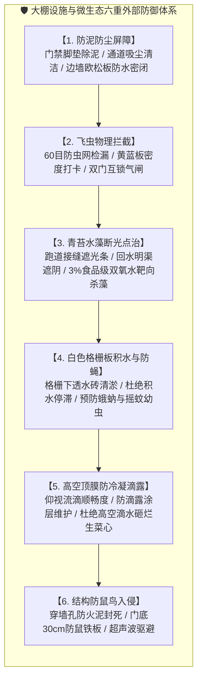

# 鱼菜共生数字工业化工厂 · 生产作业技术规范
# 05. 大棚设施与生态环境日常巡检与维护标准规范

---

> **文档版本**: v1.0.0  
> **编制归口**: 设施工程部 / 植保技术组 / 安全环保部 (EHS)  
> **发布日期**: 2026-09-23T19:20:00.000Z  
> **适用范围**: 基地温室巡检员、植保专员、设施维护工、保洁班组及生产主管  
> **核心原则**: **外防输入、切断载体、消灭死角、物理阻断、绿色防治**

---

## 1. 目的与生态防御策略

水培蔬菜与循环水养殖（RAS）处于高湿度、光照充沛且营养富集的密闭/半密闭空间中。**“菜上的病，往往根子在大棚的角角落落里”**。
若温室物理屏障受损或外围卫生恶化，外界的土传真菌孢子（立枯病、镰刀菌）、害虫（蚜虫、蓟马、粉虱）以及水体青苔水藻会在 3~5 天内穿透进入水培跑道，造成不可逆的系统性感染。

本规范旨在建立大棚内部及周边的**日常生态环境巡检与预防性维护标准**，将问题拦截在水槽之外，杜绝使用剧毒高残留农药。

---

## 2. 六大核心环境控制维度与标准操作

### 2.1 泥土与灰尘防线（切断外源土传真菌传播链）
* **控制目标**：大棚生产区域内**零裸露土壤、零外部扬尘积聚**。
* **作业标准**：
  1. **大门进出气闸**：外门处设立粗刮泥格栅，清除鞋底室外大块泥巴；进入一级更衣区后踏入 100~150 mg/L 二氧化氯脚垫；
  2. **边墙欧松板防水涂层巡查**：下部 1.0 米欧松板及防水涂层必须保持平整密闭，重点检查欧松板底部与地面接缝，严防室外暴雨时雨水夹带泥沙倒灌入内；
  3. **通道卫生维护**：主通道及跑道检修便道每日使用工业吸尘机或微湿拖把清洁，**严禁在温室内使用干燥扫帚干扫**（干扫会扬起带有真菌孢子的浮尘）。

### 2.2 飞虫物理拦截与色板虫情监测（绿色植保第一道门）
* **控制目标**：全天候物理阻隔，早期发现单点虫害，严禁成灾蔓延。
* **作业标准**：
  1. **60 目防虫网巡检（每日晨检）**：检查侧卷膜通风口及天窗防虫网，发现撕裂、穿孔或卡簧脱落，必须在 2 小时内使用专用防虫网修补贴胶粘合；
  2. **双门互锁纪律**：人员进出主气闸通道，必须严格执行“先进前门并完全关闭后，方可开启进入大棚的内门”，严禁将两扇门同时敞开；
  3. **黄蓝板科学布设与打卡**：
     * **🟡 黄色粘虫板**：主要诱杀蚜虫、烟粉虱、白粉虱、斑潜蝇。悬挂高度为跑道上方 20~30 cm，每隔 15 米交叉挂设 1 块；
     * **🔵 蓝色粘虫板**：主要诱杀蓟马（蓟马具极强蓝光趋性）。悬挂高度紧贴作物生长点上方 10~15 cm；
     * **虫口打卡阈值**：每日巡检记录色板上新增虫数。若单张色板单日新增害虫 **≥ 5 只**，立即触发局部生物制剂点喷（如苦参碱、印楝素或释放捕食螨），严禁全棚喷施化学农药。色板表面粘满虫或积灰超过 30 天必须立即更换。

### 2.3 青苔与水藻断光阻断与靶向治理（杜绝争肥耗氧）
* **控制目标**：深水跑道水体、回水渠及浮板边缘**无肉眼可见成片绿毛青苔**。
* **物理断光法则**：藻类是自养型生物，“无光则无藻”。
  * 浮板拼接缝隙、跑道最外侧贴边空隙，必须使用食品级**黑白反光遮光膜/遮光条**完整覆盖，严防阳光直接斜射入深水槽；
  * 回水明渠及调节池必须加盖遮光防尘盖板。
* **生物安全点洗工艺（严禁使用硫酸铜化学灭藻剂！）**：
  * **禁用红线**：严禁向水培跑道内投加硫酸铜或含氯杀藻剂，重金属铜离子会在蔬菜和鱼体内剧毒富集，次氯酸根会严重烧根；
  * **唯一指定清洗工艺**：巡检发现跑道内壁有初生青苔斑块，使用手持专用压力喷壶灌装 **3% 食品级过氧化氢（双氧水 H₂O₂）**，对准青苔表面进行精准局部点喷；
  * **反应机理**：双氧水强氧化穿透藻类细胞壁，3~5 分钟内青苔发白脱落，双氧水分解产物仅为**氧气与纯水**（直接为根系增氧），零化学毒害残留。

### 2.4 白色洗车透水格栅板与地面排水清洁（防蚊蝇滋生）
* **控制目标**：格栅下无恶臭、无发黑烂泥、无蛾蚋（小黑飞）与摇蚊幼虫。
* **作业标准**：
  1. **目视巡查**：行走在白色格栅板上，观察格栅网孔下方透水砖层是否有积水停滞；轻踩跺脚观察有无灰色小飞虫飞出；
  2. **掉落残叶清理**：采收或巡检掉落的枯烂菜叶，严禁践踏踩碎落入格栅缝隙，发现后立即用长柄镊子夹出；
  3. **每周定期冲洗维护**：每周五下午，分区域掀起活动格栅板，使用高压水枪接入含 50 mg/L 二氧化氯清洁水，自内向外冲刷透水砖表面积泥与藻膜，将污水顺畅排入集水沟，保持砖面干爽。

### 2.5 8.1米高顶膜防滴露与结构安全（防御高空“露水炸弹”）
* **控制目标**：顶棚凝结水顺坡流向天沟，**无水珠垂直滴入生菜叶心**。
* **作业标准**：
  1. **清晨仰视检查**：早晨 08:00 前进入温室，抬头观察 8.1 米挑高薄膜内表面。正常状态水汽应呈均匀极薄水膜顺着拱度滑入侧天沟；若发现局部凝聚成大颗水珠且发生“滴答”滴落，立即记录滴漏下方的跑道跨位；
  2. **温湿度应急联动**：发现结露滴水时，立即手动启动大空间立体环流风机，加大空气对流打破边界层，并适度微开顶通风窗排除湿热空气；
  3. **外遮阳与拉幕线巡检**：检查传动轴运转平稳度、拉幕钢丝绳张紧度，严禁钢丝跑偏卡槽刮破顶膜。

### 2.6 防鼠、防鸟与防外来生物入侵（保护管线与食品安全）
* **控制目标**：全棚无啮齿动物啃咬痕迹、无鸟类飞入、无鸟粪污染。
* **作业标准**：
  1. **穿墙管孔排查**：所有进入温室的供液管、压缩空气管、弱电网线套管，穿墙孔隙必须使用**防火阻燃密封泥（胶泥）**压实填死，不留一丝缝隙；
  2. **地面防鼠板检查**：各通道大门底部常年固定 **高 ≥ 30 cm** 的光滑镀锌防鼠金属挡板；
  3. **超声波驱鼠驱鸟器**：每周巡查固定在立柱上的多频超声波驱赶仪电源指示灯，确认 24 小时常开常通。

---

### 2.7 核心巡检微气候与水质参数基准与分级预警表

巡检人员与自动化环境控制系统应严格遵照以下三色分级阈值执行监控与闭环处置：

#### (1) 大棚微气候与物理环境指标看板
| 巡检监测项目 | 单位 | 🟢 正常合理范围 (绿区) | 🟡 注意预警范围 (黄区) | 🔴 严重报警阈值 (红区) | 超标危害与现场标准干预动作 |
| :--- | :---: | :---: | :---: | :---: | :--- |
| **棚内白天室温** | ℃ | **20.0 ~ 24.0** | 16.0 ~ 20.0 或 24.0 ~ 28.0 | **< 15.0 或 > 30.0** | **超温**：抽薹/烧心风险，立即开启外遮阳网与湿帘风机降温； **低温**：光合停滞，闭合内保温幕。 |
| **棚内夜间室温** | ℃ | **14.0 ~ 18.0** | 10.0 ~ 14.0 或 18.0 ~ 22.0 | **< 8.0 或 > 22.0** | 保持 6~8℃ 昼夜温差促糖分累积；夜温过高呼吸消耗大，过低引发冷害。 |
| **空气相对湿度 (RH)** | % | **60 ~ 75** | 50 ~ 60 或 75 ~ 85 | **< 45 或 > 85** | **过湿 (>85%)**：高空结露炸弹，诱发灰霉病/心腐病，立即强启立体环流风机排湿； **过干 (<45%)**：启动微雾喷雾。 |
| **叶面蒸汽压差 (VPD)** | kPa | **0.80 ~ 1.20** | 0.60 ~ 0.80 或 1.20 ~ 1.50 | **< 0.50 或 > 1.60** | **< 0.50**：蒸腾停滞，钙吸收阻断，引发 Tipburn 顶烧病； **> 1.60**：气孔闭合失水，叶片萎蔫。 |
| **环境大气压强** | hPa | **1000 ~ 1025** | 990 ~ 1000 | **< 990 或 2h骤降>5** | **气压骤降**：预警强雷暴或台风逼近，强制检查外遮阳固定卡扣，全闭天窗防被大风刮翻撕裂！ |
| **色板周增虫口** | 只/板/周 | **< 3** | **3 ~ 5** | **≥ 5** | **达到红线**：拍照上传飞书，定位跑道跨号，在 2 小时内组织局部生物制剂点喷（印楝素/捕食螨）。 |
| **进门脚垫药水浓度** | mg/L | **100 ~ 150** | 50 ~ 100 | **< 50 或 垫体干燥** | **低于 50**：杀菌彻底失效，鞋底泥菌外溢！立即倒掉旧水，重新配制 150 mg/L 二氧化氯注入。 |
| **格栅下积水深度** | mm | **0 (表面干爽)** | 局部微水 ≤ 3 (快速下渗) | **≥ 5 或 滞留>1小时** | **积水滞留**：小黑飞（蛾蚋）与摇蚊幼虫孵化温床！立即清理排水沟滤网，排干死水。 |
| **顶膜垂直滴露** | 滴/分钟 | **0 (均匀成膜顺流)** | 偶见大水珠但未滴入菜心 | **持续水滴滴入叶心** | **水滴砸心**：极易造成水培叶心腐烂！立即手动启动对应跨位的立体环流风机打破微气层。 |
| **防虫网破损状态** | mm | **0 (60目无缝)** | 网眼局部起毛变形 | **出现任何 ≥ 1.0 破洞** | **破网**：蓟马/白粉虱无阻穿透！巡检员随身携带防虫修补贴胶，**发现破洞必须在 15 分钟内现场贴死**。 |

#### (2) 现场深水跑道水质理化生命线指标看板（便携仪快速核对）
| 水质指标项 | 单位 | 🟢 正常合理范围 (绿区) | 🟡 注意预警范围 (黄区) | 🔴 严重报警阈值 (红区) | 现场联动与纠偏处置流程 |
| :--- | :---: | :---: | :---: | :---: | :--- |
| **溶解氧 (DO)** | mg/L | **≥ 6.50** | 5.00 ~ 6.50 | **< 5.00 (生命线)** | **DO < 5.0**：蔬菜根系缺氧褐化变黑，加州鲈浮头！立即手动开启备用罗茨风机与纯氧射流阀。 |
| **酸碱度 (pH)** | - | **6.00 ~ 6.80** | 5.50~6.00 或 6.80~7.20 | **< 5.50 或 > 7.50** | **pH 异常**：铁/磷等微量元素沉淀吸收障碍！飞书报警并通知中控台微量加注食品级磷酸或氢氧化钾。 |
| **电导率 (EC)** | mS/cm | **1.40 ~ 1.80** (生菜) | 1.20~1.40 或 1.80~2.00 | **< 1.00 或 > 2.20** | **EC 过高**：烧根脱水；**EC 过低**：营养不良！自动或手动补充浓缩营养母液或淡水稀释。 |
| **跑道水温** | ℃ | **18.0 ~ 22.0** | 22.0 ~ 25.0 或 15.0 ~ 18.0 | **> 26.0 或 < 14.0** | **水温 > 26℃**：水中溶氧极限降低，腐霉菌根腐病爆发！开启热泵冷水机组与深井热交换循环。 |

---

## 3. 🚨 现场防错绝对红线 (Poka-Yoke / 绝对禁止)

> [!CAUTION]
> 1. **严禁在跑道内使用硫酸铜等化学杀藻剂**：硫酸铜会造成重金属铜蓄积中毒，直接导致出厂质检不合格，全槽水体报废！
> 2. **严禁在水培槽上方使用扫帚扬尘打扫**：干燥清扫会导致土壤真菌孢子漫天飞舞落入水池，必须使用工业吸尘或湿拖！
> 3. **严禁双层出入门同时敞开通风**：任何因搬运偷懒而将两道门用砖头卡死敞开的行为，直接按一级责任违规处罚！
> 4. **严禁在跑道水体内直接用刷子用力刷青苔**：刷洗会把青苔断成数以亿计的微碎片并扩散至全槽，促成青苔指数级爆发！必须用 3% 双氧水局部点喷杀灭。
> 5. **严禁将白色格栅板作为生活杂物堆放台**：格栅通道必须保持 100% 畅通，严禁堆放废弃纸箱、破浮板或肥料袋。

---

## 4. 巡视维护节拍与周度打卡台账 (Work Rhythm & Checklist)

为避免形式主义与一线工人繁琐负担，本规范将大棚生态环境管控拆分为两级作业节拍：
1. **每日作业“进出顺带三看”（零填表负担）**：
   * 踩垫顺便看药水是否湿润（若干随手补倒）；
   * 抬头顺便看顶膜有无垂直滴落水珠（若有随手开风机）；
   * 走道顺便看大门有无关严、跑道边缝遮光条有无移位。
2. **每周五下午“系统深度点检与维护”（用时约 25~30 分钟，正式打卡）**：
   * 集中用手电筒细查防虫网破损并即时修补；统计并更换老化黄蓝板；
   * 掀起主要走道活动白色格栅板，使用高压水枪彻底冲洗底层透水砖积泥与藻膜；
   * 检查电缆穿墙泥封与门底防鼠金属板；
   * 班长在看板周台账上签字确认。

### 📋 大棚生态环境【周度】深度点检打卡台账 (Checklist)

| 巡查路线节点 | 核心巡检与维护指标 | 质量验收标准 | 第 1 周五 | 第 2 周五 | 第 3 周五 | 第 4 周五 | 巡检责任人 |
| :--- | :--- | :--- | :---: | :---: | :---: | :---: | :---: |
| **节点 1：进出气闸门** | 闭合气密 / 踩垫含药有效 | 闭合密封良好，脚垫踩踏冒出有效药液（100~150mg/L） | [ ] 合格 | [ ] 合格 | [ ] 合格 | [ ] 合格 | |
| **节点 2：通风防虫网** | 60目网眼完整性排查 | 全网无破孔撕裂，偶发破损已贴防虫补丁 | [ ] 完好 | [ ] 完好 | [ ] 完好 | [ ] 完好 | |
| **节点 3：色板虫情维护** | 虫口统计与老旧色板更换 | 单板新增虫口 < 5只，超期色板已换新 | [ ] 正常 | [ ] 正常 | [ ] 正常 | [ ] 正常 | |
| **节点 4：跑道边缘防藻** | 遮光覆盖 / 青苔双氧水点洗 | 遮光条严实无漏光，偶发青苔已点喷3%双氧水杀灭 | [ ] 遮严无藻 | [ ] 遮严无藻 | [ ] 遮严无藻 | [ ] 遮严无藻 | |
| **节点 5：白色格栅地面** | 掀板冲洗底层砖 / 灭蚊蝇幼虫 | 透水砖积泥已冲净，无积水死水，无小黑飞起飞 | [ ] 干爽无蝇 | [ ] 干爽无蝇 | [ ] 干爽无蝇 | [ ] 干爽无蝇 | |
| **节点 6：8.1m 挑高顶膜** | 传动轴钢丝绳 / 冷凝水流动 | 水汽顺坡滑向天沟，无破损，无垂直水珠滴漏 | [ ] 顺流无滴 | [ ] 顺流无滴 | [ ] 顺流无滴 | [ ] 顺流无滴 | |
| **节点 7：防鼠防鸟结构** | 穿墙泥封 / 门底防鼠金属板 | 套管密封胶泥无隙，防鼠板稳固，超声波绿灯常亮 | [ ] 密封到位 | [ ] 密封到位 | [ ] 密封到位 | [ ] 密封到位 | |
