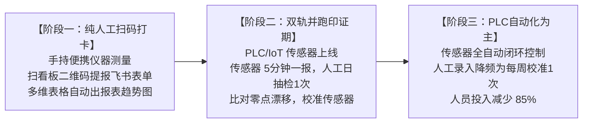

# 鱼菜共生数字工业化工厂 · 数字化演进技术规范
# 06. 过渡期环境与水质飞书多维表格数据模型及人机双轨校准规范

---

> **文档版本**: v1.0.0  
> **编制归口**: 数字农业IT部 / 种植工程部 / 设施自动化部  
> **发布日期**: 2026-09-23T19:35:00.000Z  
> **适用范围**: 基地全体水培巡检员、农艺技术员、自动化工程师及运营管理人员  
> **核心原则**: **轻量录入、多维聚合、人机校验、平滑过渡、渐进减工**

---

## 1. 背景与数字化演进路线图

在数字水培工厂建设初期，温室固定式传感器阵列（投入式温湿度计、工业荧光法 DO 探头、四电极 EC）与 PLC 自治加药/环控系统尚未完全部署就位。
为避免陷入**“纸质台账记录易丢失、统计滞后、无法预警”**的落后模式，同时规避**“初期盲目迷信自动化导致传感器零点漂移或结垢失真引发死苗”**的系统性风险，本工厂确立**“三阶段平滑演进体系”**：



1. **阶段一（纯人工扫码填报）**：农工使用手持精密仪器（水质笔、气压温湿度仪）巡检，手机扫描现场看板上的【飞书表单二维码】，30 秒内完成数字打卡，数据直入飞书多维表格；
2. **阶段二（双轨并跑与交叉印证 · 1~3 个月）**：IoT 传感器上线后，系统 24 小时高频自采，人工每日抽测 1 次。双轨比对，计算偏差 $\Delta$，排查传感器生物膜结垢与漂移；
3. **阶段三（自动化稳态运行 · 极致省工）**：传感器通过可靠性验收，自动加药与风机联动全面接管。人工测量降频为**“每周 1 次基准校准”**，现场劳动力节省 85% 以上。

---

## 2. 飞书多维表格（Lark Base）标准数据模型设计

现场农工填报通过**飞书表单（Lark Form）**进行，数据自动汇总到多维表格底表。表结构与字段定义如下：

### 2.1 字段数据字典 (Data Schema)

| 字段名称 | 飞书字段类型 | 数据范围 / 计量单位 | 录入模式 | 预警阈值与业务逻辑 |
| :--- | :--- | :--- | :--- | :--- |
| **打卡时间** | 创建时间 / 日期时间 | 严格 ISO 8601 (UTC) | 系统自动获取 | 追溯昼夜温差与溶氧周期 |
| **巡检区域** | 单选 | 育苗区 / 跑道A / 跑道B / 跑道C / 跑道D | 界面下拉单选 | 精确定位到具体跑道和批次 |
| **大棚气温** | 数字 (保留 1 位小数) | 10.0 ~ 45.0 ℃ | 手动填入 (手持气压仪) | 气温 > 32℃ 或 < 15℃ 自动黄色告警 |
| **相对湿度 (RH)** | 数字 (百分比) | 30% ~ 99% | 手动填入 (手持湿度仪) | 湿度 ≥ 92% 触发高湿结露防灰霉病预警 |
| **大气压强** | 数字 (整数) | 950 ~ 1050 hPa | 手动填入 (手持气压仪) | 参与水中饱和溶解氧反演校正 |
| **水槽水温** | 数字 (保留 1 位小数) | 15.0 ~ 32.0 ℃ | 手动填入 (水质笔) | 水温 > 26℃ 触发腐霉菌高温高危预警 |
| **酸碱度 (pH)** | 数字 (保留 2 位小数) | 4.00 ~ 9.00（目标 5.80~6.50）| 手动填入 (便携 pH 笔) | **< 5.50 或 > 6.80 自动红色标红** |
| **电导率 (EC)** | 数字 (保留 2 位小数) | 0.50 ~ 3.50 mS/cm | 手动填入 (便携 EC 笔) | 生菜偏离 1.4~1.8、空心菜偏离 2.0~2.8 标黄 |
| **根区溶解氧 (DO)** | 数字 (保留 2 位小数) | 2.00 ~ 10.00 mg/L | 手动填入 (荧光法DO仪)| **生命线指标：< 5.00 mg/L 飞书机器人即时报警** |
| **叶面 VPD (反演)**| 公式 (自动计算) | 0.40 ~ 2.00 kPa | 公式字段自动反演 | 基于气温、湿度自动反演蒸汽压差 |
| **根系/虫情拍照** | 附件 (多图) | JPG / PNG 照片 | 手机拍照上传 | 发现褐根烂根或虫口激增拍照备查 |
| **填报责任人** | 人员 | 飞书用户 ID | 飞书账号自动绑定 | 责任明确，追溯到个人 |

### 2.2 飞书多维表格公式反演字段配置

在多维表格中新增公式字段 `[反演 VPD (kPa)]`，写入 Magnus-Tetens 饱和蒸汽压反演公式：
```
ROUND(
  (0.61078 * EXP((17.27 * [大棚气温]) / ([大棚气温] + 237.3))) * (1 - [相对湿度 (RH)]),
  2
)
```
* **VPD < 0.6 kPa**：空气极度潮湿，气孔关闭，蒸腾停滞，多维表格自动标记为 `【高危结露/防灰霉】`；
* **0.8 ~ 1.2 kPa**：最佳黄金生长气压差，标记为 `【适宜生长】`；
* **VPD > 1.5 kPa**：空气极度干燥，气孔闭合防止失水，标记为 `【干燥干旱/开微雾】`。

---

## 3. 中期人机双轨并跑与交叉印证标准 (Dual-Track Calibration)

当第一期固定式传感器和 PLC 接入网络后，**严禁立即撤除人工巡检**。必须执行为期 **30~60 天的双轨交叉印证期**。

### 3.1 交叉对比操作规范
* **自动化采集频率**：PLC 每 5 分钟向时序数据库写入一组瞬时数据；
* **人工抽检频率**：巡检员每日上午 09:00 前往指定跑道，使用校准过的二级标准便携仪测量一次，填报飞书表单；
* **偏差计算与判定公式**：
  $$\Delta = |\text{手持仪测量值} - \text{PLC传感器同期读数}|$$

### 3.2 偏差阈值与维护动作响应表

| 监测参数 | 允许正常偏差 ($\Delta$) | 超标报警阈值 | 维护排查与校准动作 |
| :--- | :---: | :---: | :--- |
| **水槽水温** | $\le 0.5\,^\circ\text{C}$ | $\Delta > 0.8\,^\circ\text{C}$ | 检查传感器套管是否脱出水面、PT100 信号线松动 |
| **酸碱度 (pH)** | $\le 0.15$ | $\Delta > 0.30$ | **传感器玻璃球泡结盐垢或老化**：用 0.1M 稀盐酸清洗球泡，使用标准缓冲液（pH 4.01/6.86/9.18）两点校准 |
| **电导率 (EC)** | $\le 0.10\,\text{mS/cm}$ | $\Delta > 0.25\,\text{mS/cm}$ | 检查四电极表面是否有藻膜吸附，用酒精棉轻拭电极表面 |
| **根区溶氧 (DO)** | $\le 0.30\,\text{mg/L}$ | $\Delta > 0.80\,\text{mg/L}$ | **光学荧光帽受污或老化**：纯水冲洗荧光膜片；必要时更换新荧光帽并在空气中进行饱和水气校准 |

---

## 4. 终态自动化稳态运行与省工释放机制

### 4.1 验收放行门槛 (自动化接管标准)
双轨并跑连续 30 天满足以下条件，经技术主管审批后正式进入“阶段三”：
1. 各参数超标报警误报率 $< 2\%$；
2. 传感器断线脱网率 $< 0.1\%$；
3. PLC 自治加药步长稳定，无加药过冲震荡。

### 4.2 终态人工工作量极致精简
* **日常抄表全面归零**：巡检人员不再进行日常数据抄报，数据流由 PLC $\rightarrow$ 工业网关 $\rightarrow$ 云端/飞书集成机器人自动推送；
* **人工基准校准（仅保留周检）**：巡检组长仅需在**每周五下午**对关键水槽进行一次 5 分钟的便携仪抽查比对，若无漂移即可在系统确认，全面实现减员增效。
