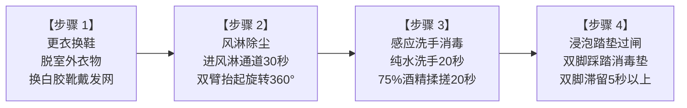

# 现场作业看板【KB-00】：车间入口二级生物安全与手消看板

> **【工位编号】**：KB-00 ｜ **【工位名称】**：车间入口生物安全闸口  
> **【物理位置】**：生产车间主门更衣区、风淋室与二级消毒闸口  
> **【责任岗位】**：全体进入人员（生产农工、巡检员、技术员、访客）  
> **【核心目标】**：切断外部泥土、线虫、真菌孢子与杂菌向温室跑道区的传播链

---

## 1. 穿戴与防护准备 (PPE & Preparation)

* 🥼 **防静电工作服**：拉链拉齐至领口，下摆与袖口收紧，严禁外露日常衣物。
* 🧢 **透气发网帽**：头发、碎发必须 100% 完全包覆于发网内部，严禁发丝外露。
* 🥾 **洁净胶靴/鞋套**：换穿车间专用白色防滑食品级工作水靴，严禁穿室外鞋入内。

---

## 2. 标准通行四步法 (Standard Operating Flow)

1. **更衣换鞋**：在更衣区脱下个人外衣，换上专用连体工作服，佩戴发网，换上专用白水靴。
2. **风淋吹扫**：进入风淋通道，触发红外感应，强制吹淋 **30 秒**。吹淋期间举起双手、原地缓慢自转 360° 以吹落毛屑。
3. **洗手消杀**：
   * 伸手接感应洗手液与纯水，揉搓双手（手心、手背、指缝、指尖、手腕）不少于 **20 秒**并烘干；
   * 伸手接感应 **75% 医用酒精**，双掌反复揉搓直至自然挥发干燥。
4. **踏垫过闸**：双脚完全踩入 **100~150 mg/L 二氧化氯浸润脚垫**，鞋底浸润停留不少于 **5 秒**方可推闸进入栽培区。

---

## 3. 🚨 现场防错绝对红线 (Poka-Yoke / 绝对禁止)

> [!CAUTION]
> 1. **严禁沾带室外泥土入内**：凡鞋底、裤脚沾带外部泥土者，一律禁止入场。土壤携带的腐霉菌与线虫是水培系统的毁灭性灾难！
> 2. **严禁不戴发网或头发外露**：蔬菜叶片夹杂头发直接判定为食品安全客诉事故。
> 3. **严禁私自绕过脚垫过闸**：跨越、绕行消毒脚垫者，记严重违章并停工培训。
> 4. **严禁携带个人食品、香烟、打火机进入温室**：烟草花叶病毒 (TMV) 可通过手接触烟草瞬间传染全池！

---

## 4. 📋 每日生物安全点检打卡表 (Checklist)

| 点检项目 | 标准要求 | 早班确认 (08:00) | 中班确认 (13:30) | 点检人 |
| :--- | :--- | :---: | :---: | :---: |
| **消毒脚垫有效性** | 浸润液面踩踏冒液，二氧化氯浓度 100~150 mg/L（用试纸实测） | [ ] 合格 | [ ] 合格 | |
| **手消酒精余量** | 感应手消机储液仓余量 ≥ 30%，喷雾均匀 | [ ] 正常 | [ ] 正常 | |
| **风淋室运行状态** | 吹淋风速正常（风速 ≥ 20 m/s），门磁互锁可靠 | [ ] 正常 | [ ] 正常 | |
| **人员着装抽检** | 进场人员工作服扣齐、发网完全包覆、换穿专用白靴 | [ ] 100%合规 | [ ] 100%合规 | |
