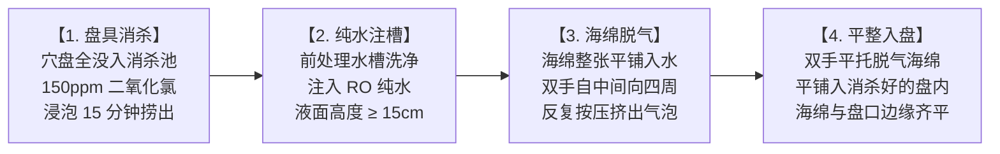

# 现场作业看板【KB-01】：海绵浸润脱气与穴盘准备工位看板

> **【工位编号】**：KB-01 ｜ **【工位名称】**：海绵脱气与穴盘准备工位  
> **【物理位置】**：育苗播种间前处理水槽与基质准备台  
> **【责任岗位】**：育苗作业员  
> **【作业节拍】**：每次播种前 4 小时完成准备，每批次（50盘）耗时 ≤ 45 分钟  
> **【核心目标】**：消除海绵内部死气与杂菌，确保基质吸水率 ≥ 95% 且含水均匀

---

## 1. 穿戴与工具物料清单

* 🥼 **防护穿戴**：防水围裙、长袖防化 PVC 橡胶手套、护目镜（配制药剂时必戴）。
* 🟢 **专用工具**：育苗专用绿色塑料周转箱、128/200 穴育苗平底盘、余氯与二氧化氯快速测试纸。
* 💧 **专用药液**：车间 RO 纯水机产水、食品级二氧化氯母液（配成 100~150 mg/L 消毒液）。

---

## 2. 标准作业四步法 (Standard Operating Flow)

1. **盘具浸泡消杀**：将周转返还的塑料穴盘完全浸没于 **100~150 mg/L 二氧化氯消毒水槽**中，压入压板确保无浮起，浸泡 **15 分钟**后取出垂直沥干。
2. **纯水注槽准备**：将专用浸润水槽洗净，接入 **RO 商用纯水**，水深不低于 **15 cm**，严禁用管道自来水直接加注。
3. **海绵反复挤压脱气**：
   * 将整张 **25×25×25 mm** 开十字口水培专用海绵平铺入水中；
   * 双手掌心从中间向两侧用力反复按压挤捏 3~5 次，排出海绵微孔中的全部空气；
   * 静置吸水，目测海绵完全下沉且手感饱满，吸水率达到 **≥ 95%**。
4. **平整对齐铺盘**：双手平托吸饱水的水培海绵，平整嵌入消杀后的穴盘中。检查海绵表面，确保平整一致，无隆起、无深陷，海绵表面与盘边基本齐平。

---

## 3. 🚨 现场防错绝对红线 (Poka-Yoke / 绝对禁止)

> [!CAUTION]
> 1. **严禁使用未消杀的旧育苗盘**：旧盘残留的绿藻与霉菌会瞬间感染刚发芽的嫩幼苗。
> 2. **严禁使用含余氯的自来水直接浸润海绵**：次氯酸残留会直接烧死蔬菜种胚初生根根尖！
> 3. **严禁海绵带气泡干心入盘**：内部有气泡会导致种子发芽后根系悬空缺水干枯死亡。
> 4. **严禁海绵表面倾斜或高低不平**：表面不平会导致点播深度不一致，造成出苗参差不齐。

---

## 4. 📋 工位每班点检打卡表 (Checklist)

| 点检项目 | 控制标准 | 批次 1 实测/确认 | 批次 2 实测/确认 | 点检人 |
| :--- | :--- | :---: | :---: | :---: |
| **消杀池药液浓度** | 二氧化氯试纸实测 100~150 mg/L | ________ mg/L | ________ mg/L | |
| **穴盘浸泡时间** | 计时钟监控 ≥ 15 分钟 | [ ] 已达标 | [ ] 已达标 | |
| **浸润水源核对** | 确认开启 RO 纯水阀门，TDS 值 ≤ 30 ppm | ________ ppm | ________ ppm | |
| **海绵吸水脱气度** | 随机按压 3 处，无气泡涌出且松手即回弹充水 | [ ] 合格 | [ ] 合格 | |
| **铺盘平整度** | 目视表面平整，各穴位十字切口居中无变形 | [ ] 合格 | [ ] 合格 | |
