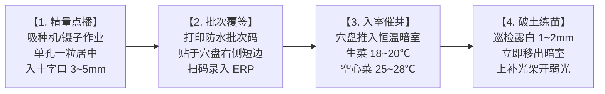

# 现场作业看板【KB-02】：精量播种与暗室催芽工位看板

> **【工位编号】**：KB-02 ｜ **【工位名称】**：精量播种与暗室催芽工位  
> **【物理位置】**：播种操作台、催芽暗室、育苗绿化补光架  
> **【责任岗位】**：育苗技工  
> **【作业节拍】**：点播单盘（128穴） ≤ 90 秒，催芽监控每 12 小时打卡一次  
> **【核心目标】**：实现单孔一粒居中定深，露白率 ≥ 98%，杜绝高温热休眠与徒长

---

## 1. 穿戴与工具物料清单

* 🥼 **防护穿戴**：连体工作服、一次性丁腈手套、医用外科口罩（防飞沫污染种子）。
* 🟢 **专用工具**：气动针头精量播种机 / 手动真空吸种笔、播种引导板、无菌细头镊子。
* 🏷️ **批次物料**：经检疫的原厂包衣良种、育苗批次条码防水标签（注明品种、批号、播种日期时间）。

---

## 2. 标准作业四步法 (Standard Operating Flow)

1. **精量点播入孔**：
   * 启动气动播种机（或持吸种笔），吸取单粒包衣种子；
   * 对准吸饱水海绵块的十字切口正中心下落，点入深度严格控制在 **3~5 mm**；
   * 空穴或漏播处，用消毒镊子人工补齐，确保单孔一粒，无双粒、无空穴。
2. **批次标识挂签**：打印防水批次二维码标签，贴于穴盘侧边，内容包含【品种代码、批次号、播种人、播种时间（精确至分钟）】，扫码同步至系统。
3. **入催芽暗室（温湿度依品种精准分流）**：
   * 将穴盘推入高湿催芽暗室，湿度维持在 **90%~95%**；
   * **生菜专属设定**：空调设定温度 **18~20℃**（严控最高不超过 22℃）；
   * **空心菜专属设定**：控温设定 **25~28℃**。
4. **见白出室与绿化炼苗**：
   * 催芽 24~36 小时起，每隔 8 小时抽检一次胚根伸出情况；
   * 当 **70% 种子露白出芽 1~2 mm 时，必须立即推出暗室**！
   * 移入育苗绿化架，开启低光照 LED 补光（PPFD 80~100 μmol/(m²·s)，每天 14 小时），促使子叶转绿。

---

## 3. 🚨 现场防错绝对红线 (Poka-Yoke / 绝对禁止)

> [!CAUTION]
> 1. **【生菜红线】严禁暗室温度超过 25℃**：高温会引发不可逆的“热休眠”，导致生菜种子成批不发芽报废！
> 2. **严禁见白后延迟出室**：一旦种芽在暗室内顶出海绵超过 5mm，会在无光环境下瞬间“徒长高脚苗”，全盘作废。
> 3. **严禁一穴多粒（空心菜除外）**：生菜双苗会导致两株争光抢肥，后期变成畸形双生弱菜。
> 4. **严禁直接暴晒在强光下**：刚出室幼苗嫩组织极度脆弱，直接打强光（PPFD > 250）会灼伤子叶导致叶绿素坏死。

---

## 4. 📋 播种与催芽打卡记录表 (Checklist)

| 巡查时间 (时:分) | 盘具批次号 | 品种 | 催芽室实测温/湿度 | 胚根露白情况 | 出室转练苗时间 | 操作员 |
| :---: | :---: | :---: | :---: | :---: | :---: | :---: |
| 08:00 | ________ | 生菜 / 空心菜 | ____ ℃ / ____ % | 刚吸胀 / 露白初显 | [ ] 留室 [ ] 出室 | |
| 16:00 | ________ | 生菜 / 空心菜 | ____ ℃ / ____ % | 露白率约 ____ % | [ ] 留室 [ ] 出室 | |
| 24:00 | ________ | 生菜 / 空心菜 | ____ ℃ / ____ % | 露白达 70% | [ ] 留室 [ ] 出室 | |
