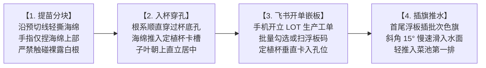

# 现场作业看板【KB-03】：分苗定植与浮板入水工位看板

> **【工位编号】**：KB-03 ｜ **【工位名称】**：分苗定植与浮板入水工位  
> **【物理位置】**：定植流水操作线、水培菜池入水口起步工位  
> **【责任岗位】**：定植作业组（2人协作）  
> **【作业节拍】**：单板（24孔）装填并推入菜池 ≤ 60 秒  
> **【核心目标】**：单孔居中、洁白主根穿底入水、保护幼根零折损、飞书工单关联

---

## 1. 穿戴与工具物料清单

* 🥼 **防护穿戴**：一次性丁腈手套（严禁裸手接触根系）、防滑胶靴、工作服。
* 🟢 **专用工具**：绿色塑料镊子、定植提篮、手机飞书 App、周次轮值彩色塑料记号旗（红/黄/蓝/绿）。
* 🧱 **工位物料**：已彻底消毒晾干的 24 孔食品级 HDPE 浮板（`RFT-24H-A-xxxx`）、标准定植杯、达标幼苗盘（`NUR-xxxx`）。

---

## 2. 标准作业四步法 (Standard Operating Flow)

1. **无损取苗分块**：
   * 检查苗龄：生菜播种后 12~14 天（2叶1心~3叶1心，根长 3~5 cm）；空心菜播种后 8~10 天或扦插枝成活；
   * 顺着海绵预切十字线轻轻撕开单块，**手指只能捏住海绵块的中上部两端**；
   * 剔除黄叶苗、无根苗、白化弱苗，严禁弱苗移栽。
2. **入杯顺根引出**：
   * 将幼苗主根自上而下顺直穿过专用定植杯底部十字网孔；
   * 轻轻将海绵块推入定植杯内部台阶，确保海绵底部露出杯底约 **5 mm**，保证入水能吸水；
   * 确认茎秆垂直向上，无扭曲歪斜。
3. **📱 飞书开立工单与批量嵌板（耗时 ≤ 15 秒）**：
   * **手机打开飞书**：进入**【定植生产与采收生命周期表】** ➔ 点击【+新建工单】；
   * **选择参数**：
     * `种植菜池编号`：选择目标菜池（如 `BED-TP-01 刀刮布1号菜池`）；
     * `来源育苗批次`：关联选择达标苗批号（如 `NUR-261015-01`）；
     * `投入浮板编号列表`：在多选框中直接按住 Shift 批量勾选板号（如 `RFT-24H-A-0001` 到 `0005`，计 5 块板）；
     * 输入定植板数 `5`，系统根据每板24孔自动折算总株数 `120` 株；
   * **嵌板作业**：将装好苗的定植杯垂直按入浮板孔位，旋转半圈卡紧。
4. **插旗目视化与轻缓推水**：
   * **插批次色标旗**：在本次定植的**第一块板和最后一块板的边角孔上，各插一支当周轮值颜色的塑料小旗（如周一定植插红旗，周四插蓝旗）**，肉眼即可辨识批次边界；
   * 两人各持浮板一侧短边，倾斜 15° 缓慢将浮板滑入菜池水面；
   * 确认浮板平稳漂浮、根系在水下自然散开垂直，双手均匀用力向前平推入水池第 1 排。

---

## 3. 🚨 现场防错绝对红线 (Poka-Yoke / 绝对禁止)

> [!CAUTION]
> 1. **严禁手指触碰裸露白色幼根**：人手皮脂分泌物与汗酸会造成幼根毛细组织坏死变褐！
> 2. **严禁硬拉硬拔幼苗**：撕扯海绵时必须顺着切缝轻轻分开，拉断主根的幼苗直接作废，严禁强行定植。
> 3. **严禁大力摔板或浮板翻扣砸水**：粗暴入水会导致根系折断甚至整株蔬菜脱杯落水。
> 4. **严禁使用未干燥或有残留藻类的湿浮板**：必须使用在飞书中状态显示为“二级消杀备用”的合格干燥浮板！

---

## 4. 📋 定植工序质检与打卡记录表 (Checklist)

> *注：现场通过手机飞书【定植生产与采收生命周期表】开单，本表作为首板首件检验备查：*

| 质检抽检项目 | 质检验收标准 | 批次首板 (24株) 实测 | 批次尾板 (24株) 实测 | 质检员 |
| :--- | :--- | :---: | :---: | :---: |
| **生产工单号 (LOT)** | 飞书自动拼接生成的有效工单码 | LOT-261101-WAT-TP01 | LOT-261101-WAT-TP01 | 张扬 |
| **浮板物理编码** | 确认浮板激光码在飞书有效勾选 | RFT-24H-A-0001 | RFT-24H-A-0005 | 张扬 |
| **根系垂直度** | 随机抽取 3 孔，主根完全自定植杯底自然伸出垂入水下 | [x] 100% 达标 | [x] 100% 达标 | 张扬 |
| **植株直立度** | 幼苗在定植杯内垂直不倾斜，子叶无压折 | [x] 100% 达标 | [x] 100% 达标 | 张扬 |
| **推板目视化** | 首尾浮板已插好当周轮值色标旗 (红/黄/蓝/绿) | [x] 红色标记旗已插 | [x] 红色标记旗已插 | 张扬 |
