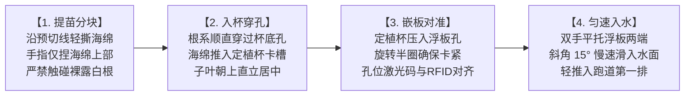

# 现场作业看板【KB-03】：分苗定植与浮板入水工位看板

> **【工位编号】**：KB-03 ｜ **【工位名称】**：分苗定植与浮板入水工位  
> **【物理位置】**：定植操作线、深水跑道入水端起步工位  
> **【责任岗位】**：定植作业组（2人协作）  
> **【作业节拍】**：单板（24孔）装填并推入水槽 ≤ 60 秒  
> **【核心目标】**：单孔居中、洁白主根穿底入水、保护幼根零折损、单株 RFID 绑定

---

## 1. 穿戴与工具物料清单

* 🥼 **防护穿戴**：一次性丁腈手套（严禁裸手接触根系）、防滑胶靴、工作服。
* 🟢 **专用工具**：绿色塑料镊子、定植提篮、无源 RFID 工业手持扫码枪。
* 🧱 **工位物料**：已彻底消毒晾干的 24 孔食品级 EPP 浮板（1.2m × 0.8m）、标准水培定植杯、达标幼苗盘。

---

## 2. 标准作业四步法 (Standard Operating Flow)

1. **无损取苗分块**：
   * 检查苗龄：生菜播种后 12~14 天（2叶1心~3叶1心，根长 3~5 cm）；空心菜播种后 8~10 天或扦插枝成活；
   * 顺着海绵预切十字线轻轻撕开单块，**手指只能捏住海绵块的中上部两端**；
   * 剔除黄叶苗、无根苗、白化弱苗，严禁弱苗移栽。
2. **入杯顺根引出**：
   * 将幼苗主根自上而下顺直穿过专用定植杯底部十字网孔；
   * 轻轻将海绵块推入定植杯内部台阶，确保海绵底部露出杯底约 **5 mm**，保证入水能吸水；
   * 确认茎秆垂直向上，无扭曲歪斜。
3. **嵌板与 RFID 识别对准**：
   * 将装好苗的定植杯垂直按入 EPP 浮板对应孔位（从 `R01C01` 至 `R06C04` 顺序装填）；
   * 手持 RFID 扫码枪轻触浮板两侧内置芯片，扫描上传该浮板【板卡 UID + 24孔作物批号】至中央数据库。
4. **轻缓入水与平稳推移**：
   * 两人各持浮板一侧短边，倾斜 15° 缓慢将浮板滑入深水跑道水面；
   * 确认浮板平稳漂浮、根系在水下自然散开垂直，双手均匀用力将浮板向前推移一个板位。

---

## 3. 🚨 现场防错绝对红线 (Poka-Yoke / 绝对禁止)

> [!CAUTION]
> 1. **严禁手指触碰裸露白色幼根**：人手皮脂分泌物与汗酸会造成幼根毛细组织坏死变褐！
> 2. **严禁硬拉硬拔幼苗**：撕扯海绵时必须顺着切缝轻轻分开，拉断主根的幼苗直接作废，严禁强行定植。
> 3. **严禁大力摔板或浮板翻扣砸水**：粗暴入水会导致根系折断甚至整株蔬菜脱杯落水。
> 4. **严禁使用未干燥或有残留藻类的湿浮板**：必须使用持有消毒绿色流转卡的合格干燥浮板！

---

## 4. 📋 定植工序质量抽检表 (Checklist)

| 抽检项目 | 质检验收标准 | 板 1 (24株) 抽检 | 板 2 (24株) 抽检 | 质检员 |
| :--- | :--- | :---: | :---: | :---: |
| **根系垂直度** | 随机抽取 3 孔，主根完全自定植杯底自然伸出垂入水下 | [ ] 100% 达标 | [ ] 100% 达标 | |
| **植株直立度** | 幼苗在定植杯内垂直不倾斜，子叶无压折 | [ ] 100% 达标 | [ ] 100% 达标 | |
| **海绵贴合度** | 海绵紧密贴合定植杯壁，晃动不晃荡脱落 | [ ] 100% 达标 | [ ] 100% 达标 | |
| **RFID 录入状态** | 手持机扫码回执绿灯亮，云端显示批次绑定成功 | [ ] 录入成功 | [ ] 录入成功 | |
