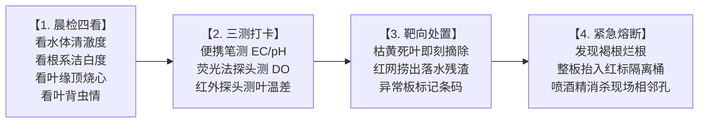

# 现场作业看板【KB-04】：深水跑道日常巡检与病弱株隔离看板

> **【工位编号】**：KB-04 ｜ **【工位名称】**：深水跑道日常巡检与隔离工位  
> **【物理位置】**：温室主通道、各水培跑道巡检推车、病害隔离观察区  
> **【责任岗位】**：跑道巡检员 / 植保专员  
> **【巡视频次】**：每日 2 次（早晨 08:30 晨检，下午 15:30 复检）  
> **【核心目标】**：早发现、早切断，根区溶解氧 ≥ 6.0 mg/L，真叶面无结露，病害零扩散

---

## 1. 穿戴与工具物料清单

* 🥼 **防护穿戴**：蓝色巡检工作服、防滑水靴、丁腈手套。
* 🔵 **专用巡检工具**：便携式四合一水质笔（测 EC/pH/DO/水温）、手持叶面温湿度计、巡检平板。
* 🔴 **应急隔离工具（严禁混入生产区）**：红色捞网、红标密闭隔离桶、75% 酒精消毒喷雾。

---

## 2. 标准作业四步法 (Standard Operating Flow)



1. **现场感官“晨检四看”**：
   * **看水色**：正常水体呈淡黄清澈无异味；若发白浑浊、有酸臭腥味，立即通报水质异常；
   * **看白根**：随机轻掀浮板，健康根系洁白繁密有弹性；若根系泛黄、发褐、有黏液软烂，立即触发病根应急；
   * **看叶缘**：重点察看生菜心叶是否有叶缘焦黑变干（顶烧心缺钙）或叶面湿漉结露（灰霉病先兆）；
   * **看害虫**：翻看叶背，查看是否有蚜虫、蓟马聚集或微弱黄色褪绿斑点。
2. **水质与环境“三测打卡”**：
   * 在跑道进水口、中段、回水口三点插入水质笔，记录 **EC、pH 与溶解氧 (DO)**；
   * 手持测温仪测量叶温与空气露点温度，若差值 **≤ 1.5℃**，立即手动启动环流风机对流除湿。
3. **常规微瑕靶向修整**：
   * 用消过毒的镊子小心摘除植株基部的单片衰老发黄外叶，放入腰间废叶袋；
   * 用蓝色细网捞出漂浮在水面的脱落碎叶与藻丝，严禁留在水里腐烂。
4. **疑似病株红线隔离（紧急熔断）**：
   * 一旦发现单株根系出现发黑软腐烂根（疑似腐霉菌），**立即停止前移**；
   * 用专用红色双人手提夹将**整块浮板完整抬出水面**，放入红色密闭隔离推车；
   * 用喷雾器对相邻板孔及周围水面喷施局部食品级双氧水消杀，系统拉响二级黄色预警。

---

## 3. 🚨 现场防错绝对红线 (Poka-Yoke / 绝对禁止)

> [!CAUTION]
> 1. **严禁徒手在水槽中撕扯病烂根**：任何水下揉搓拔扯都会把千万计的游动孢子瞬间洗入水流，造成全槽交叉传染！
> 2. **严禁将红色隔离工具带入正常健康跑道**：红标工具为污染区专用，出隔离区必须整套浸泡消杀。
> 3. **严禁私自调大加药泵或关闭夜间曝气**：深水跑道夜间严禁停风机，溶解氧低于 4.0 mg/L 属于一级责任事故。
> 4. **严禁将摘除的废叶随手扔在跑道过道或丢弃在水槽中**。

---

## 4. 📱 飞书移动端扫码打卡与多维表格自动汇总 (Lark Base Entry)

> **【过渡期数字化指引】**：前期未部署在线传感器前，巡检员使用便携笔测量后，直接用手机飞书扫码填报。数据将秒级同步至**【水培环境与水质多维表格】**自动生成走势图并进行风险标红预警；未来部署传感器后，手测值将作为与 PLC 传感器交叉印证的数据基准。

```
┌────────────────────────────────────────────────────────┐
│  【请在此处张贴：飞书水质巡检表单二维码】             │
│   📱 手机微信/飞书扫一扫 ➔ 自动获取时间与账号         │
│   ➔ 选择跑道编号 ➔ 依次填入：水温 / pH / EC / DO       │
│   ➔ 发现异常拍照上传 ➔ 点击【提交】(单次仅耗时 20 秒)  │
└────────────────────────────────────────────────────────┘
```

### 📋 纸质应急打卡台账 (仅在手机没电或网络故障时备用)

| 跑道编号 | 巡检时间 | 水温 (℃) | pH (5.8~6.5) | EC (mS/cm) | DO (≥ 6.0 mg/L) | 根系/叶片状态 | 处置动作与签字 |
| :---: | :---: | :---: | :---: | :---: | :---: | :---: | :---: |
| 跑道 A | 08:30 | ____ ℃ | ________ | ________ | ________ mg/L | [ ] 洁白无病 [ ] 偶见焦心 | |
| 跑道 B | 08:45 | ____ ℃ | ________ | ________ | ________ mg/L | [ ] 洁白无病 [ ] 偶见焦心 | |
| 跑道 C | 09:00 | ____ ℃ | ________ | ________ | ________ mg/L | [ ] 洁白无病 [ ] 偶见焦心 | |
| 跑道 D | 09:15 | ____ ℃ | ________ | ________ | ________ mg/L | [ ] 洁白无病 [ ] 偶见焦心 | |
