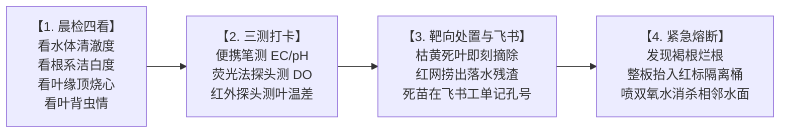

# 现场作业看板【KB-04】：水培菜池日常巡检与病弱株隔离看板

> **【工位编号】**：KB-04 ｜ **【工位名称】**：水培菜池日常巡检与隔离工位  
> **【物理位置】**：温室主通道、刀刮布/不锈钢水培菜池（`BED-TP` / `BED-SS`）、病害隔离观察区  
> **【责任岗位】**：菜池巡检员 / 植保专员  
> **【巡视频次】**：每日 2 次（早晨 08:30 晨检，下午 15:30 复检）  
> **【核心目标】**：早发现、早切断，根区溶解氧 ≥ 6.0 mg/L，真叶面无结露，病害零扩散

---

## 1. 穿戴与工具物料清单

* 🥼 **防护穿戴**：蓝色巡检工作服、防滑水靴、丁腈手套。
* 🔵 **专用巡检工具**：便携式四合一水质笔（测 EC/pH/DO/水温）、手持叶面温湿度计、手机飞书 App。
* 🔴 **应急隔离工具（严禁混入生产区）**：红色捞网、红标密闭隔离桶、75% 酒精消毒喷雾。

---

## 2. 标准作业四步法 (Standard Operating Flow)

1. **现场感官“晨检四看”**：
   * **看水色**：正常水体呈淡黄清澈无异味；若发白浑浊、有酸臭腥味，立即通报水力回路异常；
   * **看白根**：随机轻掀浮板，健康根系洁白繁密有弹性；若根系泛黄、发褐、有黏液软烂，立即触发病根应急；
   * **看叶缘**：重点察看生菜心叶是否有叶缘焦黑变干（顶烧心缺钙）或叶面湿漉结露（灰霉病先兆）；
   * **看害虫**：翻看叶背，查看是否有蚜虫、蓟马聚集或微弱黄色褪绿斑点。
2. **水质与环境“三测打卡”**：
   * 在菜池进水口、中段、回水口三点插入水质笔，确认 **EC、pH 与溶解氧 (DO ≥ 6.0 mg/L)**；
   * 手持测温仪测量叶温与空气露点温度，若差值 **≤ 1.5℃**，立即手动启动环流风机对流除湿。
3. **📱 靶向修整与飞书例外记录（一线减负原则）**：
   * **正常无死苗**：**无需做任何手机操作**，禁止无意义打卡浪费时间；
   * **若发现单株死苗/蚜虫**：
     * 戴手套小心连根拔除，严禁将残根遗留在菜池水中；
     * 打开手机飞书**【定植生产与采收生命周期表】**，找到当前批次工单（如 `LOT-261101-WAT-TP01`）；
     * 在【异常孔位死苗记录】字段中追加输入：`RFT-24H-A-0002#R01C03 拔除`。
4. **疑似病株红线隔离（紧急熔断）**：
   * 一旦发现单株根系出现大面积发黑软腐烂根（疑似腐霉菌），**立即停止推板**；
   * 用专用红色双人手提夹将**整块浮板完整抬出水面**，放入红色密闭隔离推车；
   * 用喷雾器对周围水面喷施局部食品级双氧水消杀，系统拉响二级黄色预警。

---

## 3. 🚨 现场防错绝对红线 (Poka-Yoke / 绝对禁止)

> [!CAUTION]
> 1. **严禁徒手在水槽中撕扯病烂根**：任何水下揉搓拔扯都会把千万计的游动孢子瞬间洗入水流，造成全池交叉传染！
> 2. **严禁将红色隔离工具带入正常健康菜池**：红标工具为污染区专用，出隔离区必须整套浸泡消杀。
> 3. **严禁私自调大加药泵或关闭夜间曝气**：深水菜池夜间严禁停风机，溶解氧低于 4.0 mg/L 属于一级责任事故。
> 4. **严禁将摘除的废叶随手扔在菜池走道或丢弃在水槽中**。

---

## 4. 📋 菜池巡检打卡与异常记录表 (Checklist)

| 巡检时间 | 菜池编号 | 巡检工单批次号 | 实测水温/EC/DO | 根系与叶面状态 | 异常孔位记录 (浮板#孔号) | 巡检员 |
| :---: | :---: | :---: | :---: | :---: | :---: | :---: |
| 08:30 | BED-TP-01 | LOT-261101-WAT-TP01 | 18.5℃ / 1.6 / 6.8mg/L | [x] 洁白健康 [ ] 发褐 | 无异常 (免记录) | 张扬 |
| 15:30 | BED-TP-01 | LOT-261101-WAT-TP01 | 19.2℃ / 1.6 / 6.5mg/L | [x] 洁白健康 [ ] 发褐 | RFT-24H-A-0002#R01C03 拔除 | 张扬 |
