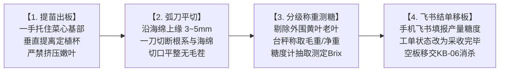

# 现场作业看板【KB-05】：成熟蔬菜采收切根与初分级工位看板

> **【工位编号】**：KB-05 ｜ **【工位名称】**：成熟蔬菜采收切根与初分级工位  
> **【物理位置】**：水培菜池出水口采收端、后处理切根分级工作台  
> **【责任岗位】**：采收作业组  
> **【作业节拍】**：单板（24株）切根、去黄叶、初分级称重 ≤ 90 秒  
> **【核心目标】**：平齐切根不伤菜心、去除黄烂叶、无泥无根、飞书产量与糖度闭环

---

## 1. 穿戴与工具物料清单

* 🥼 **防护穿戴**：食品级无粉丁腈手套、卫生发网、洁净围裙、套袖。
* 🟢 **专用工具**：日本进口高碳钢弧形切根刀、电子计重台秤、ATAGO PAL-1 便携折射糖度计、手机飞书 App。
* 📦 **包装物料**：食品级透气打孔周转筐（带蓝/绿区分标贴）、初级保鲜内衬膜。

---

## 2. 标准作业四步法 (Standard Operating Flow)

1. **垂直轻柔提离**：
   * 将推至菜池末端的成熟批次浮板靠岸锁止；
   * 一手轻柔托住蔬菜茎基部，垂直向上轻提，将整株蔬菜与定植杯分离；
   * 严禁横向拉扯导致嫩脆叶片折断。
2. **精准弧刀切根**：
   * 握持专用弧形切根刀，紧贴定植杯海绵块上沿上方 **3~5 mm** 处，水平一次性切断全部根系与海绵；
   * **切口必须平齐光滑**，严禁斜切、撕扯或切入菜心分生组织，严禁将碎海绵带入成品。
3. **初分级与称重测糖**：
   * **理叶**：摘除最外层贴近浮板的 1~2 片微黄或老化的下位叶，放入脚边废料桶；
   * **分级**：一级品（单株克重达标、无虫斑、无焦边）装入精品周转筐；二级品装入散装筐；
   * **测糖度**：每批次随机抽取 3 株挤取原汁滴入 PAL-1 糖度计，记录可溶性固形物糖度（Brix°）。
4. **📱 飞书工单结单与空板移交（耗时 ≤ 20 秒）**：
   * **打开手机飞书**：进入**【定植生产与采收生命周期表】**，打开当前采收的工单；
   * **录入实测品质与产量数据**：
     * `实际采收日期`：填入当前时间；
     * `实际采收毛重(kg)`：输入台秤称出的连板毛重；
     * `初切根净重(kg)`：输入去根去废叶后的纯净菜总重；
     * `实测糖度(Brix°)`：输入 PAL-1 实测糖度平均值（如 `3.8`）；
     * `生产批次状态`：下拉选择**“采收初加工完毕”**；
   * **空板移交**：将空的脏浮板整齐码入清洗推车，推往 【KB-06 浮板消杀工位】。

---

## 3. 🚨 现场防错绝对红线 (Poka-Yoke / 绝对禁止)

> [!CAUTION]
> 1. **严禁切刀带入海绵颗粒**：若将聚氨酯海绵残渣混入蔬菜包装，视为异物污染，直接客诉召回！
> 2. **严禁带泥、带根须装筐**：水培蔬菜核心卖点是极净即食，根须带入筐中会迅速氧化腐烂褐变。
> 3. **严禁随意抛掷、堆压蔬菜**：叶菜极其娇嫩，挤压摔打会导致叶脉内部机械损伤，2小时内迅速褐变腐烂。
> 4. **严禁未经称重测糖直接离场**：出厂数据断环会导致批次溯源失败。

---

## 4. 📋 采收批次结算与品质检验表 (Checklist)

| 采收时间 | 生产工单批次号 (LOT) | 作物品种 | 种植菜池 | 实际采收净重 (kg) | 实测糖度 (Brix°) | 批次状态确认 | 验收人 |
| :---: | :---: | :---: | :---: | :---: | :---: | :---: | :---: |
| 10:30 | LOT-261101-WAT-TP01 | 西洋菜 | BED-TP-01 | 48.5 kg | 3.2° (达标) | [x] 采收初加工完毕 | 张扬 |
