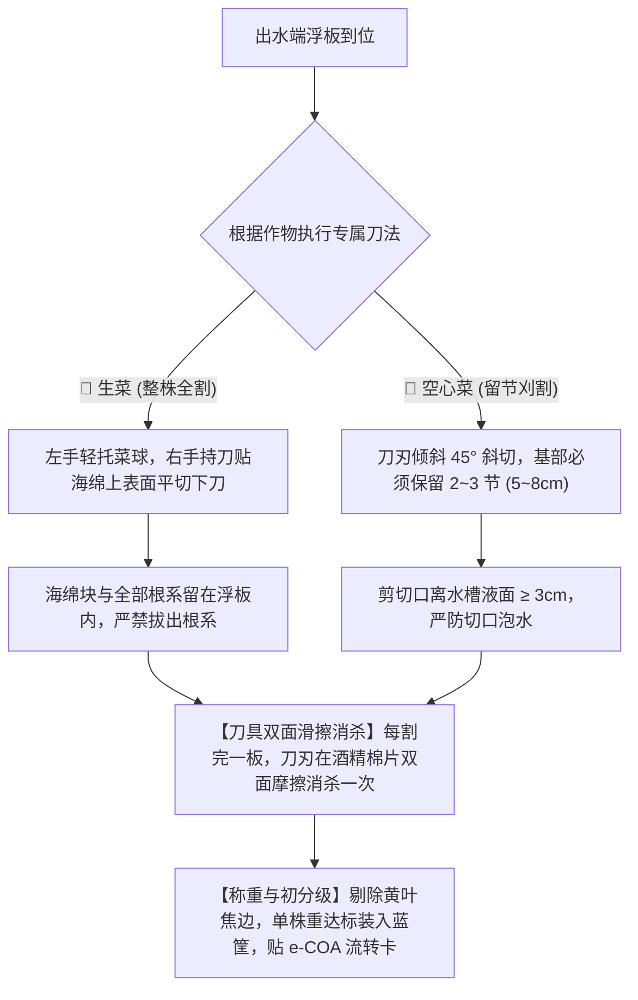

# 现场作业看板【KB-05】：成熟蔬菜采收切根与初分级工位看板

> **【工位编号】**：KB-05 ｜ **【工位名称】**：成熟蔬菜采收切根与初分级工位  
> **【物理位置】**：各深水跑道末端出水区、采收作业操作台  
> **【责任岗位】**：采收工、分级包装初检员  
> **【作业节拍】**：生菜单板（24株）平切装筐 ≤ 120 秒；空心菜单板割收 ≤ 90 秒  
> **【核心目标】**：切口平整无二次污染、根系海绵完整随板带走、残次品拦截率 100%

---

## 1. 穿戴与工具物料清单

* 🥼 **防护穿戴**：食品级无粉丁腈手套、白色洁净围裙、发网帽、食品级口罩。
* 🔵 **采收工具**：不锈钢圆头专业切菜采收刀、随身医用 75% 酒精消毒棉片盒、电子台秤。
* 📦 **周转容器**：消杀合格的食品级蓝色镂空周转筐（内衬无菌保鲜食品膜）。

---

## 2. 标准作业四步法 (分品类精准刀法)

1. **生菜专属刀法（整株平切 · 严禁拔根）**：
   * 左手轻轻托住生菜叶球中下部；
   * 右手持刀，刀刃紧贴定植杯海绵上表面水平推切下刀，一刀整齐切断茎基；
   * **海绵块与全部根系必须完整留在浮板孔内**，严禁向上拔扯！
2. **空心菜专属刀法（留节刈割 · 斜切防腐）**：
   * 左手握拢一把空心菜茎秆上部；
   * 右手持刀呈 **45° 倾角斜切**（防止伤口积聚冷凝水）；
   * **必须保留基部粗壮的 2~3 个节位（留茬高度 5~8 cm）**作为下一茬侧芽爆发点；
   * **严禁切口贴近水面**：切口距深水液面高度必须 **≥ 3 cm**。
3. **刀具随板消杀机制**：每采收完一块浮板，作业员必须从随身盒内抽出一张酒精棉片，将切菜刀正反双面用力擦拭一遍，切断汁液传毒。
4. **初分级与称重入筐**：
   * 剥离最外层贴近海绵的 1~2 片接地黄老老化叶；
   * 放在台秤上核验规格（生菜标准级 200~250 g，特级 ≥ 250 g）；
   * 根部朝向一致、整齐码入周转筐中，筐满后挂签推入预冷包装车间。

---

## 3. 🚨 现场防错绝对红线 (Poka-Yoke / 绝对禁止)

> [!CAUTION]
> 1. **严禁向上拔扯生菜连根带泥出水**：拔扯会导致大量毛细脆根断裂落入水槽，腐烂后诱发全槽腐霉菌根腐病！
> 2. **严禁空心菜低位平切泡水**：空心菜若剪口淹入营养液，茎管内部会吸水迅速变黑腐烂，导致整株报废。
> 3. **严禁切菜刀掉地后不消杀直接继续割菜**：落地刀具必须用酒精彻底冲洗擦拭。
> 4. **严禁将带有顶烧心焦黑边、虫咬斑点的残次菜混入合格品筐**。

---

## 4. 📋 采收分级工位交接打卡表 (Checklist)

| 采收批次号 | 品种 | 计划采收板数 | 实际合格筐数 | 称重合格率 (%) | 残次品重量 (kg) | 刀具消杀执行确认 | 班组长签字 |
| :---: | :---: | :---: | :---: | :---: | :---: | :---: | :---: |
| ________ | 生菜 / 空心菜 | ____ 板 | ____ 筐 | ________ % | ________ kg | [ ] 每板均擦拭 | |
| ________ | 生菜 / 空心菜 | ____ 板 | ____ 筐 | ________ % | ________ kg | [ ] 每板均擦拭 | |
