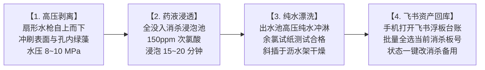

# 现场作业看板【KB-06】：浮板高压清洗与三级消杀工位看板

> **【工位编号】**：KB-06 ｜ **【工位名称】**：浮板高压清洗与三级消杀工位  
> **【物理位置】**：后处理清洗消杀间、露天防紫外线晾晒架  
> **【责任岗位】**：消杀保洁员 / 设备专员  
> **【作业节拍】**：单板（1.2m×0.9m）全流程冲洗、浸泡、沥干 ≤ 120 秒，每批次（40块）集中消杀  
> **【核心目标】**：孔内绿藻清除率 100%、真菌孢子彻底灭活、飞书资产状态一键归位

---

## 1. 穿戴与工具物料清单

* 🥼 **防护穿戴**：长筒防腐蚀橡胶手套、防水防酸雨衣雨裤、防滑高筒水靴、防飞溅防护面罩。
* 🟢 **专用工具**：220V 工业高压清洗机（压力 8~12 MPa）、浮板孔位专用旋转毛刷、次氯酸浓度测试试纸、手机飞书 App。
* 🧪 **专用消毒药剂**：食品级高纯次氯酸钠 / 二氧化氯粉剂、中和纯水。

---

## 2. 标准作业四步法 (Standard Operating Flow)

1. **高压水枪物理剥藻**：
   * 将采收完毕的脏浮板单块立于专用倾斜清洗架上；
   * 启动高压清洗机，调节扇形喷头，保持枪头与板面呈 **45° 夹角、距离 15~20 cm**；
   * 自上而下强力冲刷正面、反面以及 24 个定植孔内壁，彻底剥离残留附着的绿藻与死根。
2. **药池全没入化学消杀**：
   * 调配消杀水槽：加水并投入消毒剂，用测试试纸确认**有效氯浓度在 100~150 mg/L**；
   * 将冲净的浮板逐块平推入消杀槽，上方扣上压板锁，保证**浮板 100% 浸没在液面下**；
   * 浸泡消毒时间严格控制在 **15~20 分钟**。
3. **纯水漂洗与立体沥干**：
   * 捞出浮板，用纯水高压水枪快速冲淋正反面，冲掉表面残留消毒液；
   * 抽检板面余氯，确认无刺激性氯味；
   * 将浮板倾斜 **60° 插在不锈钢沥水通风架上**自然风干，严禁叠压堆放（防内部潮湿滋生厌氧菌）。
4. **📱 飞书浮板资产回库打卡（耗时 ≤ 10 秒）**：
   * 浮板彻底风干后，操作员打开手机飞书；
   * 进入**【浮板实物资产台账】**；
   * 筛选“当前所在菜池”为当前批次的板号（如 `RFT-24H-A-0001` 到 `0005`），点击批量全选；
   * 将【浮板当前状态】一键修改为：**“二级消杀备用”**；
   * 浮板推入定植备用区，完成物理与数据闭环。

---

## 3. 🚨 现场防错绝对红线 (Poka-Yoke / 绝对禁止)

> [!CAUTION]
> 1. **严禁浮板未全浸没漂浮消毒**：露在空气中的部位完全没有消毒，会直接带入下一茬引发全池根腐病！
> 2. **严禁叠放未干浮板**：潮湿叠放会导致板与板之间形成密封微环境，极易暴发霉菌。
> 3. **严禁使用破损、断裂或严重掉渣的浮板**：老旧浮板孔径变形会导致定植杯晃荡脱落，必须在飞书中标记“破损老化报废”并物理报废淘汰。
> 4. **严禁未经漂洗直接入池定植**：残留高浓度消毒液会瞬间烧伤下一茬新幼苗的嫩根！

---

## 4. 📋 浮板消杀批次打卡记录表 (Checklist)

| 消杀日期 | 消杀批次号 (DIS) | 消毒液实测有效氯浓度 | 浸泡起始时间 | 浸泡结束时间 | 消杀板数与编号范围 | 飞书状态归位确认 | 操作员 |
| :---: | :---: | :---: | :---: | :---: | :---: | :---: | :---: |
| 2026-11-28 | DIS-RFT-261128 | 135 mg/L (试纸达标) | 14:00 | 14:20 | 5块 (RFT-24H-A-0001~0005) | [x] 已改“二级消杀备用” | 张扬 |
