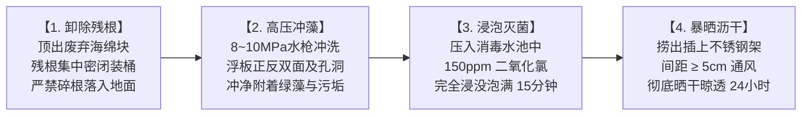

# 现场作业看板【KB-06】：浮板高压清洗与三级消杀工位看板

> **【工位编号】**：KB-06 ｜ **【工位名称】**：浮板清洗与三级消杀工位  
> **【物理位置】**：跑道末端洗板区、浸泡消毒池、立体暴晒沥水架  
> **【责任岗位】**：洗板保洁组（2人）  
> **【作业节拍】**：单块浮板冲洗 ≤ 30 秒，整批浸泡消毒恒温计时 15 分钟  
> **【核心目标】**：去除表面绿藻杂质，致病菌杀灭率 99.99%，芯片完好，晾干备用

---

## 1. 穿戴与工具物料清单

* 🥼 **防护穿戴**：重型耐酸碱防水连体皮裤、长胶手套、护目镜、防护面罩、防滑雨靴。
* 🟢 **专用洗消设备**：工业级可调高压清洗水枪（8~10 MPa）、带盖不锈钢浸泡消毒水槽。
* 💧 **指定消杀药剂**：**食品级二氧化氯消毒粉剂 / 一元泡腾片（配制浓度 150 mg/L）**；二氧化氯浓度计/试纸、专用不锈钢沥水晾板架。【⚠️ 严禁使用次氯酸钠 / 84消毒水！】

---

## 2. 标准作业四步法 (Standard Operating Flow)

1. **废弃海绵与残根脱板**：
   * 将采收完毕的废弃浮板置于残根脱出台；
   * 从浮板底部向上将 24 个定植杯及带有残根的废弃海绵顶出；
   * 废海绵直接落入专用密闭垃圾桶，运往生物堆肥区；定植杯收集进入清洗篮。
2. **高压去藻强力冲洗**：
   * 启动高压冲洗泵，调节压力至 **8~10 MPa**（严禁超压打裂发泡板材）；
   * 手持冲洗枪对准浮板正面、背面及 24 个孔内壁进行扫射冲洗，彻底剥离绿藻、生物膜与有机沉淀。
3. **整板浸没化学消杀**：
   * 将洗净的浮板竖直排列放入消杀池内；
   * 盖上不锈钢压网，确保**浮板 100% 完全浸没在 150 mg/L 二氧化氯药液中**，无裸露水面部分；
   * 启动计时钟，严格浸泡消毒不少于 **15 分钟**。
4. **立体插架暴晒风干**：
   * 戴橡胶手套捞出浮板，倾斜沥干表面药水；
   * 将浮板插在通风采光良好的不锈钢晾板架上，**板与板之间间隔 ≥ 5 cm**；
   * 暴晒风干 **24 小时以上**，目测完全干燥无水迹后方可贴上【合格放行绿标】转入定植区。

---

## 3. 🚨 现场防错绝对红线 (Poka-Yoke / 绝对禁止)

> [!CAUTION]
> 1. **【绝对红线】严禁私自使用次氯酸钠（NaClO / 84消毒液 / 漂白水）替代二氧化氯**：
>    次氯酸钠属于强碱高盐强腐蚀性药剂，一旦渗入 EPP 发泡浮板微孔中无法自然风干挥发，会在板孔微孔中固化析出。下一茬幼苗定植后，残留的强氧化性余氯会在定植孔局部集中释放，**直接灼伤并烧死幼苗初生毛细根（造成大面积发黑烂根与僵苗）**；且次氯酸钠极易与微量有机质反应生成致癌物三氯甲烷，严重违反食品安全出厂放行红线！
> 2. **严禁未消毒的湿板直接二次定植**：带水湿板表面残留的游动孢子或消杀药剂会直接污染新槽或灼伤幼根！
> 3. **严禁浮板漂浮在药液表面未完全压入**：露出水面的未接触部分将成为病菌与藻类的避风港。
> 4. **严禁高压水枪贴近近距离（< 10 cm）直冲板材**：极易破坏 EPP 发泡结构，导致浮板崩边破损漏水。
> 5. **严禁残根垃圾桶开盖停放在洗板车间**：必须随满随封盖并清运出温室区。

> [!NOTE]
> **【经验教训备注：消杀药剂选型红线】**
> 在以往生产测试中，曾有班组为贪图低成本与采购方便，擅自采用工业次氯酸钠（84消毒液）浸泡浮板。由于发泡板材蜂窝孔隙的“海绵吸附效应”，次氯酸钠无法通过普通晾晒挥发，导致该批次定植的 200 余块浮板生菜幼苗在入水第 2 天全部发生 **“根尖烧焦发黑坏死”**，全批报废；且消杀池因强碱导致有效氯迅速失效，反而诱发了腐霉菌交叉感染。自此确立铁律：**全厂浮板与器具消杀唯一指定食品级二氧化氯，严禁次氯酸钠入场！**

---

## 4. 📋 浮板洗消批次打卡台账 (Checklist)

| 洗消日期 | 批次号 | 本批清洗板数 | 二氧化氯实测浓度 | 浸泡起始时间 | 浸泡结束时间 | RFID读卡自检 | 晾干放行签字 |
| :---: | :---: | :---: | :---: | :---: | :---: | :---: | :---: |
| 2026-__-__ | ________ | ____ 块 | ______ mg/L | ____:____ | ____:____ | [ ] 抽测5块全读通 | |
| 2026-__-__ | ________ | ____ 块 | ______ mg/L | ____:____ | ____:____ | [ ] 抽测5块全读通 | |
