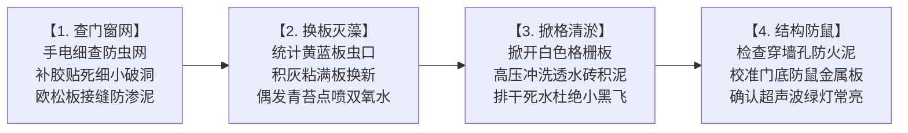
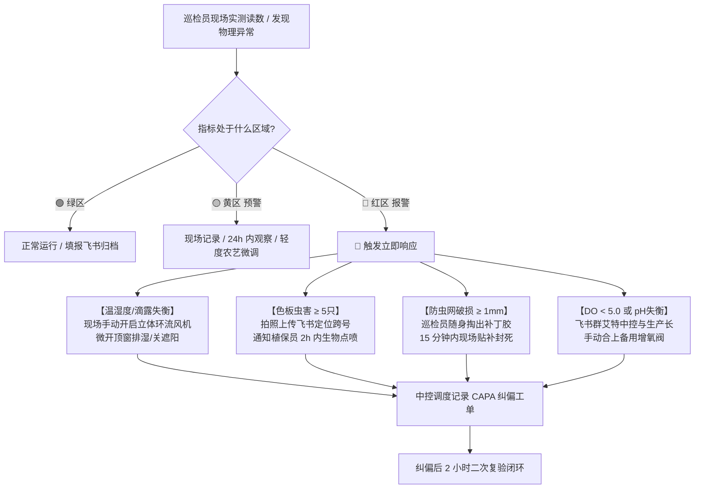

# 现场作业看板【KB-07】：大棚设施与生态环境日常巡检看板

> **【工位编号】**：KB-07 ｜ **【工位名称】**：大棚设施与生态环境日常巡检工位  
> **【物理位置】**：温室主通道目视化立柱、巡检移动推车、防虫与环境治理工作站  
> **【责任岗位】**：设施环境巡检员 / 植保专员 / 保洁班长  
> **【作业节拍】**：【周度深度点检】**每周 1 次（每周五 15:30~16:00，用时约 25~30 分钟）** ＋ 【每日进出顺带看眼】3 秒感官快速扫视（无感作业，不填表）  
> **【核心目标】**：外阻飞虫泥土、内清青苔积水、杜绝高空滴漏，全棚病虫害物理零扩散

---

## 1. 穿戴与工具物料清单

* 🥼 **防护穿戴**：专用洁净工作服、防滑白水靴、防护手套。
* 🔵 **专用巡视与清洁工具**：便携多功能气象仪（气温/湿度/气压）、**台湾衡欣 AZ86032 便携水质分析仪（DO/pH/EC/水温）**、长柄取物镊、便携强光手电筒、工业吸尘器/湿式平拖把、梯子。
* 💧 **绿色植保药械**：**3% 食品级过氧化氢（双氧水 H₂O₂）专用手持压力喷壶**、防虫网修补贴胶、备用黄板/蓝板、二氧化氯快速检测试纸。

---

## 2. 📊 核心巡检环境与水质参数合理区间与分级预警基准表

> **【目视化三色报警法则】**：
> * 🟢 **正常绿区（Optimal Target）**：环境与水质处于最佳农艺舒适带，设备维持标准工况，无需人为干预；
> * 🟡 **注意黄区（Warning / Alert）**：参数偏离基准但尚未造成急性生理伤害，**巡检员当天微调或记录观察，24 小时内复检**；
> * 🔴 **严重红区（Critical Action）**：触发生理逆境或重大生物安全隐患，**必须 10 分钟内上报并在现场启动强制干预动作**！

### 2.1 大棚空间微气候与物理环境指标看板

| 巡检监测项目 | 计量单位 | 🟢 正常合理范围 (绿区) | 🟡 注意预警范围 (黄区) | 🔴 严重报警阈值 (红区) | 超标危害与现场标准干预动作 |
| :--- | :---: | :---: | :---: | :---: | :--- |
| **棚内白天室温** | ℃ | **20.0 ~ 24.0** | 16.0 ~ 20.0 或 24.0 ~ 28.0 | **< 15.0 或 > 30.0** | **超温**：抽薹/烧心风险，立即开启外遮阳网与湿帘风机降温；<br>**低温**：光合停滞，闭合内保温幕。 |
| **棚内夜间室温** | ℃ | **14.0 ~ 18.0** | 10.0 ~ 14.0 或 18.0 ~ 22.0 | **< 8.0 或 > 22.0** | 保持 6~8℃ 昼夜温差促糖分累积；夜温过高养分消耗大，过低引发冷害。 |
| **空气相对湿度 (RH)** | % | **60 ~ 75** | 50 ~ 60 或 75 ~ 85 | **< 45 或 > 85** | **过湿 (>85%)**：高空结露炸弹，诱发灰霉病/心腐病，立即强启立体环流风机排湿；<br>**过干 (<45%)**：启动微雾喷雾。 |
| **叶面蒸汽压差 (VPD)** | kPa | **0.80 ~ 1.20** | 0.60 ~ 0.80 或 1.20 ~ 1.50 | **< 0.50 或 > 1.60** | **< 0.50**：蒸腾停滞，钙吸收阻断，引发 Tipburn 顶烧病；<br>**> 1.60**：气孔闭合失水，叶片萎蔫。 |
| **环境大气压强** | hPa | **1000 ~ 1025** | 990 ~ 1000 | **< 990 或 2h骤降>5** | **气压骤降**：预警强雷暴或台风逼近，强制检查外遮阳固定卡扣，全闭天窗防被大风刮翻撕裂！ |
| **色板周增虫口** | 只/板/周 | **< 3** | **3 ~ 5** | **≥ 5** | **达到红线**：拍照上传飞书，定位跑道跨号，在 2 小时内组织局部生物制剂点喷（印楝素/捕食螨）。 |
| **进门脚垫药水浓度** | mg/L | **100 ~ 150** | 50 ~ 100 | **< 50 或 垫体干燥** | **低于 50**：杀菌彻底失效，鞋底泥菌外溢！立即倒掉旧水，重新配制 150 mg/L 二氧化氯注入。 |
| **格栅下积水深度** | mm | **0 (表面干爽)** | 局部微水 ≤ 3 (快速下渗) | **≥ 5 或 滞留>1小时** | **积水滞留**：小黑飞（蛾蚋）与摇蚊幼虫孵化温床！立即清理排水沟滤网，排干死水。 |
| **顶膜垂直滴露** | 滴/分钟 | **0 (均匀成膜顺流)** | 偶见大水珠但未滴入菜心 | **持续水滴滴入叶心** | **水滴砸心**：极易造成水培叶心腐烂！立即手动启动对应跨位的立体环流风机打破微气层。 |
| **防虫网破损状态** | mm | **0 (60目无缝)** | 网眼局部起毛变形 | **出现任何 ≥ 1.0 破洞** | **破网**：蓟马/白粉虱无阻穿透！巡检员随身携带防虫修补贴胶，**发现破洞必须在 15 分钟内现场贴死**。 |

---

### 2.2 现场深水跑道水质理化生命线指标看板（便携仪快速核对）

> 巡检员巡查大棚时，使用 **台湾衡欣 AZ86032 便携水质分析仪**（3米探头直接下垂跑道）抽测水质，确保环境与水体协同受控：

| 水质指标项 | 单位 | 🟢 正常合理范围 (绿区) | 🟡 注意预警范围 (黄区) | 🔴 严重报警阈值 (红区) | 现场联动与纠偏处置流程 |
| :--- | :---: | :---: | :---: | :---: | :--- |
| **溶解氧 (DO)** | mg/L | **≥ 6.50** | 5.00 ~ 6.50 | **< 5.00 (生命线)** | **DO < 5.0**：蔬菜根系缺氧褐化变黑，加州鲈浮头！立即手动开启备用罗茨风机与纯氧射流阀。 |
| **酸碱度 (pH)** | - | **6.00 ~ 6.80** | 5.50~6.00 或 6.80~7.20 | **< 5.50 或 > 7.50** | **pH 异常**：铁/磷等微量元素沉淀吸收障碍！飞书报警并通知中控台微量加注食品级磷酸或氢氧化钾。 |
| **电导率 (EC)** | mS/cm | **1.40 ~ 1.80** (生菜) | 1.20~1.40 或 1.80~2.00 | **< 1.00 或 > 2.20** | **EC 过高**：烧根脱水；**EC 过低**：营养不良！自动或手动补充浓缩营养母液或淡水稀释。 |
| **跑道水温** | ℃ | **18.0 ~ 22.0** | 22.0 ~ 25.0 或 15.0 ~ 18.0 | **> 26.0 或 < 14.0** | **水温 > 26℃**：水中溶氧极限降低，腐霉菌根腐病爆发！开启热泵冷水机组与深井热交换循环。 |

---

## 3. 标准作业流（每日顺带三看 ＋ 周五深度四步）

### 3.1 每日日常：进出温室“顺带三看”（零填表负担）
* 进门踩脚垫时：顺带看一眼脚垫湿不湿（若干燥随手补倒一桶 150 mg/L 二氧化氯）；
* 抬头看高空时：顺带看一眼顶棚薄膜有没有往下滴水（若有滴漏顺手合上环流风机开关排湿）；
* 走过通道时：顺带看一眼大门关严没有、跑道边沿遮光条有没有掀开。

### 3.2 每周五下午：系统深度点检与大扫除（四步法闭环）



1. **查门窗与防虫网（守住进出外防线）**：
   * 手持手电筒仔细排查侧卷膜与天窗 **60 目防虫网**，发现撕裂、穿孔或卡簧脱落，立即用防虫贴胶修补封死；
   * 检查下部 1.0 米欧松板与地面接缝，确认无室外渗泥倒灌；气闸双门闭合严密。
2. **换色板与灭青苔（绿色切断病虫源）**：
   * 盘点黄板（蚜虫/粉虱）与蓝板（蓟马）虫情，粘满杂质或使用超 30 天的统一揭下换新；
   * 巡视跑道边缘与浮板拼接处，确保黑白反光遮光条遮严无漏光；
   * 若池壁偶见初生青苔斑块，使用 **3% 食品级双氧水精准点喷**，严禁毛刷水下刷散！
3. **掀格清淤与格栅卫生（杜绝蚊蝇滋生）**：
   * 掀起主要走道活动白色格栅板，使用高压水枪接入低浓度二氧化氯水，冲刷透水砖表面积泥与杂菌藻膜；
   * 疏通排水沟，确保格栅下无恶臭死水积聚，彻底铲除小黑飞（蛾蚋）与摇蚊幼虫温床；
   * 用长柄镊子夹出落入缝隙中的所有老黄残菜叶。
4. **结构防鼠与高空设备安全**：
   * 检查所有穿墙电缆与管道套管，确认防火密封泥饱满封死，无老鼠啃咬痕迹；
   * 检查大门底部高 ≥ 30cm 防鼠金属挡板平整稳固；超声波驱鼠驱鸟器电源绿灯常亮。

---

## 4. 🚨 现场防错绝对红线 (Poka-Yoke / 绝对禁止)

> [!CAUTION]
> 1. **严禁向水培跑道内投加硫酸铜等化学杀藻剂**：硫酸铜属重金属剧毒污染，直接造成食品安全违禁，全池报废！
> 2. **严禁在跑道上方或温室内使用干燥扫帚干扫扬尘**：干扫会将地面的土壤真菌孢子扬入水池引发烂根，必须湿拖或吸尘！
> 3. **严禁双层出入门同时敞开通风**：任何因搬运货物偷懒而卡死双门的，按重大生物安全事故追责！
> 4. **严禁在水下直接用毛刷用力刷青苔**：刷洗会将藻丝打碎成数以亿计的微碎片扩散全槽，促成爆发！必须用 3% 双氧水局部点喷杀灭。
> 5. **严禁在白色格栅板通道上堆放废弃纸箱、破浮板与杂物**。

---

## 5. 📱 飞书移动端周度点检扫码与多维表格汇流 (Lark Base Entry)

> **【环境数据数字化规范】**：每周五巡检员巡查完毕后，使用手机飞书扫描本看板二维码，快速勾选防虫网、格栅积水及填报大棚温湿度气压数据。多维表格自动汇总生成全厂环境质量雷达图与虫情趋势预警。

```
┌────────────────────────────────────────────────────────┐
│  【请在此处张贴：飞书大棚环境周检表单二维码】         │
│   📱 手机微信/飞书扫一扫 ➔ 自动获取时间与账号         │
│   ➔ 快速勾选 7 大节点合格状态 ➔ 填入手测气温/湿度/气压│
│   ➔ 偶发破损/虫情拍照上传 ➔ 点击【提交】(用时 30 秒)   │
└────────────────────────────────────────────────────────┘
```

### 📋 纸质周度打卡台账 (仅在手机没电或网络故障时备用)

| 巡查路线节点 | 核心巡检与维护指标 | 质量验收量化基准 (绿区达标) | 第 1 周五 | 第 2 周五 | 第 3 周五 | 第 4 周五 | 巡检责任人 |
| :--- | :--- | :--- | :---: | :---: | :---: | :---: | :---: |
| **节点 1：进出气闸门** | 闭合气密 / 药垫浓度 | 闭合气密良好，脚垫药液 100~150 mg/L（试纸合格） | [ ] 达标 | [ ] 达标 | [ ] 达标 | [ ] 达标 | |
| **节点 2：通风防虫网** | 60目网眼完整性排查 | 全网无破孔撕裂（破损 ≥ 1.0mm 必须现场贴死） | [ ] 完好 | [ ] 完好 | [ ] 完好 | [ ] 完好 | |
| **节点 3：色板虫情维护** | 虫口统计与老旧色板更换 | 新增虫口 < 3只/板/周（≥5只触发点喷），老化换新 | [ ] 正常 | [ ] 正常 | [ ] 正常 | [ ] 正常 | |
| **节点 4：跑道边缘防藻** | 遮光覆盖 / 青苔双氧水点洗 | 遮光条严实无漏光，偶发青苔已点喷3%双氧水杀灭 | [ ] 遮严无藻 | [ ] 遮严无藻 | [ ] 遮严无藻 | [ ] 遮严无藻 | |
| **节点 5：白色格栅地面** | 掀板冲洗底层砖 / 积水清零 | 透水砖积水=0mm、积泥冲净、无死水恶臭、无小黑飞 | [ ] 干爽无蝇 | [ ] 干爽无蝇 | [ ] 干爽无蝇 | [ ] 干爽无蝇 | |
| **节点 6：8.1m 挑高顶膜** | 传动轴钢丝绳 / 滴露为零 | 水汽顺坡滑向天沟，无破损，垂直滴水=0（滴落开风机）| [ ] 顺流无滴 | [ ] 顺流无滴 | [ ] 顺流无滴 | [ ] 顺流无滴 | |
| **节点 7：微气候参数核对** | 气温、湿度、VPD 反演 | 白天 20~24℃，湿度 60~75%，VPD 0.8~1.2 kPa | [ ] 绿区 | [ ] 绿区 | [ ] 绿区 | [ ] 绿区 | |
| **节点 8：跑道水质抽测** | DO 溶氧、pH、EC、水温 | DO ≥ 6.5mg/L，pH 6.0~6.8，水温 18~22℃ | [ ] 绿区 | [ ] 绿区 | [ ] 绿区 | [ ] 绿区 | |
| **节点 9：防鼠防鸟结构** | 穿墙泥封 / 门底防鼠金属板 | 套管密封胶泥饱满无隙，防鼠板稳固，超声波绿灯亮 | [ ] 密封到位 | [ ] 密封到位 | [ ] 密封到位 | [ ] 密封到位 | |

---

## 6. 🚨 异常超标快速响应与工单闭环流程 (Escalation Protocol)


