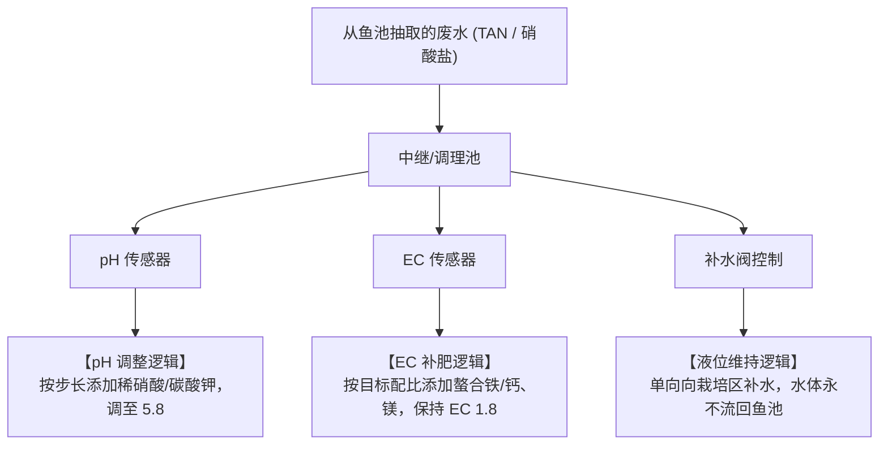

# 鱼菜共生系统：02_水培种植子系统设计 (Hydroponics Subsystem Design)

水培种植子系统（`hydro`）负责作物的光合产出与健康控制。利用物理上的“解耦系统”设计，实现蔬菜微环境（VPD、PPFD）的精准管理与营养成分的最优调节。

---

## 1. 系统范畴与物理边界

本子系统覆盖的物理设备和控制节点包括：
1. **水培栽培槽 (Hydroponic Channels/Raceways)**：植物根系生长区（一般为深水漂浮板栽培/NFT系统）。
2. **营养液中继/调理池 (Mixing/Buffering Tanks)**：解耦系统的缓冲节点，用于加入酸碱调理剂与补充矿质肥料。
3. **加药与补水机构 (Dosing Pump & Water Replenishment)**：由 PLC 驱动的蠕动泵（加酸、加碱、加微量元素）。
4. **温室环控机构 (Greenhouse Climate Actuators)**：电动外遮阳、通风侧卷膜、环流风机、LED 补光灯阵列、地源热泵暖通（HVAC）。

---

## 2. 关键环境变量监测与反演

### 2.1 PPFD (光合有效辐射) 监测
* **选型规范**：选用**量子效应光量子传感器 (PAR 计)**，不可采用普通 Lux 光照计。
* **物理集成**：在每个栽培区上空及多层垂直栽培的各层架板下均匀布置测点。PPFD 遥测数据每分钟上报一次，直接参与 LED 调光与幕帘控制逻辑。

### 2.2 VPD (饱和蒸汽压差) 计算与反演
* **物理原理**：VPD 决定作物的气孔开闭与蒸腾作用。
* **软计算模型**：由于植物叶温测量成本高且易损坏，系统通过采集**室内空气干球温度 ($T_a$)** 与**相对湿度 ($RH$)**，结合**叶面温差修正项**，在边缘网关利用马格努斯公式动态反算出当前的 VPD：
  $$\text{VPD} = e_s(T_a) \times \left(1 - \frac{RH}{100}\right)$$
  *(其中 $e_s(T_a)$ 为当前温度下的饱和水汽压)*
* **数据反馈**：当反演出的 VPD 偏离正常范围（$0.8 \sim 1.2\,\text{kPa}$）时，系统自动联动高压微雾系统或风机进行干预。

---

## 3. 调理池（Buffer）加药与 pH 自治算法

为了打破传统耦合系统的环境冲突，本解耦子系统在“营养液调理池”执行独立的化学成分控制：

* **自治算法步长限制**：由于根系对化学突变极其敏感，PLC 加药泵调节 pH 必须采用**小步长、长间隔（如每 15 分钟加药 5 秒）**的脉冲调节逻辑，禁止连续泵入。

---

## 4. AI 产量预测与收割排产模型

### 4.1 基于光温累积（DLI）与 SUCROS 机理的成熟期预测
* **算法模型**：结合 **SUCROS (植物生长机理模型)** 与 **LSTM 时序网络**。
* **数据输入**：每日光合有效辐射累积量 (DLI)、气温积温（GDD）、以及栽培区高空相机每日识别并语义分割出的**叶面积指数 (LAI)**。
* **商业表现**：系统在幼苗定植第 10 天，即可在云端以 $97\%$ 的精确度预测出该批次作物的成熟起捕日（当平均单株重达到 $250\,\text{g}$ 的物理规格），为 ERP 模块提供精准的供应链履约依据。

---

## 5. 反复调整成功的经验教训（【备注与防护墙】）

> [!WARNING]
> **【经验教训备注：高湿结露与防根腐病防护墙】**
> 在 2025 年秋冬季节性降温期间，曾因夜间温室风机联动程序失效，导致空气湿度达到 $98\%$，蔬菜叶片大面积**“结露（Dew Condensation）”**并引发严重的根腐病与灰霉病，导致全区生菜报废。
> **在此设置防御防线**：IT 系统必须实时计算“露点温度（Dew Point）”。一旦当前温室内叶片估算温度与露点温度的差值（$\Delta T$）缩小至 $1.5^\circ\text{C}$ 以内（表明即将发生物理结露），本地 PLC 必须强制拉高环流风机功率，并开启遮阳幕帘进行强制空气对流除湿，绝对不可等待云端 AI 指令。
