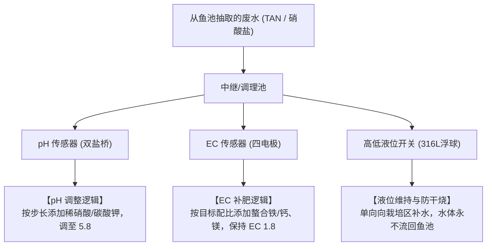

# 连锁数字化农业工厂：02_水培种植子系统设计 (Hydroponics Subsystem Design)

水培种植子系统（`hydro`）负责作物的光合产出与健康控制。利用物理上的“解耦系统”设计，实现蔬菜微环境（VPD、PPFD）的精准管理与营养成分的最优调节。

---

## 1. 系统范畴与物理边界

本子系统覆盖的物理设备和控制节点包括：
1. **水培栽培槽 (Hydroponic Channels/Raceways)**：植物根系生长区（一般为深水漂浮板栽培/NFT系统）。
2. **营养液中继/调理池 (Mixing/Buffering Tanks)**：解耦系统的缓冲节点，用于加入酸碱调理剂与补充矿质肥料。
3. **加药与补水机构 (Dosing Pump & Water Replenishment)**：由 PLC 驱动的蠕动泵（加酸、加碱、加微量元素）。
4. **温室环控机构 (Greenhouse Climate Actuators)**：电动外遮阳、通风侧卷膜、环流风机、LED 补光灯阵列、地源热泵暖通（HVAC）。

---

## 2. 关键环境变量监测与反演

### 2.1 PPFD (光合有效辐射) 监测
* **选型规范**：选用**量子效应光量子传感器 (PAR 计)**，不可采用普通 Lux 光照计。
* **物理集成**：在每个栽培区上空及多层垂直栽培的各层架板下均匀布置测点。PPFD 遥测数据每分钟上报一次，直接参与 LED 调光与幕帘控制逻辑。

### 2.2 VPD (饱和蒸汽压差) 与大空间温湿度立体感知
* **物理原理**：VPD 决定作物的气孔开闭与蒸腾作用。
* **8.1m 挑高立体测温阵列**：在 $116\text{m}\times 48\text{m}$ 温室内布置 6 根立体测温立柱（L1 冠层 1.2m、L2 中层 3.8m、L3 脊高 7.5m 共 18 组测点），配合室外超声波微气象站，全面消除大空间温度分层与冷热死区（立体测温与温控策略详见 👉 [04_大空间温室立体微气候感知与温控策略规范.md](../05_specifications/04_大空间温室立体微气候感知与温控策略规范.md)）。
* **软计算模型**：系统通过采集**室内空气干球温度 ($T_a$)**、**相对湿度 ($RH$)** 与**红外叶温 ($T_{\text{leaf}}$)**，在边缘网关利用 Magnus-Tetens 公式动态计算真叶面 VPD：
  $$\text{VPD}_{\text{leaf}} = e_s(T_{\text{leaf}}) - e_a(T_a)$$
* **数据反馈**：当反演出的 VPD 偏离正常范围（$0.8 \sim 1.2\,\text{kPa}$）时，系统自动联动高压微雾系统或风机进行干预。

### 2.3 作物蒸腾速率 ($T_r$) 与日耗水预测
* **算法模型**：边缘网关结合真叶面 VPD、PPFD 辐射、局部微风速与 Jarvis 气孔阻抗模型，运行 **Stanghellini 冠层蒸腾方程**，秒级输出瞬时蒸腾通量并积分预测全天耗水量。
* 完整机理推导与传感器配置详见：👉 [03_温室作物蒸腾量估算与感知算法规范.md](../05_specifications/03_温室作物蒸腾量估算与感知算法规范.md)。

---

## 3. 调理池（Buffer）加药、水力计算与 pH 自治算法

为了打破传统耦合系统的环境冲突，本解耦子系统在“营养液调理池”执行独立的化学成分控制与水力缓冲调配：

```mermaid
flowchart TD
    Source["从鱼池抽取的废水 (TAN / 硝酸盐)"] --> Buffer["中继/调理池"]
    
    Buffer --> SensorPH["pH 传感器 (双盐桥)"]
    Buffer --> SensorEC["EC 传感器 (四电极)"]
    Buffer --> SensorLevel["高低液位开关 (316L浮球)"]
    
    SensorPH --> LogicPH["【pH 调整逻辑】<br>按步长添加稀硝酸/碳酸钾，调至 5.8"]
    SensorEC --> LogicEC["【EC 补肥逻辑】<br>按目标配比添加螯合铁/钙、镁，保持 EC 1.8"]
    SensorLevel --> LogicLevel["【液位维持与防干烧】<br>单向向栽培区补水，水体永不流回鱼池"]
```

### 3.1 核心水力与容积工程公式概括
* **日流量计算**：$Q_{\text{daily}} = A_{\text{plant}} \times ET_c \times (1 + \eta_{\text{loss}})$（由植物蒸腾蒸发与氮素平衡决定）。
* **设计容积公式**：$V_{\text{buffer}} \approx (1.2 \sim 1.5) \times Q_{\text{daily}}$（涵盖昼夜产销峰谷错配 $V_{\text{peak}}$ 与反应停留时间 $V_{\text{HRT}}$）。
* 完整推导与工程选型详见专项技术规范：👉 [02_调节池水力计算与加药自治规范.md](../05_specifications/02_调节池水力计算与加药自治规范.md)。

### 3.2 自治加药步长与物理安全防线
* **自治算法步长限制**：由于根系对化学突变极其敏感，PLC 加药泵调节 pH 必须采用**小步长、长间隔（如每 15 分钟加药 5 秒）**的脉冲调节逻辑，禁止连续泵入。
* **物理防回流铁律**：水体单向向水培区供给，严格物理与控制互锁，调理水体永不流回 RAS 鱼池。

---

## 4. AI 产量预测与收割排产模型

### 4.1 基于光温累积（DLI）与 SUCROS 机理的成熟期预测
* **算法模型**：结合 **SUCROS (植物生长机理模型)** 与 **LSTM 时序网络**。
* **数据输入**：每日光合有效辐射累积量 (DLI)、气温积温（GDD）、以及栽培区高空相机每日识别并语义分割出的**叶面积指数 (LAI)**。
* **商业表现**：系统在幼苗定植第 10 天，即可在云端以 $97\%$ 的精确度预测出该批次作物的成熟起捕日（当平均单株重达到 $250\,\text{g}$ 的物理规格），为 ERP/APS 供应链模块与机器人调度系统提供精准的履约依据（详见 👉 [05_供应链与业务中台.md](./05_供应链与业务中台.md) 与 [04_智能调度与机器人.md](./04_智能调度与机器人.md)）。

---

## 5. 反复调整成功的经验教训（【备注与防护墙】）

> [!WARNING]
> **【经验教训备注：高湿结露与防根腐病防护墙】**
> 在 2025 年秋冬季节性降温期间，曾因夜间温室风机联动程序失效，导致空气湿度达到 $98\%$，蔬菜叶片大面积**“结露（Dew Condensation）”**并引发严重的根腐病与灰霉病，导致全区生菜报废。
> **在此设置防御防线**：IT 系统必须实时计算“露点温度（Dew Point）”。一旦当前温室内叶片估算温度与露点温度的差值（$\Delta T$）缩小至 $1.5^\circ\text{C}$ 以内（表明即将发生物理结露），本地 PLC 必须强制拉高环流风机功率，并开启遮阳幕帘进行强制空气对流除湿，绝对不可等待云端 AI 指令（策略算法详见 [04_大空间温室立体微气候感知与温控策略规范.md](../05_specifications/04_大空间温室立体微气候感知与温控策略规范.md)）。

---

## 🔗 相关设计与规范链接

* **大空间温室微气候感知与温控策略**：👉 [04_大空间温室立体微气候感知与温控策略规范.md](../05_specifications/04_大空间温室立体微气候感知与温控策略规范.md)
* **调节池水力计算与加药自治**：👉 [02_调节池水力计算与加药自治规范.md](../05_specifications/02_调节池水力计算与加药自治规范.md)
* **作物蒸腾量估算与感知算法**：👉 [03_温室作物蒸腾量估算与感知算法规范.md](../05_specifications/03_温室作物蒸腾量估算与感知算法规范.md)
* **现场弱电布线与快拆施工**：👉 [05_现场弱电线缆选型与布线施工规范.md](../05_specifications/05_现场弱电线缆选型与布线施工规范.md)
* **自动收割机器人调度与排产中台**：👉 [04_智能调度与机器人.md](./04_智能调度与机器人.md) & [05_供应链与业务中台.md](./05_供应链与业务中台.md)
* **产销协同选品与可承诺量大盘**：👉 [06_销售赋能与客户溯源子系统.md](./06_销售赋能与客户溯源子系统.md)
