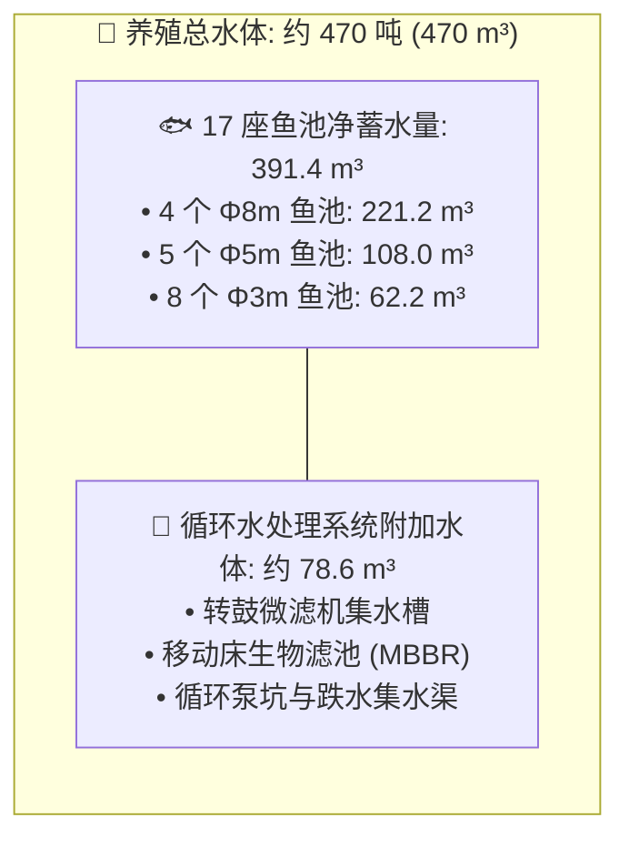
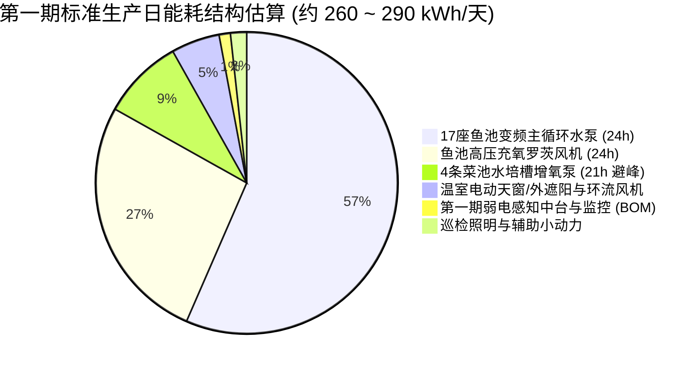

# 连锁数字化农业工厂：01_养殖水动力与全厂运行能耗估算模型 (非正式草案)

> [!CAUTION]
> ### ⚠️ 重要声明与免责提示 (Non-Official Estimation & Disclaimer)
> 1. **非正式估算性质**：本文件为项目在**方案规划与概念设计阶段的理论估算草案（非正式工程结算依据）**，旨在为初期配电容量设计、变频设备选型及运营财务预算提供量化参考模型。
> 2. **第一期设备物理边界**：**第一期（实验验证与基础数据采集期，¥5.80 万元极低 CAPEX）未包含中央地源热泵等重资产暖通空调设备**。第一期的温控完全依托“文洛温室自然开窗对流、电动外遮阳幕阻热与高空环流风机”，全厂电耗主要集中在水动力循环、微孔充氧及弱电感知中台。
> 3. **动态变量影响**：实际运行电耗受现场管网实际走向与水力局部阻力、阀门开度、变频器现场调谐频率、季节气温与昼夜温差波动、鱼群各生长周期的存塘总生物量以及分时电价（TOU）避峰执行策略的动态影响。
> 4. **验收与结算基准**：系统正式投运后，所有实际能耗数据与电费核算**一律以现场威胜 DTSD342-P5 三相智能电表的实测高精度计量为准**。

---

## 1. 17 座鱼池几何尺寸与水体容积精确测算

根据现场 3D 布局规划，养殖区由 **4 座直径 8 米大池、5 座直径 5 米中池、8 座直径 3 米小池** 构成，有效设计水深均为 $H = 1100\,\text{mm} = 1.1\,\text{m}$：

### 1.1 各规格鱼池水体参数明细表

圆柱形容积计算公式：$V = \pi \times \left(\frac{D}{2}\right)^2 \times H$

| 鱼池规格 | 数量 | 单池底面积 ($S = \pi r^2$) | 单池有效水体 ($V = S \times 1.1\text{m}$) | 该组总有效水体 ($\text{m}^3$) | 占比 | 生产养殖定位与功能划分 |
| :--- | :---: | :---: | :---: | :---: | :---: | :--- |
| **直径 8 米池** ($\Phi 8.0\text{m}$) | **4 个** | $50.27\,\text{m}^2$ | $55.29\,\text{m}^3$ | **$221.17\,\text{m}^3$** | 56.5% | 成鱼高密度养成主池（承担全厂大生物量负荷） |
| **直径 5 米池** ($\Phi 5.0\text{m}$) | **5 个** | $19.63\,\text{m}^2$ | $21.60\,\text{m}^3$ | **$108.00\,\text{m}^3$** | 27.6% | 中规格鱼养成池 / 采收前吊水净化池 |
| **直径 3 米池** ($\Phi 3.0\text{m}$) | **8 个** | $7.07\,\text{m}^2$ | $7.78\,\text{m}^3$ | **$62.20\,\text{m}^3$** | 15.9% | 鱼苗培育 / 幼鱼标粗 / 品种试验分级池 |
| **🐟 17 座鱼池净水体合计** | **17 个** | **$355.79\,\text{m}^2$** | — | **$\mathbf{391.37\,\text{m}^3}$** | **100%** | **全场 17 座鱼池有效净水体约 391.4 吨** |
| **🧪 包含水处理系统的总水体** | — | — | — | **$\approx \mathbf{470.0\,\text{m}^3}$** | — | 包含微滤机、生化滤池与管网水体（按约 20% 附加冗余） |

---

## 2. 循环水泵动力选型与理论功率推导

循环水泵负责驱动全场水体在“鱼池 $\to$ 排污管 $\to$ 滚筒微滤机 $\to$ 移动床生物滤池 $\to$ 回流提升泵房 $\to$ 旋流进水管”之间循环流动。

### 2.1 水力学计算参数
* **循环换水率 (Turnover Rate)**：按现代化陆基高密度循环水养殖（RAS）标准，循环周期设计为每小时换水 **$1.0 \sim 1.1\,\text{次/h}$**；
* **设计循环总流量 ($Q$)**：
  $$Q = 391.37\,\text{m}^3 \times 1.07\,\text{次/h} \approx 420\,\text{m}^3/\text{h} \approx 0.1167\,\text{m}^3/\text{s} \quad (116.7\,\text{L/s})$$
* **系统工作扬程 ($H$)**：
  * 地面式鱼池重力自流至地埋微滤机，泵房至鱼池净提升高度：$H_{\text{static}} \approx 1.8\,\text{m}$；
  * 管道沿程阻力 + 阀门局部阻力 + 旋流喷嘴射流压降：$H_{\text{dynamic}} \approx 2.0\,\text{m}$；
  * **设计总扬程**：$H = 3.5 \sim 4.0\,\text{m}$（取标准工况 $3.8\,\text{m}$）。
* **水泵水力轴功率计算公式**：
  $$P_{\text{shaft}} = \frac{\rho \cdot g \cdot Q \cdot H}{1000 \cdot \eta_{\text{pump}} \cdot \eta_{\text{motor}}}$$
  * 水体密度 $\rho = 1000\,\text{kg/m}^3$；重力加速度 $g = 9.8\,\text{m/s}^2$；
  * 水泵水力效率 $\eta_{\text{pump}} = 78\%$；变频电机综合效率 $\eta_{\text{motor}} = 88\%$；
  * 理论电功率：
    $$P = \frac{1000 \times 9.8 \times 0.1167 \times 3.8}{1000 \times 0.78 \times 0.88} \approx 6.33\,\text{kW}$$

### 2.2 推荐工程设备配置
* **装机方案**：选用 **3 台 $3.0\,\text{kW}$ 变频管道循环泵（2 用 1 备，总装机 $9.0\,\text{kW}$）**，或 **2 台 $4.0\,\text{kW}$ 变频泵并联**；
* **实际平均运行电功率**：经汇川变频器恒流量闭环调谐（工作在 $42 \sim 45\,\text{Hz}$），平均工作电功率约为 **$\mathbf{6.8\,\text{kW}}$**；
* **24小时连续运行电耗**：$6.8\,\text{kW} \times 24\,\text{h} = \mathbf{163.2\,\text{kWh/天}}$。

---

## 3. 充氧曝气风机动力选型与理论功率推导

气泵（罗茨鼓风机）必须承担两大刚性生化供氧任务：**17 座鱼池鱼群呼吸代谢耗氧** 与 **生物滤池硝化细菌氧化氨氮耗氧**。

### 3.1 生物化学需氧量 (SOTR) 平衡计算
1. **全场满产存塘生物量**：
   * 8m 成鱼池（4个）：存鱼约 $7.7\,\text{吨}$（密度 $35\,\text{kg/m}^3$）；
   * 5m 中鱼池（5个）：存鱼约 $3.2\,\text{吨}$（密度 $30\,\text{kg/m}^3$）；
   * 3m 鱼苗池（8个）：存鱼约 $1.2\,\text{吨}$（密度 $20\,\text{kg/m}^3$）；
   * **全场满产存鱼总重量 $W_{\text{fish}} \approx 12.0 \sim 15.0\,\text{吨}$（平均按 $12,000\,\text{kg}$ 测算）**。
2. **鱼类呼吸耗氧量 ($R_{\text{fish}}$)**：
   * 摄食与活动平均耗氧率按 $350\,\text{mg } O_2/(\text{kg}\cdot\text{h})$；
   * 需氧量：$12,000\,\text{kg} \times 0.35\,\text{g } O_2/(\text{kg}\cdot\text{h}) = \mathbf{4.20\,\text{kg } O_2/\text{h}}$。
3. **硝化细菌生化反应需氧量 ($R_{\text{bio}}$)**：
   * 满产日投饵率按 $1.5\%$（约 $180\,\text{kg}$ 饲料/天），转化总氨氮 TAN 约 $4.5\,\text{kg/天} = 0.225\,\text{kg/h}$；
   * 依据生化氧化方程式，每氧化 $1\,\text{g}$ 氨氮需消耗 $4.57\,\text{g } O_2$；
   * 硝化需氧：$0.225 \times 4.57 \approx \mathbf{1.03\,\text{kg } O_2/\text{h}}$。
4. **全场设计标准需氧速率 (SOTR)**：
   $$\text{SOTR} = 4.20 + 1.03 = \mathbf{5.23\,\text{kg } O_2/\text{h}}$$

### 3.2 风机气动力与轴功率计算
* **系统工作背压 ($\Delta P$)**：
  * 池底水深 $1.1\,\text{m}$，静水压为 $10.8\,\text{kPa}$；
  * 克服微孔橡胶膜微孔扩张阻力 + 沿程管阻 + 生化池深度（1.5m）：**设计工作风压 $\Delta P = 20 \sim 22\,\text{kPa}$**。
* **标准需风量 ($Q_{\text{air}}$)**：
  * 微孔曝气盘在 $1.1\,\text{m}$ 水深下的氧转移利用率（OTE）按 $11\%$ 测算；
  * 空气含氧量密度取 $0.28\,\text{kg } O_2/\text{m}^3$；
  * 供气风量：
    $$Q_{\text{air}} = \frac{5.23\,\text{kg } O_2/\text{h}}{0.28\,\text{kg/m}^3 \times 0.11} \approx 170\,\text{m}^3/\text{h} \approx 2.83\,\text{m}^3/\text{min}$$
  * 加上生物滤池 MBBR 悬浮填料沸腾搅拌风量（约 $0.8\,\text{m}^3/\text{min}$）：**设计总风量 $Q_{\text{air}} \approx 3.6 \sim 4.0\,\text{m}^3/\text{min}$**。
* **风机理论功率与选型**：
  $$P_{\text{blower}} = \frac{Q_{\text{air}} \cdot \Delta P}{60 \cdot 1000 \cdot \eta_{\text{blower}} \cdot \eta_{\text{motor}}} = \frac{3.8 \times 22000}{60 \times 1000 \times 0.65 \times 0.88} \approx 2.44\,\text{kW}$$
* **推荐设备配置**：**2 台 $3.7\,\text{kW}$ 或 $4.0\,\text{kW}$ 变频三叶罗茨鼓风机（1 用 1 备）**；
* **实际平均运行电功率**：变频连续运转平均电功率约为 **$\mathbf{3.2\,\text{kW}}$**；
* **24小时连续运行电耗**：$3.2\,\text{kW} \times 24\,\text{h} = \mathbf{76.8\,\text{kWh/天}}$。

---

## 4. 水动力与增氧刚性电费估算 (电价: 0.65 元/kWh)

水动力循环与微孔曝气属于**24小时不可停机的生命维持系统**，电费按 $0.65\,\text{RMB/kWh}$ 测算如下：

| 系统设备 | 推荐装机规格 | 实际平均运行功率 | 每日运行时长 | 每日用电量 (kWh/天) | 每日电费 (元/天) | **每月电费 (30天)** | **每年电费 (365天)** |
| :--- | :---: | :---: | :---: | :---: | :---: | :---: | :---: |
| **变频主循环水泵组** | 3台 3.0kW (2用1备) | **6.8 kW** | 24.0 h | **163.2 度** | **¥ 106.08** | **¥ 3,182.40** | **¥ 38,719.20** |
| **高压充氧罗茨风机组**| 2台 3.7kW (1用1备) | **3.2 kW** | 24.0 h | **76.8 度** | **¥ 49.92** | **¥ 1,497.60** | **¥ 18,220.80** |
| **💰 刚性保命负荷小计** | **装机 16.4 kW** | **平均 10.0 kW** | **24.0 h** | **240.0 度/天** | **¥ 156.00 元/天** | **$\mathbf{¥ 4,680.00\text{ 元/月}}$** | **$\mathbf{¥ 56,940.00\text{ 元/年}}$** |

---

## 5. 第一期全厂实际运行日用电量与电费综合测算 (严格第一期设备边界)

第一期以极低 CAPEX（5.80 万元）启动，环境调控依托文洛温室顶开窗自然通风、电动外遮阳网与高空环流风机，不包含地源热泵。全厂用电主要集中在弱电感知中台与水动力曝气系统：

### 5.1 第一期分阶段生产工况日耗电与电费明细表 (电价: 0.65 元/kWh)

| 生产工况与养殖阶段 | 弱电中台(BOM) | 17池水动力与曝气 (刚性) | 水培菜池增氧 | 自然通风与遮阳 | 照明与辅助 | 每日总耗电量 (kWh/天) | 每日电费 (0.65元/度) | **每月电费估算 (30天)** |
| :--- | :---: | :---: | :---: | :---: | :---: | :---: | :---: | :---: |
| **🐟 阶段 1：早期鱼苗标粗期** (仅 17 池低负荷运转，变频降频) | 3.5 度 | 156.0 度 (水泵4.5kW+风机2.0kW) | 0.0 度 | 8.0 度 | 3.5 度 | **$\approx \mathbf{171.0\text{ 度/天}}$** | **¥ 111.15 元/天** | **¥ 3,334.50 元** |
| **⚡ 阶段 2：常规养殖标准工况** (17 池常态循环，水培未投) | 3.5 度 | 240.0 度 (水泵6.8kW+风机3.2kW) | 0.0 度 | 12.0 度 | 4.5 度 | **$\approx \mathbf{260.0\text{ 度/天}}$** | **¥ 169.00 元/天** | **¥ 5,070.00 元** |
| **🌱 阶段 3：鱼菜共生全开满负荷** (17 池满产 + 4 菜池跑道全开) | 3.5 度 | 240.0 度 | 25.2 度 | 18.0 度 | 5.0 度 | **$\approx \mathbf{291.7\text{ 度/天}}$** | **¥ 189.60 元/天** | **¥ 5,688.00 元** |

---

## 6. 第一期生产运营财务指标 (Unit Economics 校验)

1. **成鱼单公斤水动力与充氧电费成本**：
   * 17 座鱼池年设计出鱼能力约为 **$20 \sim 25\,\text{吨}$**；
   * 全年水泵与风机刚性总电费约 **$5.7\,\text{万元}$**；
   * 折合**每公斤成鱼的水动力与充氧电费成本约为 ¥ 2.28 ~ 2.85 元/kg**。
2. **第一期综合运营电费预估**：
   * 第一期全厂在标准正常生产工况下，每月电费支出约为 **¥ 5,000 ~ 5,700 元**（日均约 **260 ~ 290 度**）；
   * 在鱼苗放养初期或调池空窗期，月电费可降至 **约 ¥ 3,300 元**。
3. **第一期威胜智能电表实测校验**：
   * 现场利用配电柜内已采购的 **威胜 DTSD342-P5 电表 + 3 只 200/5A 开口互感器**，可实时按 5 秒高频采集实际运行有功功率，自动按尖峰平谷复费率核算日电费，对比理论模型持续优化变频器运行频率。

---

## 🔗 相关设计与规范链接

* **第一期硬件采购 BOM 与施工清单**：👉 [04_第一期硬件采购BOM与工程施工清单.md](../../02_requirements_and_plans/04_第一期硬件采购BOM与工程施工清单.md)
* **分期实施计划书**：👉 [03_分期实施计划书.md](../../02_requirements_and_plans/03_分期实施计划书.md)
* **能耗优化子系统总体设计**：👉 [README.md](./README.md)
* **水产养殖子系统与保命逻辑**：👉 [01_aquaculture/README.md](../01_aquaculture/README.md)
* **调节池水力计算与加药规范**：👉 [01_调节池水力计算与加药自治规范.md](../02_hydroponics/01_调节池水力计算与加药自治规范.md)
