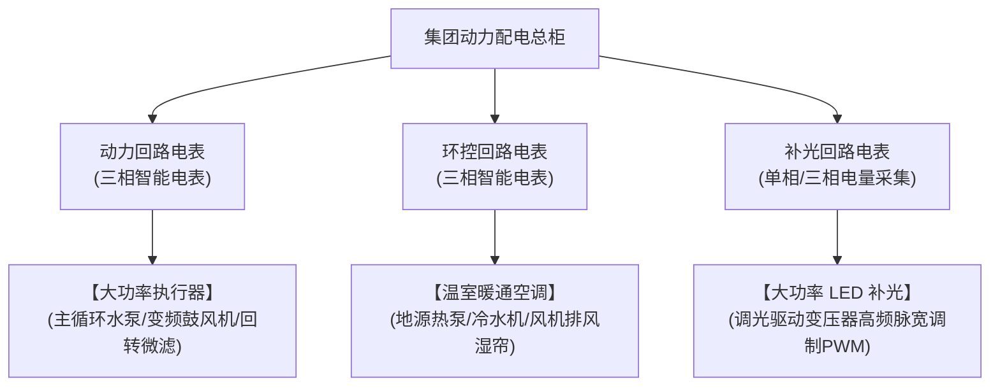

# 鱼菜共生系统：03_能耗优化子系统设计 (Energy Optimization Subsystem Design)

能耗优化子系统（`energy`）是控制设施农业日常运营开支（OPEX）的财务利器。通过精细的多级回路能耗监控与模型预测控制（MPC）算法，实现温室热能与光能的“避峰套利”。

---

## 1. 物理拓扑与多级能耗感知

为了使算法能够诊断各设备的真实能效比，必须抛弃“总配电柜单电表”的粗放模式，推行分回路导轨式智能电表网络：



* **接口协议**：所有导轨智能电表必须支持 **RS-485 (基于 Modbus-RTU 协议)** 或以太网协议，实时上报电流、电压、有功功率、无功功率与累计有功电能。

---

## 2. 外部特征数据接入（降维打击）

能耗优化子系统在云端（Cloud AI）部署，必须强力拉通以下两路外部 API，作为算法控制的核心权重：

### 2.1 高精度气象预报 API
* **数据规格**：订阅基地周边 $1\times 1\,\text{km}$ 范围、未来 72 小时的气象预报。
* **核心参数**：短波太阳辐射量 ($\text{W/m}^2$)、室外空气干球温度 ($^\circ\text{C}$)、云层覆盖率 ($\%$)、风速及风向。
* **数据价值**：提前感知自然热能（太阳能）的未来供给。

### 2.2 实时电网分时电价 (TOU) 数据
* **数据规格**：获取供电局公布的**尖峰、高峰、平段、低谷**四个时段的电价表（或某些地区的实时竞价电价表）。
* **核心参数**：各时段的每度电费单价（元/kWh）及起止物理时刻。

---

## 3. 模型预测控制 (MPC) 算法机制

MPC 控制器不单独以“这一刻温室冷热”做被动调节，而是执行**“走一步，看十步”**的时域滚动优化：

### 3.1 热力学数字孪生预测模型
系统内部维护一个温室与水体的热容量状态方程：
$$T_{\text{water}}(t+1) = f\Big( T_{\text{water}}(t), T_{\text{outdoor}}(t), \text{Solar}_{\text{radiation}}(t), U_{\text{HVAC}}(t) \Big)$$
*利用数百吨养殖水体的“高热惯性（Thermal Battery）”，在水温安全范围内扮演蓄能电磁的角色。*

### 3.2 优化目标函数 (Objective Function)
在每个决策时刻（每 15 分钟），MPC 求解器求解未来 24 小时的动作序列 $u$，以最小化电费成本：
$$\min_{u} \sum_{k=1}^{N} \text{Price}_{\text{TOU}}(t+k) \cdot P_{\text{HVAC}}\big(u(t+k)\big) \cdot \Delta t$$
$$\text{Subject to: } T_{\text{min}} \le T_{\text{water}}(t+k) \le T_{\text{max}}$$
*(约束条件：水温绝不能超出鱼类的安全生理界限 $18^\circ\text{C} \sim 24^\circ\text{C}$)*

---

## 4. 典型避峰套利场景流程

```
【下午 14:00 (平/谷电价, 阳光明媚)】
 ──► 气象 API 预测今晚 22:00 将有寒流。
 ──► MPC 决策：此时电价便宜，且阳光辐射充足。
 ──► 指令：全开遮阳幕，主动将大水体温度缓慢拉升 1.5°C（预先储热）。

【傍晚 18:00 (尖峰用电时段, 电价最贵)】
 ──► 寒流抵达，室外气温骤降。
 ──► 传统 PID 控制器：立刻全功率开启热泵加热（产生高额电费）。
 ──► MPC 算法决策：利用下午蓄积的 1.5°C 热水惯性平滑渡过。
 ──► 指令：强制关闭或极小化热泵加热设备。

【深夜 23:00 (谷段电价, 最便宜)】
 ──► 储热消耗完毕，且电价跌入谷底。
 ──► MPC 决策：全马力启动热泵。
 ──► 指令：加热水体，完成热量补充并进入下一轮循环。
```

---

## 5. 反复调整成功的经验教训（【备注与防护墙】）

> [!IMPORTANT]
> **【经验教训备注：补光电能对冲死线】**
> 在 2025 年浙江基地的运行中，曾发生过因 MPC 算法与天气预报时延不匹配，导致在白天强直射阳光下，LED 补光灯依然满负荷常开（多消耗了 400 度电），造成严重浪费。
> **在此设置程序防护墙**：系统必须在边缘网关配置**硬件照度互锁机制**。一旦现场 PAR 计检测到作物的 PPFD（光合有效辐射）已达到 $350\,\mu\text{mol}/(\text{m}^2\cdot\text{s})$，本地 PLC 将直接硬件级闭锁并强制切断 LED 补光电源，屏蔽任何云端 MPC 算法的延迟下发指令，从物理上锁死无效能耗。
