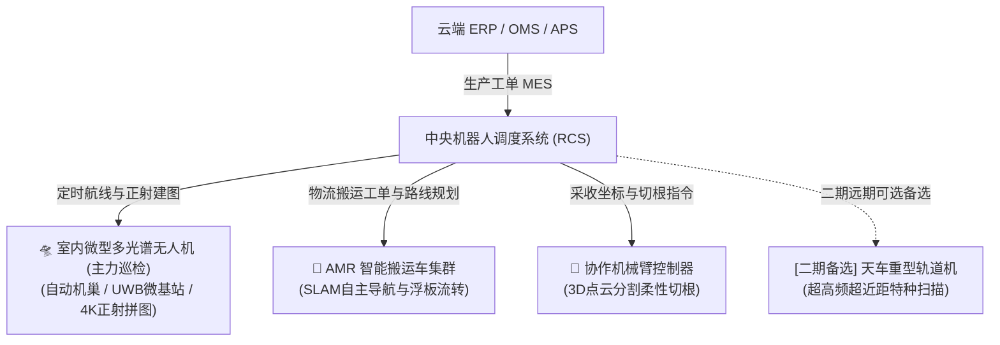

# 连锁数字化农业工厂：04_智能调度与机器人子系统设计 (Intelligent Scheduling & Robotics Subsystem Design)

智能调度与机器人子系统（`robot`）是数字化工厂的具身执行机构（手与脚）。通过集中调度系统（RCS）与 3D 视觉具身智能算法，实现全无人化、无菌的物流转运与精密蔬菜收割。

---

## 1. 集中调度系统 (RCS) 的四维金字塔架构

为防止各设备单体各自为战，系统采用统一的分层控制架构（工单生成源头来自供应链中台 APS，详见 👉 [05_supply_chain_finance/README.md](../05_supply_chain_finance/README.md)）：

---

## 2. 室内多光谱无人机（UAV）自动机巢与定时巡检规范（主力方案）

### 2.1 免轨降本决策与工程考量
* **传统轨道机痛点（为何降级为备选）**：
  1. **高昂的重资产铺设成本**：连栋温室需吊装铺设数百米高精度铝合金导轨、齿轮齿条、拖链线缆与伺服驱动滑块，初期土建与机械施工成本极为高昂；
  2. **机械磨损与高湿卡滞**：温室内部相对湿度常年达 $70\% \sim 90\%$，金属导轨和拖链滑轮易生锈、积灰、卡滞；
  3. **航线固化死板**：导轨一旦焊接安装便无法变更视角，无法兼顾 10 座鱼池表面摄食与 8.1 米挑高顶部设施。
* **室内无人机（UAV）的颠覆性优势**：
  * **零轨道施工**：全厂无需铺设一米钢轨，仅需在端头弱电柜侧放置一台紧凑型**全自动机巢（Drone Dock）**；
  * **全域立体覆盖**：既可俯瞰 4 大水培跑道生成全景正射影像，又可飞至鱼池上空巡检鱼群游姿，还可仰拍诊断 8.1m 顶部天窗与补光灯；
  * **极高性价比**：单套设备采购与调试成本不及全厂铺轨的 $1/3$。

### 2.2 自动机巢与高精度室内定位体系
* **自动机巢 (Drone Dock)**：
  * 具备防潮防尘电动启闭舱盖、无线接触式直流快充（15分钟充至 $85\%$）与车载数据高速 Wi-Fi 6 自动同步接口；
* **室内导航体系**：
  * 温室四周立柱轻量吸附安装 **4 处 UWB（超宽带）微定位基站**，配合无人机机载**下视双目视觉 SLAM 与光流传感器**，实现室内无 GPS 信号下的 **$\pm 2\,\text{cm}$ 级空间定点悬停与巡航**。

### 2.3 定时航测策略与全自动作业闭环
* **晨光唤醒巡检（09:00）**：4K RGB + 多光谱传感器扫描全厂生菜冠层，输出 NDVI 活力热力图与苗龄生长速率曲线；
* **午间光热巡检（14:00）**：FLIR 热红外镜头扫描作物叶温与温室垂直温差，提前 48 小时发现气孔蒸腾异常与微弱叶背蚜虫聚拢；
* **傍晚采收核算（18:00）**：自动拼图核算明日达到 $250\,\text{g}$ 规格的浮板孔位坐标，直接将采收工单下发给 AMR 搬运车。

---

## 3. 核心通信协议标准

为了实现不同厂商机器人的“即插即用”，强制推行以下协议规范（契约规范详见 [03_接口与数据契约规范.md](../03_system_architecture/03_接口与数据契约规范.md)）：
1. **RCS 与 AMR 群控通信**：严格遵循 **VDA 5050 标准协议**（基于 MQTT/WebSockets 传输，上报位置与接收路径）。
2. **机械臂与外围 PLC (如汇川 AM400 系列)/传送带交互**：采用 **OPC UA / EtherCAT 协议** 交互安全互锁信号。
3. **RCS 与云端业务系统通信**：采用高吞吐、低延迟的 **gRPC 协议**，保证物理收割与数字世界资产核销的秒级同步。

---

## 3. 具身智能三维视觉收割算法

传统的固定坐标机械臂极易捏碎脆嫩叶片或导致切根失败。本系统在六轴协作机械臂末端（Hand-in-Eye 架构）搭载 3D 激光 iToF 相机与具身算法（3D 数据集标注与点云格式详见 👉 [04_YOLO11活体生物数据集构建规范.md](../../03_system_architecture/04_YOLO11活体生物数据集构建规范.md)）：

### 3.1 三维点云分割与拓扑重建
* **算法模型**：边缘端（NVIDIA Jetson）运行 **PointNet++ 实例分割神经网络**。
* **物理执行**：实时采集蔬菜表面的千万个三维空间坐标（Point Cloud），在微秒级内将“重叠的叶片”、“水培板表面”和“作物的基质根茎”在 3D 空间进行语义剥离，生成精确的**语义拓扑图 (Semantic Topology)**，定位最佳切割点 $Z$ 轴深度。

### 3.2 仿生柔性抓取（力控闭环）
* **设备配置**：硅橡胶材质的**仿生软体抓手 (Soft Gripper)** + 内壁集成的**柔性触觉压力传感器阵列**。
* **控制算法**：PLC 执行“力控制 (Force Control) 闭环回路”。加压步长精细控制在毫巴级。
* **物理阈值**：**一旦抓手触觉反馈的总接触力达到 $0.2\,\text{N}$（确保稳固提起但绝不捏伤细胞组织），气压调节泵瞬间锁定压力。**

### 3.3 视觉伺服切割
* **执行**：软手拔出蔬菜后，由末端微距相机利用**图像视觉伺服 (Visual Servoing) 算法**，引导自动切刀滑入茎叶交界处，一瞬间精准切断根系。

---

## 4. 安全防护墙与故障自愈

1. **分布式物理急停硬线回路**
   * 全厂铺设一根串联的 **24V 硬线急停控制回路**。只要现场人员按下物理急停按钮，所有 AMR 与机械臂的伺服驱动器电源会在毫秒级内被切断，此动作完全不经过任何软件和网络层（接线规范见 [05_现场弱电线缆选型与布线施工规范.md](../../02_requirements_and_plans/05_现场弱电线缆选型与布线施工规范.md)）。
2. **紧急避让逻辑**
   * 当水产系统发生“急性缺氧/漏水报警”时，RCS 会瞬间将常规的蔬菜搬运工单挂起，指挥全场 AMR 自动靠边停靠在就近的**紧急避让点**，清空通道以供人工或抢修设备通行。

---

## 5. 反复调整成功的经验教训（【备注与防护墙】）

> [!CAUTION]
> **【经验教训备注 1：激光雷达温室结露防撞墙】**
> 在 2025 年的冬季高湿测试中，由于温室相对湿度瞬间达到 $95\%$，导致 2 号 AMR 的激光雷达反射镜面结露，AMR 瞬间“致盲”并失控撞偏了 5 号水培槽。
> **在此设置系统硬性约束**：所有 AMR 必须加装**超声波测距传感器与物理接触防撞条作为二级硬冗余防线**。一旦超声波探头检测到障碍物距离限制小于 $30\,\text{cm}$，车载控制器必须直接切断驱动轮电机，无条件紧急制动，绝不单信激光雷达数据。

> [!NOTE]
> **【经验教训备注 2：轨道巡检重资产痛点与无人机免轨降本】**
> 早期规划曾考虑大面积吊装天车铝合金轨道机，但在实际工程预算核算中发现：全厂铺设几百米高精度铝合金导轨、齿条与伺服滑块的施工成本高达数万元，且在温室高湿高氯环境下极易生锈积灰卡死，航线完全固化。
> **在此确立工程原则**：**全面采用“室内多光谱无人机 + 自动机巢 + 4点UWB定位”作为主力巡检方案**，零钢轨施工、零结构改动、全场立体无死角巡检，原重型轨道机仅保留为远期极端特种作业的备选方案。

---

## 🔗 相关设计与规范链接

* **供应链排产中台与订单流转**：👉 [05_supply_chain_finance/README.md](../05_supply_chain_finance/README.md)
* **农艺机理与 12 座试验舱配方调度**：👉 [08_agronomy_knowledge_rnd/README.md](../08_agronomy_knowledge_rnd/README.md)
* **水培作物成熟期预测模型**：👉 [02_hydroponics/README.md](../02_hydroponics/README.md)
* **品质控制与机械臂无菌切根装盒标准**：👉 [07_quality_assurance_lab/README.md](../07_quality_assurance_lab/README.md)
* **生物视觉与 3D 点云数据集规范**：👉 [04_YOLO11活体生物数据集构建规范.md](../../03_system_architecture/04_YOLO11活体生物数据集构建规范.md)
* **全局接口与通信协议契约**：👉 [03_接口与数据契约规范.md](../../03_system_architecture/03_接口与数据契约规范.md)
* **现场硬线急停与弱电布线**：👉 [05_现场弱电线缆选型与布线施工规范.md](../../02_requirements_and_plans/05_现场弱电线缆选型与布线施工规范.md)
