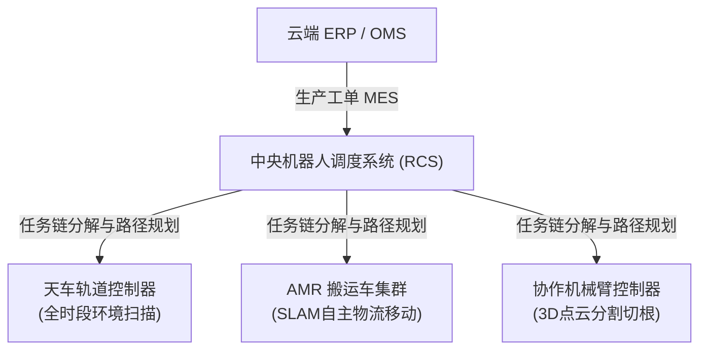

# 鱼菜共生系统：04_智能调度与机器人子系统设计 (Intelligent Scheduling & Robotics Subsystem Design)

智能调度与机器人子系统（`robot`）是数字化工厂的具身执行机构（手与脚）。通过集中调度系统（RCS）与 3D 视觉具身智能算法，实现全无人化、无菌的物流转运与精密蔬菜收割。

---

## 1. 集中调度系统 (RCS) 的三层金字塔架构

为防止各设备单体各自为战，系统采用统一的分层控制架构：

---

## 2. 核心通信协议标准

为了实现不同厂商机器人的“即插即用”，强制推行以下协议规范：
1. **RCS 与 AMR 群控通信**：严格遵循 **VDA 5050 标准协议**（基于 MQTT/WebSockets 传输，上报位置与接收路径）。
2. **机械臂与外围 PLC/传送带交互**：采用 **OPC UA 协议** 交互安全互锁信号。
3. **RCS 与云端业务系统通信**：采用高吞吐、低延迟的 **gRPC 协议**，保证物理收割与数字世界资产核销的秒级同步。

---

## 3. 具身智能三维视觉收割算法

传统的固定坐标机械臂极易捏碎脆嫩叶片或导致切根失败。本系统在六轴协作机械臂末端（Hand-in-Eye 架构）搭载 3D 激光 iToF 相机与具身算法：

### 3.1 三维点云分割与拓扑重建
* **算法模型**：边缘端（NVIDIA Jetson）运行 **PointNet++ 实例分割神经网络**。
* **物理执行**：实时采集蔬菜表面的千万个三维空间坐标（Point Cloud），在微秒级内将“重叠的叶片”、“水培板表面”和“作物的基质根茎”在 3D 空间进行语义剥离，生成精确的**语义拓扑图 (Semantic Topology)**，定位最佳切割点 $Z$ 轴深度。

### 3.2 仿生柔性抓取（力控闭环）
* **设备配置**：硅橡胶材质的**仿生软体抓手 (Soft Gripper)** + 内壁集成的**柔性触觉压力传感器阵列**。
* **控制算法**：PLC 执行“力控制 (Force Control) 闭环回路”。加压步长精细控制在毫巴级。
* **物理阈值**：**一旦抓手触觉反馈的总接触力达到 $0.2\,\text{N}$（确保稳固提起但绝不捏伤细胞组织），气压调节泵瞬间锁定压力。**

### 3.3 视觉伺服切割
* **执行**：软手拔出蔬菜后，由末端微距相机利用**图像视觉伺服 (Visual Servoing) 算法**，引导自动切刀滑入茎叶交界处，一瞬间精准切断根系。

---

## 4. 安全防护墙与故障自愈

1. **分布式物理急停硬线回路**
   * 全厂铺设一根串联的 **24V 硬线急停控制回路**。只要现场人员按下物理急停按钮，所有 AMR 与机械臂的伺服驱动器电源会在毫秒级内被切断，此动作完全不经过任何软件和网络层。
2. **紧急避让逻辑**
   * 当水产系统发生“急性缺氧/漏水报警”时，RCS 会瞬间将常规的蔬菜搬运工单挂起，指挥全场 AMR 自动靠边停靠在就近的**紧急避让点**，清空通道以供人工或抢修设备通行。

---

## 5. 反复调整成功的经验教训（【备注与防护墙】）

> [!CAUTION]
> **【经验教训备注：激光雷达温室结露防撞墙】**
> 在 2025 年的冬季高湿测试中，由于温室相对湿度瞬间达到 $95\%$，导致 2 号 AMR 的激光雷达反射镜面结露，AMR 瞬间“致盲”并失控撞偏了 5 号水培槽。
> **在此设置系统硬性约束**：所有 AMR 必须加装**超声波测距传感器与物理接触防撞条作为二级硬冗余防线**。一旦超声波探头检测到障碍物距离限制小于 $30\,\text{cm}$，车载控制器必须直接切断驱动轮电机，无条件紧急制动，绝不单信激光雷达数据。
