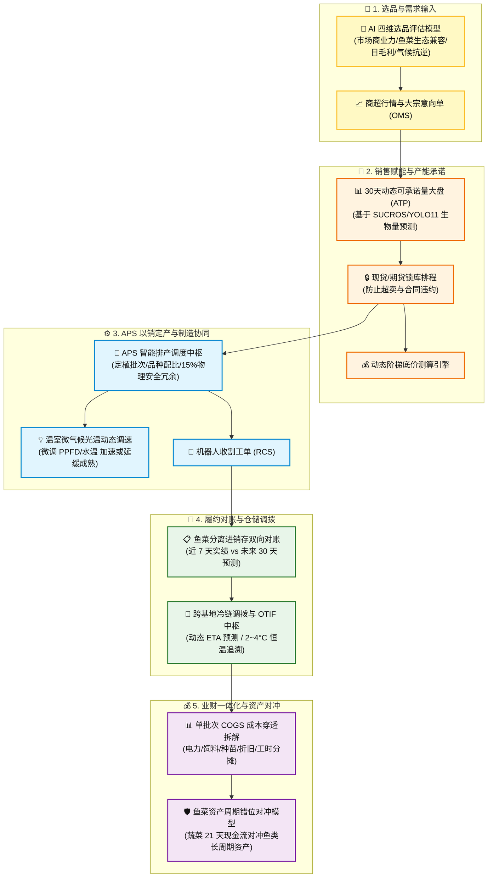
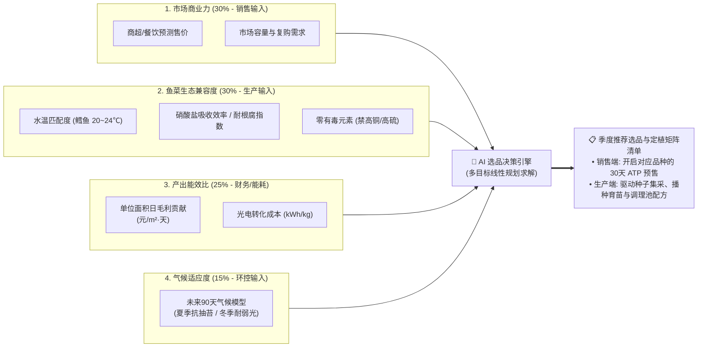
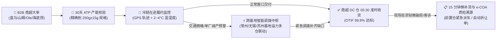

# 连锁数字化农业工厂：05_供应链与商贸协同子系统设计 (Supply Chain & Commerce Subsystem Design)

供应链与商贸协同子系统（`supply_chain_commerce`）是数字化工厂连接**商业市场需求**与**基地生产制造**的“产供销一体化中枢”。

通过打通选品决策、可承诺量预测（ATP）、以销定产计划（APS）、进销存时空对账、跨基地冷链调拨以及业财 COGS 穿透核算，彻底打破传统农业“产销脱节、盲目种植、成本不清”的行业顽疾，实现商业利润最大化与运营风险的自愈消纳。

---

## 1. 产供销一体化全链路业务架构



---

## 2. 产销协同的 AI 选品决策模型 (Varietal Selection Decision Matrix)

选品是连接“前端销售商业力”与“后端种植/养殖生物可行性”的核心战略中枢。系统构建了**四维加权多目标决策模型**，让销售总监、种植长与水产工程师在同一个数据看板上协同决策：



### 2.1 核心选品指标与量化模型

1. **单位面积日毛利贡献率（Daily Margin per Square Meter）**：
   $$\text{Margin}_{\text{daily}} = \frac{P_{\text{market}} \times Y_{\text{crop}} - (\text{Cost}_{\text{energy}} + \text{Cost}_{\text{nutrient}} + \text{Cost}_{\text{seed}})}{A_{\text{tray}} \times T_{\text{cycle}}}$$
   *公式释义：$P_{\text{market}}$ 为预期商超售价，$Y_{\text{crop}}$ 为成苗合格单株重，$A_{\text{tray}}$ 为栽培占地面积，$T_{\text{cycle}}$ 为从定植到收割的实际天数。此指标直接反映每个水培槽“每天每平米能挣多少净利润”。*

2. **鱼菜共生生态兼容指数（Aquaponic Compatibility Index, ACI）**：
   * **水温适生性校验**：高价值墨瑞鳕最佳生长水温为 $20^\circ\text{C} \sim 24^\circ\text{C}$（详见 [01_aquaculture/README.md](../01_aquaculture/README.md)），选品模型自动过滤掉在 $22^\circ\text{C}$ 水温下易发生生长停滞的植物。
   * **养分吸收与安全性**：优先选择高吸氮、耐微酸（pH 5.8~6.2）的高效品种（如奶油生菜、意大利罗勒、羽衣甘蓝）；**硬性拦截**对鱼体具有潜在毒性的作物（如需要大量叶面喷铜的特定瓜果类）。

3. **抗逆与气候适应度评分（Microclimate Resilience Score）**：
   * 结合未来 90 天宏观气象模型与温室 8.1m 挑高热力学模型（详见 [02_大空间温室立体微气候感知与温控策略规范.md](../02_hydroponics/02_大空间温室立体微气候感知与温控策略规范.md)），在夏季高温期自动推荐抗抽苔、耐高温品种，在冬季低温期推荐耐弱光品种，从源头降低热泵降温与 LED 补光的 OPEX。

### 2.2 产销协同闭环工作流 (Workflow)

* **步骤 1（季前自动推荐）**：每季度前 30 天，系统根据最新的大宗商超行情、历史能耗数据及气象预测，自动输出《基地品种效益与可行性排行榜》。
* **步骤 2（产销联席确认）**：销售总监与种植长、水产长在系统内召开“产销联席评审”，确认各品类面积配比：
  * **A 类 主力稳产种（50%）**：如高山奶油生菜、绿蝶生菜（走大宗商超稳定走量）；
  * **B 类 高溢价利润种（30%）**：如意大利甜罗勒、芝麻菜、羽衣甘蓝（周转仅 20 天，单价高，对冲鱼类长周期饲料资金）；
  * **C 类 定制/试验新品（20%）**：如米其林餐厅定制特嫩生菜、新品种耐热生菜小试。
* **步骤 3（一键驱动下游）**：确认后的选品矩阵在系统内一键生成：
  1. 销售端：自动开通对应品种的未来 30 天 ATP 产能预售通道；
  2. 生产端：向 APS 下发种子集采单、育苗播种排期及调理池专用配方。

---

## 3. 销售端核心赋能工具 (Sales Enablement)

### 3.1 基于生长期机理的可承诺量大盘 (ATP, Available to Promise)
* **业务痛点**：传统销售不敢提前 2 周接大单，因为不知道生菜能否按期长大、单株重量是否达标（如 $250\,\text{g}\pm 15\,\text{g}$ 的商超规格）。
* **技术实现**：
  1. 系统结合水培种植区的 **SUCROS 生长机理模型**（详见 👉 [02_hydroponics/README.md](../02_hydroponics/README.md)）与水产区的 **YOLO11-3D 点云生物量估算**（详见 👉 [01_aquaculture/README.md](../01_aquaculture/README.md)）。
  2. 自动在销售 CRM 平台生成未来 7天、14天、30天的**动态可承诺库存（ATP 日历）**。
* **业务价值**：销售人员在与商超采购谈判时，可直接在手机端出示未来各周的**精准可出货批次、预估单株均重与总产量**，在蔬菜定植第 5 天即可提前锁定半个月后的整批预售订单。

### 3.2 现货与期货锁库排程
* **意向订单防冲突**：销售发起“大宗意向合同”时，系统自动锁定对应的水培板区域（Reserved Allocation），防止其他销售人员重复承诺。
* **履约自动关联**：一旦合同生效，意向锁库自动转为正式生产工单，直接推送至生产 APS 与机器人收割系统 RCS（详见 👉 [04_robotics_and_dispatch/README.md](../04_robotics_and_dispatch/README.md)）。

### 3.3 基于实际能耗与饲料的动态底价测算
* **成本穿透测算**：系统根据该批次作物/鱼群在整个生命周期内实际消耗的**分回路电费**（详见 👉 [03_energy_optimization/README.md](../03_energy_optimization/README.md)）、**饲料消耗量 (FCR)** 及 **人工摊销**，秒级计算出该批次单公斤的真实生产成本（Cost of Goods Sold, COGS）。
* **底线利润保护**：销售系统内置定价红线。若销售人员给出的折扣触碰预设的最低毛利率（如 $35\%$），系统自动触发特批审批流，杜绝一线人员“盲目降价亏本抢单”。

---

## 4. APS 智能以销定产与制造协同模型

传统农业面临“种出来不知道卖给谁”的尴尬，而数字化工厂通过云端排产引擎实现以销定产：

```mermaid
flowchart TD
    Order["商超大宗订单 (OMS) & 30天 ATP 锁库"] --> APS["🧭 APS 智能排产引擎"]
    Model["生长预测模型 (SUCROS / YOLO11)<br>(生菜 21 天成熟 / 鳕鱼 4~6 个月成熟)"] --> APS
    
    APS -->|生成定植工单 (含15%安全冗余)| FarmWork["🌱 育苗与定植流水线"]
    APS -->|微调生长节奏| Microclimate["💡 温室环控调速 (调整 PPFD / 昼夜温差)"]
    APS -->|自动生成采收指令| RCS["🦾 基地协作机器人收割工单 (RCS)"]
```

* **秒级排产与生长微调**：APS 实时对比作物成熟度预测数据与 OMS 订单。一旦发现预期收割日与交货日存在 $1\sim 2$ 天微小偏差，系统自动微调温室 LED 光合辐射强度（PPFD）或温度以微幅加速/减慢作物生长速度；成熟后，直接下发收割指令给基地的 RCS 调度系统。

---

## 5. 鱼菜分离运营机制与进销存时空双向对账体系

### 5.1 鱼菜资产与商业形态的本质分离
系统强制将水培蔬菜与循环水产作为两个相互独立、财务独立核算的业务板块，杜绝“一笔糊涂账”：

| 维度与特性 | 🥬 水培蔬菜板块 (Hydroponic Portfolio) | 🐟 循环水产板块 (Recirculating Aquaculture) |
| :--- | :--- | :--- |
| **生长节律** | **21 天超短周期**，每天连续小批量定植与收割 | **4 ~ 6 个月大宗批次培育**，成鱼集中出塘上市 |
| **销售特性** | 高频日配商超 (盒马/山姆)，短保冷链日日清 | 活水车大宗批发 / 高端餐饮连锁，按吨结算 |
| **商业角色** | **【现金流奶牛】**（周转极快、现金秒级回笼） | **【高毛利支柱】**（大宗核心资产、单笔利润丰厚） |
| **采购物料** | 优质蔬菜种苗、育苗基质、微量元素肥（螯合铁/硝酸钙） | 特种膨化沉性颗粒饲料（大宗集采）、优质加州鲈/墨瑞鳕鱼苗 |

### 5.2 进销存“时空双向对账”（最近实绩 vs 未来预测）
构建 **“过去 7 天实绩”** 与 **“未来 30 天预测计划”** 的全景双向对账模型：
1. **最近 7 天采销实绩（Recent Actuals）**：
   * **蔬菜端**：近 7 天已发货出库 $31.5\,\text{吨}$（回款 $¥26.8\,\text{万}$），已进苗 $5.0\,\text{万株}$（支出 $¥1.5\,\text{万}$）；
   * **水产端**：近 7 天出塘加州鲈成鱼 $8.2\,\text{吨}$（回款 $¥22.9\,\text{万}$），已进料海大特种膨化饲料 $12.0\,\text{吨}$（支出 $¥9.6\,\text{万}$）。
2. **未来 30 天预测采购与期货销售计划（Future 30-Day Forecast）**：
   * **蔬菜端**：未来 30 天可承诺量 (ATP) 预测出货 $142.5\,\text{吨}$（商超已锁单 $86.4\%$ / 预估营收 $¥108.8\,\text{万}$）；APS 排产系统自动生成未来采购计划：$15.0\,\text{万株苗}$ 与 $2.0\,\text{万只}$ 可降解冷链包装箱（采购预算 $¥5.2\,\text{万}$）；
   * **水产端**：根据各鱼池生物量与均重生长曲线，预计未来 30 天出塘成鱼 $25.0\,\text{吨}$（预估营收 $¥70.0\,\text{万}$）；自动推导补料计划：海大饲料 $28.0\,\text{吨}$ 与 $6.0\,\text{万尾}$ 大规格早秋鲈鱼新苗（采购预算 $¥27.2\,\text{万}$）。

---

## 6. B2B 大客户履约调度与严苛准时交付 (OTIF) 控制中枢



### 6.1 准时足额交付率 (OTIF - On-Time In-Full) 管控机制
* **商超严苛截单窗口倒计时**：盒马鲜生、山姆会员店等大型商超 DC 仓通常要求每日早晨 $05:00\sim 06:00$ 截单收货，迟到 30 分钟即面临拒收或扣款。
* **全程冷链在途温湿度与轨迹穿透**：系统直连顺丰冷链车载传感器与北斗 GPS，实时采集 $2\sim 4^\circ\text{C}$ 温控曲线与电子围栏进出记录。
* **跨基地与前置仓紧急多仓调拨**：当某基地因突发设备维护导致生菜供应短缺 $100\sim 200\,\text{kg}$ 时，系统在 **$10\,\text{分钟内}$** 自动计算就近基地（如苏州调配常州、无锡调配嘉兴）的最优调拨路线与备用前置仓库存，确保 100% 按期足额交付。

### 6.2 动态到达时效 (ETA) 预测算法与提前/延后双向预警分级
* **三维动态 ETA 融合算法**：
  $$\text{Predicted ETA} = t_{\text{now}} + \frac{D_{\text{remaining}}}{v_{\text{realtime\_traffic}}} + \Delta t_{\text{unload\_queue}} - \Delta t_{\text{growth\_acceleration}}$$
  算法综合考量**在途实时高德/百度路况**、**商超 DC 仓卸货排队队列**与**前端跑道光温累积带来的采收提前/推迟偏差**。
* **双向预警三色管理机制**：
  * 🟢 **绿灯 (准点/提前到达)**：系统预测到货时刻早于或等于计划时刻。若预测提前 $>30\,\text{分钟}$，系统自动通知目标仓库开启恒温暂存区并申请绿色提前卸货通道；
  * 🟡 **黄灯 (轻度延后 $15\sim 30\,\text{分钟}$)**：系统自动推送预警至业务经理，并向商超对接人发送预计延后通知与车厢实时 $2.8^\circ\text{C}$ 温度合格凭证；
  * 🔴 **红灯 (严重延后 $>30\,\text{分钟}$ 触碰截单罚款红线)**：系统在 **$5\,\text{分钟内}$** 自动计算应急方案，智能建议“从邻近前置仓紧急调拨对应规格蔬菜”，双车并行，彻底杜绝违约拒收。

---

## 7. 业财一体化与资产错位对冲模型

### 7.1 单公斤生产成本结构 (COGS) 穿透拆解
* **特级水培生菜生产成本**：**$¥2.85/\text{kg}$**（电力能耗 $¥0.62$ + 种苗基质 $¥0.55$ + 营养液微肥 $¥0.38$ + 厂房设备折旧 $¥0.80$ + 人工工时 $¥0.50$） vs 商超直供售价 **$¥8.50/\text{kg}$** $\rightarrow$ **单品毛利率 $66.5\%$**！
* **加州鲈鱼养殖成本**：**$¥13.20/\text{kg}$**（饲料系数 FCR 0.98，饲料成本 $¥8.80$ + 鱼苗 $¥1.80$ + 电力充氧 $¥1.20$ + 折旧与人工 $¥1.40$） vs 出塘批发价 **$¥28.00/\text{kg}$** $\rightarrow$ **单品毛利率 $52.8\%$**！
* **单厂投资回收期测算模型 (Payback Period)**：
  苏州示范基地总投资 $¥420\,\text{万}$，年均净现金流 $¥168\,\text{万}$，**静态投资回收期仅 $2.5\,\text{年}$**，MPC 避峰节电每年额外贡献 $¥17.0\,\text{万}$ 净利润！

### 7.2 资产周转率错位对冲模型 (Financial Hedging)
* **短周期对冲长周期**：水培蔬菜 21 天超高速周转产生的丰沛现金流（每日回款），直接用于支付水产养殖中前 3 个月高昂的大宗沉性饲料开支与鱼苗成本，彻底解决传统养殖企业在成鱼出塘前“长达半年无现金流入、极易发生资金链断裂”的致命弱点！

---

## 8. 反复调整成功的经验教训（【备注与防护墙】）

> [!IMPORTANT]
> **【经验教训备注：合同违约与排产冗余防护墙】**
> 在 2025 年与某连锁超市大宗采购的履约中，由于前一阶段的寒流导致生菜成熟延期了 3 天，排产算法未留冗余，直接导致公司违约赔偿 5 万元。
> **在此设置排产防线**：供应链管理系统在下发生产计划时，必须配置**不低于 $15\%$ 的“物理安全冗余空间”**（即如果订单需要 1000 盘蔬菜，系统必须自动规划并定植 1150 盘；多余的 150 盘在未违约时作为散货溢价销售，以最大化对冲生物减产黑天鹅事件）。

---

## 🔗 相关设计与规范链接

* **品牌溯源、客户运营与舆情感知子系统**：👉 [06_brand_traceability_crm/README.md](../06_brand_traceability_crm/README.md)
* **品质控制与出厂 e-COA 查验**：👉 [07_quality_assurance_lab/README.md](../07_quality_assurance_lab/README.md)
* **水产养殖与 AI 估重模型**：👉 [01_aquaculture/README.md](../01_aquaculture/README.md)
* **水培种植与生长机理预测**：👉 [02_hydroponics/README.md](../02_hydroponics/README.md)
* **能耗优化与 MPC 峰谷电费套利**：👉 [03_energy_optimization/README.md](../03_energy_optimization/README.md)
* **机器人自动收割调度 (RCS)**：👉 [04_robotics_and_dispatch/README.md](../04_robotics_and_dispatch/README.md)
* **农艺机理与学术配方研发**：👉 [08_agronomy_knowledge_rnd/README.md](../08_agronomy_knowledge_rnd/README.md)
* **全局接口与数据湖存储契约**：👉 [03_接口与数据契约规范.md](../../03_system_architecture/03_接口与数据契约规范.md)
