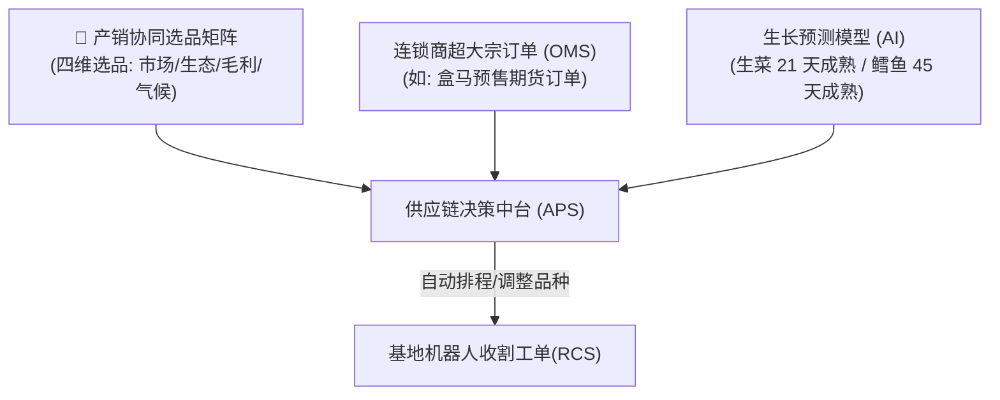
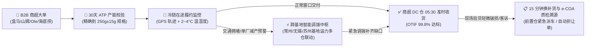

# 连锁数字化农业工厂：05_供应链与业务中台设计 (Supply Chain & Business Hub Design)

供应链与业务中台子系统（`business`）是连接数字化农业工厂技术能力与商业盈利的“转化器”。通过打通财务、订单与生产管理系统，实现资源效率的最大化和运营风险的消纳。

---

## 1. 产销智能平衡模型 (以销定产与选品驱动)

传统农业面临“种出来不知道卖给谁”的尴尬，而数字化工厂通过云端中台实现智能选品与排产：



* **秒级排产流程**：中台接收基于四维加权选品模型输出的季度定植清单（详见 👉 [06_销售赋能与客户溯源子系统.md](./06_销售赋能与客户溯源子系统.md)），实时对比作物成熟度预测数据（算法机理见 [02_水培种植子系统.md](./02_水培种植子系统.md)）与 OMS 订单。一旦触发缺口，自动微调温室 LED 光合辐射强度（PPFD）或温度以加速/减慢成熟速度；成熟后，直接下发收割指令给基地的 RCS 调度系统（详见 [04_智能调度与机器人.md](./04_智能调度与机器人.md)）。

---

## 2. 鱼菜分离运营机制与进销存时空双向对账体系

### 2.1 鱼菜资产与商业形态的本质分离
系统强制将水培蔬菜与循环水产作为两个相互独立、财务独立核算的业务板块，杜绝“一笔糊涂账”：

```
  ┌───────────────────────────────────────────────┬───────────────────────────────────────────────┐
  │ 🥬 水培蔬菜板块 (Hydroponic Portfolio)        │ 🐟 循环水产板块 (Recirculating Aquaculture)   │
  ├───────────────────────────────────────────────┼───────────────────────────────────────────────┤
  │ • 生长节律：21 天超短周期，每天连续小批量定植收割│ • 生长节律：4~6 个月大宗批次培育，成鱼集中出塘 │
  │ • 销售特性：高频日配商超(盒马/山姆)，短保冷链 │ • 销售特性：活水车大宗批发/高端餐饮，按吨结算 │
  │ • 商业角色：【现金流奶牛】(周转极快、现金秒回)│ • 商业角色：【高毛利支柱】(大宗资产、利润丰厚)│
  │ • 采购物料：优质种苗、基质、微肥(螯合铁/硝酸钙)│ • 采购物料：特种膨化沉性饲料(大宗)、优质鱼苗  │
  └───────────────────────────────────────────────┴───────────────────────────────────────────────┘
```

### 2.2 进销存“时空双向对账”（最近实绩 vs 未来预测）
中台构建 **“过去 7 天实绩”** 与 **“未来 30 天预测计划”** 的全景双向对账模型：
1. **最近 7 天采销实绩（Recent Actuals）**：
   * **蔬菜端**：近 7 天已发货出库 $31.5\,\text{吨}$（回款 $¥26.8\,\text{万}$），已进苗 $5.0\,\text{万株}$（支出 $¥1.5\,\text{万}$）；
   * **水产端**：近 7 天出塘加州鲈成鱼 $8.2\,\text{吨}$（回款 $¥22.9\,\text{万}$），已进料海大特种膨化饲料 $12.0\,\text{吨}$（支出 $¥9.6\,\text{万}$）。
2. **未来 30 天预测采购与期货销售计划（Future 30-Day Forecast）**：
   * **蔬菜端**：未来 30 天可承诺量 (ATP) 预测出货 $142.5\,\text{吨}$（商超已锁单 $86.4\%$ / 预估营收 $¥108.8\,\text{万}$）；APS 排产系统自动生成未来采购计划：$15.0\,\text{万株苗}$ 与 $2.0\,\text{万只}$ 可降解冷链包装箱（采购预算 $¥5.2\,\text{万}$）；
   * **水产端**：根据各鱼池生物量与均重生长曲线，预计未来 30 天出塘成鱼 $25.0\,\text{吨}$（预估营收 $¥70.0\,\text{万}$）；自动推导补料计划：海大饲料 $28.0\,\text{吨}$ 与 $6.0\,\text{万尾}$ 大规格早秋鲈鱼新苗（采购预算 $¥27.2\,\text{万}$）。

---

## 3. 集团高管双角色决策看板规范 (COO vs CFO)

### 3.1 🏭 COO 生产运营与交付看板 (Operations Perspective)
* **多基地 6 维雷达对标**：单位电耗蔬菜产量（$\text{kg/kWh}$）、每吨鱼水耗节水率、单株 A 级优品率（$\ge 250\text{g}$ 达 $98.6\%$）、标准化 SOP 达标率、ATP 商超期货履约率、人均管护产出；
* **平效与人效**：
  * **平效**：$42.5\,\text{kg/m}^2/\text{年}$（为传统露地蔬菜的 8~10 倍）；
  * **人效**：人均管护面积 $2,500\,\text{m}^2$，单吨蔬菜生产仅消耗 $3.2\,\text{工时}$；
* **基地 SOP 偏差管理**：实时告警如“成都基地夜间温差偏离 $1.2^\circ\text{C}$”、“北京基地水质溶氧补充滞后”。

### 3.2 💰 CFO 财务盈利与成本穿透看板 (Financial Perspective)
* **单公斤成本结构 (COGS) 穿透拆解**：
  * **特级水培生菜生产成本**：**$¥2.85/\text{kg}$**（电力能耗 $¥0.62$ + 种苗基质 $¥0.55$ + 营养液微肥 $¥0.38$ + 厂房设备折旧 $¥0.80$ + 人工工时 $¥0.50$） vs 商超直供售价 **$¥8.50/\text{kg}$** $\rightarrow$ **单品毛利率 $66.5\%$**！
  * **加州鲈鱼养殖成本**：**$¥13.20/\text{kg}$**（饲料系数 FCR 0.98，饲料成本 $¥8.80$ + 鱼苗 $¥1.80$ + 电力充氧 $¥1.20$ + 折旧与人工 $¥1.40$） vs 出塘批发价 **$¥28.00/\text{kg}$** $\rightarrow$ **单品毛利率 $52.8\%$**！
* **单厂投资回收期测算模型 (Payback Period)**：
  * 苏州示范基地总投资 $¥420\,\text{万}$，年均净现金流 $¥168\,\text{万}$，**静态投资回收期仅 $2.5\,\text{年}$**，MPC 避峰节电每年额外贡献 $¥17.0\,\text{万}$ 净利润！

## 4. B2B 大客户履约调度与严苛准时交付 (OTIF) 控制中枢



### 4.1 准时足额交付率 (OTIF - On-Time In-Full) 管控机制
* **商超严苛截单窗口倒计时**：盒马鲜生、山姆会员店等大型商超 DC 仓通常要求每日早晨 $05:00\sim 06:00$ 截单收货，迟到 30 分钟即面临拒收或扣款。
* **全程冷链在途温湿度与轨迹穿透**：系统直连顺丰冷链车载传感器与北斗 GPS，实时采集 $2\sim 4^\circ\text{C}$ 温控曲线与电子围栏进出记录。
* **跨基地与前置仓紧急多仓调拨**：当某基地因突发设备维护导致生菜供应短缺 $100\sim 200\,\text{kg}$ 时，系统在 **$10\,\text{分钟内}$** 自动计算就近基地（如苏州调配常州、无锡调配嘉兴）的最优调拨路线与备用前置仓库存，确保 100% 按期足额交付。

### 4.2 动态到达时效 (ETA) 预测算法与提前/延后双向预警分级
* **三维动态 ETA 融合算法**：
  $$\text{Predicted ETA} = t_{\text{now}} + \frac{D_{\text{remaining}}}{v_{\text{realtime\_traffic}}} + \Delta t_{\text{unload\_queue}} - \Delta t_{\text{growth\_acceleration}}$$
  算法综合考量**在途实时高德/百度路况**、**商超 DC 仓卸货排队队列**与**前端跑道光温累积带来的采收提前/推迟偏差**。
* **双向预警三色管理机制**：
  * 🟢 **绿灯 (准点/提前到达)**：系统预测到货时刻早于或等于计划时刻。若预测提前 $>30\,\text{分钟}$，系统自动通知目标仓库开启恒温暂存区并申请绿色提前卸货通道；
  * 🟡 **黄灯 (轻度延后 $15\sim 30\,\text{分钟}$)**：系统自动推送预警至 B2B 业务经理，并向商超对接人发送预计延后通知与车厢实时 $2.8^\circ\text{C}$ 温度合格凭证，避免产生误会；
  * 🔴 **红灯 (严重延后 $>30\,\text{分钟}$ 触碰截单罚款红线)**：系统在 **$5\,\text{分钟内}$** 自动计算应急方案，智能建议“从邻近前置仓（如常州前置仓）紧急调拨对应规格蔬菜”，双车并行，彻底杜绝违约拒收！

### 4.3 B2B 商业客诉快速响应与电子质检合格证 (e-COA) 溯源
* **一键调取批次电子质检单 (e-COA - Electronic Certificate of Analysis)**：当商超验收人员提出质量异议时，系统毫秒级调取对应批次的全生命周期数据（采收时刻 DLI、无农残检测证明、机械臂无菌切根打码视频），出示法律级防伪凭证；
* **15 分钟快速换补货流程**：若确认运输破损或微瑕疵，系统 15 分钟内自动触发备用跑道快速采收或前置仓派发紧急补货运单，确保商超早上上架不受任何影响，保住大客户考评满分。

---

## 5. 资产周转率错位对冲模型（财务安全阀）

云端平台推行兼顾“初期零成本”与“后期高扩展”的冷热数据分层演进架构（D1/R2 数据契约与时间戳标准详见 👉 [03_接口与数据契约规范.md](../03_system_architecture/03_接口与数据契约规范.md)）：

| 数据分级与演进阶段 | 第一期：轻量 Serverless 架构 | 第二/三期：集团分布式数仓架构 | 保留周期 | 核心业务用途 |
| :--- | :--- | :--- | :--- | :--- |
| **热数据 (Hot Data)**<br>秒级/5秒宽表遥测流 | **Cloudflare D1 (Serverless SQL)**<br>+ 边缘工控机 SQLite 缓存 | **分布式时序库**<br>(InfluxDB / TDengine) | 30 天 | 实时告警推演、能耗 MPC 滚动优化、Shadcn UI 监控看板渲染。 |
| **冷数据 (Cold Data)**<br>历史归档与多媒体 | **Cloudflare R2 (零出站流量费)**<br>(每日压缩 `.sqlite.gz` 增量归档) | **关系型/对象存储**<br>(PostgreSQL + MinIO/S3) | 永久 | 长期 AI 预测模型离线重训、历史能耗审计、财务 ROIC 报表核算。 |

* **降采样 (Downsampling) 归档**：满 30 天的数据自动触发降采样程序（如将 5 秒快照聚合转化为 1 小时统计均值）后归档至冷存储区，数据压缩率达 $90\%$ 以上。

---

## 4. 反复调整成功的经验教训（【备注与防护墙】）

> [!IMPORTANT]
> **【经验教训备注：合同违约与排产冗余防护墙】**
> 在 2025 年与某连锁超市大宗采购的履约中，由于前一阶段的寒流导致生菜成熟延期了 3 天，排产算法未留冗余，直接导致公司违约赔偿 5 万元。
> **在此设置排产防线**：供应链管理中台在下发生产计划时，必须配置**不低于 $15\%$ 的“物理安全冗余空间”**（即如果订单需要 1000 盘蔬菜，系统必须自动规划并定植 1150 盘；多余的 150 盘在未违约时作为散货溢价销售，以最大化对冲生物减产黑天鹅事件）。

---

## 🔗 相关设计与规范链接

* **农艺机理与学术知识支持 (选品决策与数字配方)**：👉 [08_农艺机理与学术知识支持子系统.md](./08_农艺机理与学术知识支持子系统.md)
* **品质控制与出厂 e-COA 放行**：👉 [07_品质控制与实验室子系统.md](./07_品质控制与实验室子系统.md)
* **销售赋能与 30 天可承诺量大盘 (ATP)**：👉 [06_销售赋能与客户溯源子系统.md](./06_销售赋能与客户溯源子系统.md)
* **全球主要国家与地区农业食品安全标准比对规范**：👉 [06_全球主要国家与地区农业食品安全标准比对规范.md](../05_specifications/06_全球主要国家与地区农业食品安全标准比对规范.md)
* **水培作物生长预测机理**：👉 [02_水培种植子系统.md](./02_水培种植子系统.md)
* **机器人自动收割调度 (RCS)**：👉 [04_智能调度与机器人.md](./04_智能调度与机器人.md)
* **全局接口与 D1 数据库契约**：👉 [03_接口与数据契约规范.md](../03_system_architecture/03_接口与数据契约规范.md)
* **一期投资预算与分期实施规划**：👉 [03_分期实施计划书.md](../02_requirements_and_plans/03_分期实施计划书.md)
* **生物视觉模型与数据库架构**：👉 [01_YOLO11活体生物数据集构建规范.md](../05_specifications/01_YOLO11活体生物数据集构建规范.md)
