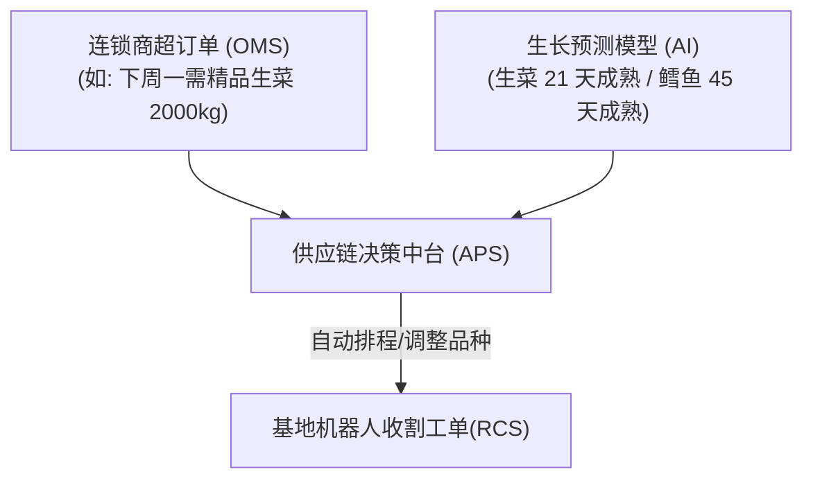

# 鱼菜共生系统：05_供应链与业务中台设计 (Supply Chain & Business Hub Design)

供应链与业务中台子系统（`business`）是连接数字化农业工厂技术能力与商业盈利的“转化器”。通过打通财务、订单与生产管理系统，实现资源效率的最大化和运营风险的消纳。

---

## 1. 产销智能平衡模型 (以销定产)

传统农业面临“种出来不知道卖给谁”的尴尬，而数字化工厂通过云端中台实现智能排产：

* **秒级排产流程**：中台实时对比作物成熟度预测数据与 OMS 订单。一旦触发缺口，自动微调温室 LED 光合辐射强度（PPFD）或温度以加速/减慢成熟速度；成熟后，直接下发收割指令给基地的 RCS 调度系统。

---

## 2. 资产周转率错位对冲模型（财务安全阀）

### 2.1 商业结构性风险
* **菜端**：定植到收割约 30 天，属于高周转、稳定现金流资产。
* **鱼端**：鱼苗至起捕需 12~18 个月，长周期资金占用，且每天需消耗高昂饲料（OPEX）。

### 2.2 AI 动态配比算法
为了防止鱼池在成熟期前榨干基地的流动资金，中台部署了**流动资金动态对冲算法**：
* **控制逻辑**：算法监控当前现金储备（Cash Reserve）与未来三个月鱼饲料费用的预测差值。
* **对冲动作**：一旦预测到流动资金紧张，算法自动提高种植网格中**超短周期、高溢价作物（如罗勒、芝麻菜，周转期仅 20 天）**的种植面积比例，利用蔬菜暴涨的即时现金流去垫付并对冲鱼类的饲料资金压力。

---

## 3. 冷热数据隔离与分布式数仓策略

在云端平台，为了支撑每天千万级时序遥测数据的接入，数仓推行冷热隔离架构：

| 数据分级 | 存储介质 | 保留周期 | 核心用途 |
| :--- | :--- | :--- | :--- |
| **热数据 (Hot Data)** 秒级/分钟级遥测流 | 分布式时序库 (InfluxDB / TDengine) | 30 天 | 实时 AI 异常检测、温室能耗 MPC 算法运算、数字孪生大屏渲染。 |
| **冷数据 (Cold Data)** 历史统计与业务流 | 关系型/对象存储 (PostgreSQL / S3) | 永久 | 长期的 AI 预测模型离线重训、历史能耗审计、财务 ROIC 报表核算。 |

* **降采样 (Downsampling) 归档**：满 30 天的时序数据自动触发降采样程序（如将 10 秒均值转化为 1 小时均值）后移入冷数据区，压缩率达 $90\%$ 以上。

---

## 4. 反复调整成功的经验教训（【备注与防护墙】）

> [!IMPORTANT]
> **【经验教训备注：合同违约与排产冗余防护墙】**
> 在 2025 年与某连锁超市大宗采购的履约中，由于前一阶段的寒流导致生菜成熟延期了 3 天，排产算法未留冗余，直接导致公司违约赔偿 5 万元。
> **在此设置排产防线**：供应链管理中台在下发生产计划时，必须配置**不低于 $15\%$ 的“物理安全冗余空间”**（即如果订单需要 1000 盘蔬菜，系统必须自动规划并定植 1150 盘；多余的 150 盘在未违约时作为散货溢价销售，以最大化对冲生物减产黑天鹅事件）。
