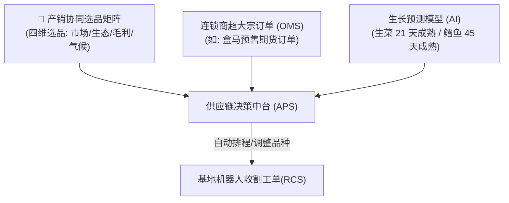

# 连锁数字化农业工厂：05_供应链与业务中台设计 (Supply Chain & Business Hub Design)

供应链与业务中台子系统（`business`）是连接数字化农业工厂技术能力与商业盈利的“转化器”。通过打通财务、订单与生产管理系统，实现资源效率的最大化和运营风险的消纳。

---

## 1. 产销智能平衡模型 (以销定产与选品驱动)

传统农业面临“种出来不知道卖给谁”的尴尬，而数字化工厂通过云端中台实现智能选品与排产：

```mermaid
flowchart TD
    Select["🎯 产销协同选品矩阵<br>(四维选品: 市场/生态/毛利/气候)"] --> APS["供应链决策中台 (APS)"]
    Order["连锁商超大宗订单 (OMS)<br>(如: 盒马预售期货订单)"] --> APS
    Model["生长预测模型 (AI)<br>(生菜 21 天成熟 / 鳕鱼 45 天成熟)"] --> APS
    
    APS -->|自动排程/调整品种| RCS["基地机器人收割工单(RCS)"]
```

* **秒级排产流程**：中台接收基于四维加权选品模型输出的季度定植清单（详见 👉 [06_销售赋能与客户溯源子系统.md](./06_销售赋能与客户溯源子系统.md)），实时对比作物成熟度预测数据（算法机理见 [02_水培种植子系统.md](./02_水培种植子系统.md)）与 OMS 订单。一旦触发缺口，自动微调温室 LED 光合辐射强度（PPFD）或温度以加速/减慢成熟速度；成熟后，直接下发收割指令给基地的 RCS 调度系统（详见 [04_智能调度与机器人.md](./04_智能调度与机器人.md)）。

---

## 2. 资产周转率错位对冲模型（财务安全阀）

### 2.1 商业结构性风险
* **菜端**：定植到收割约 30 天，属于高周转、稳定现金流资产。
* **鱼端**：鱼苗至起捕需 12~18 个月，长周期资金占用，且每天需消耗高昂饲料（OPEX，详见 [01_水产养殖子系统.md](./01_水产养殖子系统.md)）。

### 2.2 AI 动态配比算法
为了防止鱼池在成熟期前榨干基地的流动资金，中台部署了**流动资金动态对冲算法**：
* **控制逻辑**：算法监控当前现金储备（Cash Reserve）与未来三个月鱼饲料费用的预测差值。
* **对冲动作**：一旦预测到流动资金紧张，算法自动提高种植网格中**超短周期、高溢价作物（如罗勒、芝麻菜，周转期仅 20 天）**的种植面积比例，利用蔬菜暴涨的即时现金流去垫付并对冲鱼类的饲料资金压力。

---

## 3. 冷热数据隔离与数仓分期演进策略

云端平台推行兼顾“初期零成本”与“后期高扩展”的冷热数据分层演进架构（D1/R2 数据契约与时间戳标准详见 👉 [03_接口与数据契约规范.md](../03_system_architecture/03_接口与数据契约规范.md)）：

| 数据分级与演进阶段 | 第一期：轻量 Serverless 架构 | 第二/三期：集团分布式数仓架构 | 保留周期 | 核心业务用途 |
| :--- | :--- | :--- | :--- | :--- |
| **热数据 (Hot Data)** 秒级/5秒宽表遥测流 | **Cloudflare D1 (Serverless SQL)** + 边缘工控机 SQLite 缓存 | **分布式时序库** (InfluxDB / TDengine) | 30 天 | 实时告警推演、能耗 MPC 滚动优化、Shadcn UI 监控看板渲染。 |
| **冷数据 (Cold Data)** 历史归档与多媒体 | **Cloudflare R2 (零出站流量费)** (每日压缩 `.sqlite.gz` 增量归档) | **关系型/对象存储** (PostgreSQL + MinIO/S3) | 永久 | 长期 AI 预测模型离线重训、历史能耗审计、财务 ROIC 报表核算。 |

* **降采样 (Downsampling) 归档**：满 30 天的数据自动触发降采样程序（如将 5 秒快照聚合转化为 1 小时统计均值）后归档至冷存储区，数据压缩率达 $90\%$ 以上。

---

## 4. 反复调整成功的经验教训（【备注与防护墙】）

> [!IMPORTANT]
> **【经验教训备注：合同违约与排产冗余防护墙】**
> 在 2025 年与某连锁超市大宗采购的履约中，由于前一阶段的寒流导致生菜成熟延期了 3 天，排产算法未留冗余，直接导致公司违约赔偿 5 万元。
> **在此设置排产防线**：供应链管理中台在下发生产计划时，必须配置**不低于 $15\%$ 的“物理安全冗余空间”**（即如果订单需要 1000 盘蔬菜，系统必须自动规划并定植 1150 盘；多余的 150 盘在未违约时作为散货溢价销售，以最大化对冲生物减产黑天鹅事件）。

---

## 🔗 相关设计与规范链接

* **水培作物生长预测机理**：👉 [02_水培种植子系统.md](./02_水培种植子系统.md)
* **机器人自动收割调度 (RCS)**：👉 [04_智能调度与机器人.md](./04_智能调度与机器人.md)
* **全局接口与 D1 数据库契约**：👉 [03_接口与数据契约规范.md](../03_system_architecture/03_接口与数据契约规范.md)
* **一期投资预算与分期实施规划**：👉 [03_分期实施计划书.md](../02_requirements_and_plans/03_分期实施计划书.md)
* **生物视觉模型与数据库架构**：👉 [01_YOLO11活体生物数据集构建规范.md](../05_specifications/01_YOLO11活体生物数据集构建规范.md)
