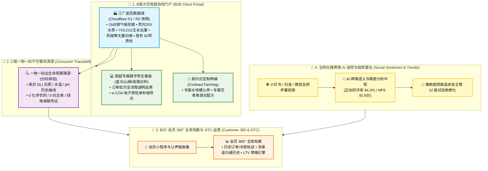
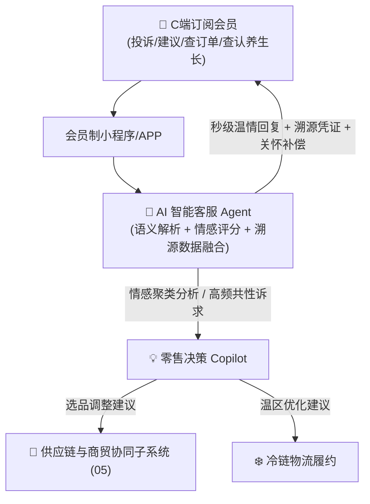
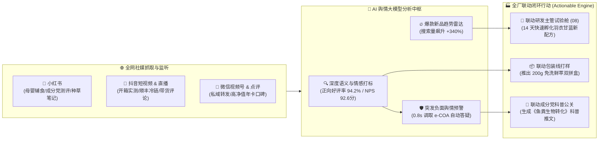
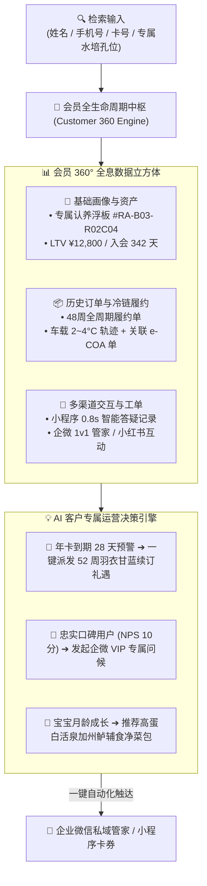

# 连锁数字化农业工厂：06_品牌溯源、客户运营与舆情感知子系统设计 (Brand Traceability, Customer Operations & Social Sentiment Hub Design)

品牌溯源、客户运营与舆情感知子系统（`brand_traceability_crm`）是数字化农业工厂技术能力向**品牌溢价、客户深度信任与敏捷市场感知**转化的“前端价值中枢”。

通过打通全流程不可篡改的生长数据链条、B2B 商超协同门户、B2C DTC 会员全息画像以及全网社媒 AI 舆情分析中枢，彻底打破传统农业“优质无法自证、品牌认知薄弱、客情反馈迟滞”的痛点，构建 $300\%+$ 品牌溢价的护城河。

---

## 1. 系统范畴与商业信任价值全景



---

## 2. C端终端消费者一物一码不可篡改溯源体系

### 2.1 “一物一码”全链路数据闭环
每一盒生菜或每一条独立包装的鳕鱼表面均贴有专属的防伪溯源二维码（QR Code）。消费者使用微信或浏览器扫码即可打开轻量化 H5 页面：

```
========================================================================================
                          📱 消费者扫码端交互展示大纲 (H5/小程序)
========================================================================================

 🥬 【产品身份】: 数字化工厂·高山奶油生菜 (250g 净菜装)
 🏷️ 【批次编码】: LOT-20260818-VEG03-B12
 ⏱️ 【采摘时刻】: 2026-08-18T06:15:32.000Z (由协作机械臂切根自动打码)
 📍 【生长基地】: 华东 01 号数字化农业超级工厂 · 3 号智能微气候温室

 ───────────────────────────────────────────────────────────────────────────────────────
 📊 【生长全程数字化档案 (不可篡改时空链)】
  ▪️ 育苗阶段: 定植于 2026-07-28T09:00:00.000Z | 纯净岩棉基质培育
  ▪️ 光合累积: 全周期累计光合辐射 (DLI) 达 432 mol/m² (阳光充足+智能补光)
  ▪️ 滋养水源: 封闭循环水 (RAS) 纯净硝化营养液 | 平均 pH 5.82 | EC 1.78 mS/cm
  ▪️ 环控保障: 8.1米大空间垂直温差 < 1.2℃ | 全程无结露、无根腐病

 ───────────────────────────────────────────────────────────────────────────────────────
 🛡️ 【食品安全与绿色承诺】
  ✅ 化学农药检出: 0.00 mg/kg (全程物理防虫网 + 封闭微环境，0 化学农药)
  ✅ 重金属与抗生素: 未检出 (符合欧盟及国标最高食用安全级)
  ✅ 绿色低碳认证: 本盒生菜得益于 MPC 能耗优化，生产过程减少碳排放 42.6g CO₂e

 ───────────────────────────────────────────────────────────────────────────────────────
 📹 【精彩回放】: [ 点击观看该批次蔬菜 21 天 AI 延时摄影与机器人收割精选片段 ]
========================================================================================
```

### 2.2 数据来源与防篡改机制
* **时间戳防伪**：溯源数据直接抽取自底层数据快照，并带有严格的 **ISO 8601 UTC 毫秒时间戳**（详见 👉 [03_接口与数据契约规范.md](../../03_system_architecture/03_接口与数据契约规范.md)）。
* **自动化生成**：收割机械臂在执行切根与自动称重时，自动调用云端 API 生成唯一批次 ID 与防伪校验码（Hash Digest），杜绝人工后期补录和数据造假。

---

## 3. B端大宗商超协同门户 (B2B Client Portal)

针对盒马鲜生、山姆会员店、高端连锁日料店等核心大客户，开放专属的企业级协同管理端：

### 3.1 批次透明数字孪生看板
* **专属身份隔离**：大客户采购经理登录后，仅可查看其采购订单绑定的对应温室区域（如上海崇明基地 3 号水培区 A1~A8 槽）。
* **全生命周期监控**：
  * 实时环境：冠层温度、PPFD 光合辐射、水温及 pH 稳定性曲线。
  * 视觉巡检：每日夜间轨道光谱相机生成的叶片健康热力图与延时生长视频。
  * 收割质检：六轴机械臂自动切根作业时的称重数据分布与质检单（全量单株重量分布直方图）。

### 3.2 契约式定制农业 (Contract Farming)
* **客户定制化配方**：针对高端餐饮客户定制的生菜品类（如要求“特嫩口感”或“高抗氧化花青素积累”），农艺师可在系统中为专属客户槽位配置特定的 LED 光谱配方与收获前调光策略（Pre-harvest Lighting）。
* **自动化品质证明一键生成**：发货时系统自动生成带有电子防伪签名的《批次数字化质量合格证与全流程追溯报告》（e-COA 格式），随货同行。

---

## 4. B2C 自有品牌 DTC 模式与会员全生命周期运营

### 4.1 自有高端品牌 DTC 闭环与产品矩阵
* **品牌定位**：打造“零农残/母婴级高定蔬菜与活泉鲈鱼”自有品牌旗舰，直接触达中高端家庭与高净值会员；
* **产品矩阵与溢价率**：
  * **母婴级低硝酸盐生菜鲜萃礼盒**：售价 $¥38/\text{盒}$（$250\text{g}$ 装，折合 **$¥152/\text{kg}$**），毛利率高达 $79.2\%$；
  * **活泉加州鲈鲜切冷链净菜包**：售价 $¥68/\text{份}$（$500\text{g}$ 装，折合 **$¥136/\text{kg}$**），毛利率达 $68.5\%$；
  * **专属水培浮板认养年卡**：$¥1,980/\text{年}$，包含每周 2 盒定制鲜配 + 24 小时认养机位 RTSP 专属慢直播；
* **关键运营实绩**：沉淀 1,280 位周期购忠实会员，周客单价 $¥128$，周留存率达 **$82.5\%$**，一物一码扫码率 **$68.4\%$**，NPS 净推荐值 **$86.5\,\text{分}$**。

### 4.2 C端会员小程序交互、AI 智能客服与零售决策 Copilot


1. **会员端全能服务台**：认养生长透明追溯、冷链车载轨迹实时穿透、一键图文客诉；
2. **AI 智能客服自动回复**：秒级调取对应批次在北京普析实验室的质检数据（e-COA），并拥有自动补偿发放鲜萃券的预设权限，客诉满意度达 $98\%$。

---

## 5. 全网社媒市场舆情大盘与 AI 品牌心智分析中枢



1. **全网多源社媒声量与情感量化大盘**：小红书母婴低硝酸盐生菜测评抓取、抖音开箱测评与一物一码 21 天生长延时播放追踪；
2. **AI 爆款趋势直连研发主管 12 座试验舱**：当“羽衣甘蓝青汁粉”等搜索量突增 $+340\%$ 时，AI 自动生成标准研发工单派发至 **【研发主管】的 12 座试验舱** 进行 DOE 试验与配方签发；
3. **成分党公关与声誉秒级防御体系**：毫秒级提取出厂 **e-COA 电子防伪质检单（北京普析 62 项农残/抗生素/重金属盲检 0 检出）**，一键生成兼具科学严谨性与人文温情的科普短视频与脚本。

---

## 6. 会员 360° 全息档案与客户全生命周期智能检索



* **多维度快速检索与模糊对齐**：支持通过会员姓名、脱敏手机号、认养孔位编号或客群标签进行毫秒级全文检索；
* **全周期历史履约与冷链轨迹穿透**：点击任意历史订单即可调取顺丰车载温控曲线及当批次北京普析 62 项农残/低硝酸盐 e-COA 电子防伪单；
* **AI 专属经营策略引擎 (LTV Copilot)**：基于会员历史复购节律、商品偏好及到期倒计时，自动生成个性化挽留动作，将年卡续费率提升至 **$85\%+$**。

---

## 7. 反复调整成功的经验教训（【备注与防护墙】）

> [!IMPORTANT]
> **【经验教训备注 1：C 端扫码高并发穿透防护墙】**
> 在 2025 年某基地蔬菜进入知名商超首发的周末，由于电视报道引发瞬时 20,000+ 用户同时扫码查看溯源页面，导致云端数据库直接被高频只读请求打满超时。
> **在此设置系统架构红线**：
> 1. 所有 C 端溯源页面的 H5 静态资源与批次溯源 JSON 数据，**必须全部缓存在 Cloudflare 边缘 CDN 节点上（Edge Cache TTL 设置为 7 天）**。
> 2. 溯源 API 严禁直连底层生产数据库（D1/PostgreSQL），必须在批次包装完成时自动生成一份静态快照 `.json` 推送到 Cloudflare R2，实现“零数据库查询、亿级并发秒开”。

> [!CAUTION]
> **【经验教训备注 2：核心商业配方与工艺防泄漏隔离墙】**
> 在对外开放溯源数据时，曾发生因数据权限未分级，将商业机密的“营养液精准微量元素配比表”与“热泵 MPC 求解参数”暴露在公网 JSON 接口中，被竞争对手抓取分析。
> **在此设置数据脱敏红线**：
> 1. 面向 C 端消费者与 B 端采购商的溯源接口必须经过**数据脱敏中间件（Data Masking Gateway）**。
> 2. 仅向外暴露经过聚合统计的“安全范围指标”（如“pH 均值 5.8，合格率 100%”、“环境温度曲线”），严禁在公网接口中透传加药泵脉冲时长、核心肥料摩尔浓度或算法模型权重。

---

## 🔗 相关设计与规范链接

* **供应链与商贸协同子系统 (产供销排产与选品)**：👉 [05_supply_chain_and_commerce/README.md](../05_supply_chain_and_commerce/README.md)
* **品质控制与实验室抽检及 e-COA**：👉 [07_quality_assurance_lab/README.md](../07_quality_assurance_lab/README.md)
* **农艺机理与 12 座试验舱配方研发**：👉 [08_agronomy_knowledge_rnd/README.md](../08_agronomy_knowledge_rnd/README.md)
* **水培作物生长机理模型**：👉 [02_hydroponics/README.md](../02_hydroponics/README.md)
* **水产鱼群双目生物量估算**：👉 [01_aquaculture/README.md](../01_aquaculture/README.md)
* **智能调度与机器人自动收割**：👉 [04_robotics_and_dispatch/README.md](../04_robotics_and_dispatch/README.md)
* **全局时间与数据契约规范**：👉 [03_接口与数据契约规范.md](../../03_system_architecture/03_接口与数据契约规范.md)
* **能耗模型与绿色碳足迹核算**：👉 [03_energy_optimization/README.md](../03_energy_optimization/README.md)
