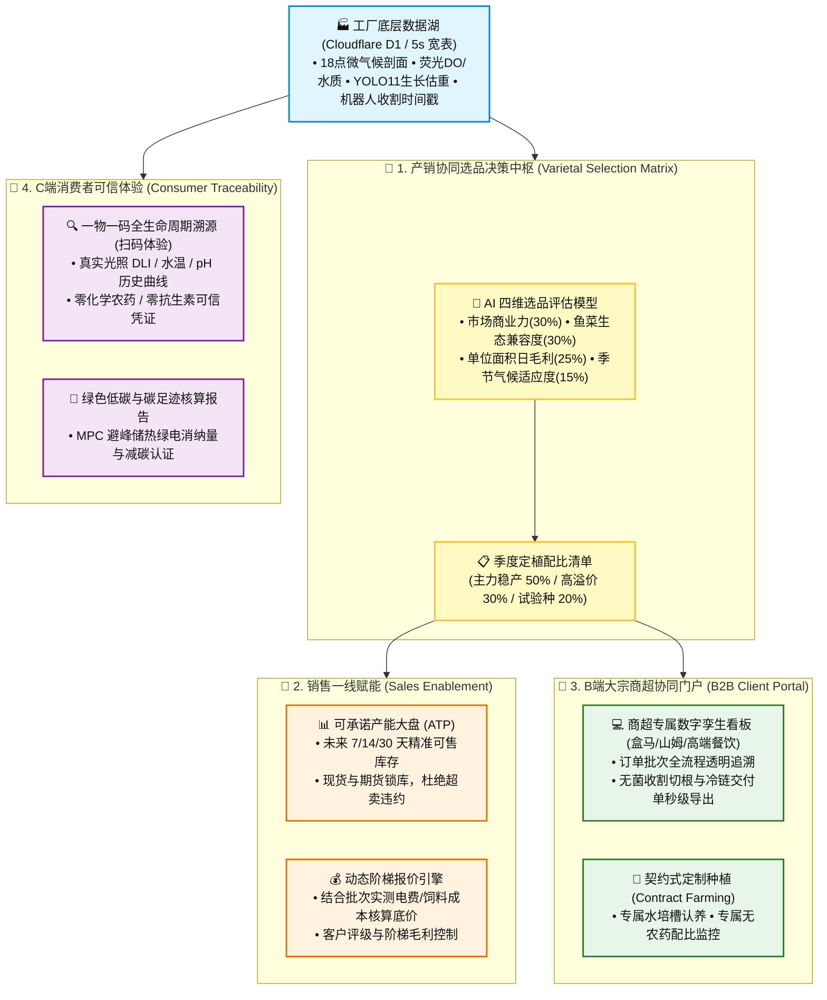
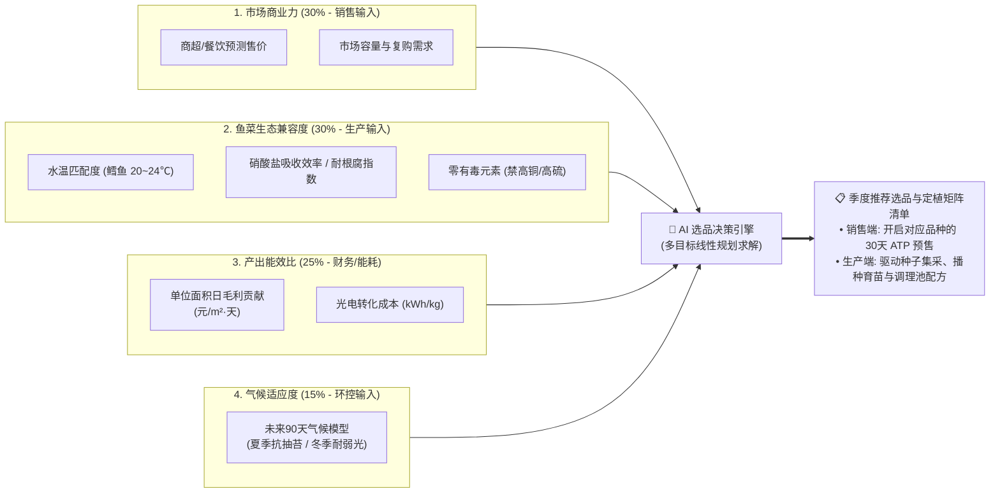
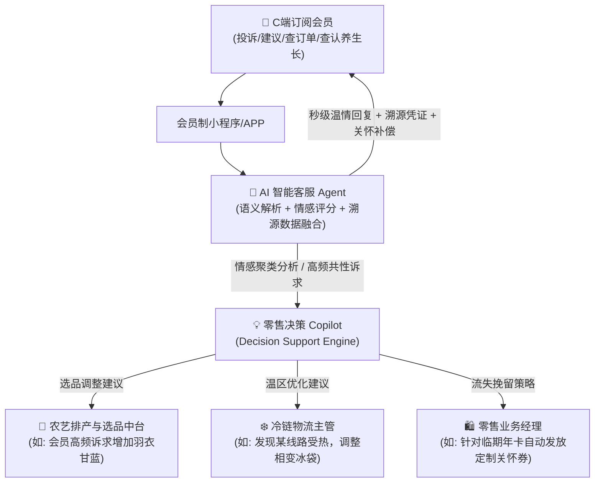
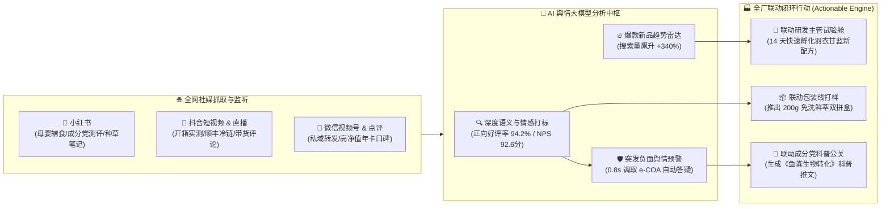
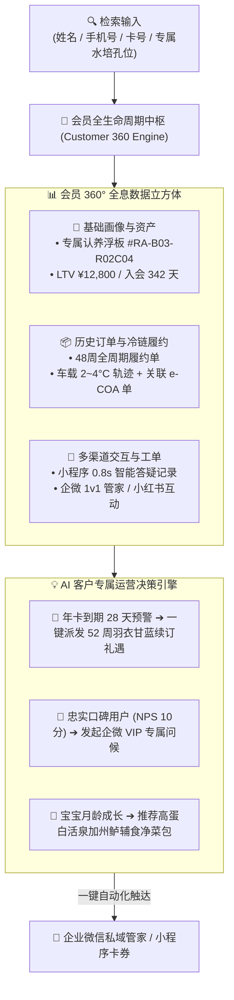

# 连锁数字化农业工厂：06_销售赋能与客户溯源子系统设计 (Sales Enablement & Customer Traceability Subsystem Design)

销售赋能与客户溯源子系统（`sales_trace`）是数字化工厂技术能力向**商业溢价与客户信任**转化的“直接变现入口”。

通过打通生产端底层的高精度生物量预测（YOLO11 / SUCROS）、环境水质时空对齐数据，构建面向**B端大客户销售团队、连锁商超采购商以及C端终端消费者**的全方位数字化服务网络，彻底打破传统农业“产销脱节、靠天吃饭、无法自证高品质”的行业顽疾。

---

## 1. 系统范畴与商业定位



* **商业溢价目标**：通过不可篡改的全生命周期数字证据链，使水培生菜和高价值鱼类在终端零售市场获取 **$30\% \sim 50\%$ 的品牌溢价**。
* **产销协同目标**：通过四维选品模型与 ATP 预测，彻底消除“盲目种出来卖不掉”与“销售签了大单种不出”的产销脱节，将商超履约违约率降至 **$0.1\%$ 以下**。

---

## 2. 产销协同的 AI 选品决策模型 (Varietal Selection Decision Matrix)

选品是连接“前端销售商业力”与“后端种植/养殖生物可行性”的核心战略中枢。系统构建了**四维加权多目标决策模型**，让销售、农艺师与水产工程师在同一个数据看板上协同决策：



### 2.1 核心选品指标与量化模型

1. **单位面积日毛利贡献率（Daily Margin per Square Meter）**：
   $$\text{Margin}_{\text{daily}} = \frac{P_{\text{market}} \times Y_{\text{crop}} - (\text{Cost}_{\text{energy}} + \text{Cost}_{\text{nutrient}} + \text{Cost}_{\text{seed}})}{A_{\text{tray}} \times T_{\text{cycle}}}$$
   *公式释义：$P_{\text{market}}$ 为预期商超售价，$Y_{\text{crop}}$ 为成苗合格单株重，$A_{\text{tray}}$ 为栽培占地面积，$T_{\text{cycle}}$ 为从定植到收割的实际天数。此指标直接反映每个水培槽“每天每平米能挣多少净利润”。*

2. **鱼菜共生生态兼容指数（Aquaponic Compatibility Index, ACI）**：
   * **水温适生性校验**：高价值墨瑞鳕最佳生长水温为 $20^\circ\text{C} \sim 24^\circ\text{C}$（详见 [01_水产养殖子系统.md](./01_水产养殖子系统.md)），选品模型自动过滤掉在 $22^\circ\text{C}$ 水温下易发生生长停滞的植物。
   * **养分吸收与安全性**：优先选择高吸氮、耐微酸（pH 5.8~6.2）的高效品种（如奶油生菜、意大利罗勒、羽衣甘蓝）；**硬性拦截**对鱼体具有潜在毒性的作物（如需要大量叶面喷铜的特定瓜果类）。

3. **抗逆与气候适应度评分（Microclimate Resilience Score）**：
   * 结合未来 90 天宏观气象模型与温室 8.1m 挑高热力学模型（详见 [04_大空间温室立体微气候感知与温控策略规范.md](../05_specifications/04_大空间温室立体微气候感知与温控策略规范.md)），在夏季高温期自动推荐抗抽苔、耐高温品种，在冬季低温期推荐耐弱光品种，从源头降低热泵降温与 LED 补光的 OPEX。

### 2.2 产销协同闭环工作流 (Workflow)

* **步骤 1（季前自动推荐）**：每季度前 30 天，系统根据最新的大宗商超行情、历史能耗数据及气象预测，自动输出《基地品种效益与可行性排行榜》。
* **步骤 2（产销联席确认）**：销售总监与种植长、水产长在系统内召开“产销联席评审”，确认各品类面积配比：
  * **A 类 主力稳产种（50%）**：如高山奶油生菜、绿蝶生菜（走大宗商超稳定走量）；
  * **B 类 高溢价利润种（30%）**：如意大利甜罗勒、芝麻菜、羽衣甘蓝（周转仅 20 天，单价高，对冲鱼类长周期饲料资金，详见 [05_供应链与业务中台.md](./05_供应链与业务中台.md)）；
  * **C 类 定制/试验新品（20%）**：如米其林餐厅定制特嫩生菜、新品种耐热生菜小试。
* **步骤 3（一键驱动下游）**：确认后的选品矩阵在系统内一键生成：
  1. 销售端：自动开通对应品种的未来 30 天 ATP 产能预售通道；
  2. 生产端：向供应链中台 APS 下发种子集采单、育苗播种排期及调理池专用配方（详见 [05_供应链与业务中台.md](./05_供应链与业务中台.md)）。

---

## 3. 销售端核心赋能工具 (Sales Enablement)

### 3.1 基于生长期机理的可承诺量大盘 (ATP, Available to Promise)
* **业务痛点**：传统销售不敢提前 2 周接大单，因为不知道生菜能否按期长大、单株重量是否达标（如 $250\,\text{g}\pm 15\,\text{g}$ 的商超规格）。
* **技术实现**：
  1. 系统结合水培种植区的 **SUCROS 生长机理模型**（详见 👉 [02_水培种植子系统.md](./02_水培种植子系统.md)）与水产区的 **YOLO11-3D 点云生物量估算**（详见 👉 [01_水产养殖子系统.md](./01_水产养殖子系统.md)）。
  2. 自动在销售 CRM 平台生成未来 7天、14天、30天的**动态可承诺库存（ATP 日历）**。
* **业务价值**：销售人员在与商超采购谈判时，可直接在手机端出示未来各周的**精准可出货批次、预估单株均重与总产量**，在蔬菜定植第 5 天即可提前锁定半个月后的整批预售订单。

### 3.2 现货与期货锁库排程
* **意向订单防冲突**：销售发起“大宗意向合同”时，系统自动锁定对应的水培板区域（Reserved Allocation），防止其他销售人员重复承诺。
* **履约自动关联**：一旦合同生效，意向锁库自动转为正式生产工单，直接推送至生产中台 APS（详见 👉 [05_供应链与业务中台.md](./05_供应链与业务中台.md)）与机器人收割系统 RCS（详见 👉 [04_智能调度与机器人.md](./04_智能调度与机器人.md)）。

### 3.3 基于实际能耗与饲料的动态底价测算
* **成本穿透测算**：系统根据该批次作物/鱼群在整个生命周期内实际消耗的**分回路电费**（详见 👉 [03_能耗优化子系统.md](./03_能耗优化子系统.md)）、**饲料消耗量 (FCR)** 及 **人工摊销**，秒级计算出该批次单公斤的真实生产成本（Cost of Goods Sold, COGS）。
* **底线利润保护**：销售系统内置定价红线。若销售人员给出的折扣触碰预设的最低毛利率（如 $35\%$），系统自动触发特批审批流，杜绝一线人员“盲目降价亏本抢单”。

---

## 4. B端大宗商超协同门户 (B2B Client Portal)

针对盒马鲜生、山姆会员店、高端连锁日料店等核心大客户，开放专属的企业级协同管理端：

### 4.1 批次透明数字孪生看板
* **专属身份隔离**：大客户采购经理登录后，仅可查看其采购订单绑定的对应温室区域（如上海崇明基地 3 号水培区 A1~A8 槽）。
* **全生命周期监控**：
  * 实时环境：冠层温度、PPFD 光合辐射、水温及 pH 稳定性曲线。
  * 视觉巡检：每日夜间轨道光谱相机生成的叶片健康热力图与延时生长视频。
  * 收割质检：六轴机械臂自动切根作业时的称重数据分布与质检单（全量单株重量分布直方图）。

### 4.2 契约式定制农业 (Contract Farming)
* **客户定制化配方**：针对高端餐饮客户定制的生菜品类（如要求“特嫩口感”或“高抗氧化花青素积累”），农艺师可在系统中为专属客户槽位配置特定的 LED 光谱配方与收获前调光策略（Pre-harvest Lighting）。
* **自动化品质证明一键生成**：发货时系统自动生成带有电子防伪签名的《批次数字化质量合格证与全流程追溯报告》（PDF 格式），随货通行。

---

## 5. C端终端消费者全生命周期可信溯源

### 5.1 “一物一码”全链路数据闭环 (Traceability Experience)

每一盒生菜或每一条独立包装的鳕鱼表面均贴有专属的防伪溯源二维码（QR Code）。消费者使用微信或浏览器扫码即可打开轻量化 H5 页面：

```
========================================================================================
                          📱 消费者扫码端交互展示大纲 (H5/小程序)
========================================================================================

 🥬 【产品身份】: 数字化工厂·高山奶油生菜 (250g 净菜装)
 🏷️ 【批次编码】: LOT-20260818-VEG03-B12
 ⏱️ 【采摘时刻】: 2026-08-18T06:15:32.000Z (由协作机械臂切根自动打码)
 📍 【生长基地】: 华东 01 号数字化农业超级工厂 · 3 号智能微气候温室

 ───────────────────────────────────────────────────────────────────────────────────────
 📊 【生长全程数字化档案 (不可篡改时空链)】
  ▪️ 育苗阶段: 定植于 2026-07-28T09:00:00.000Z | 纯净岩棉基质培育
  ▪️ 光合累积: 全周期累计光合辐射 (DLI) 达 432 mol/m² (阳光充足+智能补光)
  ▪️ 滋养水源: 封闭循环水 (RAS) 纯净硝化营养液 | 平均 pH 5.82 | EC 1.78 mS/cm
  ▪️ 环控保障: 8.1米大空间垂直温差 < 1.2℃ | 全程无结露、无根腐病

 ───────────────────────────────────────────────────────────────────────────────────────
 🛡️ 【食品安全与绿色承诺】
  ✅ 化学农药检出: 0.00 mg/kg (全程物理防虫网 + 封闭微环境，0 化学农药)
  ✅ 重金属与抗生素: 未检出 (符合欧盟及国标最高食用安全级)
  ✅ 绿色低碳认证: 本盒生菜得益于 MPC 能耗优化，生产过程减少碳排放 42.6g CO₂e

 ───────────────────────────────────────────────────────────────────────────────────────
 📹 【精彩回放】: [ 点击观看该批次蔬菜 21 天 AI 延时摄影与机器人收割精选片段 ]
========================================================================================
```

### 5.2 数据来源与防篡改机制
* **时间戳防伪**：溯源数据直接抽取自底层 Cloudflare D1 中的 5 秒宽表数据，并带有严格的 **ISO 8601 UTC 毫秒时间戳**（详见 👉 [03_接口与数据契约规范.md](../03_system_architecture/03_接口与数据契约规范.md)）。
* **自动化生成**：收割机械臂在执行切根与自动称重时，自动调用云端 API 生成唯一批次 ID 与防伪校验码（Hash Digest），杜绝人工后期补录和数据造假。

---

## 6. B2C 自有品牌 DTC 模式与会员全生命周期运营 (Retail DTC & Member Operations)

### 6.1 自有高端品牌 DTC 闭环与产品矩阵
* **品牌定位**：打造“零农残/母婴级高定蔬菜与活泉鲈鱼”自有品牌旗舰，直接触达中高端家庭与高净值会员；
* **产品矩阵与溢价率**：
  * **母婴级低硝酸盐生菜鲜萃礼盒**：售价 $¥38/\text{盒}$（$250\text{g}$ 装，折合 **$¥152/\text{kg}$**），毛利率高达 $79.2\%$；
  * **活泉加州鲈鲜切冷链净菜包**：售价 $¥68/\text{份}$（$500\text{g}$ 装，折合 **$¥136/\text{kg}$**），毛利率达 $68.5\%$；
  * **专属水培浮板认养年卡**：$¥1,980/\text{年}$，包含每周 2 盒定制鲜配 + 24 小时认养机位 RTSP 专属慢直播；
* **关键运营实绩**：沉淀 1,280 位周期购忠实会员，周客单价 $¥128$，周留存率达 **$82.5\%$**，一物一码扫码率 **$68.4\%$**，NPS 净推荐值 **$86.5\,\text{分}$**。

### 6.2 C端会员小程序交互、AI 智能客服与零售决策 Copilot (AI Member Service & Copilot)
系统通过移动端 APP / 微信小程序构建专属的会员制运营闭环与 AI 协同中枢：



1. **会员端全能服务台 (Member Mini-App)**：
   * **认养生长透明追溯**：会员可随时查看专属认养水培孔位（如 `#RA-B03-R02C04`）的实时生长日龄、当前单株均重及 24h RTSP 专属慢直播；
   * **冷链履约全景监控**：周配订单出库后，实时展示从基地冷库（$2\sim 4^\circ\text{C}$）到顺丰冷链车载温湿度的不可篡改轨迹；
   * **一键投诉与建议提报**：支持图文/语音提交客诉（如“叶片微黄”、“分量不足”）或选品与配送建议。
2. **AI 智能客服自动回复机制 (Auto-Response & Resolution)**：
   * **批次溯源数据深度融合**：AI 接收到客诉后，毫秒级调取对应批次（如 `LOT-20260818-VEG03`）的采收时间、光照 DLI 与无农残检测报告，提供有据可依、温情诚恳的专业解释；
   * **自动化补偿闭环**：根据客诉严重度，AI 拥有预设授权，自动向会员发放无门槛鲜萃券（如 $¥20\sim 50$）或触发免费补发工单，将客诉处理时效缩短至 **$1\,\text{秒}$**，客户满意度提升至 $98\%$。
3. **零售经理与全链路运营决策 Copilot (Decision Support)**：
   * **高频需求聚类驱动排产**：AI 自动挖掘会员建议词云，识别趋势（如“近 7 天 18% 会员建议增加羽衣甘蓝与芝麻菜”），自动向零售经理与农艺师生成排产调整建议；
   * **品控与物流风险联动预警**：当同一配送批次出现 2 起以上温感反馈，AI 立即向冷链主管推送“相变冰袋配比异常”警报；
   * **会员生命周期流失预警**：根据会员扫码活跃度与互动频次，对年卡即将到期的高净值用户自动生成定制关怀与专属续费权益。

---

### 6.3 🌟 全网社媒市场舆情大盘与 AI 品牌心智分析中枢 (Omni-Channel Social Sentiment & Trend Copilot)

为支撑 DTC 高端自有品牌（“碧波鲜源”）高达 $300\%+$ 的品牌溢价与中产母婴信任护城河，系统深度整合全网社媒爬虫与大模型语义情感分析中枢：



#### 核心业务与技术指标：
1. **全网多源社媒声量与情感量化大盘**：
   * **小红书监测**：重点追踪“宝宝辅食生菜”、“低硝酸盐无苦涩”、“有机蔬菜真假横评”等关键词笔记（当前已抓取 3,420 篇，正向好评率 $99\%$）；
   * **抖音短视频追踪**：追踪开箱测评、加州鲈活鱼瞬冷锁鲜、一物一码 21 天生长延时体验（累计播放量超 $1,280\,\text{万}$ 次，带货转化 ROI 达 4.2）；
   * **全网净推荐值 (NPS)**：维持在 **$92.6\,\text{分}$**（远超传统生鲜均值 $71\,\text{分}$）。
2. **AI 爆款趋势直连研发主管 12 座试验舱**：
   * 当社媒中“羽衣甘蓝青汁粉”、“免浆低脂鲈鱼片”搜索量环比突增 $+340\%$ 时，AI 自动提炼核心受众诉求，生成标准研发工单直接派发至 **【研发主管】的 12 座试验舱中试**，实现 14 天快速完成商业数字配方签发并放大至 48 米跑道量产。
3. **成分党公关与声誉秒级防御体系**：
   * 当检测到个别新用户对水培肥料或水质安全产生疑虑，AI 毫秒级提取出厂 **e-COA 电子防伪质检单（北京普析 62 项农残/抗生素/重金属盲检 0 检出）**，一键生成兼具科学严谨性与人文温情的科普短视频脚本《从鱼粪到母婴级蔬菜：揭秘硝化菌自然转化奥秘》，并自动分发至官方社媒与会员私域。

---

### 6.4 👤 会员 360° 全息档案与客户全生命周期智能检索 (Customer 360° Profile & CRM Intelligence)

为实现高净值年卡与周期购会员资产的精细化运营与终身价值 (LTV) 最大化，系统构建了**会员 360° 全息穿透数据流**：



#### 核心功能模块：
1. **多维度快速检索与模糊对齐**：支持通过会员姓名（如“张女士”）、脱敏手机号（如“138****8821”）、认养孔位编号或客群标签进行毫秒级全文检索；
2. **全周期历史履约与冷链轨迹穿透**：点击任意历史订单即可调取顺丰车载温控曲线及当批次北京普析 62 项农残/低硝酸盐 e-COA 电子防伪单；
3. **多渠道交流与客诉工单闭环**：聚合微信小程序在线客服、企微管家、电话回访及小红书互动全记录，展示 AI 毫秒级答疑依据与补偿履历；
4. **AI 专属经营策略引擎 (LTV Copilot)**：基于会员历史复购节律、商品偏好及到期倒计时，自动生成个性化挽留/升级动作（如“一键派发专属续订礼遇券”、“赠送新品体验装”），将年卡续费率提升至 **$85\%+$**。

---

## 7. 反复调整成功的经验教训（【备注与防护墙】）

> [!IMPORTANT]
> **【经验教训备注 1：C 端扫码高并发穿透防护墙】**
> 在 2025 年某基地蔬菜进入知名商超首发的周末，由于电视报道引发瞬时 20,000+ 用户同时扫码查看溯源页面，导致云端数据库直接被高频只读请求打满超时。
> **在此设置系统架构红线**：
> 1. 所有 C 端溯源页面的 H5 静态资源与批次溯源 JSON 数据，**必须全部缓存在 Cloudflare 边缘 CDN 节点上（Edge Cache TTL 设置为 7 天）**。
> 2. 溯源 API 严禁直连底层生产数据库（D1/PostgreSQL），必须在批次包装完成时自动生成一份静态快照 `.json` 推送到 Cloudflare R2，实现“零数据库查询、亿级并发秒开”。

> [!CAUTION]
> **【经验教训备注 2：核心商业配方与工艺防泄漏隔离墙】**
> 在对外开放溯源数据时，曾发生因数据权限未分级，将商业机密的“营养液精准微量元素配比表”与“热泵 MPC 求解参数”暴露在公网 JSON 接口中，被竞争对手抓取分析。
> **在此设置数据脱敏红线**：
> 1. 面向 C 端消费者与 B 端采购商的溯源接口必须经过**数据脱敏中间件（Data Masking Gateway）**。
> 2. 仅向外暴露经过聚合统计的“安全范围指标”（如“pH 均值 5.8，合格率 100%”、“环境温度曲线”），严禁在公网接口中透传加药泵脉冲时长、核心肥料摩尔浓度或算法模型权重。

---

## 🔗 相关设计与规范链接

* **产销协同选品与排产工单**：👉 [05_供应链与业务中台.md](./05_供应链与业务中台.md)
* **水培作物生长机理模型**：👉 [02_水培种植子系统.md](./02_水培种植子系统.md)
* **水产鱼群双目生物量估算**：👉 [01_水产养殖子系统.md](./01_水产养殖子系统.md)
* **智能调度与机器人自动收割**：👉 [04_智能调度与机器人.md](./04_智能调度与机器人.md)
* **全局时间与数据契约规范**：👉 [03_接口与数据契约规范.md](../03_system_architecture/03_接口与数据契约规范.md)
* **能耗模型与绿色碳足迹核算**：👉 [03_能耗优化子系统.md](./03_能耗优化子系统.md)
