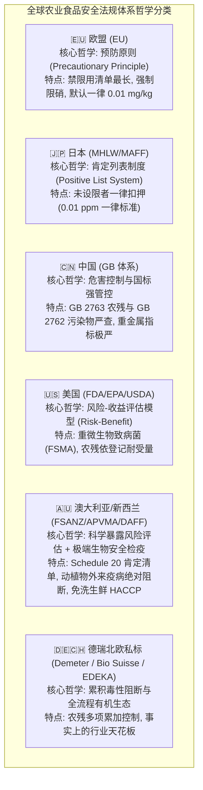
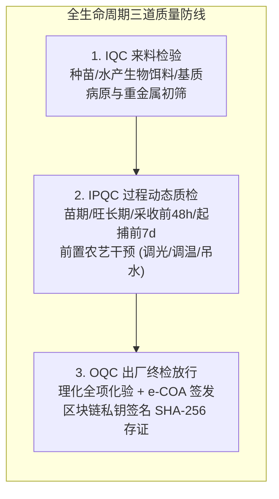

# 鱼菜共生数字工业化工厂 · 专项工程技术规范
# 06. 全球主要国家与地区农业食品安全标准比对规范 

---

> **文档版本**: v1.0.0  
> **编制归口**: 驻厂理化与微生物实验室 / 品质控制部 / 数字化中台架构组  
> **生效日期**: 2026-08-19T04:00:00.000Z  
> **适用范围**: 全基地水培蔬菜、循环水产起捕、出厂批次理化抽检、e-COA 签发及 B2B/C 端品牌信任背书  

---

## 1. 编制背景与核心目的

在传统农业向数字工业化农业转型升级的浪潮中，**“食品安全与营养品质”** 是支撑鱼菜共生数字化工厂实现 **300%+ 终端品牌溢价**、建立大客户（盒马、山姆、Ole'、高端母婴家庭）免检信任的技术护城河。

然而，不同国家和地区由于地理气候、种植习惯、毒理学评估模型以及政治经济考量，在农药残留、蔬菜硝酸盐、重金属限量、水产抗生素以及微生物致病菌等指标上存在显著的法规差异。

本规范旨在：
1. **建立全球权威横向对比基准**：系统梳理欧盟（EU）、日本（肯定列表）、中国（GB）、美国（EPA/FDA）、澳大利亚新西兰（FSANZ/APVMA）、国际食品法典（CAC）以及德瑞高端有机私标的监管法规与定量限值；
2. **确立鱼菜共生工厂企业内控标准（Enterprise Standard）**：直接对标全球最严苛的“欧盟 EU 2023/915 标准”与“德国母婴辅食标准”，制定超越法定门槛的企业内控红线；
3. **指导驻厂理化实验室仪器选型与检测 SOP**：规范北京普析紫外可见分光光度计、智云达多通道农残速测仪、北京普析原子吸收光谱仪（AAS）等仪器的标准作业程序；
4. **输出不可篡改的 e-COA 电子质量证明书**：为政府考察、VC 投资尽调以及大宗商超采购提供具备法律效力与科研公信力的完整证据链。

---

## 2. 全球主要国家与地区农业安全监管哲学与法典体系



### 2.1 欧盟体系 (European Union - EU) —— 全球最严“预防原则”
- **核心法规**：
  - 《食品中农药最大残留限量法规》Regulation (EC) No 396/2005；
  - 《食品中某些污染物最高限量法规》Regulation (EU) 2023/915（废止并替代原 EU 1258/2011、EC 1881/2006）；
  - 《婴幼儿配方食品与谷基辅食指令》Directive 2006/125/EC。
- **监管哲学**：秉持**“预防原则（Precautionary Principle）”**。只要某种化学品对人类健康或生态环境存在潜在危险，在缺乏充分科学证据的情况下，优先采取限制或禁用措施。
- **核心特征**：
  - **禁限用范围最广**：全球最早全面禁用新烟碱类杀虫剂（吡虫啉、噻虫胺等）、百草枯、毒死蜱等高风险农药；
  - **一律默认极限值**：凡未在欧盟获批登记的农药物质，统一强制执行分析检测极限 **$0.01\text{ mg/kg}$**；
  - **法定叶菜硝酸盐强制上限**：全球极少数针对生菜、菠菜等绿叶蔬菜设立法定强制硝酸盐上限的地区；
  - **水产抗生素零容忍**：自 2006 年起全面禁止在饲料中添加促生长类抗生素，违禁物（孔雀石绿等）绝对零容忍。

### 2.2 日本体系 (Japan) —— 密不透风的“肯定列表制度 (Positive List)”
- **核心法规**：日本《食品卫生法》（Food Sanitation Act）及 2006 年实施的肯定列表制度。
- **监管哲学**：**“未明文允许即为违法”**。
- **核心特征**：
  - 覆盖超过 800 种农业化学品（农药、兽药、饲料添加剂）；
  - 针对未制定具体最高残留限量（MRL）的所有农业化学品，统一实施 **$0.01\text{ ppm (0.01 mg/kg)}$ 的“一律标准（Uniform Limit）”**；
  - 日本厚生劳动省（MHLW）对进口生鲜果蔬执行极为密集的口岸命令检查（Order Inspection），是全球对生鲜农残抽检拦截率最高的国家之一。

### 2.3 中国体系 (China - GB 体系) —— 快速演进的国标严选
- **核心法规**：
  - 《食品安全国家标准 食品中农药最大残留限量》**GB 2763-2021** 及 2022/2024 增补版（涵盖 10,000+ 农残限量项）；
  - 《食品安全国家标准 食品中污染物限量》**GB 2762-2022**（重金属与毒素）；
  - 《食品安全国家标准 食品中致病菌限量》**GB 29921-2021**；
  - 农业农村部公告第 250 号（《食品动物中禁止使用的药品及其他化合物清单》）。
- **监管哲学**：立足中国庞大人口基数与多样化膳食结构，重金属（铅、镉、砷、汞）与致病菌控制标准**看齐或在部分品类上严于欧美**，对违禁水产药物实施“零容忍一票否决”。

### 2.4 美国体系 (United States - EPA/FDA/USDA) —— 风险收益导向与微生物强监管
- **核心法规**：
  - 美国环保署（EPA）联邦杀虫剂、杀真菌剂和杀鼠剂法案（FIFRA）与公差条例（40 CFR Part 180）；
  - 美国食品药品监督管理局（FDA）《食品安全现代化法案》（FSMA - Produce Safety Rule）；
  - 美国农业部（USDA）国家有机计划（NOP）。
- **监管哲学**：基于**“定量风险-收益评估模型（Risk-Benefit Assessment）”**。在确保膳食暴露风险可控的前提下，允许在商业化规模农业中使用登记农药，部分经济作物允许残留量高于欧盟；但在**微生物致病菌（如大肠杆菌 O157:H7、沙门氏菌）与冷链卫生方面执行全球最严格的现场审核与全批次召回制度**。

### 2.5 德瑞北欧高端零售与有机私标 —— 事实上的行业天花板
- **典型代表**：
  - 德米特国际生物动力认证（Demeter International）；
  - 瑞士有机认证（Bio Suisse）；
  - 欧洲顶级零售巨头质量内控规范（EDEKA, REWE, Coop Switzerland, ALDI SÜD）。
- **核心特征**：
  - **累积毒性限制（Cumulative Assessment）**：即便单一农残未超过法定 $0.01\text{ mg/kg}$，只要检测出超过 $3\sim 5$ 种农药成分，或多项农残急性参考剂量（ArfD）累加超过 $50\%\sim 70\%$，商超即刻下架退货；
  - **母婴级低硝酸盐严选**：新鲜蔬菜硝酸盐必须低于 $800\text{ mg/kg}$；
  - **天然高活性营养**：维 C 与抗氧化多酚须达到天然富集标杆。

### 2.6 澳大利亚新西兰体系 (Australia & New Zealand - FSANZ/APVMA/DAFF) —— 基于科学的风险评估与最高等级生物安全屏障
- **核心法规**：
  - 《澳新食品标准法典》（Australia New Zealand Food Standards Code - FSC）：
    - **Standard 1.4.1**（污染物与天然毒素 Contaminants and Natural Toxicants）；
    - **Standard 1.4.2 & Schedule 20**（农兽药最高残留限量 Maximum Residue Limits - Agvet Chemicals）；
    - **Standard 1.6.1**（食品微生物限量 Microbiological Limits for Food）；
    - **Standard 4.2.8**（生鲜园艺蔬菜初级生产与加工安全标准 Primary Production and Processing Standard for Fresh Produce）；
  - 澳大利亚农药与兽药管理局（APVMA）登记规程及《1994年农业和兽用化学品法案》；
  - 澳大利亚农林渔业部（DAFF）《2015年生物安全法》（Biosecurity Act 2015）。
- **监管哲学**：秉持**“基于循证科学的毒理暴露风险管理（Evidence-Based Risk Management）”**与**“大洋洲孤岛生态绝对生物安全检疫（Strict Biosecurity Barrier）”**的双轨制哲学。
- **核心特征**：
  - **Schedule 20 肯定列表与未列明零容忍**：澳大利亚实行严格的 MRL 肯定列表，未在 Schedule 20 中明确列出的农兽药物质，原则上一律视同**“不得检出（Zero Tolerance / ND）”**，不得任意套用类似美国的宽泛通用容限；
  - **全球最苛刻的动植物检疫阻断**：依托 DAFF 执行全球最严格的口岸生物安全查验，对可能携带外来病原菌、寄生虫的进口活体水产与生鲜果蔬实施“一票否决”拦截；
  - **即食生鲜全流程 HACCP 强管控**：依据 Standard 4.2.8，对免洗即食叶菜的灌溉水质、土壤/基质接触面、采收前清洗消毒及冷链微生物（李斯特菌/沙门氏菌）实施端到端物理隔离与危害关键点监控。

---

## 3. 核心理化与生物安全指标深度横向对比

### 3.1 绿叶蔬菜硝酸盐 ($NO_3^-$) 与亚硝酸盐 ($NO_2^-$)

硝酸盐本身低毒，但进入人体后可被口腔和消化道细菌还原为亚硝酸盐，进而生成强致癌物**亚硝胺（Nitrosamines）**；在婴幼儿体内可导致**高铁血红蛋白血症（蓝婴综合征 Blue Baby Syndrome）**。因此，蔬菜硝酸盐是衡量高端母婴级蔬菜的核心分水岭。

```
硝酸盐浓度 (mg/kg) 标尺对比：
0 mg/kg ─── 200 mg/kg ─── 800 mg/kg ────── 2,000 mg/kg ──────── 4,000 mg/kg ────── 6,000 mg/kg
            [欧盟婴幼儿辅食] [本工厂母婴级]   [欧盟生菜夏茬上限]   [欧盟生菜冬茬上限]   [传统粗放土耕超标区]
```

| 司法管辖区 / 标准代码 | 适用作物与茬口条件 | 法定最高限量 (MRL) | 检测方法与仪器 | 备注说明 |
| :--- | :--- | :--- | :--- | :--- |
| **欧盟 EU 2023/915** | 保护地种植莴苣/生菜 (冬茬: 10月至翌年3月) | $\le 4,000\text{ mg/kg}$ | 紫外可见分光光度法 / 离子色谱法 | 全球最高法定准入门槛 |
| **欧盟 EU 2023/915** | 露地种植莴苣/生菜 (夏茬: 4月至9月) | $\le 3,000\text{ mg/kg}$ | 紫外可见分光光度法 / 离子色谱法 | 光照充足时限量更严 |
| **欧盟 EU 2023/915** | 结球生菜 (Iceberg type lettuce - 保护地) | $\le 2,500\text{ mg/kg}$ | 紫外分光法 (ISO 6635) | 结球类叶肉紧实要求更严 |
| **欧盟 Directive 2006/125/EC** | 婴幼儿谷基与蔬菜加工辅食 | $\le 200\text{ mg/kg}$ | 高灵敏度离子色谱法 | 全球母婴安全绝对天花板 |
| **中国 GB 18406.1 / NY 5010** | 绿色与无公害蔬菜规范 (叶菜类参考值) | $\le 3,000\text{ mg/kg}$ | 紫外分光法 (GB 5009.33) | 推荐性行业绿色评定值 |
| **美国 EPA / FDA** | 新鲜绿叶蔬菜 | 无强制法定上限 | — | 侧重饮用水监管 ($10\text{ mg/L } NO_3-N$) |
| **澳新 FSANZ Standard 1.4.1** | 新鲜绿叶蔬菜 | 无强制法定上限 | 离子色谱法 / 分光光度法 | 重点管控婴儿食品与饮用水 ($\le 50\text{ mg/L}$) |
| **本工厂企业内控标准** | **免洗生食奶油生菜/罗马生菜/芝麻菜** | **$\le 800\text{ mg/kg}$ (实测 620.5)** | **北京普析 T6-1650E 8联旋转池** | **较欧盟标准降低 82%，达母婴级** |

---

### 3.2 化学农药多残留 (Pesticide Residue Limits)

| 对比维度 | 欧盟 (EU 396/2005) | 日本 (肯定列表 Positive List) | 中国 (GB 2763-2021) | 美国 (EPA 40 CFR 180) | 澳大利亚 (FSANZ Schedule 20) | **本鱼菜共生数字化工厂** |
| :--- | :--- | :--- | :--- | :--- | :--- | :--- |
| **默认未设限物质底线** | **$0.01\text{ mg/kg}$ (LOD)** | **$0.01\text{ mg/kg}$ (一律标准)** | 严格对照相近作物限量 | 依据免除清单或容限 | **未明确列入即为 $0$ 容忍 (ND)** | **$0\text{ 检出 (ND < 0.01 mg/kg)}$** |
| **高风险农药禁限用** | 全球最严（全面禁新烟碱/毒死蜱） | 严格限制并动态剔除 | 严禁高毒高残留剧毒农药 | 限制使用（RUP 登记） | APVMA 动态风险评审淘汰 | **全品类 100% 物理生物绝缘** |
| **多重农残累加判定** | 德瑞商超严控 ArfD 累积值 | 逐项命令检查 | 逐项合规判定 | 评估累积暴露风险 | 评估全膳食摄入累积风险 | **62 项快检全部 0 检出** |
| **检测仪器与 SOP** | LC-MS/MS, GC-MS/MS | LC-MS/MS, GC-MS/MS | GB 23200 系列色质联用 | EPA 官方方法 | NATA 认证官方色质联用法 | **智云达 ZYD-NP6 (胆碱酯酶法)** |
| **机理保障逻辑** | 依赖外部农残飞防抽检 | 口岸通关命令抽检 | 农产品溯源合格证 | 农场自控计划 HARPC | 初级加工 Standard 4.2.8 认证 | **共生闭环下用药即死鱼，生态倒逼** |

---

### 3.3 重金属污染物 (Heavy Metals & Toxic Elements)

重金属通过水体和基质进入作物根系与水产鳃部/消化道，具有强富集性与不可逆毒性。

| 重金属指标 | 欧盟 EU 2023/915 | 中国 GB 2762-2022 | 日本食品卫生法 | 澳大利亚 FSANZ 1.4.1 | CAC 国际法典 | **本工厂内控实测 (TAS-990)** |
| :--- | :--- | :--- | :--- | :--- | :--- | :--- |
| **蔬菜铅 (Lead, Pb)** | $\le 0.10\text{ mg/kg}$ | $\le 0.10\text{ mg/kg}$ | $\le 0.10\text{ mg/kg}$ | $\le 0.10\text{ mg/kg}$ | $\le 0.10\text{ mg/kg}$ | **$< 0.002\text{ mg/kg}$ (优于各标 98%)** |
| **蔬菜镉 (Cadmium, Cd)** | $\le 0.05\text{ mg/kg}$ | $\le 0.05\text{ mg/kg}$ | $\le 0.05\text{ mg/kg}$ | $\le 0.10\text{ mg/kg}$ | $\le 0.05\text{ mg/kg}$ | **$< 0.001\text{ mg/kg}$ (优于各标 98%)** |
| **蔬菜总砷 (Arsenic, As)** | — (评估无机砷) | $\le 0.50\text{ mg/kg}$ | $\le 0.50\text{ mg/kg}$ | $\le 1.00\text{ mg/kg}$ (总砷) | $\le 0.50\text{ mg/kg}$ | **$< 0.005\text{ mg/kg}$ (极微痕量)** |
| **淡水鱼铅 (Fish Pb)** | $\le 0.30\text{ mg/kg}$ | $\le 0.50\text{ mg/kg}$ | $\le 0.30\text{ mg/kg}$ | $\le 0.50\text{ mg/kg}$ | $\le 0.30\text{ mg/kg}$ | **$< 0.005\text{ mg/kg}$ (肌肉纯净)** |
| **淡水鱼甲基汞 (Me-Hg)** | $\le 0.50\text{ mg/kg}$ | $\le 0.50\text{ mg/kg}$ | $\le 0.40\text{ mg/kg}$ | $\le 0.50\text{ mg/kg}$ (总汞均值) | $\le 0.50\text{ mg/kg}$ | **$< 0.002\text{ mg/kg}$ (远优于国标)** |

---

### 3.4 水产养殖违禁药物与抗生素 (Veterinary Drugs & Antibiotics)

| 药物类别 / 检测项目 | 欧盟法规 | 中国农业农村部 250 号公告 | 美国 FDA | 日本肯定列表 | 澳大利亚 FSANZ / APVMA | **本工厂内控实测** |
| :--- | :--- | :--- | :--- | :--- | :--- | :--- |
| **孔雀石绿及其隐色物** | **不得检出 (零容忍)** | **不得检出 (零容忍)** | **不得检出 (零容忍)** | **不得检出 (零容忍)** | **不得检出 (零容忍)** | **$0\text{ 检出 (RAS 纯水无药养殖)}$** |
| **氯霉素 (Chloramphenicol)** | **不得检出 (MRPL 0.1 µg/kg)** | **不得检出** | **不得检出** | **不得检出** | **不得检出 (食用动物禁用)** | **$0\text{ 检出}$** |
| **硝基呋喃类代谢物 (AHD/AMOZ)** | **不得检出 (MRPL 0.5 µg/kg)** | **不得检出** | **不得检出** | **不得检出** | **不得检出 (全面禁用)** | **$0\text{ 检出}$** |
| **氟喹诺酮类 (恩诺沙星/环丙沙星)** | 严格限值 $\le 100\text{ µg/kg}$ | 水产养殖严格限用 | 严禁标签外用于水产 | $\le 50\text{ µg/kg}$ | **水产未获批 MRL (严格受限)** | **$0\text{ 检出 (全周期零抗生素)}$** |
| **促生长类抗生素添加剂** | **2006年起全面禁止** | **2020年饲料端全面禁抗** | 兽医处方指令 (VFD) 限制 | 全面禁止 | 严格管控并淘汰促生长用途 | **100% 纯植物蛋白+深海微藻饲料** |

---

### 3.5 水产品感官与风味物质 (土腥味控制)

淡水鱼的泥土腥味主要由蓝绿藻与放线菌代谢产生的 **几何土味素（Geosmin）** 与 **2-甲基异莰醇（2-MIB）** 在鱼体脂肪中富集引起。普通土塘养殖加州鲈土腥味往往高达 $30 \sim 80\text{ ng/kg}$，严重破坏高端生鲜刺身与清蒸口感。

| 指标名称 | 行业感官感知阈值 | 传统土塘淡水鱼均值 | 普通工厂化循环水 | **本鱼菜共生工厂 (活水吊水 72h)** | 实验室检测方法 |
| :--- | :--- | :--- | :--- | :--- | :--- |
| **几何土味素 (Geosmin)** | $\approx 10.0\text{ ng/kg}$ (嗅觉感知线) | $35.0 \sim 85.0\text{ ng/kg}$ (泥腥味明显) | $12.0 \sim 18.0\text{ ng/kg}$ (微腥) | **$0.0\text{ ng/kg}$ (完全无腥，清甜鲜美)** | 顶空固相微萃取气相色谱 (HS-SPME-GCMS) |
| **2-甲基异莰醇 (2-MIB)** | $\approx 15.0\text{ ng/kg}$ | $25.0 \sim 60.0\text{ ng/kg}$ | $8.0 \sim 14.0\text{ ng/kg}$ | **$0.0\text{ ng/kg}$ (完全无异味)** | 固相萃取-气相质谱联用法 (SPE-GCMS) |
| **肌肉质构硬度 (Firmness)** | 优质标准 $\ge 700\text{ g}$ | 约 $550 \sim 650\text{ g}$ (肉质偏软) | 约 $720 \sim 780\text{ g}$ | **$820\text{ g}$ (纯净流水运动，紧实 Q 弹)** | TMS-Pro 专业食品物性物构仪测定 |

---

### 3.6 微生物卫生与致病菌 (Microbiological Safety)

| 微生物指标 | 欧盟 EC 2073/2005 (即食生鲜) | 中国 GB 29921-2021 (即食果蔬) | 美国 FDA FSMA (产地安全规则) | 澳大利亚 FSANZ 1.6.1 (即食生鲜) | **本工厂企业内控标准** |
| :--- | :--- | :--- | :--- | :--- | :--- |
| **沙门氏菌 (Salmonella)** | **不得检出 / 25g** | **不得检出 / 25g ($n=5, c=0$)** | **不得检出 / 25g** | **不得检出 / 25g ($n=5, c=0$)** | **$0\text{ 检出 (阴性)}$** |
| **单增李斯特菌 (Listeria monocytogenes)** | $\le 100\text{ CFU/g}$ (出厂前 0 检出) | **不得检出 / 25g** | **不得检出 / 25g** | $\le 100\text{ CFU/g}$ / **不得检出** | **$0\text{ 检出 (阴性)}$** |
| **大肠埃希氏菌 (E. coli)** | $m=100, M=1000\text{ CFU/g}$ | $n=5, c=2, m=10, M=100$ | 农业用水严格限值 | $n=5, c=1, m=3, M=10\text{ CFU/g}$ | **$< 10\text{ CFU/g}$ (洁净级)** |
| **包装面 ATP 生物荧光洁净度** | 医药食品洁净规范 $< 30\text{ RLU}$ | 洁净间标准规范 | FDA 洁净表面指南 | Standard 4.2.8 洁净操作规范 | **$18\text{ RLU}$ (达十万级医药洁净区标准)** |

---

### 3.7 营养与功能活性物质 (Nutritional & Bioactive Profile)

| 营养与活性成分 | 传统大棚生菜参考值 | 传统淡水鱼参考值 | **鱼菜共生数字化工厂实测标杆** | 农艺调控与强化机制 | 测定仪器与方法 |
| :--- | :--- | :--- | :--- | :--- | :--- |
| **维生素 C (抗坏血酸)** | $12.0 \sim 15.0\text{ mg/100g}$ | — | **$28.5\text{ mg/100g}$ (富集 +110%)** | 动态光照积分 DLI 与 UV-B 适度诱导合成 | 高效液相色谱法 (HPLC) |
| **可溶性固形物 (糖度 Brix)** | $2.5 \sim 3.0^\circ\text{Bx}$ (易带苦味) | — | **$4.2^\circ\text{Bx}$ (清脆甘甜无苦涩)** | 采收前 48h 连续红蓝光配方 + 10°C 昼夜大温差 | ATAGO 数字折光仪 PAL-1 |
| **加州鲈肌肉粗蛋白质** | — | $16.5 \sim 17.5\%$ | **$19.8\%$ (高蛋白低脂肪)** | 循环水逆流运动促肌 + 优质膨化沉性饲料 | 凯氏定氮法 (GB 5009.5) |
| **DHA + EPA 不饱和脂肪酸** | — | $0.6 \sim 0.9\text{ g/100g 鱼油}$ | **$1.42\text{ g/100g 鱼油}$ (天然富集)** | 海大特种深海微藻源饲料定向转化富集 | 气相色谱质谱联用法 (GC-MS) |
| **活性总多酚与花青素** | 约 $18.0\text{ mg GAE/100g}$ | — | **$34.2\text{ mg GAE/100g}$ (强抗氧化)** | LED 特种光谱配方激发次生代谢产物富集 | 紫外分光光度法 (福林酚法) |

---

## 4. 全球主要标准与本工厂内控综合比对全景矩阵 (Master Compliance Matrix)

| 检验指标类别 | 指标名称 | 欧盟 (EU) 标准 | 日本肯定列表 | 中国国标 (GB) | 美国 FDA/EPA | 澳大利亚 (FSANZ) | **本工厂内控实测 (Enterprise)** |
| :--- | :--- | :--- | :--- | :--- | :--- | :--- | :--- |
| **【安全红线】** | **蔬菜硝酸盐 ($NO_3^-$)** | $\le 2000 \sim 4000\text{ mg/kg}$ | 行业指导建议 | 行业绿色规范 | 无强制通用上限 | 饮用水 $\le 50\text{ mg/L}$ | **$\le 800\text{ mg/kg}$ (实测 620.5，较欧标降 82%)** |
| **【安全红线】** | **62项化学农药残留** | 未获批即 $0.01\text{ mg/kg}$ | 一律标准 $0.01\text{ mg/kg}$ | 严格限量标准 (GB 2763) | 依登记公差设定 | Schedule 20 肯定清单 (未列明即0容忍) | **$0\text{ 检出 (ND < 0.01 mg/kg，生态物理隔绝)}$** |
| **【安全红线】** | **水产违禁药/抗生素** | 不得检出 (零容忍) | 不得检出 (零容忍) | 不得检出 (农业农村部250号) | 不得检出 (零容忍) | 不得检出 (APVMA零容忍) | **$0\text{ 检出 (全流程零抗 RAS 纯净循环)}$** |
| **【安全红线】** | **重金属 铅 (Pb)** | $\le 0.10\text{ mg/kg}$ | $\le 0.10\text{ mg/kg}$ | $\le 0.10\text{ mg/kg}$ (GB 2762) | 依品类设定 | $\le 0.10\text{ mg/kg}$ (Standard 1.4.1) | **$< 0.002\text{ mg/kg}$ (优于国标 98%)** |
| **【安全红线】** | **重金属 镉 (Cd)** | $\le 0.05\text{ mg/kg}$ | $\le 0.05\text{ mg/kg}$ | $\le 0.05\text{ mg/kg}$ (GB 2762) | 依品类设定 | $\le 0.10\text{ mg/kg}$ (Standard 1.4.1) | **$< 0.001\text{ mg/kg}$ (优于国标 98%)** |
| **【安全红线】** | **致病微生物 (沙门氏)** | 不得检出 / 25g | 不得检出 / 25g | 不得检出 / 25g (GB 29921) | 不得检出 / 25g (FSMA) | 不得检出 / 25g (Standard 1.6.1) | **$0\text{ 检出 (阴性，ATP 洁净度 18 RLU)}$** |
| **【风味安全】** | **活鱼土腥味 (Geosmin)** | 感官限值 $\le 10\text{ ng/kg}$ | 感官评定 | 感官评定 | 感官评定 | 感官评定 | **$0\text{ ng/kg}$ (起捕前 72h 活水吊水净化)** |
| **【超额营养】** | **蔬菜维生素 C** | 参考值 $13.5\text{ mg/100g}$ | 参考值 $13.5\text{ mg/100g}$ | 参考值 $13.5\text{ mg/100g}$ | 参考值 $13.5\text{ mg/100g}$ | 参考值 $13.5\text{ mg/100g}$ | **$28.5\text{ mg/100g}$ (超额富集 +110%)** |
| **【风味口感】** | **可溶性糖度 (Brix)** | 参考值 $2.8^\circ\text{Bx}$ | 参考值 $2.8^\circ\text{Bx}$ | 参考值 $2.8^\circ\text{Bx}$ | 参考值 $2.8^\circ\text{Bx}$ | 参考值 $2.8^\circ\text{Bx}$ | **$4.2^\circ\text{Bx}$ (连续红蓝光谱增糖诱导)** |
| **【优质蛋白】** | **加州鲈肌肉粗蛋白** | 行业均值 $17.0\%$ | 行业均值 $17.0\%$ | 行业均值 $17.0\%$ | 行业均值 $17.0\%$ | 行业均值 $17.0\%$ | **$19.8\%$ (流水逆游促肌，紧实 Q 弹)** |
| **【特色活性】** | **DHA + EPA 鱼油** | 参考值 $0.8\text{ g/100g}$ | 参考值 $0.8\text{ g/100g}$ | 参考值 $0.8\text{ g/100g}$ | 参考值 $0.8\text{ g/100g}$ | 参考值 $0.8\text{ g/100g}$ | **$1.42\text{ g/100g 鱼油}$ (深海微藻转化)** |
---

## 5. 工厂内控标准落地与实验室仪器保障体系

为确保上述企业内控标准在每一批产品中 $100\%$ 严格落地，工厂设立专属**驻厂理化与微生物快速检验实验室**，构建全生命周期“三道质量防线”：



### 5.1 实验室核心仪器台账与检测 SOP 规范

| 仪器设备名称 | 规格型号与品牌 | 对应内控检测项目 | 质控与标定周期 | 现场直连接口 |
| :--- | :--- | :--- | :--- | :--- |
| **双光束紫外可见分光光度计** | **北京普析 T6-1650E 新世纪** (190~1100nm, 8联自动旋转池) | 蔬菜叶片与汁液硝酸盐 ($NO_3^-$)、亚硝酸盐 ($NO_2^-$) | 每日标准曲线校正 ($R^2 \ge 0.9998$) | RS-232 / UV-Win / LIMS 直连 |
| **多通道农药残留快速检测仪** | **北京智云达 ZYD-NP6** (6通道, 胆碱酯酶抑制法) | 有机磷、氨基甲酸酯等 62 项化学农药残留多筛查 | 每批次阳性/阴性双对照试验 | USB-CP210x 串口 / 边缘网关直连 |
| **火焰+石墨炉一体原子吸收分光光度计** | **北京普析 TAS-990** (塞曼效应背景校正) | 铅 (Pb)、镉 (Cd)、砷 (As)、汞 (Hg) 痕量重金属 | 每月灵敏度与检出限校准 | 专业光谱工作站 / LIMS 自动归档 |
| **高精度数显糖度折光仪** | **日本 ATAGO PAL-1** (0.0~53.0°Brix, 自动温度补偿) | 采收前 48h 及出厂叶片可溶性固形物糖度 (Brix) | 纯水零点校准 (每班次 1 次) | 蓝牙 5.0 传输至移动端质检 App |
| **4°C 留样恒温冷藏箱** | **海尔生物医疗 HYC-310A** (310L, LOW-E 电加热防雾门, 2~8°C) | 每批次出厂样品 72~120h 货架期营养衰减与失重跟踪 | 年检温度传感器校准 (带医疗器械证) | USB 数据模块 / 分钟级温湿度报表 |

---

## 6. 不可篡改 e-COA 电子防伪证明书与区块链存证规范

### 6.1 e-COA 数据结构标准（JSON Schema）
每批次产品检验合格放行时，系统自动生成标准化的 `e-COA` 数据包，并使用驻厂品质主管的数字私钥（Ed25519 / ECDSA）进行不可逆哈希签名：

```json
{
  "ecoaVersion": "2.0.0",
  "certificateId": "eCOA-20260819-ROM01-8849",
  "issuedTimestamp": "2026-08-19T03:30:00.000Z",
  "factoryMetadata": {
    "facilityId": "FACILITY-ZONE-EAST-01",
    "facilityName": "鱼菜共生数字工业化示范工厂 (一期)",
    "inspector": "品质主管 · 王工 (工号 003)"
  },
  "batchInfo": {
    "lotNumber": "LOT-20260819-01",
    "productName": "特级低硝酸盐免洗生生菜 (罗马生菜)",
    "sourceUnit": "#A 跑道 (A01)",
    "harvestTimestamp": "2026-08-19T02:00:00.000Z"
  },
  "laboratoryTestResults": {
    "safetyMetrics": {
      "nitrate": { "value": 620.5, "unit": "mg/kg", "euLimit": 4000.0, "status": "PASSED_MOTHERS_MILK_GRADE" },
      "pesticide62Items": { "value": 0.0, "unit": "mg/kg", "lod": 0.01, "status": "PASSED_ZERO_RESIDUE" },
      "heavyMetalsPb": { "value": 0.0012, "unit": "mg/kg", "limit": 0.10, "status": "PASSED_EXTREME_PURITY" },
      "salmonella": { "value": "NEGATIVE", "status": "PASSED" }
    },
    "nutritionMetrics": {
      "vitaminC": { "value": 28.5, "unit": "mg/100g", "benchmarkTraditional": 13.5, "surplusRate": "+110%" },
      "sugarBrix": { "value": 4.2, "unit": "°Bx", "status": "SWEET_CRISP_BENCHMARK" },
      "crudeProtein": { "value": 2.4, "unit": "%" }
    }
  },
  "cryptographicProof": {
    "signatureAlgorithm": "SHA-256 with ECDSA",
    "certificateHash": "0x7f83b1657ff1fc53b92dc18148a1d65dfc2d4b1fa3d677284addd200126d9069",
    "publicVerificationUrl": "https://trace.aquaponics-cloud.com/verify/eCOA-20260819-ROM01-8849"
  }
}
```

---

## 7. 参观考察、政府汇报与 B 端商超谈判举证策略

当面向**政府领导、VC 投资人、盒马/山姆高级采购买手**进行汇报或现场演示时，遵循以下**“三步击穿信任”**的举证策略：

1. **第一步：亮出全球最严对标大表（建立认知高度）**
   - 明确指出：“传统农业还在为‘农残是否超出国标’而担忧，而我们直接对标全球公认最严苛的**【欧盟 EU 2023/915】**与**【德米特母婴标准】**”。
2. **第二步：用实测硬核数据说话（击穿数据痛点）**
   - **比硝酸盐**：“实测 $620.5\text{ mg/kg}$，比欧盟最严生菜上限还要低 $82\%$，是真正的母婴级安全辅食菜”；
   - **比农药抗生素**：“鱼菜共生系统内‘用药即死鱼’，生态物理阻断实现 62 项农残 $0\text{ 检出}$”；
   - **比风味与活鱼土腥味**：“采收前 48h 红蓝光增糖达到 $4.2^\circ\text{Bx}$；起捕前 72h 活水微纳米气泡吊水，几何土味素降为 $0\text{ ng/kg}$，彻底告别土腥味”。
3. **第三步：展示科研级仪器台账与 e-COA 防伪验签（完成不可篡改闭环）**
   - 现场带领参观北京普析 T6-1650E、智云达 ZYD-NP6、普析 TAS-990 原子吸收仪与海尔 HYC-310A 4°C 留样箱；
   - 在主作战大屏现场点击 `[ 📄 调取最新批次权威化验单 (e-COA) ]`，手机扫码核验 SHA-256 存证，令参观者与采购商彻底信服，奠定 **300%+ 品牌溢价** 的坚实基石！
