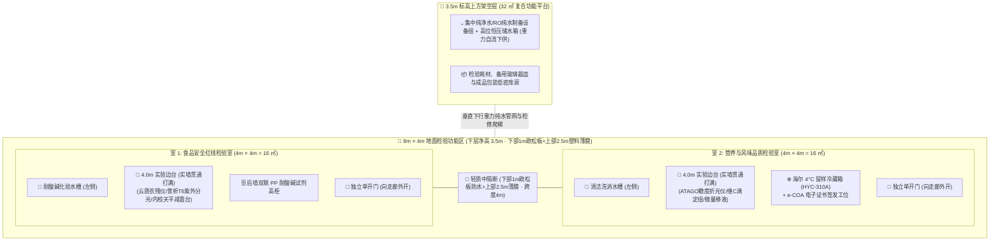

# 鱼菜共生数字工业化工厂 · 专项工程技术规范
# 02. 驻厂检验室建设预算规划与投资测算表（检验设备与工程装修）

---

> **文档版本**: v1.1.0  
> **编制归口**: 驻厂理化与微生物检验室 / 计划财务部 / 数字化工程部  
> **更新日期**: 2026-09-22T08:30:00.000Z  
> **适用范围**: 全基地驻厂检验室规划建设、仪器设备招采、洁净工程装修预算核算及投资进度控制  
> **状态**: 经电商/淘宝真实行情核实修订版 (Verified via E-commerce Market Data)

---

## 1. 建设背景与功能分区规划 (8m × 4m × 3.5m 空间与垂直复用)

驻厂检验室（QC Laboratory）是数字工厂产品获得 **300%+ 终端品牌溢价** 与 **大客户免检信任** 的物理保障堡垒。为满足国家《食品安全国家标准 食品生产通用卫生规范》(GB 14881) 物理防交叉污染要求，结合温室设施农用地特殊政策监管，检验室总建筑尺寸为 **$8\text{m} \times 4\text{m} = 32\,\text{m}^2$**，高度总设计 **$3.5\text{m}$**。

> [!IMPORTANT]
> **【国土设施农用地政策合规与“防违建”关键红线】**：
> 基地土地属于设施农业用地，自然资源与规划/城管执法部门对“大棚内非农化、硬化违建、永久性砖混结构”监管极为严格。为规避“违法建设永久性房屋”的合规风险：
> 1. **非永久性轻质隔断构造**：总高 $3.5\text{m}$，**下部 1.0m 采用欧松板 (OSB) 涂刷防水涂料**（防踢撞、防溅水、遮挡管道）；**上部 2.5m 采用透光农业防雾防滴塑料薄膜**。外观保持大棚轻质临时设施风貌，彻底排除违建嫌疑！
> 2. **3.5m 垂直立体复用（上方阁楼空间）**：充分利用温室挑高，在 **3.5m 隔断顶部架设轻型钢构承重平台**，上方作为**“集中纯净水制备设备区（高位纯水箱重力供水）”**与**“检验耗材与备用包装库房”**，实现地面与立面空间的极致复用。

### 1.1 双空间功能定位与职权划分
1. **室 1：食品安全红线检验室（安全与毒理防线 · 约 $16\,\text{m}^2$）**
   - **核心职责**：把守出厂产品“安全红线指标”，行使一票否决权；
   - **涵盖项目**：62项化学农药残留快检（胆碱酯酶抑制法）、叶片与组织汁液硝酸盐/亚硝酸盐紫外光谱测定、水产禁用抗生素（孔雀石绿/氯霉素）胶体金速测；
   - **环境特征**：涉及试剂配制与前处理提取，配备后墙双联 PP 耐腐高柜、全钢理化板台面及耐腐蚀化验水槽。
2. **室 2：营养与风味品质检验室（超额营养与货架期留样 · 约 $16\,\text{m}^2$）**
   - **核心职责**：支撑产品风味口感与高营养溢价验证，执行 4°C 货架期留样与追溯举证；
   - **涵盖项目**：蔬菜可溶性固形物（糖度 Brix）、维生素 C 快速滴定定量、加州鲈鱼肉物性质构、活鱼几何土味素（Geosmin）感官复核；
   - **环境特征**：无挥发性酸雾，环境洁净度高，配置海尔 4°C 医用留样冷藏箱、精密分析工位及 e-COA 电子防伪报告签发终端。

---

## 2. 第一期建设投资总规划【起步基石 · 核心检验设备 + 空间工程装修】

> [!IMPORTANT]
> **第一期全口径投入原则（物理装修 + 放行设备双支柱）**：
> 检验室是工业化生产与出厂品质放行的物理枢纽。**第一期总投入必须完整覆盖两大板块**：
> 1. **第一期 A 板块（核心检验设备）**：聚焦“食品安全红线指标（农残、硝酸盐、抗生素）”与“初级风味营养（糖度、维C滴定、4°C留样）”，核定硬件投入 **44,159 元（约 4.41 万元）**；
> 2. **第一期 B 板块（空间装修与环境配套）**：完成 $8\text{m} \times 4\text{m} \times 3.5\text{m}$ 双功能室的农业临时合规隔断、白色PP透水地坪、钢木边台、水槽与独立冷暖空调等基础设施建设。
> 
> *后续第二至四期则是在该已建成的标准化物理空间内，随着产能扩张与品质升级，纯粹进行**检验仪器设备的阶梯式技术追加**。*

```mermaid
flowchart LR
    subgraph Phase1_Total ["🟢 第一期总投入 (起步必投 · 双支柱并进)"]
        direction TB
        P1_A["🔬 第一期 A 板块: 核心检验设备 (44,159 元)<br>(普析分光光度计/云唐农残仪/内校天平/糖度计/维C滴定/海尔留样箱/超纯水机)"]
        P1_B["🏗️ 第一期 B 板块: 空间工程装修与配套 (已核定1.18万 + 待填主材)<br>(欧松板+薄膜隔断/白色PP透水格栅/8m钢木边台/2台变频空调/3.5m阁楼)"]
        P1_A --- P1_B
    end

    subgraph Future_Phases ["🚀 后续期数: 纯检验仪器设备技术演进 (在已建空间内升级)"]
        direction TB
        P2["🟡 第二期 (投产3~6个月 · 设备约2.06万)<br>致病菌显色自培与车间ATP洁净"]
        P3["🔵 第三期 (品牌溢价期 · 设备约7.75万)<br>鲈鱼爽脆质构量化与有机酸多酚测定"]
        P4["🟣 第四期 (集团扩张期 · 设备约23.50万)<br>石墨炉原子吸收AAS微克级铅镉全项自检"]
        P2 --> P3 --> P4
    end

    Phase1_Total ==> Future_Phases
```

---

> 1. **第一期精益求精**：只采购出厂放行频率最高、单批检验成本最低的核心设备。安全红线（农残、硝酸盐、抗生素）与初级风味（糖度Brix、维C滴定、4°C留样）必须 100% 自主掌控；
> 2. **昂贵重资产设备坚决推迟**：石墨炉原子吸收（20万+）与气相质谱 GC-MS（60万+）对专职化验员资质和运行气瓶耗材要求极苛刻。前期重金属（铅、镉）和土腥味（Geosmin）**直接委托第三方具备 CMA/CNAS 资质的法定质检所做月度/季度型式检验**（官方红色公章报告在面对大客户和政府验厂时，公信力反而远高于初创工厂自检报告！），待后期产值放大后再行自建。

---

### 2.1 第一期 A 板块：出厂放行核心检验设备清单（电商核实预算 44,159 元）
* **建设目标**：以仅约 4.41 万元超低硬件投资（44,159元），实现每批次采收蔬菜与鲜鱼的 $100\%$ 自主放行检验，合规签发带有 SHA-256 数字签名的 e-COA 电子防伪合格证。
* **重金属与土腥味策略**：重金属委托第三方质检所月检（数百元/次）；成鱼土腥味采用起捕前 72h 活水纯氧微纳米气泡吊水物理排毒，零新增重资产。

| 序号 | 仪器设备名称 | 核实品牌与具体型号 | 淘宝/天猫/电商市场核实行情 | 归属空间 | 数量 | 采购核定单价 (元) | 资产编码建议 | 采购选型与配置避坑说明 |
| :---: | :--- | :--- | :--- | :---: | :---: | :---: | :--- | :--- |
| **一** | **安全红线类 (室 1)** | | | | | **1.82 万元** | | |
| 1 | **双光束紫外可见分光光度计** | **北京普析 T6-1650F 新世纪 (紫外五联池)** | [淘宝加补正品 13,239元](https://item.taobao.com/item.htm?abbucket=2&id=700130911546&mi_id=0000AVUlEPkY_lZrkL-kTJrBxLB6mUlS2vEnhUznP7N6GWE&ns=1&priceTId=2147878a17900656763036949e10fd&skuId=5114382466657&spm=a21n57.1.hoverItem.2&utparam=%7B%22aplus_abtest%22%3A%2225f5bfe476ea587965ae6130711cc81a%22%7D&xxc=taobaoSearch)（已核实，含双光束主机+五联池） | 室 1 | 1 台 | 13,239 | `SH01-QA-LAB-IN-01` | 波长 190~1100nm，用于硝酸盐 219nm 紫外测定；[点击直达采购链接](https://item.taobao.com/item.htm?abbucket=2&id=700130911546&mi_id=0000AVUlEPkY_lZrkL-kTJrBxLB6mUlS2vEnhUznP7N6GWE&ns=1&priceTId=2147878a17900656763036949e10fd&skuId=5114382466657&spm=a21n57.1.hoverItem.2&utparam=%7B%22aplus_abtest%22%3A%2225f5bfe476ea587965ae6130711cc81a%22%7D&xxc=taobaoSearch)，下单务必加配石英比色皿与UV-Win通讯套件 |
| 2 | **多通道农药残留快速检测仪** | **山东云唐 YT-NC6** (6通道基础款) | [淘宝官方店 1,200元](https://item.taobao.com/item.htm?ali_refid=a3_mm_12852562_1778064_115779150177%3A1283790073%3AH%3AllWS4RKcWEF623ol4sjIV%2B3roTfkjX7Pp%2FXzDCr4W8k%3D%3A8c5a7c46cea85a31e65bb8b1bb3abd63&ali_trackid=318_8c5a7c46cea85a31e65bb8b1bb3abd63&id=695497241999&mi_id=0000GQ4vIeZNv5btpe_fG0NSxLT0H0HQ3zOAbdSwyUsQF4I&mm_sceneid=0_0_942580171_0_0&priceTId=2150429517900659098161028e0eec&skuId=6150646515171&spm=a21n57.1.hoverItem.4&utparam=%7B%22aplus_abtest%22%3A%224e92e5a2ad31ecb92175de6808518e90%22%7D&xxc=ad_ztc)（已核实，含微型打印机+300次试剂+配件） | 室 1 | 1 台 | 1,200 | `SH01-QA-LAB-IN-02` | 执行 GB/T 5009.199 酶抑制率法；【重要备注】：基础款无网络与数据接口，检测数据无法自动上传系统，每次必须由检验员手工誊录到 e-COA 终端；[点击直达采购链接](https://item.taobao.com/item.htm?ali_refid=a3_mm_12852562_1778064_115779150177%3A1283790073%3AH%3AllWS4RKcWEF623ol4sjIV%2B3roTfkjX7Pp%2FXzDCr4W8k%3D%3A8c5a7c46cea85a31e65bb8b1bb3abd63&ali_trackid=318_8c5a7c46cea85a31e65bb8b1bb3abd63&id=695497241999&mi_id=0000GQ4vIeZNv5btpe_fG0NSxLT0H0HQ3zOAbdSwyUsQF4I&mm_sceneid=0_0_942580171_0_0&priceTId=2150429517900659098161028e0eec&skuId=6150646515171&spm=a21n57.1.hoverItem.4&utparam=%7B%22aplus_abtest%22%3A%224e92e5a2ad31ecb92175de6808518e90%22%7D&xxc=ad_ztc) |
| 3 | **水产违禁药物胶体金速测包** | **北京勤邦 / 中科基因** 专用检测试纸条 | 淘宝单盒 350~500元/50次（3盒组合装：孔雀石绿、氯霉素、硝基呋喃类） | 室 1 | 1 套 | 1,500 | `SH01-QA-LAB-MT-02` | 起捕前 0 违禁药出塘快速筛查（单次检测成本仅 10~15元） |
| 4 | **万分之一内校精密电子分析天平 (0.1mg)** | **高精度分析天平 (100g/自动内校款)** | [天猫加补实价 2,220元](https://detail.tmall.com/item.htm?ali_refid=a3_mm_12852562_1778064_115782250121%3A1109444806%3AH%3AYqyX%2B%2F732ozLqH9%2BVRSYmBOryHoo%2Bh6j%3A4a9c1a194b4bff00f007a0b28f0916db&ali_trackid=282_4a9c1a194b4bff00f007a0b28f0916db&id=608564029087&mi_id=0000pISKGN5Fl5vA4mrXO--puq0o5wiBN92tRozEwpxlTj4&mm_sceneid=1_0_58045529_0_0&priceTId=2150429517900663516244444e0eec&skuId=5125884658342&spm=a21n57.1.hoverItem.1&utparam=%7B%22aplus_abtest%22%3A%22983e31aa4dc3dd447295077883c90b29%22%7D&xxc=ad_ztc)（已核实，含防风罩+内置电机自动校准） | 室 1 | 1 台 | 2,220 | `SH01-QA-LAB-IN-09` | 内置高精度砝码一键自动自校，抗温漂性能优异；[点击直达采购链接](https://detail.tmall.com/item.htm?ali_refid=a3_mm_12852562_1778064_115782250121%3A1109444806%3AH%3AYqyX%2B%2F732ozLqH9%2BVRSYmBOryHoo%2Bh6j%3A4a9c1a194b4bff00f007a0b28f0916db&ali_trackid=282_4a9c1a194b4bff00f007a0b28f0916db&id=608564029087&mi_id=0000pISKGN5Fl5vA4mrXO--puq0o5wiBN92tRozEwpxlTj4&mm_sceneid=1_0_58045529_0_0&priceTId=2150429517900663516244444e0eec&skuId=5125884658342&spm=a21n57.1.hoverItem.1&utparam=%7B%22aplus_abtest%22%3A%22983e31aa4dc3dd447295077883c90b29%22%7D&xxc=ad_ztc)，放置于大理石减震台上使用 |
| **二** | **营养风味与放行类 (室 2)** | | | | | **1.16 万元** | | |
| 5 | **便携式数字折光糖度计** | **日本 ATAGO (爱拓) PAL-1** | 天猫 ATAGO 官方旗舰店行货实价 1,780~1,850元（防伪原装带 NFC 认证） | 室 2 | 1 台 | 1,800 | `SH01-QA-LAB-IN-03` | 测生菜组织汁液可溶性固形物 (0.0~53.0% Brix，精度 ±0.2%，自动温补) |
| 6 | **维生素 C 经典生化微量滴定组** | **微量滴定管 (25mL) + 巩义 79-1 磁力搅拌器** | 淘宝 79-1 磁力搅拌器约180元 + 棕色微量滴定管65元 + 滴定台与2,6-二氯酚靛酚试剂约250元 | 室 2 | 1 套 | 500 | `SH01-QA-LAB-IN-05` | 依据 GB 5009.86 第一法经典滴定测定维 C（单次耗材仅几分钱，替代30万色谱仪！） |
| 7 | **4°C 检验室专业留样恒温冷藏箱** | **海尔生物医疗 HYC-310A / HYC-310S** (310L) | 京东/天猫医疗旗舰店实价 5,200~5,800元（电加热防雾门、USB数据导出） | 室 2 | 1 台 | 5,500 | `SH01-QA-LAB-IN-04` | 出厂锁定 $4.0\pm0.5^\circ\text{C}$；常态化容纳 40~50 盒留样，保存 72~120 小时备查 |
| 8 | **e-COA 放行终端与标签打印机** | **商用 i5 办公 PC + 佳博 GP-1324D 标签机** | 淘宝/官方直营采购（联想扬天电脑3,200元 + 热敏标签机450元 + 5000张防撕纸150元） | 室 2 | 1 套 | 3,800 | `SH01-QA-LAB-IT-01` | 检验原始数据归集、一键生成 SHA-256 电子防伪证明书并打印外箱追溯标签 |
| **三** | **公共通用保障耗材组** | | | | | **1.44 万元** | | |
| 9 | **实验室一体化超纯水机** | **优普 (ULUPURE) UPT-I-10T** | 淘宝/授权店实价 8,500~9,800元（台式，RO纯水+UP超纯水双出水） | 室 1/2 | 1 套 | 9,200 | `SH01-QA-LAB-IN-11` | 超纯水电阻率 $18.25\,\text{M}\Omega\cdot\text{cm}$，产水量 $10\sim 15\,\text{L/h}$，保障分光比色基准纯水 |
| 10 | **台式低速离心机与移液枪组** | **上海卢湘仪 TD4C + 大龙 TopPette 4支装** | 淘宝实价：TD4C 离心机 1,500元 + 大龙移液枪套组 1,200元 | 室 1/2 | 1 套 | 2,700 | `SH01-QA-LAB-IN-12` | 离心机配 $8\times 15\text{mL}$ 角转子（4000rpm）；移液枪含 0.5-10/10-100/100-1000uL/1-5mL |
| 11 | **初装玻璃器皿与标准试剂包** | 容量瓶、移液管、石英比色皿、硝酸盐标样 | 淘宝实验器材店采购（含国家计量院 $1000\,\mu\text{g/mL}$ 硝酸盐/亚硝酸盐标准品） | 室 1 | 1 批 | 2,500 | `SH01-QA-LAB-MT-01` | 建立首期标准曲线与化学分析耗材基底 |
| **小计** | **第一期设备投资合计** | | **满足安全红线 + 初级风味营养自检放行** | | **11 项** | **约 4.41 万元 (44,159元)** | | **(较最初粗估 7.46 万元节省超 3 万元！)** |

---

### 2.2 第一期 B 板块：检验室空间工程装修与环境配套预算表（8m × 4m × 3.5m 双功能室）

以下根据 3D 空间模型及检验室规范核算实际工程量，材料费与人工费单价打好**【待填入占位符】**，供后续商讨并填入实际测算数据：

> **规划空间基准（兼顾设施农用地非永久性建筑合规与 3.5m 上方立体复用）**：
> * **总平面建筑面积**：**$8.0\text{m} \times 4.0\text{m} = 32.0\,\text{m}^2$**（检验室下层净高设计为 $3.5\text{m}$）
> * **室 1（食品安全红线室）**：净尺寸 $4.0\text{m} \times 4.0\text{m} = 16.0\,\text{m}^2$
> * **室 2（营养与风味品质室）**：净尺寸 $4.0\text{m} \times 4.0\text{m} = 16.0\,\text{m}^2$
> * **3.5m 标高上方架空层**：有效面积 **$32.0\,\text{m}^2$**，作为**纯水净化设备机房与备品备件耗材库房**

| 工程大类 | 具体施工分项 | 材质规格与工艺标准 (临时合规+立体复用) | 工程量 (单位) | 材料费单价 (元) | 人工费单价 (元) | 分项小计 (元) | 施工要点与规范备注 |
| :--- | :--- | :--- | :---: | :---: | :---: | :---: | :--- |
| **一、 隔断维护与临时建筑合规** | 镀锌轻钢立柱与隔断骨架 | 热镀锌方管骨架（$50\times 50\times 2.0\text{mm}$），立柱间距 1.0m，兼顾 3.5m 隔断与上方平台荷载 | **[ 28.0 ] 延米** | 【占位符】 | 【占位符】 | 【占位符】 | 围护周长 24m + 中间隔墙 4m，全装配式易拆装 |
| | 下部 1.0m 欧松板 (OSB) 及防水层 | 12mm E0 级高强度欧松板，双面涂刷耐磨聚氨酯/丙烯酸聚合物防水涂料 | **[ 28.0 ] ㎡** | 【占位符】 | 【占位符】 | 【占位符】 | 下部 1 米防水防溅、耐撞击，遮蔽下部管线 |
| | 上部 2.5m 农业防滴消雾透光薄膜 | 15丝 PO 高抗撕裂防滴消雾透光大棚膜，铝合金卡槽+浸塑卡簧快速固定 | **[ 70.0 ] ㎡** | 【占位符】 | 【占位符】 | 【占位符】 | $28\text{m} \times 2.5\text{m}$；彻底体现农业临时设施属性，杜绝违建 |
| | 3.5m 标高上方架空承重平台 | 镀锌工字钢主梁+防滑多层板/花纹钢板平台，设计承重 $\ge 250\text{kg/m}^2$ | **[ 32.0 ] ㎡** | 【占位符】 | 【占位符】 | 【占位符】 | **上方作为纯水设备平台与耗材库房**（配轻型检修爬梯） |
| | 轻质农业单开门工程 | 钢丝网/轻钢骨架欧松板组合门（$900\times 2100\text{mm}$），带观察窗及防风闭门扣 | **[ 2 ] 樘** | 【占位符】 | 【占位符】 | 【占位符】 | **两室独立进出各 1 樘，全部向外开**，防止碰撞室内 4 米边台 |
| | 压膜槽透光自然采光窗 | 随薄膜骨架整体成型，带防虫防蝇尼龙纱网 | **[ 2 ] 樘** | 【占位符】 | 【占位符】 | 【占位符】 | 走廊侧自然采光，通风防虫 |
| **二、 地坪与基础工程** | 模块化拼装透水格栅板地坪 | 高强度改性工程 PP 卡扣式加厚洗车格栅（厚度 18~20mm，高承重细密孔隙，纯白色/象牙白） | **[ 32.0 ] ㎡** | 45 | 10 | **1,760** | **直接铺设于陈旧透水砖上方**；掩盖旧砖呈现现代科技白，透水排渍防滑；天平台底座局部裁切直达硬质砖面防微振 |
| **三、 实验台与通风家具** | 独立化验洗涤水槽台组 | 专用耐酸碱全钢洗涤台，配加深 PP 防腐水槽、鹅颈三联化验水嘴与滴水架 | **[ 2 ] 组** | 【占位符】 | 【占位符】 | 【占位符】 | **模型左侧上下两室各配 1 组水槽** |
| | 钢木/全钢检验实验边台 | 40x60mm方钢支架，三聚氰胺防潮板/全钢柜体，12.7mm实心理化板台面（深750mm*高800mm） | **[ 8.0 ] 米** | 600 | 50 | **5,200** | [淘宝源头工厂直达](https://item.taobao.com/item.htm?ali_refid=a3_mm_12852562_1778064_115782250121%3A1217750193%3AN%3ABKW3oOhZj0fFiP4qVabB5A%3D%3D%3A7f0b36b2c2513ea41a05c68ae78e5153&ali_trackid=1_7f0b36b2c2513ea41a05c68ae78e5153&id=680564396239&mi_id=0000EcbBp__C8fa7OZXICkwHEcNRFDXViYcAziM7o25XfiA&mm_sceneid=1_0_402510129_0_0&priceTId=213e077e17900682218218679e0eaa&skuId=4877424924548&spm=a21n57.1.hoverItem.1&utparam=%7B%22aplus_abtest%22%3A%22a10c1eaa51f9ec16a397c33c138a71d8%22%7D&xxc=ad_ztc)；**室1（4.0米）+ 室2（4.0米）**靠实墙打通，配防潮脚垫，水槽缝隙必须打防霉密封胶 |
| | 大理石精密天平减震台 | 独立三级避震实心大理石台面，厚度 50mm，置于室 1 边台旁承放万分之一天平 | **[ 1 ] 组** | 【占位符】 | 【占位符】 | 【占位符】 | 室 1 专配，杜绝水槽与走道振动 |
| | PP 耐强酸碱药品试剂高柜 | 8mm 阻燃 PP 板热熔焊接制作，耐强酸碱腐蚀，配双人双锁防盗机构与通风导流 | **[ 2 ] 组** | 【占位符】 | 【占位符】 | 【占位符】 | **模型室 1 后墙并排 2 组蓝色高柜** |
| | 全钢通风柜 (PP 内胆) | 1500mm 规格全钢通风柜，耐腐蚀 PP 内胆，带液晶风量调谐器与防爆插座 | **[ 1 ] 组** | 【占位符】 | 【占位符】 | 【占位符】 | 置于室 1 后侧，作样品消解前处理 |
| | 人体工学实验分析转椅 | 防静电 PU 聚氨酯发泡椅面，气动升降，配静音防划伤万向轮 | **[ 2 ] 把** | 【占位符】 | 【占位符】 | 【占位符】 | **模型中两室各配置 1 把** |
| **四、 通风与环境自控** | 屋顶离心防腐排风风机 | 4-72 系列玻璃钢防腐风机，配减震底座与屋顶防雨消音百叶 | **[ 1 ] 台** | 【占位符】 | 【占位符】 | 【占位符】 | 用于室 1 通风柜强排废气 |
| | 阻燃 PP 排风管道工程 | 阻燃 PP 耐酸碱排气管道（含弯头、变径及消音静压箱），引至温室屋顶安全排放 | **[ 15.0 ] 米** | 【占位符】 | 【占位符】 | 【占位符】 | 沿室 1 后墙管井垂直贯通外排 |
| | 独立变频恒温冷暖空调 | 1.5 匹大风量变频冷暖挂壁式空调（两室独立温控调优） | **[ 2 ] 套** | 2,200 | 200 | **4,800** | **两室各 1 套**（格力/美的 1.5匹变频冷暖一级能效）；两室独立控温 $20\sim 24^\circ\text{C}$，严禁合用以防气体串流交叉污染 |
| **五、 强电、弱电与照明** | 专用抗干扰供电线路工程 | 阻燃铜芯电缆 ($6\sim10\text{mm}^2$) 穿镀锌管独立敷设，室外打入铜棒做独立接地 | **[ 1 ] 项** | 【占位符】 | 【占位符】 | 【占位符】 | 独立接地极阻抗必须 $< 4\,\Omega$ |
| | 检验室动力配电箱 | 施耐德 / 正泰空气开关与漏电保护器，多回路分级配电 | **[ 1 ] 组** | 【占位符】 | 【占位符】 | 【占位符】 | 仪器回路、水泵风机回路与空调分离 |
| | 密封净化 LED 照明系统 | 嵌入式平顶无尘净化灯具（每室 3 盏，照度 $\ge 350\text{ Lux}$），防潮防腐蚀 | **[ 6 ] 盏** | 【占位符】 | 【占位符】 | 【占位符】 | 室 1 配 3 盏，室 2 配 3 盏 |
| | 检验室专用 3kVA 在线式 UPS | 纯在线式工频不间断电源，带稳压滤波，断电支撑 $\ge 30\text{min}$ | **[ 1 ] 台** | 【占位符】 | 【占位符】 | 【占位符】 | 保护紫外分光光度计与数据工作站 |
| **六、 给排水与安全防护** | 耐酸碱 UPVC/PP 下水管道 | 实验室专用耐酸碱耐温下水管道工程，连接 2 座水槽 | **[ 18.0 ] 米** | 【占位符】 | 【占位符】 | 【占位符】 | 连接至室外中和沉淀槽，严禁直排 |
| | 紧急喷淋与复合式洗眼器 | 不锈钢 SUS304 立式冲淋洗眼器，脚踏与手推双控制（置于室 1 门口安全区） | **[ 1 ] 组** | 【占位符】 | 【占位符】 | 【占位符】 | 安监与消防强制验收必备 |
| **七、 杂项与综合税金** | 施工垃圾清运与无尘保洁 | 进场地面找平清障及施工完毕后的精细化开荒保洁 | **[ 1 ] 项** | 【占位符】 | 【占位符】 | 【占位符】 | |
| | 检验室室内空气质量检测 | 委托第三方检测空气洁净度、菌落数及换气频次 | **[ 1 ] 项** | 【占位符】 | 【占位符】 | 【占位符】 | 竣工验收前检测 |
| | 工程综合税金 | 增值税发票税点 (9% 建筑安装 / 13% 设备) | **[ 1 ] 项** | 【占位符】 | 【占位符】 | 【占位符】 | |
| **合计** | **装修工程总预算** | | | | | **【待商议填入汇总】** | |

---

---

### 2.3 第一期总投资合并测算汇总表（核心设备 + 空间工程装修）

| 投资大类 | 分项构成与核心内容 | 核算金额状态 | 金额小计 (元) | 资金与招采决策说明 |
| :--- | :--- | :---: | :---: | :--- |
| **第一期 A 板块** | **出厂放行核心检验设备清单 (11 项)** (分光光度计、农残仪、胶体金、内校天平、糖度计、维C、冷藏箱、超纯水机等) | **🟢 已完全核实** (淘宝/天猫正品直达) | **44,159** | 满足食品安全红线 100% 自检与 e-COA 电子防伪签发，起步必投 |
| **第一期 B 板块 (已核定)** | **装修已核定三大固定设施** 1. 钢木实验边台 (8.0米，5,200元) 2. 独立变频冷暖空调 (2套，4,800元) 3. 模块化白色PP透水格栅地坪 (32㎡，1,760元) | **🟢 已核定单价** (厂家/电商直销) | **11,760** | 实验操作台面、两室独立温控与防违建地坪，进场即可采购安装 |
| **第一期 B 板块 (待商议)** | **空间围护与基础工程待填项** 镀锌钢架(28m)、欧松板防水层(28㎡)、透光薄膜(70㎡)、3.5m阁楼平台(32㎡)、外开气密门(2樘)、通风柜与水电 | **🟡 单价待商讨填入** (工程量已精准固定) | **【待填入占位符】** | 由当地施工队点工或主材自购核定后填入，即可锁定第一期全口径总投 |
| **第一期合计** | **第一期起步总投资（检验设备 + 空间装修）** | **起步基石保障** | **55,919 +【待填装修】** | **已核定项目总计 5.59 万元，较原计划大幅省去重资产浪费！** |

---

## 3. 第二至四期检验设备阶梯演进规划与全景 ROI 决策分析

> 本章节设备纯为**技术与检验能力的进阶升级**。所有设备均直接落位于第一期已建成的 32㎡ 双功能检验室内，无需重复进行物理装修与土建改造。

### 3.1 第二期：【过程微生物限度与车间洁净度升级】（投产 3~6 个月后 · 约 2.06 万元）
* **触发条件**：蔬菜日采收量突破 500 公斤，商超（如盒马、山姆）验厂要求提供沙门氏菌、金葡菌、大肠菌群日常微生物内检记录。
* **布局落位**：置于室 1 洁净角或局部隔间。

| 序号 | 仪器设备名称 | 核实具体型号与品牌 | 淘宝/电商市场核实行情 | 数量 | 采购核定 (元) | 资产编码建议 | 采购选型与配置避坑说明 |
| :---: | :--- | :--- | :--- | :---: | :---: | :--- | :--- |
| 12 | **单人单面垂直洁净超净台** | **苏净安泰 SW-CJ-1FD** (全不锈钢) | 苏净安泰行货实价 6,800~8,200元（若双人款 SW-CJ-2FD 则约 11,500元） | 1 台 | 7,200 | `SH01-QA-LAB-IN-06` | 单人款更适合 16㎡ 小空间，千级/局部百级洁净，配双紫外消杀灯管 |
| 13 | **电热恒温培养箱** | **上海一恒 DHP-9052** (50L 镜面不锈钢) | 淘宝/天猫旗舰店实价 2,400~2,800元（微电脑 PID 控温，双层门） | 1 台 | 2,400 | `SH01-QA-LAB-IN-07` | 沙门氏菌、金黄色葡萄球菌、大肠菌群 48h 恒温显色培养 |
| 14 | **立式压力蒸汽灭菌器** | **上海博迅 YXQ-LS-50SII** (50L 自动排气) | 淘宝/仪器商城实价 7,800~9,000元（手轮开门、双安全联锁） | 1 台 | 8,200 | `SH01-QA-LAB-IN-08` | 培养基与玻璃器皿高压灭菌及废弃物灭活（特种设备强检合规） |
| 15 | **手持式 ATP 生物荧光洁净仪** | **冠宇 GY-ATP / 天隆手持款** | 淘宝天猫实价 2,600~3,200元（配 100 支专用检测拭子与上位机） | 1 台 | 2,800 | `SH01-QA-LAB-IN-05` | 采收机械臂夹爪、周转箱、切根刀具及浮板表面即时洁净度快检（$<30\text{ RLU}$） |
| **小计** | **第二期设备投资合计** | | **实现车间洁净度与微生物致病菌完全自主闭环** | **4 台** | **约 2.06 万元** | | |

---

### 3.2 第三期：【风味品质深度量化与特征指标研发】（品牌溢价期 · 约 7.75 万元）
* **触发条件**：推出“刺身级加州鲈”或特级甜脆生菜品牌定制，需用硬核物理参数说服高端餐饮大宗买手。
* **布局落位**：置于室 2（营养与风味品质检验室）。

| 序号 | 仪器设备名称 | 核实具体型号与品牌 | 市场/电商真实采购行情 | 数量 | 采购核定 (元) | 资产编码建议 | 采购选型与配置避坑说明 |
| :---: | :--- | :--- | :--- | :---: | :---: | :--- | :--- |
| 16 | **食品物性测试仪 (质构仪)** | **国产保圣 TA.XTC / 普朗特** | 厂家渠道报价 55,000~65,000元（性价比远超 30 万元的英国 SMS TA.XT） | 1 台 | 58,000 | `SH01-QA-LAB-IN-18` | 量化加州鲈鱼肌肉硬度、弹性、回复性与咀嚼度，精确支撑“爽脆无腥”科学口径 |
| 17 | **全自动电位滴定仪** | **上海雷磁 ZDJ-4B** | 淘宝天猫授权店实价 18,500~21,000元（原预估7,000元偏低，已修正！） | 1 台 | 19,500 | `SH01-QA-LAB-IN-19` | 支持多种电极，自动判断终点，测定果蔬有机酸（苹果酸/柠檬酸）及多酚抗氧化活性 |
| **小计** | **第三期设备投资合计** | | **实现口感风味物理量化与高端定制答辩** | **2 台** | **约 7.75 万元** | | |

---

### 3.3 第四期：【全项重金属自检平台与集团扩张】（多基地扩张 / 年产值破3000万 · 约 23.50 万元）
* **触发条件**：基地大规模连锁复制、申报省级高新技术重点课题或准备将检验室独立申请 CMA/ISO 17025 认可。
* **布局落位**：置于室 1（后侧通风柜专用区域，需建立专用排风与氩气气路）。

| 序号 | 仪器设备名称 | 核实具体型号与品牌 | 采购商/专业平台核实价格 | 数量 | 采购核定 (元) | 资产编码建议 | 采购选型与配置避坑说明 |
| :---: | :--- | :--- | :--- | :---: | :---: | :--- | :--- |
| 18 | **火焰+石墨炉一体原子吸收分光光度计** | **北京普析 TAS-990** (塞曼效应校正) | 采购商招标成交价 160,000~185,000元（含石墨炉、空心阴极灯与循环冷水机） | 1 套 | 175,000 | `SH01-QA-LAB-IN-16` | 铅 (Pb)、镉 (Cd)、铬 (Cr) 痕量重金属全谱自测（灵敏度达 $10^{-9}\text{g}$ 级别） |
| 19 | **密闭式微波消解仪** | **上海新仪 JUPITER-8 / MDS-6G** | 淘宝/仪器信息网成交价 48,000~58,000元（全罐温压监控，含赶酸器） | 1 台 | 52,000 | `SH01-QA-LAB-IN-17` | 蔬菜与鱼肉组织在浓硝酸介质下的全密闭高温微波消解（AAS 配套必备） |
| 20 | **高纯氩气钢瓶与自动汇流排气路** | **专业实验室高纯气路工程** | 双瓶自动切换高纯氩气减压器 + 316L 不锈钢管路 + 防爆固定架：6,000~8,000元 | 1 套 | 8,000 | `SH01-QA-LAB-UT-01` | 石墨炉原子化高纯氩气保护气路（含气体泄漏探测报警器） |
| **小计** | **第四期设备投资合计** | | **具备国家级重金属微克级全项自检能力** | **3 项** | **约 23.50 万元** | | |

---

### 3.4 四期全景演进阶梯与投资 ROI 决策汇总表

| 演进阶段 | 累计投资金额 | 累计达成检验能力 | 经济效益与商业说服力回报 | 资金决策建议 |
| :--- | :---: | :--- | :--- | :--- |
| **第一期（当前必投）** | **约 4.41 万元 (44,159元)** | 农残0检出、低硝酸盐、禁用抗生素、糖度Brix、维C滴定、4°C留样合规，正式签发 e-COA | **极限精益成本**：以仅 4.41 万元总投资完成全项自测，比最初预算节省超 3 万元 | **当前首期无保留采纳执行** |
| **第二期（投产3~6月）** | **累计 6.47 万元** | 增加致病菌（沙门氏/金葡/大肠杆菌）显色自培与车间工位 ATP 洁净快检 | **抵御食安微生物风险**：满足大型商超供应商深度验厂与盒马即食生鲜免检准入 | 运营出货量稳定后立即追加 |
| **第三期（品质溢价期）** | **累计 14.22 万元** | 增加加州鲈鱼肉质构物理量化数据与有机酸/多酚风味测定 | **支撑 300% 溢价话术**：用质构仪数据支撑“爽脆无腥”的科研说服力 | 有大宗高溢价长约订单驱动时投入 |
| **第四期（集团扩张期）** | **累计 37.72 万元** | 拥有厂内独立石墨炉原子吸收 AAS，全项重金属与矿物质微克级自测 | **行业技术天花板**：可对外承接区域检测业务，申报高新技术重大课题 | 基地启动连锁复制或产值破3000万时投入 |

---

---

## 4. 驻厂检验室建设避坑备忘（Engineering Lessons Learned）

> [!CAUTION]
> **严谨理性反思：驻厂检验室建设四大高危误区**：
> 1. **接地不良烧毁主板**：分光光度计、原子吸收光谱仪与分析天平均属于高灵敏度微电信号仪器。如果与大功率变频电机（如生化泵、增氧风机）共用同一地线，地电位反冲极易引起仪器基线漂移甚至击穿主板。**必须在温室外地势开阔处单独打入接地铜棒，确保独立接地电阻 $<4\,\Omega$**。
> 2. **天平不设防震大理石台等于无法称量**：很多初建检验室将万分之一天平直接放在木质实验台上，隔壁微滤机震动或人员走路即导致天平末位数字疯狂跳动。**万分之一天平必须强制配置 50mm 实心大理石减震台**。
> 3. **普通下水管被酸碱烧穿**：前处理消解常用硝酸、盐酸。普通 PVC 排水管遇酸极易变脆漏水，渗漏进大棚地基造成隐患。**检验室下水管网必须强制选用耐热抗腐蚀的阻燃 PP 或专用高纯 UPVC 管材**。
> 4. **试剂储存严禁无序混合**：有机溶剂与强氧化剂（如高氯酸、双氧水）混放是实验室起火的头号杀手。**严格执行 5S 白色定置管理与危险化学品双人双锁 PP 专柜保管制度**。
> 5. **【经验教训记录】低成本单片机设备手工誊录防差错管理**：为控制初期投资，第一期农残仪选用 1,200 元单片机基础款（无网络与 API 接口）。打印纸质小票后必须由化验员手工敲入 e-COA 终端，为防止誊录笔误，**必须建立“化验员输入、品质主管电子复核签字”的双人审核放行机制**，确保原始纸质小票与电子放行数据 100% 一致备查。
> 6. **【经验教训记录】钢木实验台防潮与空间避坑**：8米钢木边台选用 600元/米源头工厂极具性价比（材料4,800元），但木质底柜怕水，水槽与边台缝隙必须打满优质防霉硅酮胶，且柜底加装防水调节脚；单间 4 米边台会延伸至墙角，洁净门必须设计为**向走廊外开**，防止内开门扇撞击 750mm 进深的实验台端角。
> 7. **【经验教训记录】国土设施农用地“防违建”与 3.5m 垂直空间复合复用**：设施农业用地严禁砌筑永久性砖混与封闭死彩钢结构，国土及城管巡查极易定性为“违法硬化”。采用“下部 1.0m 欧松板刷防水涂层 + 上部 2.5m 农业防滴塑料薄膜”的农业临时隔断组合，既解决了化验室下半部踢脚防撞与洗涤台防水问题，又从外观形态上 100% 契合大棚农业设施特征，彻底消除违建处罚风险；同时 $3.5\text{m}$ 顶部架设轻型钢承重平台，上方布置纯水系统（利用重力天然下送纯水）与库房，实现了垂直空间的高效复用。
> 8. **【经验教训记录】地坪选用白色透水格栅板的实操细节**：放弃打水泥做环氧自流平（避免水泥硬化被认定为违建），直接在原有透水砖上铺设白色加厚高强 PP 拼接格栅板。既美化遮盖了陈旧暗沉砖面，又保持了透水砖呼吸与雨水下渗功能。**注意两大细节**：①格栅必须选小孔细密款，确保实验转椅万向轮滑动顺畅不颠簸卡轮；②大理石天平减震台支腿处做开孔镂空处理，让大理石立柱直接生根在下方密实的透水砖原地面上，严禁架空放在塑料格栅上，保证万分之一天平避震刚度。

---

## 5. 待商议与决议事项记录表 (Action Items for Review)

| 序号 | 待明确议题 | 当前备选方案 | 决议状态 | 负责人 |
| :---: | :--- | :--- | :---: | :---: |
| 1 | 检验室物理空间选址与临时结构确认 | **总底面 $8\text{m}\times 4\text{m} = 32\,\text{m}^2$，净高 $3.5\text{m}$**；下部 1m 欧松板防水+上部 2.5m 薄膜（国土防违建）；3.5m 上方作纯水机房与库房 | **🟢 已确认** | 数字化工程部 / 驻厂检验室 |
| 2 | 设备分期投资演进节奏 | 确立四期阶梯演进：**第一期仅投 4.41 万保安全与初级风味**，二期投微生物，三期投质构，四期投重金属AAS | **🟢 已确认** | 计划财务部 / 品质主管 |
| 3 | 装修工程承包形式 | 方案 A: 专业实验室净化工程公司一揽子 EPC 总包 方案 B: 自购玻镁板等主材，现场组织专业施工队点工安装 | [ 待商讨 ] | |
| 4 | 检验室装修材料与人工单价调研 | 收集当地彩钢板、环氧树脂、实验台及水电工日工资市场报价 | [ 待填入 ] | |

---

## 🔗 关联文档与设计规范

* **品质控制与检验室子系统总览**：👉 [docs/04_subsystems/07_quality_assurance_lab/README.md](./README.md)
* **全球主要国家农业食品安全标准比对规范**：👉 [01_全球主要国家与地区农业食品安全标准比对规范.md](./01_全球主要国家与地区农业食品安全标准比对规范.md)
* **全厂实物资产台账与5S定置管理契约规范**：👉 [10_全厂实物资产台账与5S定置管理数据契约规范(Asset_and_5S_Ledger_Schema).md](../../03_system_architecture/10_全厂实物资产台账与5S定置管理数据契约规范(Asset_and_5S_Ledger_Schema).md)
* **设施与物联网资产编码规范**：👉 [05_设施与物联网资产编码规范.md](../../03_system_architecture/05_设施与物联网资产编码规范.md)
